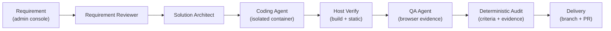

<p align="center">
  
</p>

<h1 align="center">RD-Bot</h1>

<p align="center">
  Turn a written requirement into an <strong>auditable, verified pull request</strong> —<br/>
  an orchestrated Manager → Execute → Audit delivery chain of AI coding agents.
</p>

<p align="center">
  <a href="README.zh-CN.md">中文说明</a> ·
  <a href="LICENSE"></a>
  
  
  
  
</p>

> [!WARNING]
> **Experimental / Developer Preview.** RD-Bot is a single-machine, self-hosted
> experiment maintained by one person. The admin API has **no authentication**:
> the stack publishes only on `127.0.0.1` and must never be exposed to the
> internet. There is no SLA and no multi-user support.

<p align="center">
  
</p>

## Why RD-Bot

Most coding agents stop at "the model said it worked". RD-Bot is a delivery
harness: a written requirement becomes a governed pipeline where every step
leaves evidence.

- **Input**: a requirement (title, expected result, acceptance criteria,
  optional materials) submitted from the admin console.
- **Four-role agent pipeline**: requirement reviewer → solution architect →
  coding agent → QA agent. Each role runs in an isolated Pi agent container.
- **Deterministic audit**: every stage result is audited against the frozen
  plan; an unverified claim cannot promote the task to "completed".
- **Host verification**: after coding, the host independently replays build and
  static checks against the work tree.
- **Delivery output**: a real work branch and pull request on a GitHub
  repository you have explicitly authorized, with the full evidence chain
  (stage runs, commands, artifacts, QA evidence) stored in PostgreSQL + MinIO
  and browsable in the admin console.

## How it works



The PostgreSQL database is the state truth: task state transitions, stage
commands, agent attempts, audit records and the migration ledger are all
durable rows. Agent containers are ephemeral and isolated: they never see the
Docker socket, your home directory, or your API keys — model access goes
through a hardened credential-relay sidecar.

## Quick start

Requirements: one machine with **Docker Engine / Docker Desktop and Compose
v2**. This release was verified on macOS Apple silicon; Linux x86_64/arm64 is
an intended deployment shape but has not yet had a real-machine acceptance run.
You do not need JDK, Maven, Node.js or psql on the host.

```bash
git clone https://github.com/wanghehe123/rd-bot.git
cd rd-bot
./scripts/rd-bot.sh up
```

`up` generates `deploy/docker/runtime.env` (random secrets, `0600`), builds the
Pi, QA and application images, then starts PostgreSQL 16 + pgvector, Redis 7,
MinIO, the migrations and the backend. When everything is healthy it prints:

```text
[rd-bot] admin UI: http://127.0.0.1:18080/admin
```

Stop the stack with `./scripts/rd-bot.sh down` — volumes and workspaces are
kept. Deleting data requires the explicit `./scripts/rd-bot.sh purge --yes`.

## First real task

Before agents can run, the dashboard's first-run checklist walks you through:

1. **Configure a model provider** — register an OpenAI/Anthropic-compatible
   endpoint and store its API key (keys are submitted to the backend's
   credential storage only; they never touch the browser or the git repo).
2. **Configure GitHub delivery when needed** — set `GITHUB_PAT` in
   `deploy/docker/runtime.env`, then run `./scripts/rd-bot.sh restart`. The PAT
   stays in the gitignored `0600` env file and is passed to the backend only.
3. **Create a project** pointing at a GitHub repository you authorize RD-Bot
   to operate on.
4. **Submit a requirement** — pick a small, well-scoped change and watch the
   role pipeline run, each stage producing readable artifacts and evidence.

A missing provider key or GitHub PAT cannot produce a mock success: the
affected agent or Git operation fails explicitly. The current dashboard stores
provider keys; GitHub PAT configuration is the env-file step above.

## Screenshots

| | |
| --- | --- |
|  | Task workbench: role pipeline, prompts, artifacts and audit details |
|  | Requirement delivery chain with per-stage evidence |
|  | Same workbench on a 390×844 viewport |


## Current capabilities

| Area | Status | Notes |
| --- | --- | --- |
| Single-machine Docker self-hosting | **Current** | `./scripts/rd-bot.sh`, migrations, persistence, restart-safe |
| Requirement delivery pipeline (4 roles, audited) | **Current** | Pi runtime only; PostgreSQL store only |
| Host verification (build/static replay) | **Current** | Node/Java/Python baseline inside the app container |
| GitHub delivery (branch + PR on authorized repos) | **Current** | PAT you provide; real PRs in your repos |
| Admin console (tasks, projects, evidence, delivery metrics) | **Current** | Unauthenticated — loopback only |
| Project-scoped agent memory | **Experimental** | Disabled by default; not part of the supported path |
| Feishu/Lark IM intake, webhooks | **Not supported** | Disabled by default; off in the Docker overlay |
| OpenViking external knowledge projection | **Experimental** | Disabled by default |
| Public exposure, RBAC, multi-user, HA | **Planned / not supported** | See roadmap |

## Configuration

All runtime configuration lives in `deploy/docker/runtime.env` (generated on
first `up`, never committed). Shape, not values:

```ini
RD_BOT_PORT=18080                       # host publish (loopback only)
DOCKER_GID=0                            # socket group inside containers
RD_BOT_WORKSPACE_ROOT=/abs/path/.rd-bot-data/workspaces
RD_BOT_EGRESS_NETWORK=rd-bot-egress
POSTGRES_PASSWORD=...                   # generated
RUSTFS_SECRET_ACCESS_KEY=...            # generated (MinIO)
RD_AGENT_RUNTIME_MUTATION_TOKEN=...     # generated; empty = mutations denied
GITHUB_PAT=                              # required for private clone/push + PR publication
RD_EXECUTOR_PI_CPU_LIMIT=4              # must be <= host CPU count
RD_EXECUTOR_PI_MEMORY_LIMIT=8g
```

See [`deploy/docker/README.md`](deploy/docker/README.md) and
[`deploy/docker/runtime.env.example`](deploy/docker/runtime.env.example) for
the full list. Model provider keys are configured in the admin console
(**Model providers**), not in env files.

## Operations

| Command | Behavior |
| --- | --- |
| `./scripts/rd-bot.sh doctor` | read-only environment check (daemon, socket, port, disk, CPU/RAM) |
| `./scripts/rd-bot.sh up` | first-run env generation + image builds + start |
| `./scripts/rd-bot.sh status` | service states + admin address |
| `./scripts/rd-bot.sh logs [service]` | follow logs |
| `./scripts/rd-bot.sh restart` | restart; data preserved |
| `./scripts/rd-bot.sh down` | stop; volumes and workspaces preserved |
| `./scripts/rd-bot.sh purge --yes` | delete this project's volumes + `.rd-bot-data` |

## Security model

- **No login.** The admin API is unauthenticated; the boundary is the network:
  native runs bind `127.0.0.1`, Docker publishes `127.0.0.1` only. Do not
  expose it.
- **Docker socket**: mounted read-write into the `rd-bot` service only (this is
  how the backend launches isolated agent containers). Agent containers never
  receive the socket, host directories, or credentials.
- **Credentials**: provider keys live in the backend's credential storage;
  agent containers reach models only through the credential relay. Runtime
  mutation endpoints fail closed without `RD_AGENT_RUNTIME_MUTATION_TOKEN`.
  GitHub delivery reads `GITHUB_PAT` from the gitignored `runtime.env`; it is
  not configured in the current admin console.
- **External intake off**: Feishu/Lark intake, local listener and ticket
  write-back are disabled in the defaults and again in the Docker overlay.

Details and reporting: [`SECURITY.md`](SECURITY.md).

## Troubleshooting

| Symptom | What to do |
| --- | --- |
| `docker daemon is not running` | Start Docker Desktop / the docker service; `doctor` re-checks |
| Port 18080 already in use | Stop the occupier or set `RD_BOT_PORT` in `deploy/docker/runtime.env` |
| Socket permission denied | `doctor` prints the fix for your platform (never `chmod 666`) |
| Image build fails mid-download | Usually a flaky CDN — rerun `up`; browser cache can be seeded from a previous QA tag (see `bootstrap/src/main/resources/executor/pi/README.md`) |
| Migration "DRIFT" error | A SQL file changed after it was applied; follow the message, inspect `rd_schema_migrations` |
| Agents can't run | Configure provider keys in the dashboard; for private clone/push or PR publication, set `GITHUB_PAT` in `deploy/docker/runtime.env` and restart |

## Development and testing

Native toolchain for development: JDK 21, Node.js 22, Docker. The fast gate:

```bash
./scripts/test-open-source-core.sh   # focused backend + frontend + Pi bridge + OpenSpec
./mvnw test                          # full backend suite
```

Behavioral changes go through [OpenSpec](openspec/) proposals; repository rules
live in [`AGENTS.md`](AGENTS.md) and [`RULE.md`](RULE.md). See
[`CONTRIBUTING.md`](CONTRIBUTING.md) for the minimum setup.

## Roadmap and known limitations

- Single-node only; no HA, no horizontal scaling, no backup automation.
- Abnormal interruption (kill -9, power loss mid-stage) may require manual
  recovery through the failure-recovery views; clean restarts are tested.
- One OS/arch is verified per release (recorded in the release notes);
  other platforms are untested, not unsupported-by-design.
- Public exposure, RBAC, multi-user, webhook signing and horizontal agent
  fleets are future work.
- The maintainer speaks Chinese and English; issue response is best-effort.

## License

[MIT](LICENSE) — see also [THIRD_PARTY_NOTICES.md](THIRD_PARTY_NOTICES.md)
for dependency, base image and asset boundaries.

## Acknowledgements

README structure takes inspiration from the self-hosting projects
[n8n](https://github.com/n8n-io/n8n), [Open WebUI](https://github.com/open-webui/open-webui),
[Dify](https://github.com/langgenius/dify) and [Immich](https://github.com/immich-app/immich);
no content, branding or assets were copied. Their trademarks belong to their
owners.
