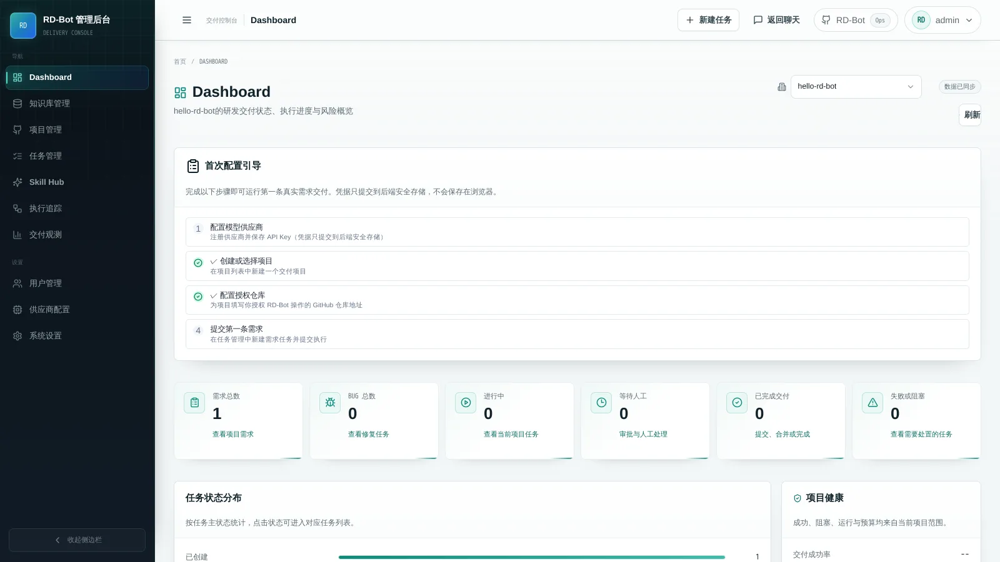
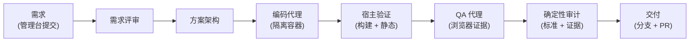
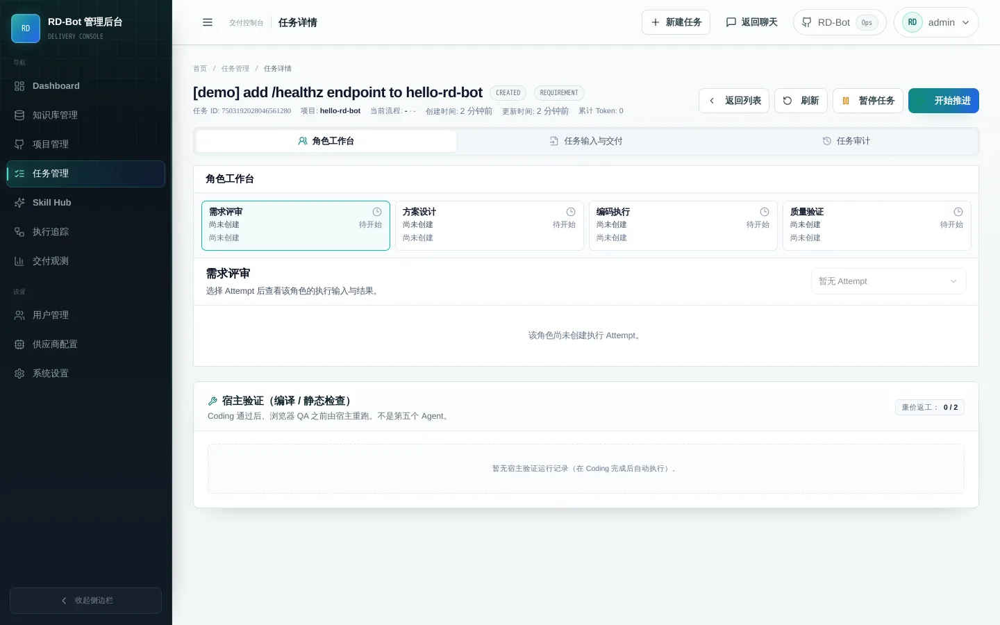
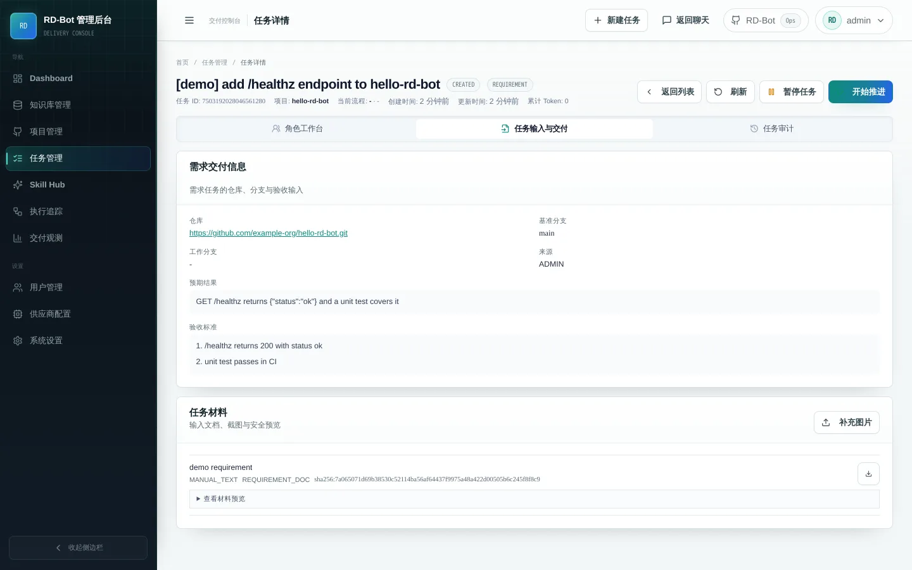
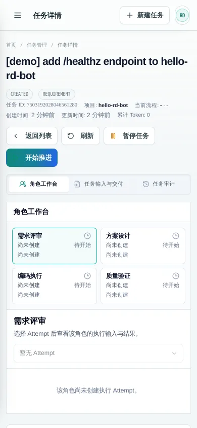

<p align="center">
  
</p>

<h1 align="center">RD-Bot</h1>

<p align="center">
  把一段需求文字变成<strong>可审计、经验证的 Pull Request</strong>——<br/>
  由 Manager → Execute → Audit 交付链编排的 AI 编码代理流水线。
</p>

<p align="center">
  <a href="README.md">English</a> ·
  <a href="LICENSE"></a>
  
  
  
  
</p>

> [!WARNING]
> **实验性质 / Developer Preview。** RD-Bot 是单机自托管、个人维护的实验项目。
> 管理面**没有鉴权**：整套服务只发布在 `127.0.0.1`，绝不能暴露到公网。
> 没有服务等级承诺，也不支持多用户。

<p align="center">
  
</p>

## 为什么是 RD-Bot

大多数编码代理止步于「模型说它做完了」。RD-Bot 是一个交付约束面：一段需求
会进入一条受治理的流水线，每一步都留下证据。

- **输入**：在管理台提交需求（标题、预期结果、验收标准，可附材料）。
- **四角色代理流水线**：需求评审 → 方案架构 → 编码执行 → QA 验证，
  每个角色运行在隔离的 Pi Agent 容器中。
- **确定性审计**：每个阶段的结果都对照冻结计划审计；未经验证的断言
  无法把任务推进为「已完成」。
- **宿主验证**：编码完成后，由宿主独立回放构建与静态检查。
- **交付输出**：在你明确授权的 GitHub 仓库上产出真实工作分支与 PR，
  完整证据链（阶段运行、命令、产物、QA 证据）存于 PostgreSQL + MinIO，
  可在管理台逐条回看。

## 工作原理



PostgreSQL 是状态真相：任务状态迁移、阶段命令、代理 attempt、审计记录与
迁移 ledger 全部是持久化行。Agent 容器是短暂且隔离的：它们拿不到 Docker
socket、你的主目录或 API key——模型访问只经过加固的 credential relay 边车。

## 快速开始

环境要求：一台装有 **Docker Engine / Docker Desktop 与 Compose v2** 的机器
（已测形态：macOS Apple silicon、Linux x86_64/arm64）。宿主无需 JDK、Maven、
Node.js 或 psql。

```bash
git clone https://github.com/wanghehe123/rd-bot.git
cd rd-bot
./scripts/rd-bot.sh up
```

`up` 会生成 `deploy/docker/runtime.env`（随机秘密、权限 0600）、构建 Pi、QA
与应用镜像，然后启动 PostgreSQL 16 + pgvector、Redis 7、MinIO、迁移任务与
后端。全部健康后输出：

```text
[rd-bot] admin UI: http://127.0.0.1:18080/admin
```

用 `./scripts/rd-bot.sh down` 停止——数据卷与工作区都会保留。删除数据必须
显式执行 `./scripts/rd-bot.sh purge --yes`。

## 第一条真实任务

Agent 运行前，首页的「首次配置引导」会带你完成：

1. **配置模型供应商**——登记一个 OpenAI/Anthropic 兼容端点并保存 API key
   （key 只提交到后端凭据存储；不进浏览器、不进 git 仓库）。
2. **创建项目**——指向你授权 RD-Bot 操作的 GitHub 仓库。
3. **提交需求**——选一个小而清晰的任务，观察角色流水线运行，
   每个阶段都产出可阅读的产物与证据。

在 provider key 与 GitHub 凭据配置完成之前，任务提交会被明确阻断——
RD-Bot 不会伪造成功。

## 截图

| | |
| --- | --- |
|  | 任务工作台：角色流水线、Prompt、产物与审计明细 |
|  | 需求交付链与逐阶段证据 |
|  | 390×844 视口下的同一工作台 |


## 当前能力

| 能力 | 状态 | 说明 |
| --- | --- | --- |
| 单机 Docker 自托管 | **当前支持** | `./scripts/rd-bot.sh`、迁移、持久化、重启安全 |
| 需求交付流水线（4 角色、带审计） | **当前支持** | 仅 Pi 运行时；仅 PostgreSQL store |
| 宿主验证（构建/静态回放） | **当前支持** | 应用容器内置 Node/Java/Python 基线 |
| GitHub 交付（授权仓库的分支 + PR） | **当前支持** | 使用你提供的 PAT；产出真实 PR |
| 管理台（任务、项目、证据、交付观测） | **当前支持** | 无鉴权——仅限本机 |
| 项目级 Agent 记忆 | **实验性** | 默认关闭；不属于首发支持面 |
| 飞书 IM 接入、webhook | **不支持** | 默认关闭；Docker overlay 中再次显式关闭 |
| OpenViking 外部知识投影 | **实验性** | 默认关闭 |
| 公网暴露、RBAC、多用户、高可用 | **计划 / 不支持** | 见路线图 |

## 配置

运行时配置都在 `deploy/docker/runtime.env`（首次 `up` 生成，绝不提交）。
只展示形态，不展示真实值：

```ini
RD_BOT_PORT=18080                       # 宿主发布端口（仅 loopback）
DOCKER_GID=0                            # 容器内 socket 组
RD_BOT_WORKSPACE_ROOT=/abs/path/.rd-bot-data/workspaces
RD_BOT_EGRESS_NETWORK=rd-bot-egress
POSTGRES_PASSWORD=...                   # 自动生成
RUSTFS_SECRET_ACCESS_KEY=...            # 自动生成（MinIO）
RD_AGENT_RUNTIME_MUTATION_TOKEN=...     # 自动生成；留空 = 修改请求被拒绝
RD_EXECUTOR_PI_CPU_LIMIT=4              # 不得超过宿主 CPU 数
RD_EXECUTOR_PI_MEMORY_LIMIT=8g
```

完整列表见 [`deploy/docker/README.md`](deploy/docker/README.md) 与
[`deploy/docker/runtime.env.example`](deploy/docker/runtime.env.example)。
模型供应商 key 在管理台「模型供应商」页配置，不写进 env 文件。

## 日常操作

| 命令 | 行为 |
| --- | --- |
| `./scripts/rd-bot.sh doctor` | 只读环境检查（daemon、socket、端口、磁盘、CPU/内存） |
| `./scripts/rd-bot.sh up` | 首次生成 env + 构建镜像 + 启动 |
| `./scripts/rd-bot.sh status` | 服务状态 + 管理地址 |
| `./scripts/rd-bot.sh logs [service]` | 跟随日志 |
| `./scripts/rd-bot.sh restart` | 重启；数据保留 |
| `./scripts/rd-bot.sh down` | 停止；数据卷与工作区保留 |
| `./scripts/rd-bot.sh purge --yes` | 删除本项目的数据卷 + `.rd-bot-data` |

## 安全模型

- **无登录。** 管理 API 无鉴权；边界在网络层：原生进程绑定 `127.0.0.1`，
  Docker 只发布 `127.0.0.1`。不要暴露公网。
- **Docker socket**：只读写挂载给 `rd-bot` 服务（后端由此创建隔离的 Agent
  容器）。Agent 容器永远拿不到 socket、宿主目录或凭据。
- **凭据**：供应商 key 存在后端凭据存储；Agent 容器只经 credential relay
  访问模型。没有 `RD_AGENT_RUNTIME_MUTATION_TOKEN` 时，运行时修改端点
  fail closed。
- **外部入口默认关闭**：飞书接入、本地 listener 与工单写回在默认配置和
  Docker overlay 中双重关闭。

细节与漏洞报告：[`SECURITY.md`](SECURITY.md)。

## 常见问题

| 症状 | 处理 |
| --- | --- |
| `docker daemon is not running` | 启动 Docker Desktop / docker 服务；`doctor` 可复检 |
| 18080 端口被占用 | 停掉占用进程，或在 `deploy/docker/runtime.env` 设 `RD_BOT_PORT` |
| socket 权限不足 | `doctor` 会给出对应平台的修法（永远不要 `chmod 666`） |
| 镜像构建中断 | 多为 CDN 抖动——重跑 `up`；可用旧 QA 镜像做浏览器缓存种子（见 `bootstrap/src/main/resources/executor/pi/README.md`） |
| 迁移报 "DRIFT" | SQL 文件在应用后又被改动；按报错提示检查 `rd_schema_migrations` |
| Agent 无法运行 | 首页引导会指出缺少的 provider / GitHub 配置 |

## 开发与测试

开发用原生工具链：JDK 21、Node.js 22、Docker。快速门：

```bash
./scripts/test-open-source-core.sh   # 后端聚焦集 + 前端 + Pi 桥 + OpenSpec
./mvnw test                          # 后端全量
```

行为变更走 [OpenSpec](openspec/) 提案；仓库规则见
[`AGENTS.md`](AGENTS.md) 与 [`RULE.md`](RULE.md)。最小环境见
[`CONTRIBUTING.md`](CONTRIBUTING.md)。

## 路线图与已知限制

- 仅支持单节点；没有高可用、没有水平扩展、没有备份自动化。
- 异常中断（kill -9、断电）可能需要通过失败恢复界面人工介入；
  正常重启路径已测试。
- 每个发布版本只验证一种 OS/架构（记录在发布说明中）；其他平台属
  「未测试」，不是「设计上支持」。
- 公网暴露、RBAC、多用户、webhook 签名与横向 Agent 集群属于后续工作。
- 维护者使用中文与英文；issue 回复尽力而为。

## 许可证

[MIT](LICENSE) —— 依赖、基础镜像与素材的第三方边界见
[THIRD_PARTY_NOTICES.md](THIRD_PARTY_NOTICES.md)。

## 致谢

README 结构参考了自托管项目 [n8n](https://github.com/n8n-io/n8n)、
[Open WebUI](https://github.com/open-webui/open-webui)、
[Dify](https://github.com/langgenius/dify) 与
[Immich](https://github.com/immich-app/immich) 的信息组织方式；
未复制其文案、品牌或素材。相关商标归各自所有者所有。
