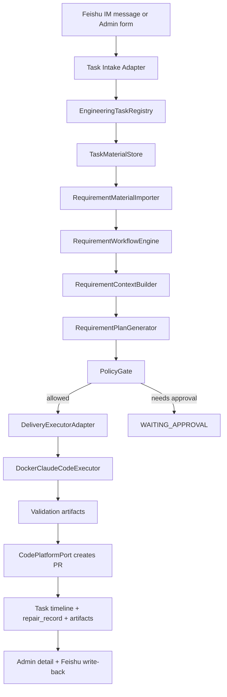

# RD-Bot Requirement Delivery Bot Research And Development Plan

> **For agentic workers:** REQUIRED SUB-SKILL: Use superpowers:subagent-driven-development (recommended) or superpowers:executing-plans to implement this plan task-by-task. Steps use checkbox (`- [ ]`) syntax for tracking.

**Goal:** 将 RD-Bot 从 BugFix-only MVP 扩展为智能研发机器人，先交付“需求任务自动编码、测试、创建 PR”的 MVP，并为后续智能问答、评审、治理留出统一任务模型。

**Architecture:** 采用“通用研发任务控制面 + 类型化工作流”的方案。保留现有 `bootstrap -> engine -> rag` 依赖方向，复用知识库、RAG、Docker Claude Code、GitHub PR、RocketMQ、审计与任务管理能力；把 BugFix 专属的任务、上下文、Prompt、执行请求逐步泛化为 `EngineeringTask` / `RequirementTask` / `TaskMaterial` / `DeliveryWorkflow`。

**Tech Stack:** Java 21, Spring Boot 3.5, Maven, PostgreSQL + MyBatis-Plus + pgvector, RocketMQ, React 18 + Vite + TypeScript + shadcn/Radix + Tailwind, Feishu IM/OpenAPI, Docker Claude Code, GitHub REST/gh CLI.

---

## 1. 调研范围

本计划基于 2026-06-29 对本地仓库 `/Users/wish233/Documents/RD-Bot` 的实际代码调研。

已阅读的本地约束：

- `AGENTS.md`：产品定位、模块边界、P0-P3 路线、PolicyGate、执行与持久化规则。
- `RULE.md`：Java 21 / Spring Boot 3.5 多模块单体开发规范、端口适配器、测试要求。
- `README.md`、`docs/roadmap/public-roadmap.md`：现有 RAG、知识库、演示路线和 harness 定位。
- `docs/rd-task-management-design.md`、`docs/rd-task-management-requirements.md`：现有任务管理设计。
- `docs/superpowers/specs/2026-06-23-feishu-im-ticket-ingestion-design.md` 和对应 plan：现有 Feishu IM 工单入口设计。

重点代码路径：

- 后端任务与状态：`rag/src/main/java/com/wish/rd/rag/runtime/*`
- Bug 修复编排：`engine/src/main/java/com/wish/rd/engine/bugfix/*`
- RAG 上下文：`engine/src/main/java/com/wish/rd/engine/rag/*`、`rag/src/main/java/com/wish/rd/rag/pipeline/*`
- 工单与队列：`engine/src/main/java/com/wish/rd/engine/ticket/*`
- 执行与 PR：`exec/src/main/java/com/wish/rd/exec/repair/*`、`bootstrap/src/main/java/com/wish/rd/bootstrap/executor/*`、`bootstrap/src/main/java/com/wish/rd/bootstrap/github/*`
- Feishu IM：`bootstrap/src/main/java/com/wish/rd/bootstrap/feishu/im/*`
- Feishu 文档导入：`rag/src/main/java/com/wish/rd/rag/knowledge/Feishu*`、`bootstrap/src/main/java/com/wish/rd/bootstrap/feishu/MockFeishuDocumentClient.java`
- 前端任务管理：`frontend/src/pages/admin/rdtask/*`、`frontend/src/services/rdTaskService.ts`

外部技术资料核对方向：

- GitHub REST Pull Request：创建 PR 需要 `head`、`base`、`title`、`body`，生产建议 GitHub App，local smoke 可保留 `gh`。
- RocketMQ：继续使用 topic、tag、consumer group 做异步调度，消息保持瘦身。
- Feishu OpenAPI：IM 消息事件、IM 发消息、Drive/Docx/Wiki 读取均应在 `bootstrap` 适配层实现，核心层只依赖规范化端口。
- Claude Code / Agent SDK：继续把模型/执行器当作可替换 worker，不把 Claude 语义写进领域模型。

## 2. 当前系统画像

### 2.1 已具备能力

RD-Bot 已经不是简单 Demo，当前代码已经具备做需求任务的底座：

- 管理后台：
  - React/Vite 前端位于 `frontend/`。
  - `/admin/rd-tasks` 已有任务列表、详情、暂停、恢复、删除、时间线。
  - `RdTaskListPage` 目前只支持创建 BugFix 风格任务：标题、工单 ID、工单标题、优先级、Prompt 快照。
- 任务状态：
  - `RagStreamTaskRegistry` 管理 `RdBugFixTask`。
  - 状态为 `CREATED -> SEARCHING -> EXECUTING -> COMMITTED -> MERGED`，失败为 `REJECTED`，逻辑删为 `DELETED`。
  - `RdTaskStatusEventStore` 已支持任务时间线。
- 工单触发：
  - Feishu IM 消息可转换成本地 ticket，并经 `TicketEventIngestionEngine` 发布到队列。
  - `RepairTicketMessage` 是瘦消息，只含 `ticketId/priority/traceId/attempt/source/eventId/eventType`。
  - `TicketRepairExecutionConsumer` 可在 RAG 就绪后按配置触发自动执行。
- RAG：
  - `RagBugFixEngine` 从 `TicketSnapshot` 和 logs 构建 `BugFixMessage`。
  - `RepairRagPipeline` 做意图分类、多通道检索、上下文打包。
  - 知识库支持本地文档上传、Feishu 文档导入 mock、定时刷新模型。
- 执行：
  - `RepairExecutorPort` 是执行器端口，`DockerClaudeCodeExecutor` 是 Docker Claude Code 实现。
  - 执行器输出校验 `result.json`，要求 `status/summary/prBody/changedFiles/testCommands/testStatus/riskLevel/needHumanAction`。
  - `EngineBugFixExecutorAdapter` 把 engine 的 `BugFixExecutionRequest` 适配到 exec 的 `RepairJobCommand`，再创建 PR。
- 证据与治理：
  - `repair_records`、`repair_record_artifacts`、`repair_assets`、`repair_audit_events` 已在 SQL 中存在。
  - Docker allowlist、模型熔断、超时/预算告警、GitHub 仓库 allowlist 已有基础。

### 2.2 关键限制

当前系统能修 Bug，但要做需求会卡在这些点：

1. 任务模型是 BugFix 专属。
   - `RdBugFixTask.TASK_TYPE = "BUG_FIX"`。
   - `RdTaskStore` 只保存/查询 BugFix。
   - `/admin/rd-tasks` 列表调用 `queryBugFixTasks`。

2. RAG 输入是故障工单形态。
   - `RepairRagRequest(ticketId, description, logs)` 适合 bug。
   - `BugFixMessage` 字段是 ticketTitle、ticketDescription、logs/evidence。
   - 需求文档、预期结果、验收标准、原型/接口说明没有一等模型。

3. Prompt 和执行桥接写死 BugFix。
   - `BugFixPromptBuilder` fallback 模板标题是“研发修复任务”。
   - `BugFixExecutor` / `BugFixExecutionRequest` 只能表达修复。
   - PR 标题固定 `RD-Bot repair:`，work branch 默认 `repair/`。

4. Feishu IM 只有“把消息当工单”的解析器。
   - `FeishuImTicketParser` 支持字段：系统、仓库、分支、问题、日志、期望、实际、优先级。
   - 没有任务意图分类：修 bug / 做需求 / 问答。
   - 没有附件、飞书文档链接、需求材料抽取。

5. 前端任务新建入口过窄。
   - 只能录入 title/ticketId/ticketTitle/priority/promptSnapshot。
   - 不支持任务类型、需求文档上传、Feishu 文档 URL、预期结果、仓库/分支、自动执行策略。

6. 真实 Feishu 文档读取未实现。
   - `FeishuDocumentClient` 是端口。
   - `MockFeishuDocumentClient` 只返回固定 Markdown。
   - 做需求必须补一个真实 `FeishuDocumentClient` 适配器，或先用 mock/local smoke 验证端口。

7. repair record 模型有历史双层。
   - `engine.ticket.RepairRecordRepository` 是编排端口。
   - `exec.repair.RepairRecordRepository` 是更完整的执行证据端口。
   - `ExecRepairRecordRepositoryAdapter` 负责桥接。
   - 新功能应优先复用 exec 侧完整模型，避免再复制一套需求记录。

## 3. 产品目标

### 3.1 新定位

从：

```text
Bug ticket -> RAG -> Docker fix -> PR
```

扩展为：

```text
Feishu conversation / Admin manual task
-> EngineeringTask
-> Task materials
-> ContextPackage
-> Plan
-> PolicyGate
-> Docker execution
-> Validation
-> PR
-> Report / write-back / audit
```

第一阶段只交付“做需求”，但模型上要能容纳后续：

- `BUG_FIX`：修复缺陷。
- `REQUIREMENT`：实现需求。
- `QNA`：智能问答，仅生成答案和引用，不进入执行/PR。
- `REVIEW`：代码评审或 PR 评审。
- `TEST_GENERATION`：补测试。
- `DOC_UPDATE`：文档改造。

### 3.2 需求任务 MVP

用户可通过两个入口创建需求任务：

1. Feishu 对话触发：
   - 用户在 Feishu 中发消息给 RD-Bot。
   - 消息包含“做需求/实现需求/开发功能”等意图，或使用结构化字段。
   - 支持粘贴飞书文档 URL、需求摘要、仓库、分支、预期结果。
   - RD-Bot 回复任务已创建、缺少字段、执行进展、PR 链接。

2. 前端任务管理新建：
   - 在 `/admin/rd-tasks` 点击“新建任务”。
   - 选择任务类型：`需求开发`。
   - 上传本地需求文档，或填写 Feishu 文档 / Wiki URL。
   - 填写必须字段：标题、仓库、目标分支、预期结果、验收标准/测试建议、优先级。
   - 可选择是否自动执行；默认进入 `WAITING_POLICY` 或 `WAITING_APPROVAL` 由策略决定。

需求任务完成后：

- 自动解析需求材料。
- 构建任务级上下文。
- 生成实现计划和执行 Prompt。
- 在 Docker 沙箱内编码。
- 运行测试。
- 创建 PR。
- 保存 diff、测试日志、prompt、执行结果、PR 元数据、风险评估。
- 在任务详情页展示完整证据。

## 4. 方案比较

### 4.1 方案 A：最小改造，继续复用 BugFix 模型

做法：

- 前端新建任务仍创建 `RdBugFixTask`。
- 需求文档内容塞进 `promptSnapshot` 或 `ticketDescription`。
- `BugFixPromptBuilder` 增加少量 if/else，根据字段判断是 bug 还是需求。

优点：

- 改动最少。
- 可能 1-2 天跑出一个演示。

缺点：

- 需求、问答、评审会继续挤在 BugFix 类型里。
- RAG 与执行证据语义不清。
- 前端列表无法区分任务类型和阶段。
- 后续治理会非常痛苦。

结论：不推荐。只适合作为临时 demo，不适合作为项目主线。

### 4.2 方案 B：推荐，建立通用研发任务模型，先实现 REQUIREMENT 类型

做法：

- 在现有 `RdTask` 抽象下引入 `RdTaskType` 和通用 `EngineeringTask`。
- 保留 `RdBugFixTask` 兼容旧链路，同时新增 `RdRequirementTask` 或通用 `RdDeliveryTask`。
- 新增 `TaskMaterial` 表达本地文件、Feishu 文档、手填说明、附件。
- 新增 `RequirementWorkflowEngine`，复用知识库、RAG、Docker、GitHub、审计。
- 把执行桥接从 `EngineBugFixExecutorAdapter` 演进为 `DeliveryExecutorAdapter`。
- 前端任务创建改为类型化向导。

优点：

- 符合 AGENTS.md 的 harness 定位。
- BugFix、Requirement、QNA 可以共享控制面，但保持类型语义。
- 现有 Docker/GitHub/审计能力可复用。
- 分阶段落地，可先保兼容后迁移。

缺点：

- 第一期改动大于方案 A。
- 需要新增数据库表和较多端口。

结论：推荐采用。先实现 `REQUIREMENT`，不破坏现有 BugFix。

### 4.3 方案 C：一步到位做多智能体平台

做法：

- 直接引入 Planner / Coder / Tester / Reviewer 多 agent。
- 建立 skill marketplace、复杂审批、项目管理、问答知识助手。

优点：

- 产品想象空间大。

缺点：

- 对当前 MVP 来说范围过大。
- 会掩盖当前最关键的模型泛化与证据闭环问题。
- 很难在短期得到可验证的端到端结果。

结论：不推荐作为本轮。可作为 P4/P5 演进。

## 5. 推荐总体设计

### 5.1 核心原则

- `rag` 负责知识和上下文，不直接调用 Docker/GitHub/Feishu。
- `engine` 负责编排任务流。
- `exec` 负责执行、验证、产物、代码平台端口。
- `bootstrap` 负责 REST、Feishu、GitHub、Docker、Postgres 适配。
- MQ 消息保持瘦身，只传任务 ID、类型、来源、优先级、trace，不传大文档和 secret。
- 文档、prompt、diff、log、测试输出进入 artifact 或 object storage 引用，不塞主表。
- 需求任务输出必须有 validation evidence；无测试或测试失败不能创建“成功”PR。

### 5.2 目标链路



### 5.3 分层落点

`rag`：

- `RdTaskType`
- `RdTaskStatus` 扩展，支持需求任务更完整阶段。
- `EngineeringTask` / `RdDeliveryTask` 通用任务快照。
- `TaskMaterial` 值对象和 store 端口。
- `RequirementContextPackage` 或通用 `DeliveryContextPackage`。
- `RequirementMaterialSummary`，保存需求摘要、验收点、约束、引用文档。

`engine`：

- `RequirementTaskCommand`
- `RequirementWorkflowEngine`
- `RequirementContextBuilder`
- `RequirementPromptBuilder`
- `RequirementPlanGeneratorPort`
- `DeliveryExecutor` 通用执行端口，兼容 BugFix。
- `EngineeringTaskQueueMessage`
- `EngineeringTaskQueueConsumer`

`exec`：

- 保留 `RepairExecutorPort`，第一阶段可重命名语义留待后续，新增通用 `DeliveryJobCommand` 需要评估是否替代 `RepairJobCommand`。
- 短期可继续复用 `RepairJobCommand`，但 `policyJson/contextJson` 增加 `taskType=REQUIREMENT`。
- `StructuredRepairResult` 可暂时复用；下一阶段改名为 `StructuredDeliveryResult`，保留 JSON 兼容。

`bootstrap`：

- `RequirementTaskController` 或扩展 `RdTaskController`。
- Multipart 本地需求文档上传。
- Feishu 文档真实读取适配器。
- Feishu IM 需求意图解析器。
- Postgres task/material store。
- RocketMQ 通用任务队列适配。

`frontend`：

- 任务列表增加任务类型筛选。
- 新建任务向导支持 Bug 修复 / 需求开发。
- 需求任务详情显示材料、计划、策略、执行日志、PR、验收结果。

## 6. 数据模型设计

### 6.1 `rd_tasks` 泛化

现有 `rd_tasks` 已有：

- `task_type`
- `ticket_id`
- `ticket_title`
- `priority`
- `status`
- `title`
- `prompt_snapshot`
- `execution_result_json`
- `pull_request_url`
- `error_message`
- `paused`

建议新增轻量字段：

```sql
ALTER TABLE rd_tasks ADD COLUMN IF NOT EXISTS source_type VARCHAR(64) NOT NULL DEFAULT '';
ALTER TABLE rd_tasks ADD COLUMN IF NOT EXISTS source_id VARCHAR(256) NOT NULL DEFAULT '';
ALTER TABLE rd_tasks ADD COLUMN IF NOT EXISTS source_url TEXT NOT NULL DEFAULT '';
ALTER TABLE rd_tasks ADD COLUMN IF NOT EXISTS repository_url TEXT NOT NULL DEFAULT '';
ALTER TABLE rd_tasks ADD COLUMN IF NOT EXISTS repo_owner VARCHAR(256) NOT NULL DEFAULT '';
ALTER TABLE rd_tasks ADD COLUMN IF NOT EXISTS repo_name VARCHAR(256) NOT NULL DEFAULT '';
ALTER TABLE rd_tasks ADD COLUMN IF NOT EXISTS base_branch VARCHAR(256) NOT NULL DEFAULT 'main';
ALTER TABLE rd_tasks ADD COLUMN IF NOT EXISTS work_branch TEXT NOT NULL DEFAULT '';
ALTER TABLE rd_tasks ADD COLUMN IF NOT EXISTS expected_result TEXT NOT NULL DEFAULT '';
ALTER TABLE rd_tasks ADD COLUMN IF NOT EXISTS acceptance_json JSONB NOT NULL DEFAULT '{}'::jsonb;
ALTER TABLE rd_tasks ADD COLUMN IF NOT EXISTS policy_json JSONB NOT NULL DEFAULT '{}'::jsonb;
ALTER TABLE rd_tasks ADD COLUMN IF NOT EXISTS extension_json JSONB NOT NULL DEFAULT '{}'::jsonb;
```

说明：

- 保持主表只存可列表展示和状态判断的摘要字段。
- 需求文档正文、附件内容、prompt 全文、diff、test log 不进主表。
- `ticket_id/ticket_title` 暂时保留，未来用 `source_id/source_type` 替代。

### 6.2 新增 `rd_task_materials`

需求材料是新能力的核心，必须一等建模。

```sql
CREATE TABLE IF NOT EXISTS rd_task_materials (
    id                 BIGINT PRIMARY KEY,
    task_id            BIGINT NOT NULL,
    material_type      VARCHAR(64) NOT NULL,
    source_type        VARCHAR(64) NOT NULL,
    source_uri         TEXT NOT NULL DEFAULT '',
    source_token       VARCHAR(512) NOT NULL DEFAULT '',
    title              TEXT NOT NULL DEFAULT '',
    mime_type          VARCHAR(128) NOT NULL DEFAULT '',
    content_hash       VARCHAR(128) NOT NULL DEFAULT '',
    content_preview    TEXT NOT NULL DEFAULT '',
    artifact_uri       TEXT NOT NULL DEFAULT '',
    knowledge_document_id BIGINT NULL,
    revision_id        VARCHAR(128) NOT NULL DEFAULT '',
    metadata_json      JSONB NOT NULL DEFAULT '{}'::jsonb,
    created_at         TIMESTAMPTZ NOT NULL DEFAULT now(),
    updated_at         TIMESTAMPTZ NOT NULL DEFAULT now()
);

CREATE INDEX IF NOT EXISTS idx_rd_task_materials_task ON rd_task_materials (task_id, created_at);
CREATE INDEX IF NOT EXISTS idx_rd_task_materials_source ON rd_task_materials (source_type, source_token);
```

`material_type` 建议：

- `REQUIREMENT_DOC`
- `EXPECTED_RESULT`
- `ACCEPTANCE_CRITERIA`
- `API_CONTRACT`
- `DESIGN_IMAGE`
- `REFERENCE_LINK`
- `CHAT_CONTEXT`

`source_type` 建议：

- `LOCAL_UPLOAD`
- `FEISHU_DOC`
- `FEISHU_WIKI`
- `FEISHU_IM_TEXT`
- `MANUAL_TEXT`
- `URL`

### 6.3 新增通用队列消息

现有 `RepairTicketMessage` 绑定 ticketId。需求任务应该发通用任务消息：

```java
public record EngineeringTaskMessage(
        String taskId,
        String taskType,
        String priority,
        String traceId,
        int attempt,
        String source,
        String eventId,
        String eventType,
        Instant createdAt
) {
}
```

队列 topic 可沿用 `RD_BOT_REPAIR_TICKET` 以降低基础设施成本，但建议新 topic：

- topic：`RD_BOT_ENGINEERING_TASK`
- consumer group：`GID_RD_BOT_ENGINEERING_WORKER`
- tags：`BUG_FIX`、`REQUIREMENT`、`QNA`

短期兼容：

- 保留 `RepairTicketMessage` 处理旧 BugFix。
- 新 `EngineeringTaskMessage` 处理新 Requirement。
- 后续把 BugFix 迁移到通用消息。

### 6.4 状态机扩展

当前状态太少，需求开发需要更完整阶段。建议新增 `RdTaskStatus`：

```text
CREATED
MATERIAL_COLLECTING
MATERIAL_READY
CONTEXT_BUILDING
CONTEXT_READY
PLAN_GENERATING
PLAN_GENERATED
WAITING_POLICY
WAITING_APPROVAL
EXECUTING
VALIDATING
PR_CREATING
COMMITTED
MERGED
REPORTING
COMPLETED
REJECTED
FAILED_RETRYABLE
FAILED_NEEDS_HUMAN
CANCELLED
DEAD_LETTERED
RECOVERING
DELETED
```

兼容策略：

- BugFix 旧状态继续可用。
- 新 Requirement 走新状态。
- 前端用状态分组展示：准备中、执行中、待人工、已完成、失败。

## 7. 后端研发计划

### Phase 0：设计收敛与兼容保护

目标：先把边界定住，不影响当前 BugFix 真实链路。

- [ ] 新增 `RdTaskType`：`BUG_FIX`、`REQUIREMENT`、`QNA`。
- [ ] 给 `RdTaskQuery` 增加 `taskType` 过滤。
- [ ] `/admin/rd-tasks` 返回 `taskType` 并支持按类型筛选。
- [ ] 前端列表增加任务类型列和筛选，但创建入口仍兼容旧字段。
- [ ] 加 policy test：`RagBugFixEngine` 仍不触发执行器，BugFix 旧路径不变。
- [ ] 加 schema policy test：后续新增 SQL 均在 `bootstrap/src/main/resources/sql/postgres`。

验收：

- `./mvnw -pl rag,bootstrap -am -Dtest=RagStreamTaskRegistryTest,RdTaskControllerTest -Dsurefire.failIfNoSpecifiedTests=false test`
- `cd frontend && npm run typecheck`

### Phase 1：任务材料模型

目标：本地文件和 Feishu 文档都能作为任务输入资产，不再塞 prompt。

后端新增：

- `rag/runtime/TaskMaterial.java`
- `rag/runtime/TaskMaterialType.java`
- `rag/runtime/TaskMaterialSourceType.java`
- `rag/runtime/TaskMaterialStore.java`
- `rag/runtime/InMemoryTaskMaterialStore.java`
- `bootstrap/persistence/entity/RdTaskMaterialRow.java`
- `bootstrap/persistence/mapper/RdTaskMaterialMapper.java`
- `bootstrap/persistence/PostgresTaskMaterialStore.java`

业务服务：

- `engine/task/TaskMaterialImportEngine`
- 支持：
  - `importManualText(taskId, title, text)`
  - `importLocalUpload(taskId, MultipartFile file)`
  - `importFeishuDocument(taskId, sourceUrl)`

控制器：

- `POST /admin/rd-tasks/{taskId}/materials/text`
- `POST /admin/rd-tasks/{taskId}/materials/upload`
- `POST /admin/rd-tasks/{taskId}/materials/feishu`
- `GET /admin/rd-tasks/{taskId}/materials`
- `GET /admin/rd-tasks/{taskId}/materials/{materialId}/preview`

复用现有能力：

- 本地上传可以先用 `WriteKnowledgeDocumentCommand` 的解析能力，也可以先保存 material 再可选入知识库。
- Feishu 文档先复用 `FeishuDocKnowledgeImporter` 和 `FeishuDocumentClient`。
- 大文件原文进入对象存储或 artifact URI，DB 只保留 preview/hash。

验收：

- 创建需求任务后上传 Markdown/TXT 文件，能看到 material 列表和 preview。
- 输入飞书文档 URL，在 mock client 下能导入并关联 material。
- 相同 URL + revision/hash 重复导入不重复创建知识文档。

### Phase 2：需求任务创建入口

目标：从前端创建完整需求任务。

后端新增：

```java
public record CreateRequirementTaskCommand(
        String title,
        String priority,
        String repositoryUrl,
        String repoOwner,
        String repoName,
        String baseBranch,
        String expectedResult,
        List<RequirementMaterialInput> materials,
        boolean autoExecute
) {
}
```

新增接口：

- `POST /admin/rd-tasks/requirements`
- `PUT /admin/rd-tasks/{taskId}/requirements`
- `POST /admin/rd-tasks/{taskId}/submit`

创建逻辑：

1. 校验必填字段：
   - `title`
   - `repositoryUrl` 或 `repoOwner + repoName`
   - `baseBranch`
   - 至少一个需求材料：上传文件、飞书文档、手填需求正文三选一
   - `expectedResult`
2. 创建 `task_type=REQUIREMENT` 的任务。
3. 导入材料。
4. 写任务时间线：
   - `CREATED`
   - `MATERIAL_COLLECTING`
   - `MATERIAL_READY`
5. 若 `autoExecute=true`，发布 `EngineeringTaskMessage`。
6. 若策略要求人工确认，进入 `WAITING_APPROVAL`。

前端改造：

- `RdTaskListPage` 的“新建任务”变为向导：
  - Step 1：选择任务类型：修 Bug / 做需求。
  - Step 2：填写基础信息：标题、优先级、仓库、分支。
  - Step 3：需求材料：本地上传 / Feishu 文档 URL / 手填正文。
  - Step 4：预期结果与验收标准。
  - Step 5：确认自动执行策略。
- 详情页新增：
  - “需求材料”区域。
  - “预期结果/验收标准”区域。
  - “执行计划”区域。
  - “证据与产物”区域。

验收：

- 前端可不离开任务管理页创建需求任务。
- 创建后列表显示 `taskType=REQUIREMENT`。
- 详情页能看到材料、预期结果、状态时间线。

### Phase 3：Feishu 对话触发需求任务

目标：用户通过 Feishu 对话创建需求任务。

新增解析器：

- `FeishuImTaskIntentParser`
- `FeishuImRequirementParser`

支持消息格式：

```text
做需求
标题: 增加订单催单功能
仓库: https://github.com/example/waimai.git
分支: main
优先级: P1
需求文档: https://example.feishu.cn/docx/xxxx
预期结果: 用户可在订单详情点击催单，商家端收到提醒
验收: 前端构建通过；新增接口测试；订单状态不被修改
```

自然语言兜底：

- 若包含“做需求 / 实现需求 / 开发功能 / 新增功能”，判定 `REQUIREMENT`。
- 若包含“修复 / 报错 / 异常 / 失败 / bug”，走 `BUG_FIX`。
- 若包含“是什么 / 怎么用 / 查询 / 解释”，未来走 `QNA`，本期可回复暂不支持。

流程：

1. `FeishuImMessageController` 接收消息。
2. `FeishuImTaskIntentParser` 判定任务类型。
3. `REQUIREMENT` 走 `RequirementTaskIntakeEngine`。
4. 缺字段时不入队执行，创建草稿或直接回复缺少字段。
5. 字段齐全时创建任务并入队。
6. Feishu 回复：
   - 任务 ID
   - 当前状态
   - 后台详情链接
   - 缺失字段或已开始执行

本阶段不建议直接解析 Feishu 附件二进制。先支持文档 URL 和文本字段；附件下载放 Phase 6。

验收：

- Feishu IM fixture 能创建 `REQUIREMENT` 任务。
- 缺少仓库或预期结果时，回复缺失字段，不触发执行。
- Queue message 不包含文档正文和 secret。

### Phase 4：需求上下文与计划生成

目标：把需求材料转成执行器可用的结构化上下文和实现计划。

新增模型：

```java
public record RequirementContextPackage(
        String taskId,
        String requirementSummary,
        List<String> acceptanceCriteria,
        List<String> constraints,
        List<String> suggestedFiles,
        List<String> suggestedValidationCommands,
        List<RetrievedChunk> retrievedChunks,
        List<String> materialIds,
        String traceId
) {
}
```

新增服务：

- `RequirementContextBuilder`
  - 聚合 task metadata、materials、knowledge chunks、repository hints。
  - 把需求文档摘要、验收点、约束、相关代码证据打包。
- `RequirementPlanGeneratorPort`
  - 初期可规则化生成 plan。
  - 后续可调用模型生成 plan。
- `RequirementPlanValidator`
  - 必须有验收标准。
  - 必须有测试建议。
  - 高风险变更必须进入审批。

Prompt 设计：

- 新建 `engine/src/main/resources/prompt/requirement.st`
- 内容必须包含：
  - 任务 ID、需求标题、仓库、目标分支。
  - 需求摘要。
  - 原始材料引用。
  - 预期结果和验收标准。
  - 允许修改范围。
  - 必须执行或说明无法执行的测试命令。
  - 输出结构化 `result.json`。

状态推进：

```text
MATERIAL_READY
-> CONTEXT_BUILDING
-> CONTEXT_READY
-> PLAN_GENERATING
-> PLAN_GENERATED
-> WAITING_POLICY
```

验收：

- 对一个本地 Markdown 需求文档生成 `RequirementContextPackage`。
- 详情页能显示需求摘要、验收标准和建议测试。
- promptSnapshot 明确是需求实现，不出现 BugFix-only 文案。

### Phase 5：策略门禁与自动执行

目标：需求任务能安全进入 Docker 编码，并根据风险决定是否需要人工确认。

新增：

- `PolicyGatePort`
- `RuleBasedRequirementPolicyGate`
- `PolicyDecision`

规则建议：

- 缺少仓库或目标分支：`BLOCKED_NEED_INFO`。
- 缺少验收标准：`BLOCKED_NEED_INFO`。
- 仓库不在 allowlist：`UNSAFE`。
- 修改范围涉及 auth/security/payment/config：`WAITING_APPROVAL`。
- 需求材料超过大小限制：`WAITING_APPROVAL`。
- 明确要求生产数据、secret、线上操作：`UNSAFE`。
- 低风险 UI/文档/小功能：`ALLOWED`。

执行桥接：

- 新增 `DeliveryExecutor` 或 `RequirementExecutor`，短期内部复用 `RepairExecutorPort`。
- 新增 `DeliveryExecutionRequest`：

```java
public record DeliveryExecutionRequest(
        String taskId,
        String taskType,
        String prompt,
        String repositoryUrl,
        String repoOwner,
        String repoName,
        String baseBranch,
        String workBranch,
        Map<String, String> contextJson,
        Map<String, String> policyJson
) {
}
```

桥接到 `RepairJobCommand` 时：

- `repairRecordId = taskId` 或关联的 `repair_records.id`。
- `ticketId = sourceId`。
- `ticketTitle = title`。
- `policyJson.bridge = "requirement-delivery-executor"`。
- branch prefix 用 `feature/` 或 `requirement/`，不要再用 `repair/`。

PR 标题：

- BugFix 保持 `RD-Bot repair: ...`
- Requirement 用 `RD-Bot requirement: ...`

验收：

- mock executor 下能创建 PR URL 并进入 `COMMITTED`。
- unsafe 策略不会调用 Docker。
- waiting approval 不会入队执行。

### Phase 6：真实 Feishu 文档读取

目标：从 Feishu 文档 / Wiki URL 读取需求正文。

新增真实适配器：

- `bootstrap/feishu/doc/FeishuDocumentOpenApiClient`
- 实现 `FeishuDocumentClient`

能力：

- 解析 `docx` / `wiki` token。
- 获取 tenant access token。
- 读取文档标题、revision、正文块。
- Markdown 化正文。
- 脱敏错误信息。
- 支持 mock fallback。

注意：

- 不要在 `rag` 直接调用 Feishu SDK 或 HTTP。
- Feishu API 字段、权限、错误码以官方 OpenAPI 和用户提供的 app 权限为准。
- 缺权限时返回可定位错误，并在任务状态中进入 `FAILED_NEEDS_HUMAN` 或 `WAITING_APPROVAL`。

验收：

- mock client 测试保持稳定。
- 真实 smoke 在配置 FEISHU_APP_ID/SECRET 和文档权限后可读取标题与正文摘要。
- 失败时不泄露 app secret、tenant token、文档正文敏感内容。

### Phase 7：前端任务详情增强

目标：任务详情页成为研发交付证据页。

新增详情区块：

- 基本信息：类型、来源、仓库、分支、优先级、状态。
- 需求材料：文档列表、来源、preview、hash、Feishu URL。
- 上下文包：需求摘要、相关知识、相关文件、traceId。
- 实现计划：步骤、验收标准、测试建议。
- 策略决策：allowed / waiting approval / unsafe，原因。
- 执行结果：状态、summary、changed files、test commands、test status、risk。
- PR：链接、分支、merge 状态。
- artifacts：patch.diff、test.log、claude-events.jsonl、result.json。
- 操作：暂停、恢复、停止、重试、审批、打回。

前端技术要求：

- 使用现有 shadcn/Radix/Tailwind 风格。
- 表单用分步 dialog 或独立 `/admin/rd-tasks/new` 页面。
- 上传控件必须展示文件名、大小、解析状态。
- 长文本使用 `react-markdown` 渲染 preview。
- 状态徽标从硬编码 BugFix 状态扩展为状态分组映射。

验收：

- `npm run typecheck` 通过。
- `npm run build` 通过。
- 需求任务详情在桌面宽度和常见移动宽度无文字重叠。

## 8. API 设计

### 8.1 任务列表

扩展现有：

```http
GET /admin/rd-tasks?taskType=REQUIREMENT&status=EXECUTING&keyword=xxx&page=1&pageSize=20
```

响应新增：

```json
{
  "records": [
    {
      "taskId": "747...",
      "taskType": "REQUIREMENT",
      "sourceType": "ADMIN",
      "sourceId": "",
      "repositoryUrl": "https://github.com/example/app.git",
      "baseBranch": "main",
      "expectedResult": "用户可催单",
      "status": "PLAN_GENERATED",
      "title": "增加订单催单功能"
    }
  ]
}
```

### 8.2 创建需求任务

```http
POST /admin/rd-tasks/requirements
Content-Type: application/json
```

```json
{
  "title": "增加订单催单功能",
  "priority": "P1",
  "repositoryUrl": "https://github.com/example/waimai.git",
  "repoOwner": "example",
  "repoName": "waimai",
  "baseBranch": "main",
  "expectedResult": "用户可在订单详情页催单，商家端收到提醒",
  "acceptanceCriteria": [
    "前端构建通过",
    "新增接口测试通过",
    "订单状态不被修改"
  ],
  "materials": [
    {
      "sourceType": "FEISHU_DOC",
      "sourceUri": "https://example.feishu.cn/docx/xxx"
    }
  ],
  "autoExecute": true
}
```

### 8.3 上传需求文档

```http
POST /admin/rd-tasks/{taskId}/materials/upload
Content-Type: multipart/form-data
```

字段：

- `file`
- `materialType=REQUIREMENT_DOC`
- `knowledgeBaseId` 可选
- `chunkingMode=STRUCTURE_AWARE`

### 8.4 提交执行

```http
POST /admin/rd-tasks/{taskId}/submit
```

语义：

- 检查材料是否齐全。
- 执行 policy。
- allowed 时发布队列。
- waiting approval 时停住。
- blocked 时返回 409 和缺失字段。

### 8.5 审批

```http
POST /admin/rd-tasks/{taskId}/approve
```

```json
{
  "message": "确认允许修改前端订单详情和商家通知接口"
}
```

## 9. 测试计划

### 9.1 单元测试

`rag`：

- `RdTaskTypeTest`
- `TaskMaterialTest`
- `InMemoryTaskMaterialStoreTest`
- `RagStreamTaskRegistryRequirementTest`

`engine`：

- `RequirementTaskCommandTest`
- `RequirementWorkflowEngineTest`
- `RequirementContextBuilderTest`
- `RequirementPromptBuilderTest`
- `RequirementPolicyGateTest`
- `EngineeringTaskQueueMessageTest`
- `FeishuRequirementIntentParserTest` 如果 parser 放 engine。

`bootstrap`：

- `RequirementTaskControllerTest`
- `TaskMaterialControllerTest`
- `PostgresTaskMaterialStorePolicyTest`
- `FeishuDocumentOpenApiClientTest`
- `FeishuImRequirementMessageControllerTest`
- `DeliveryExecutorAdapterTest`

`exec`：

- 如果新增 `DeliveryJobCommand`，增加 contract test。
- 如果复用 `RepairJobCommand`，增加 `taskType=REQUIREMENT` contextJson 保留测试。

### 9.2 集成测试

本地 mock golden path：

```text
POST /admin/rd-tasks/requirements
-> upload material
-> submit
-> mock queue consume
-> mock executor
-> mock PR
-> GET /admin/rd-tasks/{id}
-> timeline contains MATERIAL_READY, CONTEXT_READY, PLAN_GENERATED, COMMITTED
```

真实/半真实 smoke：

- Postgres：任务、materials、timeline、repair_records 持久化。
- RocketMQ：`EngineeringTaskMessage` 发布和消费。
- Docker：在 allowlist demo repo 中运行。
- GitHub：`gh` local smoke 创建 PR。
- Feishu IM：fixture 创建需求任务，真实环境可选。
- Feishu doc：mock 必测，真实凭证 smoke 可选。

### 9.3 验证命令

后端 focused：

```bash
./mvnw -pl rag -Dtest=TaskMaterialTest,InMemoryTaskMaterialStoreTest,RagStreamTaskRegistryRequirementTest test
./mvnw -pl engine -Dtest=RequirementWorkflowEngineTest,RequirementPromptBuilderTest,RequirementPolicyGateTest test
./mvnw -pl bootstrap -am -Dtest=RequirementTaskControllerTest,TaskMaterialControllerTest,DeliveryExecutorAdapterTest -Dsurefire.failIfNoSpecifiedTests=false test
```

前端：

```bash
cd frontend
npm run typecheck
npm run build
```

全量：

```bash
./mvnw test
```

真实 HTTP：

```bash
./mvnw -pl bootstrap -am spring-boot:run
curl -s http://localhost:18080/admin/rd-tasks?taskType=REQUIREMENT
```

## 10. 实施里程碑

### Milestone 1：类型化任务和材料底座

周期建议：2-3 天。

交付：

- `RdTaskType`
- `taskType` 查询过滤。
- `TaskMaterial` 模型和 store。
- `rd_task_materials` SQL。
- 前端列表任务类型展示。
- 本地上传材料 API。

验收：

- 可创建 `REQUIREMENT` 任务并关联一份本地 Markdown 材料。
- 列表和详情可展示材料摘要。

### Milestone 2：前端需求任务创建

周期建议：2-3 天。

交付：

- 需求任务创建向导。
- Feishu 文档 URL 输入。
- 预期结果和验收标准表单。
- 自动执行开关。
- 后端 `POST /admin/rd-tasks/requirements`。

验收：

- 无需 Feishu，即可通过管理后台创建需求任务。
- 创建后状态到 `MATERIAL_READY`。

### Milestone 3：需求上下文和计划生成

周期建议：3-4 天。

交付：

- `RequirementContextPackage`
- `RequirementContextBuilder`
- `RequirementPromptBuilder`
- `RequirementPlanGeneratorPort`
- prompt 模板 `requirement.st`
- 详情页展示上下文和计划。

验收：

- 对样例需求生成可执行 prompt。
- prompt 不包含 BugFix-only 文案。
- 计划包含验收标准和测试建议。

### Milestone 4：执行与 PR 复用

周期建议：3-5 天。

交付：

- `DeliveryExecutionRequest`
- `DeliveryExecutorAdapter`
- Requirement 到 Docker/GitHub 的桥接。
- PR title/body 按需求任务生成。
- 执行结果写回 `rd_tasks` 和 `repair_records/artifacts`。

验收：

- mock executor 下端到端进入 `COMMITTED`。
- Docker real smoke 可在 demo repo 创建 PR。

### Milestone 5：Feishu 对话创建需求任务

周期建议：2-4 天。

交付：

- Feishu IM 任务意图解析。
- 需求字段解析。
- 缺字段回复。
- Feishu write-back 进展/PR。

验收：

- fixture 测试覆盖创建、缺字段、入队、回复。
- 真实 Feishu 可选 smoke 记录到 `docs/smoke/`。

### Milestone 6：真实 Feishu 文档读取

周期建议：3-5 天，取决于权限和 OpenAPI 字段确认。

交付：

- `FeishuDocumentOpenApiClient`
- token/url 解析。
- docx/wiki 正文 Markdown 化。
- 错误脱敏和 smoke 文档。

验收：

- mock 稳定。
- 真实文档 smoke 在有权限时通过。
- 缺权限有清晰错误和人工处理状态。

## 11. 风险与缓解

| 风险 | 影响 | 缓解 |
| --- | --- | --- |
| 直接复用 BugFix 导致语义污染 | 后续问答/需求/评审难扩展 | 采用 `RdTaskType` + `TaskMaterial` + `RequirementWorkflowEngine` |
| Feishu 文档 OpenAPI 权限不足 | 真实需求文档读取失败 | mock/local 先通；真实读取做可选 smoke；缺权限进入 `FAILED_NEEDS_HUMAN` |
| 大文档塞入 DB 主表 | 性能和审计风险 | 原文进 artifact/object storage，主表只存 hash/preview |
| Docker 执行需求时范围过大 | 高风险改动或误改 | PolicyGate + repo/branch allowlist + PR-only |
| 当前 `RepairJobCommand` 命名偏修复 | 长期领域语义不清 | 短期复用，后续重命名为 `DeliveryJobCommand` 并保留适配层 |
| 前端创建向导过复杂 | 影响 MVP 交付 | 第一版只做必填字段和三种材料来源；高级选项折叠 |
| RocketMQ 新 topic 增加基础设施成本 | 本地配置复杂 | 第一版可复用旧 topic 或 memory queue；生产再切新 topic |
| 真实 GitHub 权限不稳定 | PR smoke 失败 | 保留 mock code platform 和 gh CLI local smoke |
| 任务状态扩展影响旧测试 | 回归风险 | 保留旧状态合法流转；新增状态仅 Requirement 使用 |

## 12. 需要用户确认的外部契约

这些点不能猜，进入实现前需要确认：

1. 需求任务的必填字段是否固定为：
   - 标题
   - 需求文档或需求正文
   - 预期结果
   - 仓库 URL / owner / repo
   - base branch
   - 验收标准
2. Feishu 对话触发时，用户是否必须 `@` bot。
3. 飞书文档权限：
   - 使用 bot 读文档，还是使用 user OAuth。
   - 允许读 docx、wiki、drive 附件中的哪些类型。
4. 需求任务是否默认自动执行。
   - 建议默认：低风险自动执行，高风险等待审批。
5. PR 目标平台第一版是否只支持 GitHub。
6. 需求任务默认分支前缀：
   - 建议 `feature/rd-bot-<taskId>`，不要复用 `repair/`。
7. 前端是否需要保留“手工 Prompt 快照”入口。
   - 建议保留在高级区，仅管理员可用。

## 13. 第一版验收标准

功能验收：

- 管理后台可创建 `REQUIREMENT` 任务。
- 支持本地需求文档上传。
- 支持 Feishu 文档 URL mock 导入。
- 支持填写预期结果和验收标准。
- 任务详情可查看材料、上下文、计划、策略、执行结果、PR。
- mock executor 下自动跑到 `COMMITTED`。
- Feishu IM fixture 可创建需求任务或返回缺字段提示。
- 不影响现有 BugFix 任务创建、队列消费、Docker 执行、PR 创建。

质量验收：

- `./mvnw -pl rag,engine,bootstrap -am test` 通过。
- `./mvnw test` 尽量通过；若外部服务缺失，报告具体原因。
- `frontend npm run typecheck` 和 `npm run build` 通过。
- 至少一个 mock golden path HTTP 报告写入 `docs/qa/`。
- 如果跑真实 Docker/GitHub smoke，记录 PR URL、测试日志、失败原因。

安全验收：

- MQ 消息不包含需求正文、附件内容、Feishu token、GitHub token、模型密钥。
- prompt/artifact 经过 secret redaction。
- 非 allowlist 仓库不执行。
- validation failed 不创建成功 PR。
- high risk 需求进入人工审批。

## 14. 推荐文件改动清单

后端 `rag`：

- Create `rag/src/main/java/com/wish/rd/rag/runtime/RdTaskType.java`
- Modify `rag/src/main/java/com/wish/rd/rag/runtime/RdTaskStatus.java`
- Modify `rag/src/main/java/com/wish/rd/rag/runtime/RdTaskQuery.java`
- Modify `rag/src/main/java/com/wish/rd/rag/runtime/RagStreamTaskRegistry.java`
- Create `rag/src/main/java/com/wish/rd/rag/runtime/TaskMaterial.java`
- Create `rag/src/main/java/com/wish/rd/rag/runtime/TaskMaterialStore.java`
- Create `rag/src/main/java/com/wish/rd/rag/runtime/InMemoryTaskMaterialStore.java`

后端 `engine`：

- Create `engine/src/main/java/com/wish/rd/engine/requirement/RequirementTaskCommand.java`
- Create `engine/src/main/java/com/wish/rd/engine/requirement/RequirementWorkflowEngine.java`
- Create `engine/src/main/java/com/wish/rd/engine/requirement/RequirementContextPackage.java`
- Create `engine/src/main/java/com/wish/rd/engine/requirement/RequirementContextBuilder.java`
- Create `engine/src/main/java/com/wish/rd/engine/requirement/RequirementPromptBuilder.java`
- Create `engine/src/main/resources/prompt/requirement.st`
- Create `engine/src/main/java/com/wish/rd/engine/task/EngineeringTaskMessage.java`
- Create `engine/src/main/java/com/wish/rd/engine/task/EngineeringTaskQueuePublisher.java`
- Create `engine/src/main/java/com/wish/rd/engine/task/EngineeringTaskQueueConsumer.java`
- Create `engine/src/main/java/com/wish/rd/engine/policy/PolicyDecision.java`
- Create `engine/src/main/java/com/wish/rd/engine/policy/RuleBasedRequirementPolicyGate.java`

后端 `bootstrap`：

- Modify `bootstrap/src/main/resources/sql/postgres/p0_knowledge_productionization.sql`
- Create `bootstrap/src/main/java/com/wish/rd/bootstrap/persistence/entity/RdTaskMaterialRow.java`
- Create `bootstrap/src/main/java/com/wish/rd/bootstrap/persistence/mapper/RdTaskMaterialMapper.java`
- Create `bootstrap/src/main/java/com/wish/rd/bootstrap/persistence/PostgresTaskMaterialStore.java`
- Modify `bootstrap/src/main/java/com/wish/rd/bootstrap/controller/admin/rdtask/RdTaskController.java`
- Create `bootstrap/src/main/java/com/wish/rd/bootstrap/controller/admin/rdtask/RequirementTaskController.java`
- Create `bootstrap/src/main/java/com/wish/rd/bootstrap/feishu/im/FeishuImTaskIntentParser.java`
- Create `bootstrap/src/main/java/com/wish/rd/bootstrap/feishu/im/FeishuImRequirementParser.java`
- Create `bootstrap/src/main/java/com/wish/rd/bootstrap/feishu/doc/FeishuDocumentOpenApiClient.java`
- Create `bootstrap/src/main/java/com/wish/rd/bootstrap/executor/DeliveryExecutorAdapter.java`

前端：

- Modify `frontend/src/services/rdTaskService.ts`
- Create `frontend/src/services/taskMaterialService.ts`
- Modify `frontend/src/pages/admin/rdtask/RdTaskListPage.tsx`
- Modify `frontend/src/pages/admin/rdtask/RdTaskDetailPage.tsx`
- Create `frontend/src/pages/admin/rdtask/RequirementTaskCreateDialog.tsx`
- Create `frontend/src/pages/admin/rdtask/TaskMaterialPanel.tsx`
- Create `frontend/src/pages/admin/rdtask/TaskExecutionEvidencePanel.tsx`
- Modify `frontend/src/types.ts`

测试：

- Add `rag/src/test/java/com/wish/rd/rag/runtime/TaskMaterialStoreTest.java`
- Add `engine/src/test/java/com/wish/rd/engine/RequirementWorkflowEngineTest.java`
- Add `engine/src/test/java/com/wish/rd/engine/RequirementPromptBuilderTest.java`
- Add `engine/src/test/java/com/wish/rd/engine/RequirementPolicyGateTest.java`
- Add `bootstrap/src/test/java/com/wish/rd/bootstrap/RequirementTaskControllerTest.java`
- Add `bootstrap/src/test/java/com/wish/rd/bootstrap/TaskMaterialControllerTest.java`
- Add `bootstrap/src/test/java/com/wish/rd/bootstrap/FeishuImRequirementParserTest.java`
- Add `bootstrap/src/test/java/com/wish/rd/bootstrap/DeliveryExecutorAdapterTest.java`

## 15. 不建议本轮做的内容

- 不做完整智能问答 UI。本轮只预留 `QNA` 类型，不实现执行。
- 不做复杂多 agent 协作。先用单执行器跑通需求闭环。
- 不做多代码平台。GitHub 先行，保持 `CodePlatformPort` 可替换。
- 不做飞书附件二进制下载。第一版支持 URL 和本地上传。
- 不做自动合并。PR 只创建，不 merge。
- 不做生产审批流复杂 UI。第一版只做 approve/reject 两个动作。

## 16. 自检

- 没有要求修改现有 BugFix 主流程语义。
- 所有外部系统仍在端口后面。
- 需求文档没有被设计成 MQ 大消息。
- 大产物没有进入主表。
- 计划包含前端、后端、数据、队列、Feishu、执行、PR、测试、验收。
- 对 Feishu API 字段和权限没有做未确认假设，已列为用户确认项。
