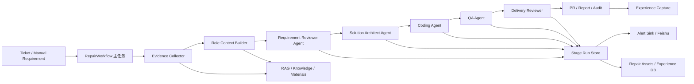

# RD-Bot 多 Agent RAG 证据编排引擎技术设计

日期：2026-07-01

## 1. 目标

把当前“需求材料 -> 一次性打包给 Docker Claude Code -> PR”的单链路，改造成“RAG 证据收集 + 多 Agent 编排”的引擎层。Java 应用只负责控制面：

- 收集、裁剪、持久化证据；
- 规划多角色 Agent 阶段；
- 派发任务给可替换执行器；
- 校验并回收结构化结果；
- 推进任务和阶段状态；
- 触发告警、人工介入、PR、报告和经验沉淀。

Java 应用不继承底层 AI infra，不绑定某个模型 SDK，也不把所有证据一次性塞给一个 Agent。模型、Docker、Feishu、GitHub、RocketMQ、Skill 安装器都必须通过端口接入。

## 2. 当前代码证据

需求交付链路集中在 `engine/src/main/java/com/wish/rd/engine/requirement/RequirementDeliveryEngine.java`：

- `submit` 同步完成材料检查、上下文构建、计划生成、规则门禁、四阶段执行、交付复核、复核后 PR 发布和结果写回。
- 执行器入口仍是 `RequirementExecutorPort`，但当前改造已按 `AgentRole.requirementDeliveryOrder()` 拆成 `REQUIREMENT_REVIEWER`、`SOLUTION_ARCHITECT`、`CODING_AGENT`、`QA_AGENT` 四个阶段。
- 当前切片新增 `RequirementDeliveryReviewer`，在 `markRequirementCommitted` 前复核多 Agent 聚合结果；复核失败进入 `REJECTED`，并发送 `DELIVERY_REVIEW_FAILED` 告警。
- 当前切片新增 `RequirementPullRequestPublisherPort`，物理 PR 创建已从 `CODING_AGENT` 执行器抽出，由 Java 控制面在 `deliveryReview.approved=true` 后调用 bootstrap 适配器发布；执行器阶段只返回交付候选证据。

上下文构建在 `engine/src/main/java/com/wish/rd/engine/requirement/RequirementContextBuilder.java`：

- 当前只做确定性摘要；
- 注释明确避免把外部模型调用混入控制面；
- 尚未按角色构建不同上下文包。

任务状态在 `rag/src/main/java/com/wish/rd/rag/runtime/RdTaskStatus.java` 和 `RagStreamTaskRegistry`：

- 已有粗粒度主状态：`CONTEXT_BUILDING`、`PLAN_GENERATING`、`WAITING_POLICY`、`EXECUTING`、`VALIDATING`、`PR_CREATING`、`REPORTING`、`COMPLETED` 等；
- `ensureTransition` 已定义合法流转；
- 需求链路已按 `EXECUTING -> VALIDATING -> PR_CREATING -> COMMITTED -> REPORTING -> COMPLETED` 写入主任务时间线。

执行器在 `exec/src/main/java/com/wish/rd/exec/repair/docker/DockerClaudeCodeExecutor.java`：

- 已有多 provider 轮询、失败熔断、providerAttemptsJson、结构化结果校验、产物收集；
- 仍然面向“一个修复执行任务”，不是“多角色阶段运行”；
- `StructuredResultValidator` 校验的是编码执行结果，不覆盖需求评审、方案设计、QA 报告等角色产物。

告警基础在 `exec/src/main/java/com/wish/rd/exec/repair/alert`：

- `RepairAlertSinkPort` 是通知端口；
- `RepairExecutionWatchdog` 能发超时和预算告警；
- 需要扩展为阶段失败、等待人工、复核失败、provider 降级、经验入库失败等告警。

资产沉淀基础在 `exec/src/main/java/com/wish/rd/exec/repair/RepairAssetType.java`：

- 已有 `BUG_CAUSE`、`FIX_STRATEGY`、`REPAIR_PROCESS`、`ACCEPTANCE_PLAN`、`VALIDATION_RESULT` 等；
- 需要扩展产品文档、技术方案、QA 日志、经验条目等资产类型。

## 3. 目标架构



核心设计原则：

- 主任务状态机保持粗粒度、可对外理解；多 Agent 细节进入阶段运行表。
- 每个 Agent 阶段都有独立输入上下文、prompt、provider 尝试、结构化输出、产物、复核结果和告警。
- RAG 不再产出一个“大包”，而是按角色产出 `RoleContextPackage`。
- 每个阶段的输出先通过协议校验，再进入下一个阶段；不能让下游 Agent 隐式补齐上游缺失产物。
- 生产状态使用数据库事务、幂等键、唯一约束和分布式锁端口，不依赖 JVM 内存状态。

## 4. 多角色阶段

第一版固定四个角色，后续通过配置和 Skill 扩展：

| 顺序 | 角色 | 主要职责 | 必需产物 | 失败动作 |
| --- | --- | --- | --- | --- |
| 1 | `REQUIREMENT_REVIEWER` | 评审需求是否可做、信息是否足够、风险是否可控 | `requirement-review.json` | 缺信息进入 `WAITING_APPROVAL` 或 `FAILED_NEEDS_HUMAN` |
| 2 | `SOLUTION_ARCHITECT` | 生成具体开发方案、影响面、验收映射和测试计划 | `solution-plan.json` | 方案不完整进入 `FAILED_NEEDS_HUMAN` |
| 3 | `CODING_AGENT` | 在沙箱仓库内实现代码、运行开发侧测试、准备 PR body 和交付候选证据 | `result.json`、`patch.diff`、`test.log` | 执行失败进入 `FAILED_RETRYABLE` 或 `FAILED_NEEDS_HUMAN`；不得创建物理 PR |
| 4 | `QA_AGENT` | 基于验收标准、交付候选包和真实命令复测，确认是否允许发布 PR | `qa-report.json`、`qa-test.log` | QA 失败进入 `FAILED_NEEDS_HUMAN`，不得创建 PR |

`REQUIREMENT_REVIEWER` 不只是普通成功阶段。当前切片已在 `RequirementDeliveryEngine` 中增加评审后门禁：当评审阶段执行器返回成功，但结构化结果中的 `status`、`decision` 或 `feasibility` 明确为 `NEED_INFO`、`NEEDS_HUMAN`、`UNSAFE`、`REJECTED`、`FAILED` 或 `BLOCKED` 时，控制面会把该阶段标记为 `FAILED_NEEDS_HUMAN`，聚合结果写为 `{"status":"NEEDS_HUMAN"}`，主任务写入 `FAILED_NEEDS_HUMAN`，并停止派发 `SOLUTION_ARCHITECT`、`CODING_AGENT` 和 `QA_AGENT`。这保证“模型成功响应”不等于“需求可交付”。

交付复核不是一个可省略步骤。`RequirementDeliveryReviewer` 属于 Java 控制面规则组件，不调用模型或外部系统。当前已落地的最小复核检查：

- `multiAgentStatus` 必须是 `SUCCESS`；
- `multiAgentStages` 必须包含四个必需角色；
- 四个阶段 `success=true`；
- `CODING_AGENT` 必须提供可发布交付候选证据，如 `prBody`、`changedFiles` 或 `testSummary`；
- `QA_AGENT` 必须输出 `status=PASSED`，且 `acceptanceResults` 每项都包含验收标准、真实命令、`PASSED` 状态和日志产物引用；
- `RequirementDeliveryReviewer` 必须拒绝任何 `multiAgentStages` 中包含阶段级 `pullRequestUrl` 的聚合结果，防止历史数据、旁路调用或后续重构绕过引擎阶段的越权 PR 拦截；
- JSON 非法、QA 阶段缺失或任一角色失败都会拒绝交付。
- 复核通过结果会写入最终 `executionResultJson.deliveryReview`，随后 `RequirementPullRequestPublisherPort` 创建 PR，并把 `pullRequestPublication` 写入最终结果，供生产 smoke、审计报告和后续人工复核直接查询。
- `EngineRequirementPullRequestPublisherAdapter` 创建 PR 前会生成包含 `RD-Bot Delivery Review` 和 `RD-Bot QA Evidence` 的 PR body，并把 `targetBranch`、`workBranch`、`deliveryReviewApproved`、`qaAcceptanceResultCount`、`prBodyEvidenceIncluded` 等字段写入 PR 发布 metadata；生产 smoke 通过这些字段验证“复核后才发布”的最小证据闭环。
- Agent 阶段执行请求中的 `pullRequestRequired` 必须始终为 `false`。如果任一执行器仍返回非空 `pullRequestUrl`，控制面必须把它视为越权 PR 策略违例，阶段转为 `FAILED_NEEDS_HUMAN`，错误分类为 `AGENT_PR_POLICY_VIOLATION`，停止后续 Agent、交付复核和 PR 发布。控制面不能把该 URL 当成正常交付结果继续推进。

后续生产复核还需要扩展：

- 每个阶段输出通过对应 schema；
- `CODING_AGENT` 有更完整的可审查 diff 和真实测试记录；
- provider 降级和失败信息已记录；
- 产物不包含密钥；
- 远端 PR body 反查、完整风险/回滚模板和 allowlist 仓库策略还需要生产专项演练覆盖。

## 5. 状态管理

### 5.1 主任务状态

不建议把四个 Agent 角色直接塞进 `RdTaskStatus`。`RdTaskStatus` 继续表达对外可读的工作流状态：

```text
CREATED
-> MATERIAL_COLLECTING
-> MATERIAL_READY
-> CONTEXT_BUILDING
-> CONTEXT_READY
-> PLAN_GENERATING
-> PLAN_GENERATED
-> WAITING_POLICY
-> WAITING_APPROVAL
-> EXECUTING
-> VALIDATING
-> PR_CREATING
-> COMMITTED
-> REPORTING
-> COMPLETED
```

映射关系：

- `CONTEXT_BUILDING`：材料标准化、证据检索、角色上下文构建。
- `PLAN_GENERATING`：`REQUIREMENT_REVIEWER` 和 `SOLUTION_ARCHITECT` 完成可行性与方案产物。
- `EXECUTING`：`CODING_AGENT` 执行。
- `VALIDATING`：四角色执行完成后，控制面基于 `QA_AGENT` 输出和交付候选产物执行交付复核。
- `PR_CREATING`：交付复核通过后，由控制面调用 `RequirementPullRequestPublisherPort` 创建物理 PR。
- `COMMITTED`：PR URL 已写回主任务，表示可审查交付候选已生成。
- `REPORTING`：生成报告、通知、经验沉淀。
- `COMPLETED`：报告与经验沉淀完成，需求交付闭环结束。

### 5.2 阶段状态

新增阶段运行状态，不污染主状态：

```text
PENDING
-> CONTEXT_READY
-> DISPATCHING
-> RUNNING
-> RESULT_COLLECTING
-> VERIFYING
-> SUCCEEDED
```

失败和恢复：

```text
FAILED_RETRYABLE
FAILED_NEEDS_HUMAN
SKIPPED
CANCELLED
RECOVERING
```

阶段状态表需要满足：

- `task_id + role + attempt_no` 唯一；
- `task_id + role + idempotency_key` 唯一，防止重复派发；
- 状态推进必须在事务内校验 source -> target；
- 每次状态变化写入事件表；
- 应用重启后可以按最后成功阶段恢复。

### 5.3 建议表结构

新增 SQL 文件：`bootstrap/src/main/resources/sql/postgres/p1_multi_agent_orchestration.sql`。

核心表：

- `rd_agent_stage_runs`：阶段运行主表。
- `rd_role_context_packages`：角色上下文包快照。
- `rd_agent_stage_artifacts`：阶段产物索引，记录 artifact URI、hash、metadata 和可审计 `content_preview`；大内容可转对象存储。
- `rd_agent_stage_events`：阶段事件时间线。
- `rd_agent_skill_installations`：Skill 安装与版本快照。
- `rd_experience_entries`：可沉淀经验条目。

`rd_agent_stage_runs` 关键字段：

- `id bigint primary key`
- `task_id varchar not null`
- `role varchar not null`
- `status varchar not null`
- `attempt_no integer not null`
- `provider_name varchar`
- `provider_attempts_json jsonb not null default '[]'`
- `context_package_id bigint`
- `prompt_artifact_id bigint`
- `result_artifact_id bigint`
- `review_result_json jsonb not null default '{}'`
- `error_category varchar`
- `error_message text`
- `started_at timestamp`
- `finished_at timestamp`
- `created_at timestamp not null`
- `updated_at timestamp not null`

`rd_agent_stage_artifacts` 的 prompt/result 快照必须至少写入：

- `artifact_type`：如 `PROMPT_SNAPSHOT`、`RESULT_JSON`。
- `artifact_uri`：可追踪到任务和阶段的稳定 URI。
- `content_preview`：用于验收和人工复核的脱敏预览，当前实现保存前 20000 字符。
- `content_hash`：完整内容的 SHA-256，用于证明预览对应的原始快照未被静默替换。
- `metadata_json`：记录 taskId、stageRunId、role、artifactType、contentLength。

`rd_experience_entries` 的成功经验不能只有摘要文本。阶段级经验必须绑定
`source_artifact_id`，指向同一阶段的 `RESULT_JSON` artifact；交付报告经验优先
绑定 `QA_AGENT` 的 result artifact。这样后续 RAG 摄取或人工复核可以从经验反查
原始阶段输出、hash、preview 和 provider 尝试证据。

## 6. 上下文管理和 RAG

新增角色上下文模型：

- `RoleContextPackage`
- `RoleContextProfile`
- `RoleContextEvidence`
- `RoleContextBuilder`
- `RoleContextPackageStore`

角色上下文不是简单过滤字符串，而是带证据引用的结构化包：

```json
{
  "taskId": "rd-...",
  "role": "REQUIREMENT_REVIEWER",
  "packageVersion": 3,
  "queryPlan": [],
  "evidence": [],
  "omittedEvidence": [],
  "acceptanceCriteria": [],
  "riskHints": [],
  "contextBudget": {
    "maxChars": 18000,
    "usedChars": 14210
  }
}
```

角色差异：

- `REQUIREMENT_REVIEWER`：需求原文、验收标准、现有产品文档、历史相似需求、约束、缺失字段。
- `SOLUTION_ARCHITECT`：评审结果、架构文档、代码路径索引、接口契约、历史技术方案、风险模块。
- `CODING_AGENT`：方案、目标文件、最小必要上下文、验收标准、测试命令、仓库边界、禁止事项。
- `QA_AGENT`：需求、方案、diff、测试计划、验收标准、运行命令、历史 QA 日志、失败案例。

RAG 要求：

- 每个证据项必须有 `evidence_id`、来源、hash、时间、可追踪引用；
- prompt 中传证据摘要和引用，不传无法解释来源的大段黑盒文本；
- 上下文包落库，后续复核和审计用同一包，不在下游重新生成不一致上下文；
- `RequirementDeliveryEngine` 构建角色上下文前会调用 `WorkflowExperienceStore.searchReusable`，把命中的历史经验转换为 `rd-experience://{experienceId}` 证据并加入上下文包；这保证后续相似需求能在 Agent prompt 中看到已复核经验。
- 敏感内容在入 prompt 前做脱敏；
- 角色上下文构建失败不能默认退化为全量材料打包，必须进入 `FAILED_RETRYABLE` 或 `FAILED_NEEDS_HUMAN`。

## 7. Provider 降级、重试和复核

执行层已有 provider fallback，但多 Agent 后需要两层降级：

1. 阶段级降级：每个阶段记录 provider 尝试、失败原因、熔断状态和最终 provider。
2. 执行器级降级：复用 `DockerClaudeCodeExecutor` 的 provider 链、熔断和环境变量预检查。

当前实现约定：执行器通过 `RequirementExecutionResult.resultJson` 返回 `dockerMetadata.provider`
和 `dockerMetadata.providerAttemptsJson`，`RequirementDeliveryEngine` 在阶段从 `RUNNING`
进入 `RESULT_COLLECTING` 前把这些字段回填到 `AgentStageRun.providerName` 和
`AgentStageRun.providerAttemptsJson`。PostgreSQL 适配器将其持久化到
`rd_agent_stage_runs.provider_name` / `provider_attempts_json`，供生产验收和审计查询。
PostgreSQL `PostgresAgentStageRunStore.transition` 在更新阶段主表的同时写入
`rd_agent_stage_events`，记录 source/target status、错误分类、进入时间和持续时间，
用于恢复审计和生产验收。
`ProviderAttemptEvidence` 会解析真实 `providerAttemptsJson`，只有发现非成功 attempt
后出现成功 attempt，且 `failedProvider` 与 `activeProvider` 都非空且不相同，才能
算多 provider 降级；同 provider 重试只属于重试证据，不触发 `PROVIDER_FALLBACK`。
同时 Feishu 告警 sidecar 必须包含 `PROVIDER_FALLBACK`，多 Agent 生产报告才把
#5 标记为 `PASSED`，并输出 `providerFallbackEvidenceValidated=true`、
`failedProvider`、`failedStatus`、`activeProvider`。

重试策略：

- 可重试：provider 超时、容器启动失败、result.json 缺失、临时网络失败。
- 不可重试：需求缺信息、策略门禁拒绝、QA 真实验收失败、产物 schema 不合格且重试次数用尽。
- 每次重试必须新建 `attempt_no`，不能覆盖原阶段产物。

产物复核：

- `REQUIREMENT_REVIEWER` 必须通过 `RequirementReviewResultValidator`。
- `SOLUTION_ARCHITECT` 必须通过 `AgentRoleResultValidator` 的方案协议校验，且编码阶段 prompt 必须包含方案上游结果。
- `CODING_AGENT` 继续通过 `StructuredResultValidator`，并增加 diff/test/prBody 必需项。
- `QA_AGENT` 必须通过 `AgentRoleResultValidator` 的 QA 协议校验，且每条验收标准有真实执行证据。
- `RequirementDeliveryReviewer` 汇总以上复核结果；失败时停在 `VALIDATING` 后转 `REJECTED`，阻断物理 PR 创建、`COMMITTED`、成功交付报告和 `COMPLETED`。

## 8. 告警和通知

新增通用告警端口：

- `AgentWorkflowAlertSinkPort`
- `AgentWorkflowAlert`
- `AgentWorkflowAlertType`

可复用现有 `RepairAlertSinkPort` 思路，但事件类型需要扩展：

- `STAGE_FAILED_RETRYABLE`
- `STAGE_FAILED_NEEDS_HUMAN`
- `PROVIDER_FALLBACK`
- `POLICY_WAITING_APPROVAL`
- `QA_FAILED`
- `DELIVERY_REVIEW_FAILED`
- `PR_PUBLICATION_FAILED`
- `EXPERIENCE_CAPTURE_FAILED`
- `WORKFLOW_DEAD_LETTERED`

`bootstrap` 提供 Feishu 通知适配器：

- 当前 `RequirementDeliveryEngine` 已在记录 `providerAttemptsJson` 后识别失败后成功的 provider 尝试链，并发布 `PROVIDER_FALLBACK` 告警，metadata 包含 `failedProvider`、`failedStatus`、`activeProvider` 和角色信息；
- 当前第一版实现 `FeishuImRepairAlertSink`，通过 `RepairAlertSinkPort`
  向配置的 Feishu IM `chat_id` 发送真实文本告警；
- `EngineAgentWorkflowAlertSink` 将 engine 层 `AgentWorkflowAlert` 桥接到 exec
  通用 `RepairAlert`，Java 编排层只依赖端口；
- Feishu ticket 字段、状态枚举、写回格式由用户提供后再接入；
- 告警必须包含 taskId、role、stageRunId、状态、失败分类、下一步人工动作、产物链接；
- `FeishuImRepairAlertSink` 先保留本地告警快照，再发送 Feishu；发送失败记录
  `DeliveryAttempt`，不让通知故障打断主工作流；
- `FeishuAlertRealSmokeTest` 会对六类告警分别执行真实 Feishu 发送，并写出
  `feishu-alert-production-acceptance-*.json` sidecar；`MultiAgentRequirementDeliveryRealSmokeTest`
  只在 sidecar 的 RD-Bot 版本、环境标识、执行人和六类 messageId 均匹配时，才把
  `feishuAlertEvidenceValidated=true` 计入多 Agent 总验收报告；
- `FeishuImClient` 只受 `rd.feishu.im.enabled=true` 控制，不再与 ticket provider
  绑定，因此 Helpdesk、Feishu IM、本地 mock 工单 provider 均可复用 IM 告警通道；
- 后续完整生产化仍需要把 delivery attempt 从内存补齐到数据库事件表。

## 9. Skill 扩展

新增 Skill 能力不能让 Agent 任意安装任意代码。建议设计：

- `SkillRegistryPort`：查询可用 Skill、版本、适用角色、风险等级。
- `SkillInstallerPort`：安装或准备 Skill，返回安装快照。
- `SkillPolicyGate`：校验角色是否允许使用某 Skill。
- `SkillInstallationEngine`：编排 registry 查询、生产元数据校验、策略门禁和安装端口调用；缺少 version/source/checksum/allowed roles/risk level 或未得到 `ALLOWED` 决策时不会调用安装器。
- `AgentRoleProfile`：声明该角色默认 Skill 集合和可选 Skill 集合。

落库字段：

- skill id；
- version 或 commit hash；
- source；
- install command；
- checksum；
- allowed roles；
- risk level；
- installed path；
- installed_at；
- policy decision。

Agent prompt 只拿到已批准 Skill 的使用说明和路径，不直接拿 Skill 安装权限。需要新增 Skill 时，流程进入 `WAITING_APPROVAL` 或由配置白名单自动批准。

## 10. 经验沉淀

经验沉淀分三层：

1. 原始产物：产品文档、技术方案、QA 日志、失败日志、PR 元数据进入 `repair_record_artifacts` 或阶段产物表。
2. 当前切片可复用经验：提炼后的 `WorkflowExperienceEntry`，类型与 `WorkflowExperienceType` 保持一致：
   - `REQUIREMENT_REVIEW`
   - `TECHNICAL_DESIGN`
   - `CODE_CHANGE`
   - `QA_REPORT`
   - `DELIVERY_REPORT`
3. 经验检索：当前切片通过 `WorkflowExperienceStore.searchReusable` 直接检索 `rd_experience_entries` 中的可复用、非失败、已脱敏经验，并以 `rd-experience://` 证据 URI 写入后续角色上下文包。
4. 知识库摄取：后续生产化再通过 RAG 摄取任务把已复核资产进入知识库，成为更通用的向量/关键词检索证据。

自动入库必须有门禁：

- 只有 `RequirementDeliveryReviewer` 通过或人工确认的产物才能进入可复用经验；
- 失败案例可以入库，但必须标记 `failure=true`、失败分类和适用范围；
- 入库前做脱敏；
- 经验条目必须关联 taskId、stageRunId、sourceArtifactId 和 hash。

## 11. 具体改造位置

### engine

新增包：`engine/src/main/java/com/wish/rd/engine/agent`

- `AgentRole`
- `AgentStageStatus`
- `AgentStageRun`
- `AgentStageRunStore`
- `AgentStageEventStore`
- `AgentStagePlanner`
- `AgentStageExecutorPort`
- `AgentStageExecutionRequest`
- `AgentStageExecutionResult`
- `AgentStageResultValidator`
- `AgentWorkflowAlertPort`

改造包：`engine/src/main/java/com/wish/rd/engine/requirement`

- `RequirementDeliveryEngine`：从单次执行改为多阶段编排。
- `RequirementContextBuilder`：保留确定性摘要，新增调用 `RoleContextBuilder`。
- `RequirementPlanGenerator`：只负责 fallback 计划，不替代 `SOLUTION_ARCHITECT`。
- `RuleBasedRequirementPolicyGate`：在评审前做硬门禁，评审后可二次门禁。
- 新增 `RequirementDeliveryReviewer`。

### rag

新增包：`rag/src/main/java/com/wish/rd/rag/context`

- `RoleContextPackage`
- `RoleContextProfile`
- `RoleContextEvidence`
- `RoleContextQueryPlan`
- `RoleContextPackageStore`
- `RoleContextBuilder`

改造：`rag/src/main/java/com/wish/rd/rag/runtime`

- `RagStreamTaskRegistry` 增加需求链路 `VALIDATING`、`PR_CREATING`、`REPORTING`、`COMPLETED` 标记方法。
- 主状态机不新增角色状态，只补齐需求链路实际使用的状态推进方法。

### exec

新增或扩展：

- `exec/src/main/java/com/wish/rd/exec/repair/agent`：通用 Agent 执行请求、结果、产物协议。
- `exec/src/main/java/com/wish/rd/exec/repair/result`：增加角色结果 validator。
- `RepairAssetType`：增加产品、技术方案、QA、经验相关类型。
- `RepairAlertSinkPort` 或新增 workflow 告警端口：支持阶段告警。
- `RepairExecutorPort`：保留编码执行端口；多角色执行建议新增 `AgentExecutorPort`，避免把所有角色伪装成“修复执行”。

### bootstrap

新增：

- Postgres stage/context/artifact/experience store；
- Feishu IM 告警适配器 `FeishuImRepairAlertSink`；
- Skill registry/installer 配置适配；
- 多 Agent 编排配置；
- 生产真实 smoke test 配置开关。

SQL：

- `bootstrap/src/main/resources/sql/postgres/p1_multi_agent_orchestration.sql`

配置：

- `rd.agent.workflow.enabled`
- `rd.agent.workflow.roles`
- `rd.agent.workflow.max-attempts`
- `rd.agent.workflow.require-delivery-review`
- `rd.agent.skill.enabled`
- `rd.feishu.im.alert.enabled`
- `rd.feishu.im.alert.chat-id`
- `rd.experience.capture.enabled`

## 12. 实施切片

### Slice 1：阶段模型和状态存储

- 新增阶段角色、阶段状态、阶段运行 record 和 store 端口。
- 新增内存 store 单测。
- 新增 Postgres SQL 草案。
- 不改执行行为，只建立可验证模型。

### Slice 2：角色上下文包

- 新增 `RoleContextPackage` 模型和 builder。
- 基于当前材料、任务、验收标准先做确定性角色裁剪。
- 增加上下文包测试，证明四个角色拿到不同证据集合。

### Slice 3：多阶段编排

- 改造 `RequirementDeliveryEngine` 为阶段规划 + 阶段执行。
- 第一版可使用现有 Docker Claude 执行器适配为 `AgentStageExecutorPort`。
- 每个阶段输出独立落库和校验。

### Slice 4：复核和 PR 阻断

- 新增 `RequirementDeliveryReviewer`。
- 当前切片已实现：QA 失败或交付复核失败时阻断 `COMMITTED`，触发 `QA_FAILED` 或 `DELIVERY_REVIEW_FAILED`，失败交付报告以 `failure=true` 沉淀。
- 当前切片已实现：把物理 PR 创建从 `CODING_AGENT` 执行结果中抽出，放到 `RequirementDeliveryReviewer` 通过之后的 `RequirementPullRequestPublisherPort`。
- 当前切片已实现：主任务时间线显式推进到 `VALIDATING`、`PR_CREATING`、`COMMITTED`、`REPORTING`、`COMPLETED`。

### Slice 5：告警和真实通知

- 扩展告警类型。
- `bootstrap` 接入 Feishu IM/webhook 真实发送。
- 失败、等待审批、QA 失败、复核失败均发通知。

### Slice 6：Skill 和经验沉淀

- 增加 Skill registry/installer 端口和策略门禁。
- 增加 `SkillInstallationEngine`，确保安装前先校验元数据和策略，只有 `ALLOWED` 决策才调用安装端口。
- 增加经验条目表、资产类型和 RAG 摄取入口。
- 只把复核通过或人工确认的产物沉淀为知识。

## 13. 测试策略

测试必须分层：

- 纯单测：状态流转、阶段 planner、上下文裁剪、schema validator、delivery reviewer。
- 集成测试：Postgres store、阶段恢复、任务主状态和阶段状态一致性。
- 执行器测试：provider fallback、产物缺失、schema 不合格、密钥脱敏。
- 生产真实 smoke test：真实 Docker、真实 provider、真实 GitHub PR、真实 Feishu 通知、真实 Postgres。

生产真实测试不得用 mock 替代。日常 `./mvnw test` 未显式打开生产 smoke 时可以由 JUnit 条件跳过；一旦传入真实 smoke 的 `enabled=true` 开关，缺少凭据或生产参数必须 fail fast，并在报告中明确缺失项，不能用 JUnit assumption skip 冒充通过。SKIPPED 报告必须写入下一步补验命令模板，且只能记录属性名、环境变量名和占位符，不能写入 secret 值。生产验收报告必须记录 `rd.multi-agent.smoke.rd-bot-version`、`rd.multi-agent.smoke.environment-id` 和 `rd.multi-agent.smoke.executed-by`，用于把每次验收绑定到真实部署版本、环境和执行人；Feishu 告警专项 smoke 也必须通过 `rd.feishu.alert.smoke.rd-bot-version`、`rd.feishu.alert.smoke.environment-id` 和 `rd.feishu.alert.smoke.executed-by` 写入同类可追溯元数据。多 provider 验收拆成两层：`ProviderPreflightRealSmokeTest` 先证明至少两个真实 provider/adapter 可用；最小多 Agent smoke 只要求每个阶段 `providerAttemptCount>0`，证明阶段确实调用 provider，不再把“每阶段尝试全部 provider”误当成健康链路要求；完整 #5 则必须通过受控失败后成功的不同 provider attempt 和 Feishu `PROVIDER_FALLBACK` sidecar 证明跨 provider 降级。报告只记录 provider secret env 数量，不记录 secret 值。GitHub 交付验收不能只检查仓库 URL 和 PR URL，真实 smoke 还必须校验 `rd.multi-agent.smoke.github-code-platform-mode=real`、`rd.multi-agent.smoke.github-auth-mode` 属于 `GITHUB_APP|PAT_LOCAL_SMOKE|GH_CLI_LOCAL_SMOKE`；`GITHUB_APP` 和 `PAT_LOCAL_SMOKE` 需要对应凭据 env，`GH_CLI_LOCAL_SMOKE` 可以使用本机已登录 `gh` 会话且不要求额外 token env，但报告必须记录认证模式且不记录 token 值。独立 `GitHubCodePlatformRealSmokeTest` 显式开启后也必须在缺少 `repo-owner`、`repo-name`、`work-branch` 或真实认证来源时失败。Skill 策略验收由独立 `SkillPolicyRealSmokeTest` 覆盖，显式开启后必须提供真实 `file://` skill source、checksum 和 install root；该 smoke 会通过 `LocalFileSystemSkillInstaller` 真实复制低风险 Skill，并证明未授权角色和高风险 Skill 没有触发安装器。最小审计链验收由多 Agent smoke 报告中的 `auditChainEvidenceValidated`、阶段事件数、角色上下文包数、阶段产物链接数、经验链接数和 PR trace 字段证明；完整指标接口和远端 PR 反查仍作为生产专项验收，总 smoke 通过 `rd.multi-agent.smoke.github-pr-remote-evidence-json` 接入 GitHub PR body 反查 sidecar，缺失时 #8、#13 和 #14 保持 `NOT_RUN`，不能用本地 metadata 冒充远端 PR body 证据。真实 smoke 的 HTTP 请求超时、任务完成总等待时间和轮询间隔分别由 `rd.multi-agent.smoke.request-timeout-seconds`、`rd.multi-agent.smoke.completion-timeout-seconds`、`rd.multi-agent.smoke.poll-interval-seconds` 控制，避免真实 Docker/provider 执行耗时被 30 秒默认请求超时误判。

## 14. 关键决策

- 主任务状态机保持粗粒度；角色阶段进入新表。
- RAG 产物按角色落库，不再只有一个通用上下文包。
- 多 provider 降级复用执行器能力，同时在阶段层记录 provider 尝试。
- QA Agent 不是可选项；QA 失败不得创建 PR。
- Skill 安装必须经过白名单和策略门禁。
- 经验沉淀必须可追踪、已复核、可脱敏。

## 15. 2026-07-04 验收更新

当前生产 smoke 暴露出两个必须写入技术设计的执行面约束：

- 仓库发布只能发生在 `CODING_AGENT` 阶段。`REQUIREMENT_REVIEWER`、`SOLUTION_ARCHITECT` 和 `QA_AGENT` 只产出可审计角色结果，不创建、不推送、不发布仓库分支；物理 PR 仍只能在交付复核通过后由控制面统一发布。
- Git 工作区准备必须优先识别已有远端 work branch。若远端 `requirement/{taskId}` 已存在，应从远端 work branch checkout 后继续执行，不能每次从 base branch 重建后强推，否则恢复/重跑会触发 non-fast-forward 冲突。

Provider 侧当前已完成最小门禁，还需要下一轮结构化改造：

- `DockerClaudeCodeExecutor` 当前只适合作为 Claude Code/Anthropic-compatible 执行面。`long-cat` 这类 Anthropic-compatible URL 可以进入该 provider 链。
- 当前已在 provider 配置中引入 `protocol` 字段，并在 Docker Claude Code 配置转换时只接收 `anthropic-compatible`、`anthropic-claude-code`、`claude-code` 或 `anthropic` provider；如果配置里只有 OpenAI-compatible provider，启动执行配置时会 fail fast。
- `minimax` 当前配置为 OpenAI-compatible `/v1` URL，默认标记为 `openai-chat-completions`，不会再被转换成 `ANTHROPIC_BASE_URL` 进入 Docker Claude Code provider 链。
- 已新增独立 `OpenAiChatCompletionsRepairExecutor` 和 `RoleAwareRepairExecutor`。非编码角色可由 OpenAI-compatible adapter 产出结构化角色结果，`CODING_AGENT` 仍走 Docker Claude Code，以避免模型聊天接口直接承担仓库写代码、测试和发布职责。
- 已新增 `ProviderPreflightRealSmokeTest` 作为长链路前置门禁。该 smoke 按 `application.yaml` 默认识别 `long-cat` 与 `minimax`，验证 provider env、协议、adapter 名称、真实 HTTP 响应和 response fingerprint；凭据缺失、quota、协议不支持或 HTTP/schema 失败都会先写入 `provider-preflight-production-acceptance-*.md/json`，避免完整多 Agent smoke 长时间空跑。完整 `MultiAgentRequirementDeliveryRealSmokeTest` 现在会读取 `rd.multi-agent.smoke.provider-preflight-evidence-json`，只有同版本、同环境、同执行人的 `PASSED_PROVIDER_PREFLIGHT_SMOKE` JSON 通过校验后才继续跑 RD-Bot HTTP/PostgreSQL 长链路。
- 后续完整生产验收仍必须用真实 provider 前置探活和阶段 `providerAttemptsJson` 共同证明 provider 可用；未被 adapter 支持或缺少凭据的 provider 必须写入可审计失败分类，而不是进入长时间 Docker 执行后才失败。最小成功链路允许阶段在健康第一 provider 上一次成功，完整 #5 的降级证明必须由单独受控失败演练补齐。

2026-07-05 01:05 已形成完整生产真实证据基线：

- `provider-preflight-production-acceptance-20260704-160250.md/json` 已通过，`long-cat` 与 `minimax` 均以真实 HTTP 返回 200，`successfulProviderCount=2`。
- `multi-agent-production-acceptance-20260704-103658.md/json` 已通过最小多 Agent 生产 smoke，主任务 `7479113030836555776` 完成四角色链路，PR 为 `https://github.com/example-owner/example-repo/pull/15`，且记录 `timelineEvents=14`、`stageEvents=24`、`roleContextDistinctCount=4`、`qaReportEvidenceValidated=true`、`auditChainEvidenceValidated=true`。
- 真实失败推动的代码约束已落地：非编码角色使用独立 stage task id 做执行隔离；历史成功结果会归一化为 `solution-plan` 与 `qa-report` 协议；`needHumanAction` 只在出现时要求布尔值；最小 smoke 不再强制每阶段 provider attempt 数等于 provider 总数；`CODING_AGENT` 现在会把执行器返回的 `PATCH_DIFF`、`TEST_LOG`、`DOCKER_METADATA` 等辅助产物透传并持久化为阶段产物，供 #6 Docker coding 专项真实反查。
- PR 发布链路已补齐远端可复核证据：`EngineRequirementPullRequestPublisherAdapter` 会把 `taskId` 和结构化结果中的 `rd-artifact://`/HTTP/S3 产物 URI 写入 PR body，并记录 `prBodyContainsTaskId`、`prBodyContainsArtifactLink` 等 metadata；`github-pr-remote-evidence-production-acceptance-20260704-165255.md/json` 已通过真实 GitHub PR #15 远端反查和 secret needle 扫描。
- 指标审计链路已补齐真实 HTTP 入口：`/actuator/prometheus` 由 `PrometheusMetricsController` 从真实 PostgreSQL 聚合任务和阶段数据，`observability-metrics-production-acceptance-20260704-170114.md/json` 已证明 HTTP 200、关键指标存在、`stageMetricCount=12`、审计链和远端 PR trace 均绑定主任务。
- 最新台账 `production-acceptance-evidence-ledger-20260704-170527.md/json` 显示 `PASSED=15`、`FAILED=0`、`NOT_RUN=0`，最终门禁 `ProductionAcceptanceFinalGateSnapshotTest` 已接受该台账。#15 现在由 #1-#14 全部真实通过证明，不再停留在最小 smoke 阶段。

本阶段快速收口记录见：

- `docs/superpowers/plans/2026-07-04-multi-agent-rag-orchestration-fast-acceptance-closeout.md`
