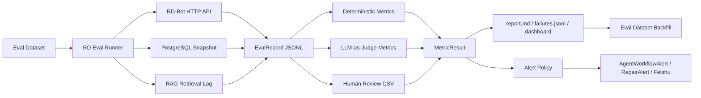

# RD-Bot RAG 与多 Agent 量化评测设计

日期：2026-07-06

## 1. 背景与目标

RD-Bot 当前已经具备 RAG 检索、四角色研发交付、阶段产物、经验沉淀、Prometheus 指标和 Feishu 告警基础，但还缺一个统一的“质量尺子”：

- RAG 检索到了什么、是否真的命中了关键证据，目前主要靠人工看日志。
- 需求评审、方案设计、编码和 QA 的好坏，目前更多是流程是否走完，而不是结果质量可量化。
- 告警已有基础端口，但缺少基于评测分数和质量退化的告警策略。

本 spec 的目标是定义 RD-Bot 的量化评测闭环：把每次 RAG 检索和多 Agent 交付录制为结构化 `EvalRecord`，用确定性指标和 LLM-as-judge 指标评分，输出报告、失败样本和告警，并把线上失败样本沉淀回离线评估集。

## 2. 外部产品调研结论

调研对象包括 LangSmith、Langfuse、Phoenix、Braintrust、Promptfoo、Ragas、DeepEval 和 TruLens。它们的共同模式可以抽象成五件事：

1. **数据集和实验分离**：离线数据集用于回归，线上 traces 用于监控，线上问题回流到数据集。
2. **Trace 是事实源**：评测不是只看最终答案，而是读取检索、工具调用、模型调用、阶段事件、耗时和成本。
3. **评分分层**：确定性指标负责快、稳、可进 CI；LLM-as-judge 负责语义质量；人工复核用于校准 judge。
4. **结果可比较**：每次评测产出不可变 experiment/run，可按版本、prompt、模型、检索策略对比。
5. **线上告警基于阈值和趋势**：生产流量无 reference 时，用 reference-free 指标、异常检测和失败分类告警。

可借鉴但不直接照搬的点：

- LangSmith / Braintrust 的 offline + online eval 生命周期。
- Langfuse 的 trace、score、dataset、experiment、dashboard 和 CI gate 组合。
- Phoenix / TruLens 的 RAG 评价三元组：context relevance、groundedness、answer relevance。
- Ragas / DeepEval 的 RAG 指标拆分：retriever 与 generator 分开评。
- Promptfoo 的本地可跑、配置化断言和 CI 阻断思路。

参考链接：

- <https://docs.langchain.com/langsmith/evaluation-concepts>
- <https://langfuse.com/docs/evaluation/overview>
- <https://arize.com/docs/phoenix/evaluation/llm-evals>
- <https://www.braintrust.dev/docs/evaluate>
- <https://www.promptfoo.dev/docs/intro/>
- <https://docs.ragas.io/en/stable/concepts/metrics/available_metrics/>
- <https://deepeval.com/docs/metrics-introduction>
- <https://www.trulens.org/component_guides/evaluation/feedback_selectors/selecting_components/>

## 3. 本地 ragenteval 可复用经验

`/Users/wish233/PycharmProjects/ragenteval` 已经沉淀出一条清晰的评测流水线：

```text
EvalSample -> EvalRecord -> MetricResult -> report.md / per_sample.csv / failures.jsonl / slides.html
```

其中最值得 RD-Bot 复用的是：

- **录制与评分分离**：先跑真实接口生成 `runs/*.jsonl`，后续可重复评分而不重跑昂贵链路。
- **自建指标 + RAGAS 指标组合**：Hit@K、Recall@K、MRR、误拒率、TTFT 走确定性脚本；faithfulness、answer_correctness、context_precision 等走 LLM judge。
- **失败样本落盘**：`failures.jsonl` 明确记录 query、期望证据、实际证据、失败原因和分数快照。
- **人工列优先**：`per_sample.csv` 预留 `*_manual` 列，人工复核后重新渲染报告。
- **A/B diff**：两次 run 可比较，适合检索策略、prompt、模型或上下文裁剪变更前后对比。

不能直接复用的是电商客服字段。RD-Bot 需要替换为研发交付字段：任务材料、角色产物、阶段状态、上下文证据、测试命令、PR 证据、告警记录和经验沉淀。

## 4. RD-Bot 当前可采集事实源

### 4.1 RAG 事实源

- `RepairRagPipeline.prepareContext(...)` 是 RAG 主入口，产出 `RepairContextPackage`。
- `RagRetrievalLogEvent` 已记录 `taskId`、`ticketId`、主意图、检索通道、`retrievedChunks` 和 `contextSummary`。
- `FileRagRetrievalLogSink` 默认把事件写入 `logs/rag-retrieval.jsonl`。
- `RagTraceController` 暴露 `/rag/traces/runs`、`/rag/traces/runs/{traceId}`、`/rag/traces/runs/{traceId}/nodes`。
- `/rag/v3/chat` 和 `/rag/v3/tasks/{taskId}` 可用于真实 HTTP 录制。

### 4.2 多 Agent 事实源

- `RequirementDeliveryEngine` 是需求交付主编排入口。
- 固定角色顺序为 `REQUIREMENT_REVIEWER -> SOLUTION_ARCHITECT -> CODING_AGENT -> QA_AGENT`。
- `rd_role_context_packages` 记录每个角色的证据、验收点、风险提示、上下文预算和省略证据。
- `rd_agent_stage_runs` 记录角色、状态、attempt、provider、provider attempts、上下文包、prompt/result artifact、失败分类和时间戳。
- `rd_agent_stage_artifacts` 记录 prompt/result/log 等产物 URI、摘要、`content_preview`、hash 和 metadata。
- `rd_agent_stage_events` 记录阶段时间线和 duration。
- `rd_experience_entries` 记录成功交付后的经验沉淀和复用证据。

### 4.3 告警与指标事实源

- `AgentWorkflowAlertSinkPort` 是 engine 层告警端口。
- `EngineAgentWorkflowAlertSink` 将多 Agent 告警桥接到 `RepairAlertSinkPort`。
- `FeishuImRepairAlertSink` 先本地留存，再发送 Feishu，并记录 delivery attempt。
- `RepairAlertType` 已覆盖阶段失败、provider fallback、QA 失败、交付复核失败、PR 发布失败、经验沉淀失败、知识刷新失败等类型。
- `/actuator/prometheus` 已输出任务成功率、QA 通过率、PR 创建率、人工介入率、重试率和阶段状态计数。

## 5. 总体架构



第一版实现建议放在 RD-Bot 仓库内：

```text
qa-runs/evaluation/
  datasets/
  runs/
  reports/
  failures/

scripts/evaluation/
  rd_eval_run.py
  rd_eval_score.py
  rd_eval_report.py
  rd_eval_diff.py
```

后续如果需要产品化，再把 runner 和 metric 引擎改造成 Java 端的 `EvalEngine` 与管理后台页面。第一版优先保持脚本化，降低侵入面。

## 6. 评估集 schema

第一版用 JSONL，每行一个 `RdEvalSample`。

```json
{
  "sample_id": "RD-RAG-001",
  "suite": "rag|requirement|solution|coding|qa|e2e",
  "scenario": "waimai-payment-callback",
  "difficulty": "easy|medium|hard",
  "tags": ["payment", "postgres", "regression"],
  "input": {
    "title": "支付回调成功但订单状态未更新",
    "description": "用户支付成功后商家端仍显示待支付",
    "logs": ["PaymentCallbackService.handleSuccess completed..."],
    "repository": "owner/repo",
    "baseBranch": "main",
    "priority": "P2"
  },
  "rag_gold": {
    "expectedIntentSystemId": "waimai",
    "mustEvidenceUris": [
      "knowledge://waimai/payment-callback",
      "code://server/src/services/PaymentCallbackService.java#handleSuccess"
    ],
    "niceEvidenceUris": [
      "code://server/src/services/OrderService.java#markPaid"
    ],
    "requiredTerms": ["PAID", "PENDING_PAYMENT", "paymentTransactionId"],
    "forbiddenTerms": ["无需修改", "无法判断"]
  },
  "stage_gold": {
    "REQUIREMENT_REVIEWER": {
      "expectedDecision": "APPROVED|NEED_INFO|NEEDS_HUMAN|UNSAFE|REJECTED",
      "mustMentionRisks": ["数据一致性", "幂等"],
      "mustBlockDownstream": false
    },
    "SOLUTION_ARCHITECT": {
      "mustSections": ["affectedFiles", "implementationSteps", "acceptanceMapping", "testPlan"],
      "mustAcceptanceIds": ["AC-1", "AC-2"],
      "expectedAffectedFiles": ["server/src/services/PaymentCallbackService.java"]
    },
    "CODING_AGENT": {
      "expectedChangedFiles": ["server/src/services/PaymentCallbackService.java"],
      "requiredTestCommands": ["npm test"],
      "forbiddenChangedFiles": [".env", "application.yaml"]
    },
    "QA_AGENT": {
      "mustRunRealCommands": true,
      "expectedAcceptanceStatuses": ["PASSED"],
      "maxSkippedAcceptanceCount": 0
    }
  },
  "alert_gold": {
    "expectedAlertTypes": [],
    "forbiddenAlertTypes": ["PR_PUBLICATION_FAILED"]
  }
}
```

字段规则：

- `mustEvidenceUris` 是检索主指标的真值集合；`niceEvidenceUris` 只参与 inclusive recall，不参与硬门禁。
- `expectedDecision` 用于评测需求评审的阻断准确率。
- `mustSections` 和 `mustAcceptanceIds` 用于方案产物结构完整性。
- `expectedChangedFiles` 和 `forbiddenChangedFiles` 用于编码 diff 质量和安全边界。
- `mustRunRealCommands` 用于 QA 真实验证率，`SKIPPED` 不计通过。

## 7. 录制结果 schema

Runner 每次执行输出 `RdEvalRecord`，落到 `qa-runs/evaluation/runs/<run_id>.jsonl`。

```json
{
  "run_id": "rd-eval-20260706-001",
  "sample_id": "RD-RAG-001",
  "rd_bot_version": "git-sha-or-build-version",
  "environment_id": "local|sit|prod-like",
  "task_id": "7479...",
  "status": "COMPLETED",
  "rag": {
    "traceId": "trace-id",
    "primaryIntentSystemId": "waimai",
    "searchChannels": ["vector", "keyword", "code"],
    "retrievedEvidenceUris": ["code://..."],
    "retrievedChunks": [
      {
        "chunkId": "waimai#...",
        "sourceName": "PaymentCallbackService.java",
        "knowledgeType": "code-snippet",
        "score": 9.6,
        "content": "..."
      }
    ],
    "contextSummary": "...",
    "latencyMs": 1234
  },
  "stages": {
    "REQUIREMENT_REVIEWER": {
      "status": "SUCCEEDED",
      "attemptNo": 1,
      "providerName": "long-cat",
      "providerAttemptCount": 1,
      "durationMs": 30000,
      "promptArtifactUri": "artifact://...",
      "resultArtifactUri": "artifact://...",
      "resultJson": {},
      "errorCategory": "",
      "errorMessage": ""
    }
  },
  "delivery": {
    "pullRequestUrl": "https://github.com/.../pull/15",
    "deliveryReviewApproved": true,
    "experienceTypes": ["REQUIREMENT_REVIEW", "TECHNICAL_DESIGN", "CODE_CHANGE", "QA_REPORT", "DELIVERY_REPORT"]
  },
  "alerts": [
    {
      "type": "PROVIDER_FALLBACK",
      "taskId": "7479...",
      "stageRunId": "7479...",
      "messageId": "feishu-message-id",
      "success": true
    }
  ],
  "timing": {
    "totalDurationMs": 600000,
    "ttftMs": 1200
  }
}
```

第一版 runner 必须保证：

- 录制同一个真实任务的 HTTP、PostgreSQL、retrieval log 和告警 sidecar，而不是拼接不同任务。
- 不记录任何 secret 原文，只记录 env 名、provider 名、协议、base URL 和脱敏 fingerprint。
- 对读取失败的字段写 `error` 和 `missingSources`，不要静默当成空列表。

## 8. 指标体系

### 8.1 RAG 检索指标

| 指标 | 公式 | 口径 | 初始阈值 |
| --- | --- | --- | --- |
| `intent_top1` | `predictedIntent == expectedIntent` | 全部 RAG 样本 | `>= 0.92` |
| `evidence_hit@5` | Top5 evidence 与 must 集合有交集 | `mustEvidenceUris` 非空样本 | `>= 0.90` |
| `evidence_recall@5` | Top5 命中 must 数 / must 总数 | `mustEvidenceUris` 非空样本 | `>= 0.80` |
| `evidence_recall_inclusive@5` | Top5 命中 must+nice 数 / must+nice 总数 | 诊断指标 | 不做硬门禁 |
| `mrr@10` | 第一个 must 命中的倒数排名 | `mustEvidenceUris` 非空样本 | `>= 0.70` |
| `critical_evidence_missing_rate` | 必需证据完全未命中样本占比 | RAG 样本 | `<= 0.05` |
| `noise_context_rate` | retrieved chunks 中无关 chunk 占比 | LLM 或人工标注 | `<= 0.25` |
| `context_budget_usage` | 实际上下文 token / 预算 token | 角色上下文包 | `<= 0.90` |

### 8.2 RAG 生成指标

| 指标 | 含义 | 来源 | 初始阈值 |
| --- | --- | --- | --- |
| `faithfulness` | 回答或上下文摘要是否被检索证据支撑 | LLM-as-judge | `>= 0.90` |
| `answer_relevancy` | 输出是否回应输入问题 | LLM-as-judge | `>= 0.85` |
| `answer_correctness` | 输出是否与 reference / acceptance oracle 一致 | LLM-as-judge + 人工列 | `>= 0.80` |
| `context_precision` | 召回内容中有用信息比例 | LLM-as-judge | `>= 0.75` |
| `context_recall` | 召回内容是否覆盖 reference 所需信息 | LLM-as-judge | `>= 0.80` |

RAGAS/DeepEval 类指标要保留 `n_runs`、judge model、embedding model、base URL 和失败重试次数。生产报告只记录配置名称，不记录 key。

### 8.3 需求评审指标

| 指标 | 公式 | 初始阈值 |
| --- | --- | --- |
| `requirement_decision_accuracy` | 评审决策等于 `expectedDecision` 的比例 | `>= 0.95` |
| `blocker_recall` | 应阻断样本被阻断的比例 | `>= 0.95` |
| `false_block_rate` | 不应阻断样本被阻断的比例 | `<= 0.03` |
| `risk_coverage` | 命中 `mustMentionRisks` 的比例 | `>= 0.80` |
| `downstream_leak_rate` | 已阻断需求仍派发后续角色的比例 | `= 0` |

评审阶段的 `NEED_INFO / NEEDS_HUMAN / UNSAFE / REJECTED / FAILED / BLOCKED` 必须被视为阻断类，不允许进入方案、编码或 QA。

### 8.4 方案设计指标

| 指标 | 公式 | 初始阈值 |
| --- | --- | --- |
| `solution_schema_valid_rate` | result artifact 可解析且字段齐全比例 | `>= 0.98` |
| `acceptance_mapping_coverage` | 方案覆盖 gold acceptance 数 / gold acceptance 总数 | `>= 0.90` |
| `affected_file_precision` | 方案影响文件命中实际变更文件比例 | `>= 0.70` |
| `affected_file_recall` | 实际变更文件被方案预测比例 | `>= 0.70` |
| `test_plan_coverage` | 测试计划覆盖验收项比例 | `>= 0.85` |
| `risk_and_rollback_presence` | 风险和回滚段落均存在比例 | `>= 0.95` |

方案结果不是只看“有文本”。必须检查 `affectedFiles`、`implementationSteps`、`acceptanceMapping`、`testPlan` 和风险/回滚信息。

### 8.5 编码指标

| 指标 | 公式 | 初始阈值 |
| --- | --- | --- |
| `coding_result_schema_valid_rate` | `result.json` 通过结构化校验比例 | `>= 0.98` |
| `changed_file_precision` | 实际变更文件落在预期/方案文件内比例 | `>= 0.80` |
| `forbidden_file_touch_rate` | 触碰 forbidden 文件样本比例 | `= 0` |
| `test_command_pass_rate` | 编码阶段声明测试命令通过比例 | `>= 0.90` |
| `secret_leak_rate` | prompt/result/diff/metadata 命中 secret needle 比例 | `= 0` |
| `provider_attempt_success_rate` | provider attempt 最终成功比例 | `>= 0.95` |
| `provider_fallback_rate` | 降级发生比例 | 只监控趋势 |
| `pr_policy_violation_rate` | 编码阶段越权返回 PR URL 比例 | `= 0` |

编码阶段不得创建物理 PR；任何阶段级 `pullRequestUrl` 都应计入 `pr_policy_violation_rate` 并触发阻断。

### 8.6 QA 指标

| 指标 | 公式 | 初始阈值 |
| --- | --- | --- |
| `qa_schema_valid_rate` | QA report 可解析且字段齐全比例 | `>= 0.98` |
| `real_command_execution_rate` | 带真实命令和日志引用的验收项比例 | `>= 0.95` |
| `acceptance_pass_rate` | 验收项 `PASSED` 比例 | 只监控趋势 |
| `skipped_acceptance_rate` | 验收项 `SKIPPED` 比例 | `<= 0.05` |
| `qa_false_pass_rate` | gold 失败样本被 QA 放行比例 | `= 0` |
| `qa_blocker_precision` | QA 阻断样本确有失败验收项比例 | `>= 0.95` |
| `qa_log_artifact_coverage` | 验收项包含 log artifact 引用比例 | `>= 0.95` |

`SKIPPED` 不等于通过。生产验收中 `SKIPPED` 只能作为缺环境说明，必须附补测命令模板。

### 8.7 交付闭环指标

| 指标 | 公式 | 初始阈值 |
| --- | --- | --- |
| `delivery_review_approval_accuracy` | 交付复核决策与 gold 一致比例 | `>= 0.95` |
| `pr_creation_success_rate` | 复核通过后 PR 创建成功比例 | `>= 0.98` |
| `required_experience_complete_rate` | 五类经验全部创建比例 | `>= 0.95` |
| `experience_redacted_rate` | 经验 `redacted=true` 比例 | `= 1.0` |
| `experience_reuse_hit_rate` | follow-up 上下文含 `rd-experience://` 的比例 | `>= 0.60` 初始监控 |

必需经验类型为：

- `REQUIREMENT_REVIEW`
- `TECHNICAL_DESIGN`
- `CODE_CHANGE`
- `QA_REPORT`
- `DELIVERY_REPORT`

## 9. 报告产物

每次评测输出目录：

```text
qa-runs/evaluation/reports/<run_id>/
  report.md
  per_sample.csv
  failures.jsonl
  _scores.json
  diff.md
```

`report.md` 必须包含：

- run metadata：版本、环境、样本数、任务数、执行人。
- 核心 KPI：RAG、四角色、交付、告警。
- 按 suite/scenario/difficulty/provider 分层。
- 失败 TopN：每条含 sampleId、taskId、role、metric、score、threshold、artifactUri、nextAction。
- 跳过项：明确缺失环境和补测命令。

`per_sample.csv` 必须包含：

- 每个指标的 per-sample 分数。
- RAGAS/LLM judge 指标后预留 `*_manual` 列。
- `taskId`、`stageRunId`、`artifactUri`，便于人工追踪。

`failures.jsonl` 必须包含：

- `failureReasons`
- `expected`
- `actual`
- `scoreSnapshot`
- `evidenceUris`
- `nextAction`

## 10. 告警策略

新增评测类告警建议先复用 `RepairAlertType`，再按需要扩展：

| 告警 | 触发条件 | Severity | nextAction |
| --- | --- | --- | --- |
| `RAG_EVALUATION_DEGRADED` | `evidence_hit@5`、`context_recall` 或 `faithfulness` 低于阈值 | P1 | 查看 `failures.jsonl`，回归检索策略或知识库 |
| `AGENT_STAGE_EVALUATION_DEGRADED` | 任一角色核心指标低于阈值 | P1 | 查看 role artifact 和 judge reason |
| `QA_SKIPPED_TOO_HIGH` | `skipped_acceptance_rate > 0.05` | P1 | 补齐真实环境或测试命令 |
| `REQUIREMENT_REVIEW_FALSE_PASS` | 应阻断需求被放行 | P0 | 立即停止后续派发并人工复核 |
| `SECRET_LEAK_DETECTED` | 任一产物命中 secret needle | P0 | 阻断交付，隔离产物 |
| `FEISHU_ALERT_DELIVERY_FAILED` | Feishu delivery attempt 失败 | P2 | 检查 Feishu 配置和 chatId |
| `EVAL_RUN_FAILED` | runner 无法录制完整事实源 | P2 | 检查 HTTP、PostgreSQL、日志路径 |

告警 metadata 必须包含：

- `runId`
- `sampleId`
- `taskId`
- `role`
- `stageRunId`
- `metricName`
- `score`
- `threshold`
- `artifactUri`
- `reportUri`
- `nextAction`

不得包含 secret 原文、完整 token、API key、明文密码或未脱敏环境变量值。

## 11. 实施切片

### Slice 1：离线评测脚手架

目标：先跑出 RD-Bot 专属 `EvalSample -> EvalRecord -> MetricResult -> report`。

交付：

- 新增 `qa-runs/evaluation/datasets/rd_eval_smoke.jsonl`。
- 新增 Python runner/score/report 脚本。
- 录制 `/rag/v3/chat`、`/rag/v3/tasks/{taskId}`、`logs/rag-retrieval.jsonl` 和 PostgreSQL 阶段表。
- 只实现确定性指标：Hit@K、Recall@K、MRR、阶段状态、schema 完整率、真实命令覆盖率、SKIPPED 比例。

验收：

```bash
python3 scripts/evaluation/rd_eval_run.py --dataset qa-runs/evaluation/datasets/rd_eval_smoke.jsonl --limit 3
python3 scripts/evaluation/rd_eval_score.py --latest --skip-judge
python3 scripts/evaluation/rd_eval_report.py --latest
```

### Slice 2：LLM-as-judge 与人工复核

目标：补齐 faithfulness、context precision/recall、方案质量、QA 质量 judge。

交付：

- Judge 配置只从环境变量读取。
- `--judge-n 3` 支持多次取均值。
- `per_sample.csv` 支持人工列优先。
- judge prompt 固定输出 JSON，不解析自由文本。

验收：

```bash
python3 scripts/evaluation/rd_eval_score.py --latest --judge-limit 10 --judge-n 3
python3 scripts/evaluation/rd_eval_report.py --latest
```

### Slice 3：告警闭环

目标：将评测阈值触发为 `AgentWorkflowAlert` / `RepairAlert`。

交付：

- 增加评测告警类型或 metadata 约定。
- Feishu 告警包含 `runId`、`metricName`、`score`、`threshold`、`reportUri`、`nextAction`。
- 告警发送失败写入 delivery attempt，不影响评测报告落盘。

验收：

```bash
./mvnw -q -pl bootstrap -Dtest=EngineAgentWorkflowAlertSinkTest,FeishuImRepairAlertSinkTest test
```

### Slice 4：管理端与 Prometheus

目标：把评测结果接入运营视图。

交付：

- `/admin/evaluations/runs`：列出 run。
- `/admin/evaluations/runs/{runId}`：查看报告和失败样本。
- `/actuator/prometheus` 增加评测分数、失败数、告警数、最近一次 run 状态。

验收：

```bash
./mvnw -q -pl bootstrap -am -Dtest=EvaluationAdminControllerTest,PrometheusMetricsControllerTest -Dsurefire.failIfNoSpecifiedTests=false test
```

### Slice 5：CI 与回归门禁

目标：让质量退化不能悄悄合入。

交付：

- smoke 数据集每次 PR 跑确定性指标。
- nightly 跑 full 数据集 + LLM judge。
- A/B diff 对比 baseline，低于阈值 fail。
- 线上失败样本自动进入 candidate dataset，人工确认后进主评估集。

验收：

```bash
python3 scripts/evaluation/rd_eval_diff.py --baseline <baseline_run> --candidate <candidate_run> --fail-on-regression
```

## 12. 数据集建设策略

第一批样本建议按以下比例构建：

| suite | 数量 | 来源 |
| --- | ---: | --- |
| RAG 检索 | 30 | 真实 bug/需求材料、知识库文档、代码证据 |
| 需求评审 | 20 | 可交付、缺信息、高风险、不安全、拒绝类 |
| 方案设计 | 20 | 单文件、多文件、数据库、外部 API、配置类 |
| 编码 | 20 | 可快速验证的本地仓库任务 |
| QA | 20 | 成功、失败、缺环境、误通过陷阱 |
| E2E | 10 | 完整四角色链路 |

每条样本必须有：

- 明确 gold。
- 可追溯 source。
- 预期失败/成功理由。
- 不含 secret 明文。
- 可在本地或生产等价环境复现。

## 13. 风险与约束

- LLM judge 有方差，单次 3%-5% 波动不能直接判定退化；关键指标需支持多次取均值和人工列覆盖。
- Judge 不能与被评模型长期同源；报告必须记录 judge model，后续应支持不同 provider。
- 线上无 reference 的样本不能算 reference-based correctness，只能算 reference-free 风险指标和异常指标。
- RAG 评测必须绑定同一次检索事实源，避免像早期 ragenteval 那样用生产 SSE 与评测旁路两次独立检索拼接。
- 评测脚本不得把 provider key、Feishu secret、GitHub token 写入命令行参数、报告、metadata 或日志。
- 不允许用 `SKIPPED` 冒充通过。

## 14. 当前不做

第一版不做：

- 完整评测平台 UI。
- 自动训练 judge。
- 自动生成所有 gold。
- 多轮对话评测。
- 细粒度 token 成本归因到每个 prompt span。

这些能力等离线评测和告警闭环稳定后再加。

## 15. 完成定义

本方案完成的最低标准：

1. 至少 3 条 RAG 样本、3 条多 Agent 样本能录制为 `RdEvalRecord`。
2. 自建指标能生成 `_scores.json`、`report.md`、`per_sample.csv`、`failures.jsonl`。
3. 失败样本能定位到 taskId、role、stageRunId 和 artifactUri。
4. 至少一个低分阈值能触发脱敏 Feishu 告警。
5. 报告明确列出通过项、失败项、跳过项和补测命令。
6. 所有评测产物均不包含 secret 明文。
