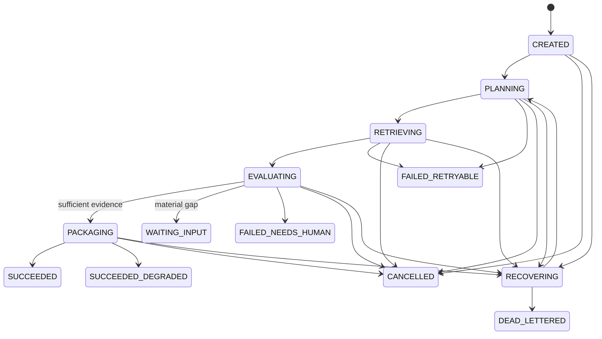

# Deep RAG Retrieval State Redesign

## Decision

RD-Bot now treats one retrieval attempt as an independent `RetrievalRun`. It does not use
`RdTaskStatus` or `AgentStageStatus` to describe internal search work. This is the controlled
counterpart to Deep RAG's iterative navigation: RD-Bot retains its audit, project-boundary and
retry guarantees while letting retrieval report its own plan, execution and quality outcome.

The implementation deliberately keeps three state machines separate:

| Scope | Source of truth | Purpose |
| --- | --- | --- |
| Delivery task | `rd_tasks` plus task events | User-visible delivery lifecycle |
| Agent stage | `rd_agent_stage_runs` | Role dispatch, provider attempt and output lifecycle |
| Retrieval attempt | `rd_rag_retrieval_runs` plus events | Evidence collection, quality decision and retry lineage |

## Retrieval Lifecycle

`WAITING_INPUT`, `SUCCEEDED`, `SUCCEEDED_DEGRADED`, `FAILED_RETRYABLE`,
`FAILED_NEEDS_HUMAN`, `CANCELLED` and `DEAD_LETTERED` are terminal attempts. A retry never
rewrites one of these rows: it creates `attemptNo + 1` with `parentRunId` pointing at the prior
attempt. `RetrievalRunTransitionPolicy` is the only permitted transition graph.

The current vertical slice executes:

`NORMALIZE_QUERY -> ROUTE_SCOPE -> PLAN/RETRIEVE -> EVALUATE -> PACKAGE`

The existing rule query rewrite is now done before `RepairRagRequest` enters retrieval. Multi
channel search fan-out reports per-channel outcomes, retains successful evidence when one
channel fails and uses reciprocal rank fusion (`k=60`) rather than comparing incompatible source
scores.

## Quality And Task Projection

The lifecycle records `SUFFICIENT`, `DEGRADED_ACCEPTABLE` or `NEED_INPUT` as an explicit
`EvidenceQualityDecision`. For the Bug entrypoint:

| Retrieval result | Task projection |
| --- | --- |
| `SUCCEEDED` / `SUCCEEDED_DEGRADED` | `SEARCHING -> EXECUTING`; the legacy chat compatibility flow subsequently commits its synthetic response |
| `WAITING_INPUT` | `SEARCHING -> FAILED_NEEDS_HUMAN`; no execution prompt is sent |
| retryable retrieval exception | `SEARCHING -> FAILED_RETRYABLE` |

The requirement delivery entrypoint creates a `REQUIREMENT_BASE` run and one `AGENT_ROLE` run
for each of `REQUIREMENT_REVIEWER`, `SOLUTION_ARCHITECT`, `CODING_AGENT` and `QA_AGENT` before
role context assembly. This records distinct context intent and leaves stage state ownership with
`RequirementDeliveryEngine`.

## Persistence And Concurrency

`bootstrap/src/main/resources/sql/postgres/p2_rag_retrieval_state.sql` adds:

- `rd_rag_retrieval_runs`: attempt lineage, project KB scope, redacted query preview/hash,
  budget, counters, quality outcome, lease fields and optimistic `version`.
- `rd_rag_retrieval_events`: append-only status transitions written in the same transaction as
  the successful compare-and-set run update.
- `rd_rag_retrieval_steps` and `rd_rag_retrieval_artifacts`: durable extension points for
  per-step audit and redacted output metadata.
- `knowledge_map_nodes`: KB/document/chunk-range summaries without raw document expansion.
- `rd_role_context_packages.retrieval_run_id`: a forward-compatible link for role package
  provenance.

`PostgresRetrievalRunStore` uses a versioned SQL `UPDATE ... WHERE version = expectedVersion`.
It is transactional around a transition and its event insert. The in-memory store follows the
same transition policy for fast domain tests only; it is not the production truth.

## Knowledge Map Safety

`POST /admin/knowledge-base/{knowledgeBaseId}/map/rebuild` rebuilds a controlled map from
the persisted KB, documents and chunk indices. `GET /admin/knowledge-base/{knowledgeBaseId}/map`
returns only node identifiers, parent links, paths, checksum/revision, token estimates and bounded
summaries. It does not expose raw documents, accept file paths or accept `..` traversal input.

## API And UI

The retrieval control plane provides:

- `GET /admin/rd-tasks/{taskId}/retrieval-runs`
- `GET /admin/rag-retrieval-runs/{runId}`
- `GET /admin/rag-retrieval-runs/{runId}/timeline`
- `GET /admin/rag-retrieval-runs/{runId}/artifacts`
- `POST /admin/rag-retrieval-runs/{runId}/retry`
- `POST /admin/rag-retrieval-runs/{runId}/cancel`
- `GET /admin/knowledge-base/{knowledgeBaseId}/map`
- `POST /admin/knowledge-base/{knowledgeBaseId}/map/rebuild`

The task detail page now includes a compact RAG retrieval panel with attempts, consumer, status,
iteration, evidence counts, quality outcome and safe retry/cancel controls. Active task detail
refresh remains owned by the existing page polling behavior. `RD_BOT_BACKEND_TARGET` can override
Vite's default `18080` proxy target for isolated local QA.

The initial artifact projection writes a redacted `QUERY` artifact at run creation, a
`QUALITY_REPORT` at evaluation and a redacted `CONTEXT_PACKAGE` summary when packaging succeeds.
Artifact endpoints intentionally omit metadata blobs and raw source bodies.

## Configuration

The implemented baseline reads the following environment variables without storing their values:

- `RD_RAG_DEEP_MAX_ITERATIONS` (default `3`)
- `RD_RAG_DEEP_CONTEXT_BUDGET_CHARS` (default `18000`)

Channel timeout, model planner timeout, document expansion budget, external reranker and recovery
scanner remain the next incremental delivery. They must be added behind ports and persisted step
artifacts rather than by allowing free-form model tool execution.

## Follow-up Boundaries

This slice establishes the production state boundary, persistence, safe map and operator surface.
Before enabling autonomous multi-round planning in production, implement the remaining ports and
their acceptance cases: structured `RetrievalPlannerPort`, `RerankerPort`, `EvidenceGraderPort`,
per-step/artifact writers, lease recovery scanner, full-document expansion reader, role package
foreign-key enforcement and the A03-A18 real-evaluation fixtures. Do not make a model's hidden
reasoning or unbounded file reads part of the state machine.
