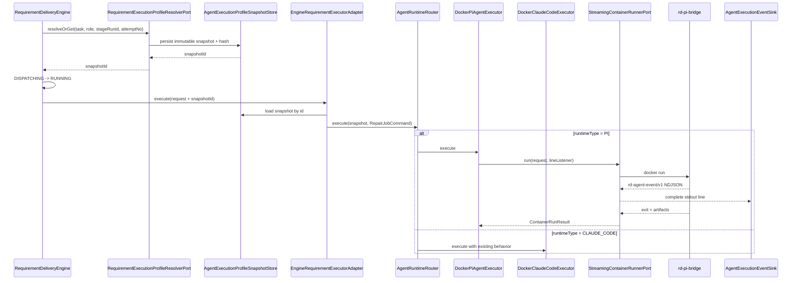

# RD-Bot Pi Agent Runtime Implementation Plan

> Date: 2026-07-26
> Status: Phases 0-8 implemented in worktree; Phase 9 canary and operator inputs pending
> Source design: `docs/superpowers/specs/2026-07-26-pi-agent-runtime-integration-design.md`

## 0. Implementation Status (updated 2026-07-26)

| Phase | State | Evidence |
| --- | --- | --- |
| 0 Baseline fixtures | Done (adapted) | Versioned protocol schemas under `bootstrap/src/main/resources/executor/pi/protocol/` + `PiProtocolResourceTest`; event fixtures live as bridge Node tests instead of `exec/src/test/resources/pi-events/*` |
| 1 Control-plane domain/persistence | Done | `rag/.../project/agent/**`, `p8_pi_agent_runtime.sql`, Postgres stores + mappers, provider registry |
| 2 Snapshot before RUNNING | Done | `RequirementExecutionProfileResolverPort`, `EngineRequirementExecutionProfileResolver`, `rd.executor.agent-runtime.enabled` switch |
| 3 Java strategy router | Done | `exec/.../runtime/AgentRuntimeRouter`, `AgentRuntimeExecutorConfiguration`; BugFix wiring untouched |
| 4 Pi bridge + image | Done | `bootstrap/src/main/resources/executor/pi/` (Dockerfile, `rd-pi-bridge.mjs`, 6 bridge tests green, no real Provider needed) |
| 5 L2 streaming + Pi executor | Done | `StreamingContainerRunnerPort`, `ContainerOutputListener`, `pi/impl/DockerPiAgentExecutor`, line-decoder/backpressure tests |
| 6 Event persistence + one-way SSE | Done | `AgentExecutionEventStore`, private RustFS archive (`ObjectStoragePiArtifactPublisher`, retention service), SSE at `/admin/rd-tasks/{taskId}/stage-runs/{stageRunId}/execution-events` |
| 7 H1 read path + fail-closed boundary | Partial | Verified-set read path, digest-verified materializer, read-only mounts done; publication APIs deferred (see below) |
| 8 Admin APIs + frontend | Done | `AgentExecutionProfileAdminController`, mutation token gate, ProjectListPage profile controls, TaskRoleWorkbench runtime snapshot/override/SSE panels |
| 9 Canary + production gate | Not started | Blocked on operator inputs O1-O8 |

### H1 publication boundary: explicit fail-closed contract

The extension publication pipeline (upload, isolated build, signature, smoke
import) and its admin APIs are intentionally NOT implemented yet because they
depend on operator inputs O2 (signature keys) and O6 (build/size limits).
The following APIs from Section 14 therefore do not exist yet and must not be
stubbed with weaker semantics:

```text
POST /admin/agent-extensions
GET  /admin/agent-extensions/{extensionId}/versions
POST /admin/agent-extensions/{extensionId}/versions/{version}/verify
POST /admin/agent-extension-sets
PUT  /admin/projects/{projectId}/agent-execution-profiles/{profileId}/extension-set
```

Until the publisher exists, every H1 layer already fails closed:

- `rd.executor.pi.resources.enabled=false` by default; enabling it without
  `approved-cache-root` throws at startup (`PiAgentResourceConfiguration`).
- `PostgresPiVerifiedResourceSetStore` resolves only `enabled` sets whose every
  member is `VERIFIED` with a well-formed SHA-256; anything else resolves empty.
- `FileSystemPiResourceManifestMaterializer` re-hashes each bundle against the
  frozen snapshot digest, rejects symlinks/path escapes, and fails the whole
  stage on any mismatch (D9 fail-closed).
- Profile/binding/override mutations return 503 until
  `rd.executor.agent-runtime.mutation-token` is configured
  (`AgentRuntimeMutationAccessPolicy`), and 403 on token mismatch.
- Seeding a verified extension row today requires direct control-plane database
  access by a platform administrator; there is no HTTP path that can register
  an unverified bundle.

## 1. Goal

Introduce Pi as a first-class, selectable requirement-delivery executor without
turning `DockerClaudeCodeExecutor` into a collection of runtime conditionals.
Java remains the control plane, Docker remains the isolation boundary, and a
small Node bridge embeds the Pi SDK inside the Pi container.

The first production scope is deliberately narrow:

1. Only `CODING_AGENT` can select Pi.
2. Java resolves an immutable execution snapshot before a stage enters
   `RUNNING`, then routes to Pi, Claude Code, or model-only by strategy.
3. Pi events stream one way from the container to Java using L2 line callbacks.
   There is no steer, follow-up, reload, or other bidirectional session control.
4. Extension activation uses H1 semantics. A changed extension set affects only
   a later stage/container; a running container never reloads resources.
5. Pi failure does not automatically fall back to Claude Code.
6. BugFix is not migrated. It is being retired separately and must not be
   affected by Pi Spring wiring.

## 2. Locked Decisions

| ID | Area | Decision |
| --- | --- | --- |
| Q1 | Executor switch | Java `AgentRuntimeRouter`, before Docker request creation |
| Q2 | Observation | L2 streaming container stdout; no bidirectional control |
| Q3 | Hot activation | H1, next stage/container only |
| D1 | Pi roles | `CODING_AGENT` only; QA remains Claude |
| D2 | Runtime override | Project-role default plus authorized task-level registered profile override |
| D3 | Profile model | New agent execution profile model; retain current runtime-image profile |
| D4 | Java/Pi boundary | Node `rd-pi-bridge` uses SDK; Java consumes RD-owned NDJSON |
| D5 | Runtime interaction | Observe and stop only; no steer, follow-up, reload, or model switch |
| D6 | Pi fallback | No automatic Claude fallback |
| D7 | Extension trust | Platform-admin published and verified only |
| D8 | Hot activation | H1 only; no H2/H3 implementation |
| D9 | Extension failure | Fail closed for every selected extension |
| D10 | Session | Archive to RustFS; never auto-resume |
| D11 | Events | Normalized events in normal artifact flow; raw Pi events restricted and short-lived |
| D12 | Credentials | Minimal environment-variable injection |
| D13 | Providers | One unified `ModelProviderProfile` with runtime-specific adapters |
| D14 | QA migration | Separate future project after Pi coding canary |
| D15 | Dependencies | Built and locked in isolated publisher; never installed at runtime |
| D16 | Snapshot timing | Resolve at `DISPATCHING`; running attempt is immutable |
| D17 | Repo context | Allow Pi to load repository `AGENTS.md`/`CLAUDE.md`; record observed paths and hashes |
| D18 | BugFix | Do not integrate it; retire separately and route all new work through Requirement Delivery |
| D19 | Tool policy | Project-role `toolPolicyVersion`; host policy is the hard upper bound |

## 3. Explicit Non-Goals

- Do not migrate `QA_AGENT`, browser QA images, or QA evidence semantics to Pi.
- Do not add a runtime command API, stdin command loop, WebSocket, steer,
  follow-up, model switch, compaction command, or `ctx.reload()`.
- Do not keep Pi containers alive after `agent_settled`.
- Do not automatically load repository `.pi/extensions`, `.pi/settings.json`,
  `.pi/skills`, `.agents/skills`, or project package sources.
- Do not run Pi or third-party extensions on the host.
- Do not perform runtime `npm install`, `pi install`, or Git package fetches.
- Do not reuse a partially modified Pi workspace in a Claude attempt.
- Do not modify the legacy BugFix request or result protocol.
- Do not remove Claude Code until the Pi canary has passed and a separate
  retirement decision is approved.

## 4. Target Execution Flow



The snapshot persistence must happen before `RUNNING`. A crash after snapshot
creation but before transition leaves a `DISPATCHING` stage with a reusable
snapshot. `resolveOrGet(stageRunId)` must return that exact snapshot rather
than resolving current configuration again.

## 5. Cross-Cutting Contracts

### 5.1 Execution profiles and bindings

Use multiple registered profiles rather than one mutable row per project-role,
because D2 requires an authorized task override to reference a registered
profile ID.

```text
AgentExecutionProfile
  profileId
  projectId
  role
  name
  runtimeType                 PI | CLAUDE_CODE | MODEL_ONLY
  providerProfileId
  modelOverride?
  runtimeImageProfileRole?    references existing Claude image profile semantics
  extensionSetId + extensionSetVersion?
  toolPolicyId + toolPolicyVersion
  sessionPolicy               ARCHIVE_NO_RESUME
  enabled
  version
```

Bindings are separate:

```text
ProjectAgentExecutionProfileBinding(projectId, role, profileId)
TaskAgentExecutionProfileOverride(taskId, role, profileId)
```

Resolution precedence is fixed:

1. Authorized task-role override.
2. Project-role default binding.
3. Compatibility default that reproduces current behavior.

Compatibility defaults are:

- `CODING_AGENT` and `QA_AGENT`: Claude Code.
- `REQUIREMENT_REVIEWER` and `SOLUTION_ARCHITECT`: model-only only when the
  existing OpenAI-chat executor is enabled; otherwise Claude Code.
- A profile requesting Pi for a non-coding role is invalid and cannot activate.

### 5.2 Immutable execution snapshot

`AgentExecutionProfileSnapshot` stores resolved non-secret values, not mutable
foreign-key lookups:

```text
snapshotId / stageRunId / taskId / attemptNo
runtimeType / runtimeProtocolVersion
imageReference / imageDigest
providerId / providerProtocol / baseUrl / model / thinkingLevel
credentialEnvironmentVariableName     # never the value
profileId / profileVersion / resolvedFrom
extensionSetId / setVersion / every extension version and sha256
toolPolicyId / toolPolicyVersion / normalized policy hash
sessionPolicy
snapshotJson / snapshotHash / resolvedAt
```

The snapshot store has a unique constraint on `stage_run_id`. All readers
verify `sha256(canonical(snapshotJson)) == snapshotHash` before use.

### 5.3 Unified provider profile

Add a shared `ModelProviderProfile` registry. A profile contains public routing
metadata and the name of an environment variable holding its credential. It
does not contain the credential value.

Runtime adapters are explicit:

- Claude adapter accepts only protocols the Claude CLI integration supports.
- Pi adapter renders Pi model metadata and maps the selected environment value
  into `ModelRuntime` at process startup.
- Model-only adapter maps compatible profiles to the existing chat executor.
- Unsupported `(runtimeType, providerProtocol)` pairs fail profile validation,
  not during an agent turn.

For backward compatibility, existing `rd.executor.docker.providers` and
`rd.executor.openai-chat` configuration are adapted into the registry when the
new unified provider list is absent. Log one deprecation warning; do not change
which current Provider is selected.

### 5.4 Event protocol

Bridge stdout is reserved for strict LF-delimited `rd-agent-event/v1` JSON.
Every bridge event has a `sourceSequence`; Java validates the envelope and
assigns the authoritative `sequence` used by storage and SSE.

Required normalized classes:

```text
RUNTIME_READY / AGENT_STARTED / AGENT_SETTLED / RUNTIME_STOPPED
TURN_STARTED / TURN_COMPLETED
ASSISTANT_TEXT_DELTA / ASSISTANT_TEXT_COMPLETED
TOOL_STARTED / TOOL_PROGRESS / TOOL_COMPLETED / TOOL_BLOCKED
PROVIDER_REQUESTED / PROVIDER_RESPONDED / PROVIDER_RETRYING
COMPACTION_STARTED / COMPACTION_COMPLETED
RESOURCES_LOADED / EXTENSION_FAILED
USAGE_UPDATED
RESULT_SUBMITTED / RESULT_REJECTED / ARTIFACT_WRITTEN
PROTOCOL_ERROR
```

Never normalize or display hidden reasoning, environment values, authorization
headers, full Provider request bodies, unrestricted tool output, or raw session
content.

### 5.5 Result contract

`rd_submit_result` is an image-bundled required tool:

1. Pi tool parameters use TypeBox `Type.Object({ result: Type.Any() })`.
2. Bridge validates `result` with a versioned JSON schema and writes
   `/work/output/result.json` atomically.
3. It emits `RESULT_SUBMITTED`, records `resultAccepted=true`, and returns
   `terminate: true` only as a stop hint.
4. Bridge waits for `agent_settled` and validates the file again.
5. Java uses the existing `StructuredResultValidator` as final authority.
6. Success requires an accepted result, `agent_settled`, a zero container exit,
   and a Java-valid `result.json`. Any disagreement is failure.

### 5.6 H1 extension contract

An extension version is immutable. Activation updates only a logical binding.
At `DISPATCHING`, the resolver freezes exact versions and hashes. Before Docker
starts, the materializer creates one immutable resource manifest for that
stage. The manifest and all content-addressed bundle directories are mounted
read-only. Bridge reads the manifest once and never reloads it.

Repository context is intentionally different from executable resources:

- Repository `AGENTS.md`/`CLAUDE.md` may be discovered by Pi.
- Repository extensions, skills, settings, prompts, themes, and packages are
  filtered out.
- `RESOURCES_LOADED` and `runtime-meta.json` record the actual context paths and
  SHA-256 values observed at startup.

## 6. Phase 0: Baseline and Contract Fixtures

### Objective

Freeze current behavior and create deterministic protocol fixtures before any
production routing change.

### Changes

- Add protocol schemas under
  `bootstrap/src/main/resources/executor/pi/protocol/`:
  `rd-agent-event-v1.schema.json`, `rd-pi-request-v1.schema.json`, and
  `rd-result-v1.schema.json`.
- Add recorded valid and invalid event streams under
  `exec/src/test/resources/pi-events/`.
- Add a current-routing characterization test for every role with
  `openai-chat` enabled and disabled.
- Add a Spring context characterization test proving the legacy BugFix adapter
  resolves exactly the same executor before Pi beans exist.
- Record baseline paired-run fields: runtime, provider, model, base commit,
  prompt hash, result validity, duration, token usage, and artifact completeness.

### Primary files

- Modify `engine/src/test/java/com/wish/rd/engine/requirement/RequirementDeliveryEngineTest.java`.
- Modify `bootstrap/src/test/java/com/wish/rd/bootstrap/executor/EngineRequirementExecutorConfigurationTest.java`.
- Add `exec/src/test/java/com/wish/rd/exec/repair/runtime/AgentRuntimeEventFixtureTest.java`.
- Add `exec/src/test/resources/pi-events/*.jsonl`.
- Add `bootstrap/src/main/resources/executor/pi/protocol/*.json`.

### Exit gate

- Existing tests are green before feature code.
- Every fixture has an expected normalized event sequence and expected failure
  category.
- The baseline report contains no invented benchmark values; unavailable data
  is marked explicitly.

## 7. Phase 1: Control-Plane Domain and Persistence

### Objective

Add new profiles, bindings, snapshots, extension metadata, and tool-policy
metadata without changing runtime selection yet.

### Domain changes

Add under `rag/src/main/java/com/wish/rd/rag/project/agent/`:

- `model/AgentRuntimeType.java`
- `model/ModelProviderProtocol.java`
- `model/ModelProviderProfile.java`
- `model/AgentExecutionProfile.java`
- `model/ProjectAgentExecutionProfileBinding.java`
- `model/TaskAgentExecutionProfileOverride.java`
- `model/AgentExecutionProfileSnapshot.java`
- `model/AgentToolPolicy.java`
- `model/AgentExtension.java`
- `model/AgentExtensionVersion.java`
- `model/AgentExtensionSet.java`
- Store interfaces and services for profiles, bindings, overrides, snapshots,
  policies, extensions, versions, and sets.
- In-memory implementations matching existing `ProjectRuntimeProfileStore`
  conventions.

Keep `rag/src/main/java/com/wish/rd/rag/project/runtime/` and
`rd_project_runtime_profiles` unchanged. They continue to represent verified
Claude runtime images.

### PostgreSQL migration

Add `bootstrap/src/main/resources/sql/postgres/p8_pi_agent_runtime.sql` with:

```text
rd_agent_execution_profiles
rd_project_agent_profile_bindings
rd_task_agent_profile_overrides
rd_agent_execution_profile_snapshots
rd_agent_tool_policies
rd_agent_extensions
rd_agent_extension_versions
rd_agent_extension_sets
rd_agent_extension_set_members
```

Important constraints:

- Unique `(project_id, role, name)` for registered profiles.
- Unique `(project_id, role)` for default bindings.
- Unique `(task_id, role)` for task overrides.
- Unique `stage_run_id` for snapshots.
- Check runtime and role enums in SQL.
- Foreign keys from binding/override to enabled profile records.
- Extension-set members reference immutable version rows.
- Snapshot rows are append-only; there is no update mapper.

Add MyBatis rows, mappers, and PostgreSQL store implementations under the
existing `bootstrap/persistence` packages. Canonical snapshot JSON and its hash
must be covered by round-trip tests.

### Provider registry

- Add `AgentProviderProperties` for `rd.executor.providers`.
- Add `ModelProviderProfileRegistry` and runtime compatibility validation.
- Add adapters from the current Docker and OpenAI-chat property structures when
  unified configuration is absent.
- Reject duplicate IDs, missing credential env names, unsupported protocols,
  and blank models at startup.

### Tests first

- Service tests for profile activation and role/runtime compatibility.
- Override precedence tests.
- In-memory and PostgreSQL contract tests for every store.
- Canonical JSON/hash stability tests.
- Existing runtime-image profile tests remain unchanged.

### Exit gate

- Applying P8 to an existing database is additive and does not alter P7 rows.
- Restarting with no new profile data preserves current behavior.
- No table or API stores an API key value.

## 8. Phase 2: Resolve and Freeze Before `RUNNING`

### Objective

Make an immutable snapshot a hard invariant of the new requirement-delivery
path before introducing Pi execution.

### Engine changes

Add:

- `engine/src/main/java/com/wish/rd/engine/requirement/RequirementExecutionProfileResolverPort.java`
- `engine/src/main/java/com/wish/rd/engine/requirement/model/RequirementExecutionProfileResolution.java`

Modify:

- `engine/src/main/java/com/wish/rd/engine/requirement/model/RequirementExecutionRequest.java`
  to carry `executionProfileSnapshotId`.
- `engine/src/main/java/com/wish/rd/engine/requirement/RequirementDeliveryEngine.java`
  so it captures the prompt, resolves or reuses the snapshot, and only then
  transitions to `RUNNING`.

Resolution failures are classified before execution:

- Invalid/missing disabled profile, unsupported runtime/provider pair, or
  disallowed Pi role: `AGENT_RUNTIME_PROFILE_INVALID` and
  `FAILED_NEEDS_HUMAN`.
- Transient persistence failure: `AGENT_RUNTIME_SNAPSHOT_UNAVAILABLE` and
  `FAILED_RETRYABLE`.
- Existing snapshot hash mismatch: `AGENT_RUNTIME_SNAPSHOT_CORRUPT` and
  `FAILED_NEEDS_HUMAN`.

### Bootstrap changes

- Add `EngineRequirementExecutionProfileResolver` implementing the engine port.
- Add an `AgentExecutionProfileSnapshotReader` used by the bootstrap adapter.
- Modify `EngineRequirementExecutorAdapter` to load only the supplied snapshot.
  Remove its execution-time read of the latest `ProjectRuntimeProfileService`
  for the new path.
- Keep a feature switch `rd.executor.agent-runtime.enabled`. When disabled, the
  exact existing path is used for rollback. When enabled, blank snapshot IDs
  are rejected for Requirement Delivery.

### Idempotency tests

- Re-entering a `DISPATCHING` stage reuses its existing snapshot.
- Updating a project binding after snapshot creation does not change the
  current attempt.
- A new retry attempt gets a new stage and resolves current configuration.
- A crash between snapshot insert and `RUNNING` transition is recoverable.
- No executor call occurs when resolution fails.

### Exit gate

- With the feature switch off, all existing behavior is byte-for-byte
  compatible at the adapter policy boundary.
- With it on and no explicit profile, snapshots reproduce current role routing.
- Every enabled-path `RUNNING` stage has exactly one valid snapshot.

## 9. Phase 3: Java Strategy Router With Claude Compatibility

### Objective

Exercise the new strategy boundary first with existing Claude/model-only
executors. Pi remains unavailable until its strategy passes later gates.

### New exec types

Add under `exec/src/main/java/com/wish/rd/exec/repair/runtime/`:

- `AgentRuntimeExecutorPort.java`
- `AgentRuntimeRouter.java`
- `AgentRuntimeExecutionRequest.java`
- `UnsupportedAgentRuntimeException.java`

`AgentRuntimeExecutorPort` is requirement-delivery-specific and does not extend
the globally injected `RepairExecutorPort`. `AgentRuntimeRouter` owns an
explicit immutable map from `AgentRuntimeType` to existing strategy instances.

### Spring wiring

- Add `AgentRuntimeExecutorConfiguration`.
- Inject `AgentRuntimeExecutorPort` explicitly into
  `EngineRequirementExecutorAdapter`.
- Do not register the Router as global `@Primary RepairExecutorPort`.
- Keep `DockerClaudeCodeExecutor` and model-only beans addressable by concrete
  type/qualifier.
- Stop using `RoleAwareRepairExecutor` inside Requirement Delivery once the
  resolver emits explicit runtime types. Keep any legacy bean needed by the
  retiring BugFix path until that path is deleted separately.

### Tests first

- One strategy invocation per runtime type.
- Unknown/unregistered runtime fails before workspace creation.
- Router never rereads profiles or providers.
- Snapshot ID/hash appear in command policy and final artifact metadata.
- Spring context test proves adding the Router does not alter
  `EngineBugFixExecutorAdapter` injection.

### Exit gate

- Enabling the new path with all roles resolving to current runtimes passes the
  full requirement-delivery regression suite.
- No Pi image or package is needed to pass this phase.

## 10. Phase 4: Pi SDK Bridge and Base Image

### Objective

Produce a deterministic one-shot Pi runtime that can be tested without Java or
a real paid Provider.

### New resource project

Create under `bootstrap/src/main/resources/executor/pi/`:

```text
Dockerfile
package.json
package-lock.json
src/rd-pi-bridge.mjs
src/protocol.mjs
src/event-normalizer.mjs
src/result-tool.mjs
src/resource-loader.mjs
src/session-archive.mjs
test/*.test.mjs
```

The image pins:

- Node base image digest.
- Exact `@earendil-works/pi-coding-agent` version.
- Exact `typebox` and bridge validation dependency versions.
- Non-root `rdbot` user and fixed `/work` contract.

### One-shot bridge lifecycle

1. Read `/work/input/request.json`; stdin is not a command channel.
2. Validate request schema and selected resources before creating a session.
3. Configure `SettingsManager` so repository `.pi/settings.json` cannot alter
   runtime behavior.
4. Load image-bundled required extensions and manifest-approved external
   extensions only.
5. Allow context-file discovery for repository `AGENTS.md`/`CLAUDE.md`, while
   filtering repository executable resources.
6. Create one Pi session, subscribe to events, and prompt once.
7. Wait for `agent_settled`, finalize artifacts, flush the archived session,
   then exit. There is no idle loop or reload.

### Output separation

- stdout: normalized RD NDJSON only.
- stderr: bounded operational diagnostics.
- `/work/output/agent-events.jsonl`: normalized replay artifact.
- `/work/output/private/pi-raw-events.jsonl`: restricted raw events.
- `/work/output/private/session/`: archived session.
- `/work/output/result.json`, `patch.diff`, `test.log`, `runtime-meta.json`:
  standard execution artifacts.

### Tests

- Protocol parsing, invalid request, and oversized line/unit payload tests.
- Event normalization fixtures for every required Pi lifecycle event.
- `agent_end` followed by retry must not finish the bridge.
- `agent_settled` without valid result fails.
- `terminate: true` mixed with another non-terminating tool result does not
  falsely mark success.
- Repository `.pi/extensions` and `.agents/skills` are not loaded, while a test
  `AGENTS.md` is loaded and hashed.
- Extension load error is fail-closed.
- stdout contains no ordinary log line.

### Exit gate

- `npm test` passes without a real Provider.
- Docker smoke starts as non-root, validates the request, emits
  `RUNTIME_READY`, and produces deterministic failure artifacts with a fake
  Provider.
- Image contains no API key, project extension, or mutable `latest` dependency.

## 11. Phase 5: L2 Container Streaming and Pi Executor

### Objective

Connect the one-shot Pi image to Java with real line streaming while leaving
the synchronous Claude runner contract intact.

### Structured mounts

Add `ContainerMount(hostPath, containerPath, readOnly)` and migrate
`ContainerRunRequest` from an untyped mount map to structured mount specs.
Keep compatibility constructors until existing Claude tests are migrated.
`ProcessContainerRunner` must render read-only bind mounts with Docker's
structured `--mount` form and reject duplicate container destinations.

### L2 runner port

Add:

```java
public interface StreamingContainerRunnerPort {
    ContainerRunResult run(
            ContainerRunRequest request,
            ContainerOutputListener listener
    ) throws IOException;
}
```

This remains a blocking one-shot call. It streams complete lines during the
run but returns only after container exit. It does not return a session handle
and does not accept commands.

`ProcessContainerRunner` implements both the old synchronous port and the new
streaming port through one internal process implementation. Add a strict UTF-8
LF decoder with a configurable maximum line size instead of an unbounded
`readLine()` path.

### Event sink

Add under `exec/src/main/java/com/wish/rd/exec/repair/events/`:

- `AgentRuntimeEvent`
- `AgentRuntimeEventParser`
- `AgentExecutionEventSink`
- `AgentExecutionTraceSnapshot`
- `AgentEventRedactor`

Sink behavior:

- Validate schema/runtime/stage identity before accepting an event.
- Assign monotonic authoritative sequence numbers.
- Deduplicate repeated source sequences.
- Coalesce high-frequency text/tool progress deltas under pressure.
- Never drop lifecycle completion, result, error, usage-final, or resource
  version events.
- Isolate listener failure from stdout draining.
- Append accepted normalized events to the stage event file.
- Convert malformed/non-protocol stdout to bounded `PROTOCOL_ERROR` metadata.

### Pi executor

Add:

- `exec/src/main/java/com/wish/rd/exec/repair/pi/DockerPiAgentExecutor.java`
- Pi-specific request/result parsers and error classifier.
- `bootstrap/src/main/java/com/wish/rd/bootstrap/executor/PiAgentExecutorProperties.java`
- Pi strategy construction in `AgentRuntimeExecutorConfiguration`.

The executor:

1. Rejects non-`CODING_AGENT` snapshots.
2. Resolves the snapshot's provider adapter and minimal credential env value.
3. Prepares input, output, workspace, and resource mounts.
4. Starts the Pi image through `StreamingContainerRunnerPort`.
5. Feeds stdout lines to `AgentExecutionEventSink` during execution.
6. Applies existing repository, patch, artifact, and Java result validation.
7. Never invokes Claude on Pi failure.

Do not extract a universal base executor before this works. Reuse existing
ports and extract only small generic helpers proven identical by Claude and Pi
characterization tests.

### Tests

- Process runner emits lines before process exit.
- UTF-8 split boundaries, CR rejection/normalization policy, oversized lines,
  listener exceptions, timeout, and non-zero exit.
- Read-only extension mount appears in the exact Docker argument list.
- Pi executor does not accept a QA snapshot.
- Missing credential, invalid event, missing result, and result disagreement
  have stable error categories.
- Stop by existing container name cancellation still terminates Pi and drains
  final diagnostics.
- Claude executor tests remain unchanged except structured-mount adaptation.

### Exit gate

- A fake local Provider drives a complete Pi coding turn through Java and
  produces a Java-valid result and ordered live events.
- No event requires waiting for container exit before becoming visible in the
  Java registry.
- Pi failure produces one failed Attempt and zero Claude container starts.

## 12. Phase 6: Event Persistence, Session Archive, and One-Way SSE

### Objective

Complete D10/B and D11/B without adding a control channel.

### Artifact changes

- Add generic `AGENT_EVENTS`, `PI_RAW_EVENTS`, `PI_SESSION`, and
  `AGENT_RUNTIME_META` artifact types.
- Keep reads of legacy `CLAUDE_EVENTS` for completed historical stages.
- Generalize `ContainerRunResult.claudeEventsJsonl` into a typed event/artifact
  collection rather than adding a parallel Pi-only field.
- Publish normalized event JSONL through the normal artifact path.
- Publish raw events and sessions to separate private RustFS prefixes with
  metadata marking them restricted and expiration-eligible.
- Do not include raw/session content in normal artifact preview endpoints.

### Registry and API

- Generalize `DockerExecutionRegistry` to `AgentExecutionRegistry`, retaining a
  compatibility facade while current controllers migrate.
- Generalize `ClaudeExecutionTraceSnapshot` to
  `AgentExecutionTraceSnapshot` with runtime/provider/model/resource metadata.
- Keep the current polling endpoint compatible.
- Add one-way SSE:

```text
GET /admin/rd-tasks/{taskId}/stage-runs/{stageRunId}/execution-events
Accept: text/event-stream
Last-Event-ID: <sequence>
```

SSE reads only normalized events. It supports replay from the in-memory ring
while running and from the normalized artifact after completion. It has no
companion POST command endpoint.

### Retention implementation

- Add configurable normalized, raw, and session retention values.
- Add a scheduled cleanup service that deletes only expired private objects
  after checking artifact metadata.
- Default production activation must remain blocked until the operator values
  in Section 18 are supplied; tests use short explicit durations.

### Tests

- SSE event IDs are monotonic and reconnect resumes after `Last-Event-ID`.
- Polling and SSE represent the same normalized event content.
- Raw/session artifacts return forbidden/not-found through ordinary content
  endpoints.
- Cleanup deletes only expired private objects and is idempotent.
- Event redaction fixtures contain no configured test secret.

### Exit gate

- The role workbench can display Pi lifecycle, tool, usage, resource, and result
  events while the container is still running.
- Disconnecting the browser does not affect the agent or event persistence.
- No endpoint can send data back to the Pi process.

## 13. Phase 7: Platform Extension Publisher and H1 Materializer

### Objective

Allow a platform administrator to publish, verify, activate, roll back, and
inject Pi extensions without rebuilding the Pi image.

### Publication flow

Add bootstrap services:

- `AgentExtensionPublicationService`
- `AgentExtensionBuildRunner`
- `AgentExtensionArtifactVerifier`
- `AgentExtensionArtifactSigner`
- `AgentExtensionSetService`
- `AgentExtensionMaterializer`
- `AgentExtensionMutationAccessPolicy`

Upload accepts a bounded source archive with `rd-extension.json`,
`package.json`, and a mandatory lockfile when dependencies exist.

Build occurs in a dedicated container that has:

- No project checkout.
- No Provider credentials or application secrets.
- A bounded temporary filesystem, CPU, memory, PID count, and timeout.
- Network access only to the configured dependency registry during build.
- Exact Node/Pi ABI matching the target runtime image.

The build uses locked production dependencies and packages them into the
bundle. Runtime installation is forbidden. Native addons are rejected in the
first milestone; support requires a later multi-platform artifact decision.

### Verification

- Reject absolute paths, `..`, duplicate normalized paths, device entries,
  symlinks/hardlinks escaping the archive root, and oversized expansion.
- Verify manifest, declared capabilities, role/project scope, Pi version range,
  bridge protocol range, OS/arch/Node ABI, checksums, and signature.
- Smoke-import every extension in the target Pi base image without Provider
  credentials.
- Generate checksums and SBOM metadata.
- Store the immutable bundle in a private RustFS bucket keyed by SHA-256.

### H1 materialization

- Cache path: `<workspaceRoot>/_pi-resources/cache/<sha256>`.
- Use a per-digest lock, same-filesystem temporary directory, full verification,
  and atomic move. Existing cache entries are reused only after marker/hash
  verification.
- Never expose an API-supplied host path to Docker.
- Create a stage manifest listing only snapshot-approved bundle hashes.
- Mount each cache directory and the manifest read-only.
- Delete stage manifests after the attempt retention window; keep immutable
  cache entries under a separate bounded cache policy.
- Activation or rollback changes a binding only. Running stages do not observe
  the change.

### Tool policy enforcement

Implement `toolPolicyVersion` at two layers:

- Bridge/image layer: enabled Pi tool names and `rd-policy-gate` checks.
- Host/container layer: allowed write mounts, non-root user, dropped
  capabilities, no privileged mode, resource limits, and an approved Docker
  network policy.

The extension hook may block more operations but cannot relax host policy.
If the selected network policy cannot be enforced by available Docker/egress
infrastructure, profile activation fails closed.

### Tests

- Valid dependency bundle builds once and loads in a fresh Pi container.
- Runtime executes with network installation disabled.
- Tampered bundle, bad signature, traversal, symlink escape, zip bomb,
  incompatible Pi range, and undeclared capability all fail closed.
- Concurrent materialization of the same digest leaves one valid cache entry.
- Activating version 2 does not change an already resolved version 1 stage.
- Rolling back to version 1 changes the next snapshot without changing image
  digest.
- Container cannot write to extension mounts.

### Exit gate

- A new extension version becomes available to the next Pi Attempt without a
  Docker image rebuild.
- Every event/result can be traced to extension-set version and member hashes.
- Any selected-extension failure prevents Pi startup.

## 14. Phase 8: Admin APIs and Frontend

### Backend APIs

Add controllers for:

```text
GET  /admin/model-provider-profiles

GET  /admin/projects/{projectId}/agent-execution-profiles
POST /admin/projects/{projectId}/agent-execution-profiles
PUT  /admin/projects/{projectId}/agent-execution-profiles/{profileId}
PUT  /admin/projects/{projectId}/agent-execution-profiles/{role}/default

PUT    /admin/rd-tasks/{taskId}/agent-execution-profile-overrides/{role}
DELETE /admin/rd-tasks/{taskId}/agent-execution-profile-overrides/{role}

POST /admin/agent-extensions
GET  /admin/agent-extensions/{extensionId}/versions
POST /admin/agent-extensions/{extensionId}/versions/{version}/verify
POST /admin/agent-extension-sets
PUT  /admin/projects/{projectId}/agent-execution-profiles/{profileId}/extension-set

GET /admin/rd-tasks/{taskId}/stage-runs/{stageRunId}/execution-profile
GET /admin/rd-tasks/{taskId}/stage-runs/{stageRunId}/execution-events
```

Mutation rules:

- Accept IDs and bounded configuration only, never image names, host paths,
  arbitrary extension URLs, or secret values.
- Task override is allowed only for a registered profile belonging to the same
  project and role.
- Once a stage snapshot exists, changing the task override cannot mutate that
  stage; return conflict with the existing snapshot ID.
- Extension mutations require a separate fail-closed platform capability gate.
- Profile activation validates runtime/provider/role/extension/tool-policy
  compatibility atomically.

### Frontend changes

- Extend `frontend/src/services/projectService.ts` with agent profile,
  provider, extension-set, and activation types.
- Generalize `frontend/src/services/executionTraceService.ts` from Claude-only
  trace types to runtime-neutral types.
- Add operational profile controls to
  `frontend/src/pages/admin/project/ProjectListPage.tsx` using the existing
  project-management interaction style.
- Update `frontend/src/components/admin/rdtask/TaskRoleWorkbench.tsx` to show
  runtime, Provider, model, snapshot hash, image digest, extension versions,
  tool policy, live turns/tools/usage, and final result state.
- Use `EventSource` for the one-way SSE endpoint and retain current 1.5-second
  polling as disconnect fallback.
- Do not add runtime command buttons.

### Exit gate

- Admin can create two registered coding profiles, bind one as project default,
  and apply the other as an authorized task override.
- UI clearly shows which source won: task override, project binding, or
  compatibility default.
- A running Attempt keeps its displayed snapshot after profile edits.
- Frontend typecheck/build passes and real-browser verification finds no
  overlapping or truncated profile/event controls on desktop and mobile.

## 15. Phase 9: Canary, Rollback, and Production Gate

### Canary order

1. Enable `rd.executor.agent-runtime.enabled` in a non-production environment.
2. Keep every compatibility/default profile on existing runtimes.
3. Create one Pi `CODING_AGENT` profile for an explicitly selected project.
4. Keep QA and planning roles on their current routes.
5. Run paired Claude/Pi attempts with the same project, base commit, prompt
   hash, Provider/model, tool policy, and budget.
6. Review result validity, artifact completeness, event completeness, duration,
   usage, repository diff, and human intervention rate.
7. Expand only after the operator-defined thresholds in Section 18 pass.

### Rollback

- Deactivate the Pi profile or point the project binding back to Claude.
- New Attempts resolve Claude; running Pi Attempts remain unchanged.
- Do not mutate existing snapshots, extension sets, or session/event archives.
- For an active faulty Pi Attempt, use the existing stop action. Because D6=A,
  no Claude Attempt starts automatically.
- Global emergency rollback sets `rd.executor.agent-runtime.enabled=false` and
  restores the old requirement adapter path after currently running Attempts
  are stopped or completed.

### Mandatory evidence

- Maven test reports for `rag`, `engine`, `exec`, and `bootstrap`.
- Node bridge tests and image build digest.
- Real fake-Provider end-to-end trace.
- At least one real approved Provider Pi run.
- Pi/Claude paired-run report.
- HTTP evidence for profile, snapshot, event polling/SSE, extension activation,
  and restricted-artifact access.
- Browser screenshots for profile management and live role trace.
- Tamper, extension failure, no-auto-fallback, and rollback evidence.

Write the final evidence to
`docs/qa/pi-agent-runtime-acceptance-YYYY-MM-DD.md` with exact commands, IDs,
hashes, HTTP statuses, and unresolved environmental blockers.

## 16. Test Command Matrix

Focused tests during development:

```bash
./mvnw -pl rag -am -Dtest=AgentExecutionProfileServiceTest -Dsurefire.failIfNoSpecifiedTests=false test
./mvnw -pl engine -am -Dtest=RequirementDeliveryEngineTest -Dsurefire.failIfNoSpecifiedTests=false test
./mvnw -pl exec -am -Dtest=AgentRuntimeRouterTest,AgentRuntimeEventParserTest,DockerPiAgentExecutorTest -Dsurefire.failIfNoSpecifiedTests=false test
./mvnw -pl bootstrap -am -Dtest=EngineRequirementExecutorAdapterTest,EngineRequirementExecutorConfigurationTest,ProcessContainerRunnerTest -Dsurefire.failIfNoSpecifiedTests=false test
```

Bridge and image:

```bash
npm --prefix bootstrap/src/main/resources/executor/pi ci
npm --prefix bootstrap/src/main/resources/executor/pi test
docker build -f bootstrap/src/main/resources/executor/pi/Dockerfile -t rd-bot/pi-agent:test bootstrap/src/main/resources/executor/pi
```

Module regression:

```bash
./mvnw -pl rag,engine,exec,bootstrap -am test
npm --prefix frontend run typecheck
npm --prefix frontend run build
```

The implementation agent must not report a phase complete when its exit gate or
required dynamic evidence has not run. Environment failures are reported with
the exact command, error, and remaining evidence; they are not rewritten as
successful tests.

## 17. Suggested Pull Request Slices

Keep each slice independently reviewable and leave Pi disabled until PR 5:

1. **PR 1: Contracts and control-plane persistence**
   Phase 0 and Phase 1, additive only.
2. **PR 2: Snapshot-before-RUNNING invariant**
   Phase 2 with compatibility feature switch.
3. **PR 3: Java strategy router**
   Phase 3, routing only to existing executors.
4. **PR 4: Pi bridge and pinned image**
   Phase 4, tested independently of Java.
5. **PR 5: L2 runner and Pi executor**
   Phase 5, first end-to-end Pi capability, still no project binding enabled.
6. **PR 6: Generic event persistence and one-way SSE**
   Phase 6.
7. **PR 7: Extension publisher and H1 injection**
   Phase 7.
8. **PR 8: Admin API/UI and canary controls**
   Phase 8.
9. **PR 9: Canary evidence and production configuration**
   Phase 9, no architectural changes unless acceptance exposes a defect.

Do not combine PR 2, PR 5, and PR 7. They respectively change orchestration
state timing, container execution protocol, and trusted-code supply chain; a
combined rollback would be too ambiguous.

## 18. Remaining Operator Inputs

The architecture is decided, but the following values must not be invented by
the implementer. Code should expose validated configuration and fail closed at
the relevant production gate until values are supplied.

| ID | Required input | Why it matters | Blocks |
| --- | --- | --- | --- |
| O1 | Exact Pi npm version and approved base-image digest | Reproducibility and extension compatibility | Phase 4 production image |
| O2 | Extension signature algorithm, trusted public keys, private-key custody/rotation | D7 requires signed platform artifacts; this is a security boundary | Phase 7 production publication |
| O3 | Raw-event retention, normalized-event retention, session retention, and who may download restricted artifacts | D10/B and D11/B choose storage shape but not duration/access | Phase 6 production activation |
| O4 | Docker egress network/proxy name and Provider/registry allowlist | D19/B cannot be strongly enforced by an extension hook alone | Pi production profile activation |
| O5 | Capability-token or existing identity/RBAC mechanism for profile overrides and extension mutations | D2/B and D7/A require authorized control-plane mutations | Phase 8 mutation APIs |
| O6 | Extension upload/expanded-size limits, build timeout, allowed package registries, and cache quota | Supply-chain and host resource limits | Phase 7 production publication |
| O7 | Canary project IDs and minimum success/artifact thresholds plus maximum acceptable latency/cost regression | Determines whether canary may expand | Phase 9 expansion |
| O8 | Date/commit that removes or disables BugFix wiring | Router must not accidentally affect the legacy chain before retirement | Final Spring production gate |

These inputs do not block contract, store, router, fixture, or fake-Provider
development. They block only the production gates listed above.

## 19. Definition of Done

The migration is complete only when all of the following are true:

- Every enabled Requirement Delivery Attempt has one immutable, hash-verified
  execution snapshot created before `RUNNING`.
- The Java Router selects a registered strategy from that snapshot and never
  infers Pi from an image name.
- Only approved coding profiles can reach `DockerPiAgentExecutor`.
- Pi runs in Docker as non-root, with enforced mounts, tool policy, and network
  policy; Pi and extensions never run on the host.
- Java receives useful Pi events before container exit, persists normalized and
  restricted raw streams according to configured retention, and exposes only
  one-way observation APIs.
- Result success is agreed by `rd_submit_result`, `agent_settled`, container
  exit, and Java validation.
- Extension activation and rollback change the next Attempt without rebuilding
  the image or mutating a running Attempt.
- Repository context files are auditable by loaded path/hash, while repository
  executable Pi resources remain disabled.
- Pi failure never launches Claude automatically.
- Existing Claude, QA, planning-role, stop, retry, artifact, and handoff
  regressions pass.
- The acceptance report contains real Docker, Provider, HTTP, database, and
  browser evidence and lists any environmental limitation plainly.
