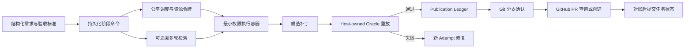
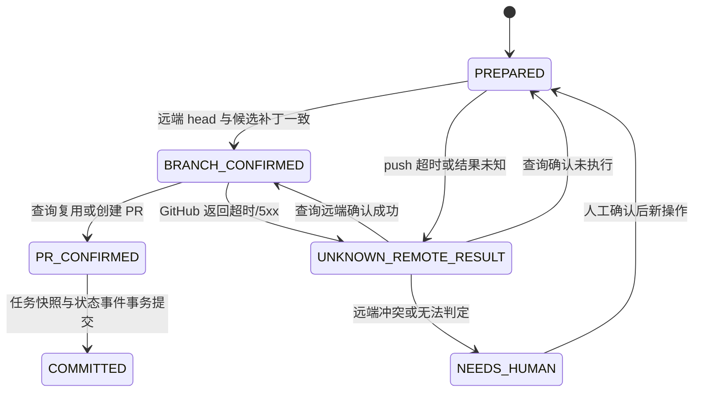

# RD-Bot 面试场景改造执行计划

> 日期：2026-08-03  
> 依据：`docs/reviews/rd-bot-interview-scenario-audit-2026-08-03.md`、共享面试会话第 1～12 题、当前源码与 115 个定向测试结果  
> 目标：把“主体架构成立、关键闭环不完整”的 6.5/10 项目，改造成能经受状态一致性、安全、测试 Oracle、模型降级与百任务调度追问的生产级研发交付 Harness。

## 1. 改造原则

1. **先补正确性和安全边界，再补能力标签。** P0 未完成前，不扩大“全自动”“强沙箱”“100% 检出”“Exactly Once”“Deep RAG”等口径。
2. **状态机与外部副作用分开治理。** 数据库 CAS 只能保护库内状态；Git push、GitHub PR、模型调用等必须有 operation ledger、远端查询与对账。
3. **Agent 负责提出和执行，Host 负责授权和判定。** 凭据、危险能力、验收断言和最终发布决策由控制面持有。
4. **每项能力必须有可复现实验。** 结论同时具备数据集版本、环境、样本数、原始产物、统计脚本和报告，才能进入简历或面试指标。
5. **遵守现有分层。** 领域契约放在 `engine`/`exec`/`rag`，外部 SDK、PostgreSQL、Docker 和 GitHub 适配放在 `bootstrap`。

## 2. 目标状态



## 3. 实施顺序与总体工期

| 阶段 | 工作包 | 单人估算 | 前置依赖 | 退出门槛 |
|---|---|---:|---|---|
| 基线 | WP-0 指标与故障矩阵 | 1～2 天 | 无 | 口径、数据集、故障点冻结 |
| P0 | WP-1 外部发布幂等与对账 | 4～6 天 | WP-0 | 崩溃窗口不重复分支/PR |
| P0 | WP-2 Pi 容器安全基线 | 5～8 天 | WP-0 | 恶意仓库无法读密钥、越权写或任意外传 |
| P0 | WP-3 Host-owned 测试 Oracle | 6～10 天 | WP-0 | 业务断言由 Host 独立执行 |
| P1 | WP-4 主任务 CAS 与 fencing | 3～5 天 | WP-1 | 过期写者被数据库拒绝 |
| P1 | WP-5 Provider 能力路由与降级 | 4～7 天 | WP-2、WP-3 | 降级可审计、可限制、结果可复核 |
| P1 | WP-6 阶段化调度与公平背压 | 6～10 天 | WP-4 | 100 长任务下无项目饥饿 |
| P2 | WP-7 迭代式检索与离线评测 | 5～8 天 | WP-0 | 多轮检索有增益与停止条件 |
| P2 | WP-8 指标实验包与口径同步 | 3～5 天 | WP-3、WP-7 | 简历数字一键复现 |

单人串行约 7～10 周；2～3 人可按“发布一致性 / 安全执行 / Oracle 与评测”三条线并行，约 4～6 周。每个工作包独立合并，禁止以一个超大 PR 一次性交付。

## 4. WP-0：冻结基线与故障矩阵

### 目标

建立后续所有改造共享的成功定义，避免“功能实现了但无法证明”。

### 实施

- 在 `docs/qa/` 建立面试场景验收计划，冻结 Q1～Q12 对应的事实、指标分母和风险口径。
- 建立故障注入矩阵：DB 提交前后、Git push 前后、GitHub 201/422/超时、Redis 锁租约异常、Provider 429/5xx、容器恶意外传、Oracle 假阳性、100 长任务排队。
- 固定当前基线：115 个定向测试、容器启动参数、调度池参数、检索调用轮数、QA 证据协议。
- 新增统一运行元数据：代码 commit、配置 hash、模型与温度、数据集版本、执行时间、样本数、重复次数。

### 验收

- 每个后续工作包至少映射一个故障样本和一个成功样本。
- 报告中的百分比都能回链到原始 JSON/日志和统计命令。
- `resume_optimized.md` 在实验完成前不新增未经验证的提升数字。

## 5. WP-1：外部发布幂等与远端对账（P0）

### 当前裂缝

阶段 attempt 和数据库事件已具备幂等/CAS，但 Git push 或 GitHub PR 已成功、数据库未记录时，重试仍可能重复应用补丁、重复创建 PR 或错误进入 `REJECTED`。

### 数据模型

新增 `rd_requirement_publications`：

| 字段 | 说明 |
|---|---|
| `id` | Snowflake 主键 |
| `operation_id` | `sha256(taskId + baseBranch + workBranch + candidatePatchSha256)`，唯一 |
| `task_id` / `stage_run_id` | 关联任务与发布来源 |
| `status` | `PREPARED / BRANCH_CONFIRMED / PR_CONFIRMED / COMMITTED / UNKNOWN_REMOTE_RESULT / NEEDS_HUMAN` |
| `candidate_patch_sha256` | 候选补丁身份 |
| `remote_head_sha` | 已确认远端分支 head |
| `pull_request_url` / `pull_request_number` | 远端 PR 身份 |
| `version` | publication CAS 版本 |
| `last_error` / `next_reconcile_at` | 对账诊断与退避 |

### 状态规则



### 文件范围

- `engine/.../requirement/RequirementDeliveryEngine.java`
- `engine/.../requirement/RequirementPullRequestPublisherPort.java`
- 新增 publication domain、store port、reconcile use case。
- `bootstrap/.../executor/impl/EngineRequirementBranchPublisherAdapter.java`
- `bootstrap/.../executor/impl/EngineRequirementPullRequestPublisherAdapter.java`
- `bootstrap/.../github/impl/GitHubCodePlatformAdapter.java`
- `bootstrap/src/main/resources/sql/postgres/p0_knowledge_productionization.sql`

### 关键实现

1. 先插入 `PREPARED` 意图，再触发任何远端写操作；唯一约束吸收双实例重复请求。
2. 分支发布前查询远端 head/marker。补丁已存在则确认成功，不再次 `git apply`。
3. 创建 PR 前按 repo + head + base 查询 open PR，并校验 body 中的 `taskId` 与 `operationId` marker。
4. 超时、5xx、连接中断统一进入 `UNKNOWN_REMOTE_RESULT`，由 reconciler 查询，不立即重放。
5. 只有 `PR_CONFIRMED` 后，才在事务内写任务 PR URL、状态事件并把 publication 置 `COMMITTED`。
6. 冲突分支、同 head 不同 operation、多个候选 PR 进入 `NEEDS_HUMAN`，不自动覆盖。

### 必测故障

- commit 成功后进程崩溃；push 成功后崩溃；GitHub 201 后 DB 失败。
- GitHub POST 超时但实际已创建；重试返回 422；两个实例同时发布。
- 相同 operation 重放只得到同一 branch/PR；不同 patch 不得复用旧 PR。

### 回滚

保留旧 publisher 只读开关；新 ledger 可停止 reconciler，但不得删除已记录 operation。回滚时发布任务进入人工处理，禁止退回无对账的直接 POST。

## 6. WP-2：Pi 执行容器安全基线（P0）

### 当前裂缝

Pi 容器持有模型供应商真实密钥，默认 `bridge` 网络、普通可写挂载，且通用执行器没有统一 non-root、read-only rootfs、cap-drop、no-new-privileges 和资源上限。角色工具 allowlist 不能约束 `bash` 直接写文件或外传数据。

### 文件范围

- `exec/.../docker/model/ContainerRunRequest.java`
- `bootstrap/.../executor/impl/ProcessContainerRunner.java`
- `exec/.../pi/impl/DockerPiAgentExecutor.java`
- `bootstrap/src/main/resources/executor/pi/rd-pi-bridge.mjs`
- Pi `Dockerfile` / `Dockerfile.qa` 及配置测试。

### 实施

- 用 Host credential relay 代持 Provider 密钥；容器只获得绑定 `taskId + stageRunId + provider + expiry + maxCalls` 的一次性短期令牌。
- 默认禁网；需要模型访问时只允许 relay 地址，需要依赖下载时使用独立受控网络阶段和 task-local cache。
- 标准参数：非 root 用户、`--read-only`、`--cap-drop=ALL`、`--security-opt=no-new-privileges`、memory/cpu/pids/ulimit、临时 `tmpfs`。
- Architect/Review 角色 repo 只读；Coding 仅工作区 repo 可写；QA 验证独立副本，不能改候选补丁。
- Host 持有 capability policy：文件范围、命令类别、网络目的地、调用预算；危险能力需要短期批准令牌。
- 容器日志、环境快照和原始事件进行密钥脱敏；控制面检查不得把 secret 复制到 artifact。

### 验收

- 恶意仓库中的 Prompt Injection 无法读取长期 Provider 密钥、GitHub 凭据或访问任意公网。
- Review 角色即使调用 bash 也不能修改 repo；Coding 不能写宿主其他目录。
- fork bomb、无限内存、超量进程和超时命令均被资源边界终止并留下结构化原因。
- 按仓库约束运行 Pi npm 测试、`DockerPiAgentExecutorTest` 与 Bootstrap 配置测试，并重建两类 Pi 镜像验证实际参数。

## 7. WP-3：Host-owned 测试 Oracle（P0）

### 当前裂缝

现有 QA 能证明“命令退出为 0 且证据齐全”，但不能独立证明 HTTP 字段、数据库终值、权限拒绝、日志隐私等业务语义。Agent 自报 `PASSED` 仍承担了过多判定权。

### 结构化验收模型

将每条验收标准编译为不可变 `AssertionSpec`：

```text
id, sourceCriteriaId, preconditions, fixture,
action, assertionType, target, operator, expected,
tolerance, evidenceRequired, timeout, sensitivity
```

首批断言器：

- HTTP：状态码、JSONPath、响应头、Schema、轮询最终一致性。
- SQL：行存在、字段值、行数、不变量与事务后终态。
- 文件：路径、hash、文本/AST 条件、禁止文件。
- 日志：必须/禁止模式、PII/secret 扫描。
- 浏览器：DOM/ARIA/可见性/路由状态；截图只作证据，不单独作为业务真值。

### 文件范围

- 扩展 `engine/.../bugfix/acceptance/AcceptancePlanValidator.java` 的 schema 校验，但不在 engine 直接执行基础设施。
- 在 `exec` 新增 assertion runner SPI、结果模型与聚合器。
- `QaEvidenceBundleValidator` 校验 assertion result 与 artifact 引用闭环。
- `bootstrap` 提供 HTTP/SQL/文件/浏览器适配和受控配置。
- 容器内 `result-tool.mjs`、角色 Prompt 和 Host validator 同步升级，避免协议裂缝。

### 验收

- Agent 删除/改写 `AssertionSpec` 会被 hash 校验拒绝。
- `exitCode=0` 但 JSONPath/SQL 不符合预期时，Host 必须判失败。
- CURRENT 与 REGRESSION 均有独立断言结果和证据引用。
- verifier 在干净工作区重放候选补丁，结果不依赖 Coding 工作区残留。

## 8. WP-4：主任务 CAS 与 fencing（P1）

### 实施

- `rd_tasks` 增加 `version`，所有状态推进使用 `WHERE id=? AND version=? AND status=?`。
- 任务快照、状态事件、version 递增保持同一事务。
- Redisson 锁仍用于减少竞争，但不再是正确性的唯一防线。
- 对长时间持锁链路引入单调 fencing token；旧 token 的写入在 PostgreSQL 层失败。
- 管理台普通字段编辑和状态推进使用不同 command，防止 blind upsert 覆盖运行状态。

### 验收

- 构造锁租约过期后旧 worker 晚到写入，数据库拒绝 stale write。
- pause/cancel 与 worker 完成竞争时，仅一条合法边成功，事件与快照一致。
- 不再使用 `RdTaskMapper.upsertTask` 盲写已有运行任务。

## 9. WP-5：Provider 能力路由与安全降级（P1）

### 实施

- Provider profile 增加 capabilities：tool calling、strict JSON、context/output、vision、区域、数据保留、允许角色、风险等级。
- 健康度和 half-open 探测权迁移到 Redis/PostgreSQL，避免多实例各自放量探测。
- 纯生成允许有限 fallback；涉及工具和副作用时先查询 operation ledger。
- 数据库迁移、安全、权限等高风险任务默认禁止弱能力模型降级，或要求人工确认。
- Provider 切换创建新 attempt/干净工作区，不能复用前一 Provider 的未审计文件残留。
- 所有候选结果仍经过同一 schema、Oracle 和 Delivery Review。

### 验收

- 429/5xx/超时分类、熔断、half-open、预算和 deadline 均有确定性测试。
- 两实例只允许一个 half-open probe；跨 Provider 不产生重复工具副作用。
- 能力不满足时明确 `WAITING_POLICY`/人工处理，而不是静默降级。

## 10. WP-6：阶段化调度、公平性与背压（P1）

### 当前裂缝

一个 requirement worker 同步占用完整四角色流程；默认最多 4 条长任务并发，后续短任务可能长时间排队。当前恢复按 `updated_at,id`，没有项目公平、aging、资源配额和 batch claim。

### 实施

- 把整条 workflow job 拆成持久 stage command，每个命令包含 `task/version/role/attempt/deadline/resourceClass`。
- PostgreSQL 使用小批量 `FOR UPDATE SKIP LOCKED` claim；保留 lease、heartbeat、retry、dead letter。
- 调度策略采用 priority + aging + project weighted fair queue；限制每项目、每 Provider、Docker、Browser QA 在途数。
- 线程池只承接已经获得资源令牌的短调度动作；外部限流触发延迟重排，不在 worker 中阻塞睡眠。
- 指标：queue age P50/P95、最老任务、项目等待比、lease lost、重试率、资源利用率、拒绝数。

### 压测验收

- 100 个 30 分钟～2 小时的混合任务仿真下，每个活跃项目在规定窗口内获得服务。
- P0 短任务不会被先到的 P2 长任务无限阻塞；aging 防止低优先级永久饥饿。
- Provider/GitHub 限流时队列有界、可观测且不发生重试风暴。
- 多实例 recovery 每轮有 batch limit，不扫描并提交全部可恢复任务。

## 11. WP-7：迭代式检索与离线评测（P2）

### 实施

- 在 `DeepRetrievalOrchestrator` 引入 `plan -> search -> assess -> rewrite/expand -> search` 循环。
- 每轮保存 query、候选、入选证据、缺口、信息增益、累计 token/时间。
- 停止条件同时包括：证据门禁满足、连续两轮无新增证据、最大轮数、token/时间预算、需要用户澄清。
- 权威事实、权限与仓库作用域始终是硬过滤；query rewrite 不能扩大租户/项目边界。
- 建立按任务类型分桶的 Recall@K、MRR/NDCG、证据覆盖、无证据拒答正确率和端到端任务成功率。

### 验收

- 多跳样本相对单轮基线有可复现增益；普通样本不会因无意义迭代显著增时。
- 每次停止都有 `stopReason`，可以回放每轮输入和证据变化。
- 若离线增益不足，保留现有“多通道检索 + 证据门禁”命名，不强行宣称 Deep RAG。

## 12. WP-8：指标实验包与面试口径同步（P2）

### 目录建议

```text
benchmarks/interview-claims/
  datasets/<version>/cases.jsonl
  faults/<fault-id>/
  runners/
  raw/<run-id>/
  reports/<run-id>.html
  metrics.json
  README.md
```

### 规则

- `0/4 -> 4/4` 只能称为 4 样本 pilot。
- `9/15 -> 15/15`、漏检率或缓存/耗时提升，在原始实验不存在时必须删除或标注“待复现”。
- 每个数字必须声明样本数、基线、模型/温度、预算、运行次数、成功定义和置信区间/波动。
- 更新 README、项目介绍和面试材料：Redis Stream 已替代 RocketMQ；需求交付走 PostgreSQL job；PR 在 QA 与 Delivery Review 后创建。

## 13. 合并门禁与 Definition of Done

每个工作包只有同时满足以下条件才算完成：

- 有设计 spec，列出状态、合法边、失败窗口、回滚和数据迁移。
- 有单元、并发/故障注入、持久化 policy 和必要的真实 HTTP/容器测试。
- 任何 Host/容器协议变更都同步更新 Prompt、bridge、容器预校验与 Host validator。
- 生产共享状态以 PostgreSQL/Redis 为真值，不新增 JVM 内存兜底。
- 新增高风险配置默认安全，关闭安全机制需要显式配置并在启动日志告警。
- QA 报告引用原始 artifact、hash 和执行命令；不能只写“测试通过”。
- 面试报告中的“已具备”必须能定位源码或复现实验；否则降级为“部分具备/待验证”。

## 14. 建议验证命令

```bash
# 现有回归基线
./mvnw -pl engine -am \
  -Dtest=RequirementDeliveryEngineTest,RequirementDeliveryReviewerTest,TaskRetryEngineTest,DeepRetrievalOrchestratorTest \
  -Dsurefire.failIfNoSpecifiedTests=false test

./mvnw -pl exec -am \
  -Dtest=DockerPiAgentExecutorTest,QaEvidenceBundleValidatorTest \
  -Dsurefire.failIfNoSpecifiedTests=false test

./mvnw -pl bootstrap -am \
  -Dtest=RequirementDeliveryDispatchServiceTest,EngineRequirementBranchPublisherAdapterTest,GitHubCodePlatformAdapterTest,PostgresAgentStageRunStoreTest \
  -Dsurefire.failIfNoSpecifiedTests=false test

# Pi 协议变更
cd bootstrap/src/main/resources/executor/pi && npm test
```

新增测试命名建议：`RequirementPublicationReconciliationTest`、`RdTaskFencingConcurrencyTest`、`ProcessContainerSecurityPolicyTest`、`HostOwnedAssertionRunnerTest`、`ProviderFallbackSideEffectSafetyTest`、`RequirementFairSchedulingSimulationTest`、`IterativeRetrievalEvaluationTest`。

## 15. 面试时的阶段性口径

在 P0/P1/P2 全部完成前，推荐如实回答：

> RD-Bot 已经具备持久化任务、阶段 CAS、租约恢复、角色上下文溯源和严格 QA 证据协议；当前正在补齐数据库外副作用对账、Host 独立业务 Oracle、容器最小权限和公平调度。我们不会把数据库幂等直接等同于 GitHub Exactly Once，也不会把证据齐全等同于业务结果一定正确。

这比夸大“全自动、100% 检出、强隔离”更可信，也能自然引出本计划中的工程取舍。
