# RD-Bot 核心数据库表与精简 ER 图

> 调查日期：2026-08-04
> 目标：从当前 63 张 PostgreSQL 表中筛出真正支撑“需求 → 上下文 → Agent 阶段 → RAG → QA → PR 发布 → 重试恢复”的核心表。
> 本文保留 **36 张核心表**；没有把告警、旧 BugFix、评测实验、后台用户和扩展管理等辅助表放进主 ER 图。

## 1. 筛选标准

一张表满足以下任一条件，就进入核心清单：

- 被 `RequirementDeliveryEngine`、派发服务、阶段 Store、重试服务或发布对账链路直接读写；
- 承载任务、阶段、检索、QA 或外部发布的持久状态；
- 是知识检索的真实数据源；
- 是执行 Provider、工具策略或项目运行时选择的必要配置；
- 是恢复、幂等、审计或证据链不可替代的记录。

以下表暂不放入主图：`admin_users`、告警配置/投递、传统 `repair_*` 兼容链、评测实验 `rd_evaluation_*`、经验沉淀 `rd_experience_entries`、知识地图/刷新指标、术语映射、任务模板、Skill 扩展包明细和私有中间产物。它们不是“不能用”，而是不会改变当前主交付链路的核心结构。

## 2. 核心表清单

### 2.1 任务、状态、派发和 PR 发布

| # | 表名 | 重要程度 | 作用 | 关键字段 |
|---:|---|---|---|---|
| 1 | `rd_projects` | P0 | 项目与代码仓库绑定，提供仓库地址、默认分支和项目开关。 | `id`、`project_key`、`repository_url`、`default_branch` |
| 2 | `rd_tasks` | P0 | RD 任务主快照：工单、任务类型、状态、提示、执行结果和 PR 地址。 | `id`、`task_type`、`ticket_id`、`status`、`prompt_snapshot`、`pull_request_url` |
| 3 | `rd_task_status_events` | P0 | 任务状态时间线，记录状态进入、耗时和触发源。 | `task_id`、`status`、`entered_at`、`duration_ms`、`trigger` |
| 4 | `rd_task_materials` | P0 | 保存需求附件、外部来源、对象存储 URI、hash 和知识文档版本。 | `task_id`、`material_type`、`source_uri`、`content_hash`、`artifact_uri` |
| 5 | `rd_requirement_delivery_jobs` | P0 | 持久化需求派发队列，负责 claim、租约、心跳、重试和死信前状态。 | `task_id`、`status`、`attempt_no`、`lease_owner`、`lease_until` |
| 6 | `rd_requirement_publications` | P0 | Git 分支/GitHub PR 外部副作用账本，处理 operation 幂等、远端确认和对账。 | `operation_id`、`task_id`、`stage_run_id`、`status`、`candidate_patch_sha256`、`pull_request_url` |
| 7 | `rd_task_retry_checkpoints` | P0 | 人工恢复意图、失败阶段、重试起点、任务版本和证据绑定。 | `task_id`、`failure_phase`、`retry_from_role`、`idempotency_key`、`source_task_version` |

### 2.2 Agent 阶段与审查

| # | 表名 | 重要程度 | 作用 | 关键字段 |
|---:|---|---|---|---|
| 8 | `rd_role_context_packages` | P0 | 某任务/角色实际使用的上下文包，记录证据、验收、风险提示和 hash。 | `task_id`、`role`、`package_version`、`evidence_json`、`content_hash` |
| 9 | `rd_agent_stage_runs` | P0 | 角色阶段 attempt 主表，记录状态、Provider、上下文包、Prompt/结果产物和错误。 | `task_id`、`role`、`status`、`attempt_no`、`idempotency_key`、`context_package_id` |
| 10 | `rd_agent_stage_artifacts` | P0 | 阶段生成的补丁、报告、结果和文件产物索引。 | `stage_run_id`、`task_id`、`artifact_type`、`artifact_uri`、`content_hash` |
| 11 | `rd_agent_stage_events` | P0 | 阶段状态事件，支持时间线、耗时、恢复和并发诊断。 | `stage_run_id`、`task_id`、`status`、`entered_at`、`duration_ms` |
| 12 | `rd_ai_review_runs` | P0 | Delivery Review / AI Review 的判定、评分、摘要和审查重试链。 | `task_id`、`attempt_no`、`parent_run_id`、`status`、`decision`、`score` |
| 13 | `rd_ai_review_events` | P1 | AI Review 状态变化和失败事件。 | `run_id`、`from_status`、`to_status`、`trigger` |
| 14 | `rd_ai_review_artifacts` | P1 | AI Review 输入包、响应、评分详情和审查报告。 | `run_id`、`artifact_type`、`artifact_uri`、`content_hash` |

### 2.3 RAG 与知识数据

| # | 表名 | 重要程度 | 作用 | 关键字段 |
|---:|---|---|---|---|
| 15 | `knowledge_bases` | P0 | 知识库根实体，定义知识范围和启用状态。 | `id`、`name`、`enabled` |
| 16 | `knowledge_documents` | P0 | 知识源文档、版本、同步状态和原文内容。 | `knowledge_base_id`、`source_uri`、`revision_id`、`status` |
| 17 | `knowledge_chunks` | P0 | 文档切分后的检索单元，保存顺序、内容和 hash。 | `document_id`、`knowledge_base_id`、`chunk_index`、`content_hash` |
| 18 | `knowledge_vectors` | P1 | 向量检索数据，保存 embedding、内容和元数据。 | `id`、`embedding`、`metadata_json` |
| 19 | `ingestion_tasks` | P1 | 文档入库/重建任务的运行快照。 | `pipeline_id`、`knowledge_base_id`、`document_id`、`status` |
| 20 | `ingestion_task_nodes` | P1 | 摄取任务的节点级执行状态、耗时和输出。 | `task_id`、`pipeline_id`、`node_id`、`status` |
| 21 | `rd_rag_retrieval_runs` | P0 | 一次可恢复、可审计的检索运行主记录。 | `task_id`、`stage_run_id`、`status`、`current_iteration`、`quality_decision` |
| 22 | `rd_rag_retrieval_events` | P1 | 检索运行状态变更事件。 | `run_id`、`from_status`、`to_status`、`occurred_at` |
| 23 | `rd_rag_retrieval_steps` | P0 | 每轮查询规划、通道检索、融合和质量判断步骤。 | `run_id`、`iteration_no`、`step_type`、`channel_name`、`status` |
| 24 | `rd_rag_retrieval_artifacts` | P0 | 查询、候选、最终证据和质量报告的可追溯产物。 | `run_id`、`step_id`、`artifact_type`、`content_hash` |

### 2.4 QA、运行时和权限配置

| # | 表名 | 重要程度 | 作用 | 关键字段 |
|---:|---|---|---|---|
| 25 | `rd_qa_validation_profiles` | P0 | QA 启动命令、健康检查、允许 Host 和回归命令配置。 | `scope_type`、`scope_id`、`mode`、`base_url`、`start_command` |
| 26 | `rd_qa_evidence_objects` | P0 | QA 截图、trace、console、network 和日志对象索引。 | `task_id`、`stage_run_id`、`artifact_id`、`object_uri`、`sha256` |
| 27 | `rd_model_provider_profiles` | P0 | Provider 协议、模型、地址和凭据环境变量名。 | `provider_id`、`protocol`、`base_url`、`model_id`、`credential_environment_variable` |
| 28 | `rd_agent_execution_profiles` | P0 | 项目/角色执行配置，绑定 runtime、Provider、Tool Policy 和扩展集合。 | `profile_id`、`project_id`、`role`、`provider_profile_id`、`tool_policy_id` |
| 29 | `rd_agent_execution_profile_snapshots` | P0 | 阶段启动时冻结的执行配置，防止运行中配置漂移。 | `snapshot_id`、`stage_run_id`、`task_id`、`attempt_no`、`snapshot_hash` |
| 30 | `rd_agent_tool_policies` | P0 | 工具 allow/deny、文件/网络范围、资源限制和策略 hash。 | `policy_id`、`version`、`policy_json`、`policy_hash` |
| 31 | `rd_project_runtime_profiles` | P1 | 项目按角色选择的 Agent runtime 镜像和 Dockerfile 验证状态。 | `project_id`、`role`、`agent_type`、`image`、`validation_status` |
| 32 | `rd_project_agent_profile_bindings` | P1 | 项目/角色到默认 execution profile 的绑定。 | `project_id`、`role`、`profile_id` |
| 33 | `rd_task_agent_profile_overrides` | P1 | 单任务覆盖项目默认 Agent profile。 | `task_id`、`project_id`、`role`、`profile_id` |
| 34 | `rd_skill_catalog` | P1 | Skill 目录、版本、来源、风险等级和允许角色。 | `skill_id`、`version`、`source_uri`、`risk_level` |
| 35 | `rd_skill_role_bindings` | P1 | Skill 与 Agent 角色的授权和排序关系。 | `role`、`skill_id`、`sort_order` |
| 36 | `rd_agent_skill_installations` | P1 | 某个阶段实际安装的 Skill 版本、来源和策略快照。 | `task_id`、`stage_run_id`、`skill_id`、`skill_version` |

## 3. 核心执行链路

```text
rd_projects
    ↓ 项目/仓库范围
rd_tasks
    ├── rd_task_materials
    ├── rd_requirement_delivery_jobs
    ├── rd_role_context_packages
    │       ↓
    │   rd_agent_stage_runs
    │       ├── rd_agent_stage_events
    │       ├── rd_agent_stage_artifacts
    │       ├── rd_rag_retrieval_runs
    │       │       ├── rd_rag_retrieval_steps
    │       │       ├── rd_rag_retrieval_artifacts
    │       │       └── rd_rag_retrieval_events
    │       ├── rd_qa_evidence_objects
    │       └── rd_agent_execution_profile_snapshots
    ├── rd_task_retry_checkpoints
    ├── rd_ai_review_runs
    │       ├── rd_ai_review_events
    │       └── rd_ai_review_artifacts
    ├── rd_requirement_publications
    └── rd_task_status_events

knowledge_bases → knowledge_documents → knowledge_chunks → knowledge_vectors
                         ↑
                  ingestion_tasks → ingestion_task_nodes

rd_model_provider_profiles ─┐
rd_agent_tool_policies ─────┼→ rd_agent_execution_profiles
rd_project_runtime_profiles ┘          ↓
                               profile snapshots / stage execution
rd_skill_catalog → rd_skill_role_bindings → rd_agent_skill_installations
```

## 4. 精简版 ER 图

图中保留 36 张核心表。`FK` 表示 PostgreSQL DDL 已声明外键；`逻辑` 表示当前由业务字段和 Store/Engine 维护，数据库层未必有外键。

```mermaid
erDiagram
    rd_projects ||--o{ rd_tasks : "逻辑项目范围"
    rd_tasks ||--o{ rd_task_status_events : "逻辑 task_id"
    rd_tasks ||--o{ rd_task_materials : "逻辑 task_id"
    rd_tasks ||--o{ rd_requirement_delivery_jobs : "FK"
    rd_tasks ||--o{ rd_requirement_publications : "逻辑 task_id"
    rd_tasks ||--o{ rd_task_retry_checkpoints : "逻辑 task_id"
    rd_tasks ||--o{ rd_role_context_packages : "FK"
    rd_role_context_packages ||--o{ rd_agent_stage_runs : "FK"
    rd_tasks ||--o{ rd_agent_stage_runs : "FK"
    rd_agent_stage_runs ||--o{ rd_agent_stage_events : "FK"
    rd_agent_stage_runs ||--o{ rd_agent_stage_artifacts : "FK"
    rd_tasks ||--o{ rd_agent_stage_events : "FK"
    rd_tasks ||--o{ rd_agent_stage_artifacts : "FK"
    rd_tasks ||--o{ rd_ai_review_runs : "逻辑 task_id"
    rd_ai_review_runs ||--o{ rd_ai_review_events : "FK"
    rd_ai_review_runs ||--o{ rd_ai_review_artifacts : "FK"
    rd_tasks ||--o{ rd_rag_retrieval_runs : "逻辑 task_id"
    rd_agent_stage_runs ||--o{ rd_rag_retrieval_runs : "逻辑 stage_run_id"
    rd_rag_retrieval_runs ||--o{ rd_rag_retrieval_events : "FK"
    rd_rag_retrieval_runs ||--o{ rd_rag_retrieval_steps : "FK"
    rd_rag_retrieval_runs ||--o{ rd_rag_retrieval_artifacts : "FK"
    rd_rag_retrieval_steps ||--o{ rd_rag_retrieval_artifacts : "逻辑 step_id"
    rd_tasks ||--o{ rd_qa_evidence_objects : "逻辑 task_id"
    rd_agent_stage_runs ||--o{ rd_qa_evidence_objects : "逻辑 stage_run_id"
    rd_tasks ||--o{ rd_qa_validation_profiles : "逻辑 scope"
    rd_agent_stage_runs ||--o{ rd_agent_execution_profile_snapshots : "FK"
    rd_tasks ||--o{ rd_agent_execution_profile_snapshots : "FK"

    knowledge_bases ||--o{ knowledge_documents : "FK"
    knowledge_documents ||--o{ knowledge_chunks : "FK"
    knowledge_bases ||--o{ knowledge_chunks : "FK"
    knowledge_chunks ||--o{ knowledge_vectors : "逻辑 metadata"
    knowledge_bases ||--o{ ingestion_tasks : "FK"
    knowledge_documents ||--o{ ingestion_tasks : "FK"
    ingestion_tasks ||--o{ ingestion_task_nodes : "FK"

    rd_model_provider_profiles ||--o{ rd_agent_execution_profiles : "逻辑 provider"
    rd_agent_tool_policies ||--o{ rd_agent_execution_profiles : "逻辑 policy"
    rd_projects ||--o{ rd_agent_execution_profiles : "逻辑 project"
    rd_projects ||--o{ rd_project_runtime_profiles : "逻辑 project"
    rd_agent_execution_profiles ||--o{ rd_project_agent_profile_bindings : "FK"
    rd_agent_execution_profiles ||--o{ rd_task_agent_profile_overrides : "FK"
    rd_projects ||--o{ rd_project_agent_profile_bindings : "逻辑 project"
    rd_tasks ||--o{ rd_task_agent_profile_overrides : "逻辑 task"
    rd_skill_catalog ||--o{ rd_skill_role_bindings : "FK"
    rd_tasks ||--o{ rd_agent_skill_installations : "FK"
    rd_agent_stage_runs ||--o{ rd_agent_skill_installations : "FK"
    rd_skill_catalog ||--o{ rd_agent_skill_installations : "逻辑 skill"

    rd_projects {
        bigint id PK
        varchar project_key UK
        varchar repository_url
        varchar default_branch
    }
    rd_tasks {
        bigint id PK
        varchar task_type
        varchar ticket_id
        varchar status
        varchar pull_request_url
    }
    rd_task_status_events {
        bigint id PK
        bigint task_id
        varchar status
        timestamptz entered_at
    }
    rd_task_materials {
        bigint id PK
        bigint task_id
        varchar material_type
        varchar content_hash
    }
    rd_requirement_delivery_jobs {
        bigint id PK
        bigint task_id FK
        varchar status
        varchar lease_owner
    }
    rd_requirement_publications {
        bigint id PK
        varchar operation_id UK
        bigint task_id
        varchar status
    }
    rd_task_retry_checkpoints {
        bigint id PK
        bigint task_id
        varchar idempotency_key UK
        varchar status
    }
    rd_role_context_packages {
        bigint id PK
        bigint task_id FK
        varchar role
        varchar content_hash
    }
    rd_agent_stage_runs {
        bigint id PK
        bigint task_id FK
        varchar role
        varchar status
        int attempt_no
    }
    rd_agent_stage_events {
        bigint id PK
        bigint stage_run_id FK
        bigint task_id FK
        varchar status
    }
    rd_agent_stage_artifacts {
        bigint id PK
        bigint stage_run_id FK
        bigint task_id FK
        varchar artifact_type
    }
    rd_ai_review_runs {
        bigint id PK
        bigint task_id
        varchar status
        varchar decision
    }
    rd_ai_review_events {
        bigint id PK
        bigint run_id FK
        varchar to_status
    }
    rd_ai_review_artifacts {
        bigint id PK
        bigint run_id FK
        varchar artifact_type
    }
    rd_rag_retrieval_runs {
        bigint id PK
        bigint task_id
        bigint stage_run_id
        varchar status
        int current_iteration
    }
    rd_rag_retrieval_events {
        bigint id PK
        bigint run_id FK
        varchar to_status
    }
    rd_rag_retrieval_steps {
        bigint id PK
        bigint run_id FK
        int iteration_no
        varchar step_key
    }
    rd_rag_retrieval_artifacts {
        bigint id PK
        bigint run_id FK
        varchar artifact_type
    }
    rd_qa_validation_profiles {
        varchar scope_type PK
        varchar scope_id PK
        varchar mode
        varchar start_command
    }
    rd_qa_evidence_objects {
        bigint id PK
        bigint task_id
        bigint stage_run_id
        varchar sha256
    }
    rd_agent_execution_profile_snapshots {
        varchar snapshot_id PK
        bigint stage_run_id FK
        bigint task_id FK
        varchar snapshot_hash
    }

    knowledge_bases {
        bigint id PK
        varchar name
        boolean enabled
    }
    knowledge_documents {
        bigint id PK
        bigint knowledge_base_id FK
        varchar revision_id
        varchar status
    }
    knowledge_chunks {
        bigint id PK
        bigint document_id FK
        bigint knowledge_base_id FK
        int chunk_index
    }
    knowledge_vectors {
        bigint id PK
        text content
        vector embedding
    }
    ingestion_tasks {
        bigint id PK
        bigint knowledge_base_id FK
        bigint document_id FK
        varchar status
    }
    ingestion_task_nodes {
        bigint id PK
        bigint task_id FK
        bigint node_id
        varchar status
    }

    rd_model_provider_profiles {
        varchar provider_id PK
        varchar protocol
        varchar model_id
        varchar credential_environment_variable
    }
    rd_agent_execution_profiles {
        varchar profile_id PK
        bigint project_id
        varchar role
        varchar provider_profile_id
        varchar tool_policy_id
    }
    rd_agent_tool_policies {
        varchar policy_id PK
        int version PK
        varchar policy_hash
    }
    rd_project_runtime_profiles {
        bigint project_id PK
        varchar role PK
        varchar image
        varchar validation_status
    }
    rd_project_agent_profile_bindings {
        bigint project_id PK
        varchar role PK
        varchar profile_id FK
    }
    rd_task_agent_profile_overrides {
        bigint task_id PK
        varchar role PK
        varchar profile_id FK
    }
    rd_skill_catalog {
        varchar skill_id PK
        varchar version PK
        varchar risk_level
    }
    rd_skill_role_bindings {
        varchar role PK
        varchar skill_id FK
        int sort_order
    }
    rd_agent_skill_installations {
        bigint id PK
        bigint task_id FK
        bigint stage_run_id FK
        varchar skill_id
    }
```



## 5. 这张精简图最适合回答什么问题

- **任务如何持久化和恢复：** `rd_tasks → rd_requirement_delivery_jobs → rd_agent_stage_runs → rd_task_retry_checkpoints`。
- **状态如何追踪：** `rd_task_status_events`、`rd_agent_stage_events`、`rd_rag_retrieval_events`、`rd_ai_review_events` 分别对应任务、阶段、检索和 Review 四类生命周期。
- **上下文从哪里来：** `rd_task_materials → knowledge_documents → knowledge_chunks → rd_rag_retrieval_runs → rd_role_context_packages`。
- **QA 如何证明：** `rd_agent_stage_artifacts → rd_qa_evidence_objects`，再由 QA profile 决定如何启动和验证。
- **模型和权限如何冻结：** `rd_model_provider_profiles + rd_agent_tool_policies → rd_agent_execution_profiles → rd_agent_execution_profile_snapshots`。
- **PR 为什么能重试不重复：** `rd_requirement_publications` 是 Git/GitHub 外部副作用的唯一 operation 账本。

## 6. 核验结果

```bash
python3 - <<'PY'
from pathlib import Path
import re

sql = []
for path in Path('bootstrap/src/main/resources/sql/postgres').glob('*.sql'):
    sql += re.findall(r'(?im)^\s*CREATE TABLE(?: IF NOT EXISTS)?\s+([\w.]+)', path.read_text())
core = re.findall(r'^\|\s*\d+\s*\|\s*`([^`]+)`\s*\|', Path('docs/superpowers/plans/2026-08-04-rd-bot-core-database-er.md').read_text(), re.M)
print('全部 DDL 表:', len(set(sql)))
print('核心表:', len(set(core)))
print('期望:', 63, 36)
PY
```

本次只新增这份精简数据库说明，没有修改业务代码，也没有回滚工作区现有改动。
