# RD-Bot 数据库表清单与 ER 图

> 调查日期：2026-08-04
> 范围：当前仓库 `bootstrap/src/main/resources/sql/postgres/*.sql` 中实际声明的 PostgreSQL 表，以及对应的实体、Mapper、Store 和业务引用。
> 结论：当前 SQL DDL 共定义 **63 张表**，分布在 12 个 PostgreSQL SQL 文件中。

## 1. 统计口径

本清单以 PostgreSQL DDL 中的 `CREATE TABLE IF NOT EXISTS` 为主口径，并用以下源码交叉确认用途：

- `bootstrap/src/main/java/com/wish/rd/bootstrap/persistence/entity/*Row.java`：MyBatis-Plus 表映射。
- `bootstrap/src/main/java/com/wish/rd/bootstrap/persistence/mapper/*Mapper.java`：SQL 写入、查询和更新入口。
- `rag`、`engine`、`exec` 中的 `*Store`、`*Port`、Engine 和领域模型：表对应的业务边界。
- `bootstrap/src/main/resources/sql/postgres/`：最终表结构、索引、唯一约束和显式外键。

说明：`scripts/evaluation/tests/test_export_trials.py` 中用于测试的临时表、Pi/Claude 依赖包内部的 migration，以及 `target/` 构建产物不计入 RD-Bot 应用数据库表。

## 2. SQL 文件与表数量

| SQL 文件 | 主要领域 | 表数量 |
|---|---|---:|
| `p0_knowledge_productionization.sql` | 用户、知识库、摄取、项目、任务、修复、告警、发布 | 26 |
| `p1_multi_agent_orchestration.sql` | 角色上下文、阶段运行、阶段产物、经验和派发 Job | 7 |
| `p2_rag_retrieval_state.sql` | 检索运行、检索步骤、检索产物、知识地图 | 5 |
| `p3_task_retry_ai_review.sql` | 重试检查点、AI Review | 4 |
| `p4_web_evaluation_console.sql` | 评测运行、事件、产物、试验 | 5 |
| `p5_qa_evidence.sql` | QA 配置和证据对象 | 2 |
| `p6_evaluation_data_quality.sql` | 对既有经验表追加数据质量字段 | 0 |
| `p7_project_runtime_profiles.sql` | 项目运行时角色配置 | 1 |
| `p8_zz_default_qa_v2.sql` | 默认 QA 配置更新 | 0 |
| `p8_pi_agent_runtime.sql` | Provider、执行 Profile、Tool Policy、扩展和私有产物 | 11 |
| `p9_default_qa_v2_gate.sql` | 默认 QA 配置更新 | 0 |
| `p10_skill_hub.sql` | Skill 目录和角色绑定 | 2 |
| **合计** |  | **63** |

## 3. 表清单与作用

### 3.1 用户、知识库与摄取域

| # | 表名 | 作用 | 关键字段 | 主要关系 / 实现 |
|---:|---|---|---|---|
| 1 | `admin_users` | 管理台用户账号和角色信息。 | `id`、`username`、`role`、`password_hash` | 管理台认证；当前没有连接到业务表的显式外键。 |
| 2 | `knowledge_bases` | 知识库根实体，控制名称、描述和启用状态。 | `id`、`name`、`enabled` | 被文档、分块、摄取任务、知识地图和刷新指标引用。 |
| 3 | `knowledge_documents` | 知识库中的源文档及同步版本、原文预览、刷新计划。 | `id`、`knowledge_base_id`、`source_uri`、`revision_id`、`status` | `knowledge_base_id → knowledge_bases.id`；`KnowledgeDocumentRow` / `KnowledgeDocumentMapper`。 |
| 4 | `knowledge_chunks` | 文档切分后的检索单元，保存内容、顺序、hash 和元数据。 | `id`、`document_id`、`knowledge_base_id`、`chunk_index`、`content_hash` | `document_id → knowledge_documents.id`；`knowledge_base_id → knowledge_bases.id`。 |
| 5 | `knowledge_vectors` | 向量化后的内容和 embedding，供向量检索。 | `id`、`content`、`embedding`、`metadata_json` | DDL 未声明到 chunk 的外键，通常通过向量 metadata / 业务 ID 关联。 |
| 6 | `ingestion_tasks` | 一次知识摄取任务的运行快照，记录来源、状态、数量和错误。 | `id`、`pipeline_id`、`knowledge_base_id`、`document_id`、`status` | `knowledge_base_id → knowledge_bases.id`；`document_id → knowledge_documents.id`；由 `TaskIngestionEngine` / Store 使用。 |
| 7 | `ingestion_task_nodes` | 摄取任务中每个管道节点的执行结果、耗时和输出。 | `id`、`task_id`、`pipeline_id`、`node_id`、`status`、`output_json` | `task_id → ingestion_tasks.id`；`IngestionTaskNodeMapper`。 |
| 8 | `t_intent_node` | 意图树节点，保存意图编码、层级、示例、召回集合和提示模板。 | `id`、`kb_id`、`intent_code`、`parent_code`、`collection_name`、`top_k` | `kb_id` / `parent_code` 为业务层关联，DDL 未声明外键；`IntentNodeRow`。 |
| 9 | `t_ingestion_pipeline` | 摄取流程定义的根表。 | `id`、`name`、`description`、`deleted` | 被 `t_ingestion_pipeline_node` 和 `ingestion_tasks.pipeline_id` 逻辑引用。 |
| 10 | `t_ingestion_pipeline_node` | 摄取流程中的节点、后继节点和条件配置。 | `id`、`pipeline_id`、`node_id`、`next_node_id`、`settings_json` | `pipeline_id → t_ingestion_pipeline.id`；`node_id` / `next_node_id` 连接意图或节点图。 |
| 11 | `knowledge_refresh_metrics` | 每次文档刷新/重建的统计结果。 | `id`、`document_id`、`knowledge_base_id`、`success`、`old_chunk_count`、`new_chunk_count` | `document_id` / `knowledge_base_id` 为业务关联；记录耗时和错误。 |
| 12 | `knowledge_map_nodes` | 知识地图或代码结构地图节点，用于按路径、文档和 chunk 范围导航。 | `id`、`knowledge_base_id`、`parent_id`、`document_id`、`path`、`revision_id` | `knowledge_base_id → knowledge_bases.id`；`document_id → knowledge_documents.id`；`parent_id` 自关联逻辑。 |
| 13 | `rd_query_term_mappings` | 查询词改写/术语映射规则，支持项目级或全局范围。 | `id`、`project_id`、`scope`、`source_term`、`target_term`、`priority` | `project_id → rd_projects.id`；`QueryTermMappingMapper`。 |

### 3.2 项目、RD 任务、派发与外部发布

| # | 表名 | 作用 | 关键字段 | 主要关系 / 实现 |
|---:|---|---|---|---|
| 14 | `rd_projects` | RD 项目注册表，保存仓库、默认分支和启用状态。 | `id`、`project_key`、`repository_url`、`repo_owner`、`repo_name`、`default_branch` | 被项目告警、预算、模板、术语映射等表引用；`RdProjectStore` / `PostgresRdProjectStore`。 |
| 15 | `rd_tasks` | RD 任务主快照，保存工单信息、任务类型、状态、提示、结果和 PR 地址。 | `id`、`task_type`、`ticket_id`、`status`、`title`、`prompt_snapshot`、`pull_request_url` | 被状态事件、材料、delivery job、上下文、阶段、告警和恢复流程逻辑引用；当前 DDL 没有 `project_id` 列。 |
| 16 | `rd_task_status_events` | RD 任务状态时间线，append-only 记录每次状态进入和耗时。 | `id`、`task_id`、`status`、`entered_at`、`duration_ms`、`trigger` | `task_id` 逻辑引用 `rd_tasks.id`；`RagStreamTaskRegistry` / `PostgresRdTaskStatusEventStore`。 |
| 17 | `rd_task_materials` | 任务输入材料、外部 URI、对象存储附件和知识文档版本。 | `id`、`task_id`、`material_type`、`source_uri`、`content_hash`、`artifact_uri`、`knowledge_document_id` | `task_id` 和 `knowledge_document_id` 为业务关联；`TaskMaterialStore`。 |
| 18 | `rd_requirement_delivery_jobs` | 需求交付的持久化派发队列，负责 claim、lease、heartbeat、重试和死信前状态。 | `id`、`task_id`、`status`、`attempt_no`、`lease_owner`、`lease_until`、`max_attempts` | `task_id → rd_tasks.id`；`RequirementDeliveryDispatchService` / `RequirementDeliveryJobMapper`。 |
| 19 | `rd_requirement_publications` | Git 分支和 GitHub PR 外部副作用账本，保证 operation 幂等与远端对账。 | `id`、`operation_id`、`task_id`、`stage_run_id`、`status`、`candidate_patch_sha256`、`pull_request_url`、`version` | `task_id` / `stage_run_id` 为业务关联；`RequirementPublicationStore` / `RequirementPublicationMapper`。 |
| 20 | `rd_project_alert_configs` | 项目告警开关、接收人、事件类型和预算/失败阈值配置。 | `project_id`、`enabled`、`recipients_json`、`event_types_json`、`budget_threshold_usd` | `project_id → rd_projects.id`；`RdProjectAlertConfigMapper`。 |
| 21 | `rd_project_token_budgets` | 项目默认 token 预算。 | `project_id`、`default_token_budget` | `project_id → rd_projects.id`；按项目唯一。 |
| 22 | `rd_alert_deliveries` | 一次告警发送的状态、外部消息 ID、失败信息和幂等键。 | `id`、`task_id`、`project_id`、`alert_type`、`status`、`idempotency_key` | `task_id → rd_tasks.id`、`project_id → rd_projects.id`；`RdAlertDeliveryMapper`。 |
| 23 | `rd_project_task_templates` | 项目级任务模板、需求正文、复现步骤和验收标准。 | `project_id`、`task_type`、`name`、`requirement_body`、`acceptance_criteria_json` | `project_id → rd_projects.id`；项目与任务类型联合唯一。 |
| 24 | `rd_task_retry_checkpoints` | 人工恢复意图和重试起点，保留失败阶段、版本、证据和操作备注。 | `id`、`task_id`、`failure_phase`、`retry_from_role`、`failed_stage_run_id`、`idempotency_key`、`status` | `task_id`、stage/retrieval/review ID 为业务关联；重试 attempt 保持旧 attempt 不变。 |

### 3.3 传统 Bug 修复与审计域

| # | 表名 | 作用 | 关键字段 | 主要关系 / 实现 |
|---:|---|---|---|---|
| 25 | `repair_records` | 传统 Bug 修复任务的主记录，保存 RAG、执行器、Docker、GitHub、测试和风险摘要。 | `id`、`ticket_id`、`status`、`rag_summary`、`executor_json`、`github_json`、`test_json` | 被修复产物、资产和审计事件引用；`RepairRecordRow` / `RepairRecordMapper`。 |
| 26 | `repair_record_artifacts` | Bug 修复阶段产物索引，如补丁、日志、报告和结果文件。 | `id`、`repair_record_id`、`artifact_type`、`artifact_uri`、`content_hash` | `repair_record_id → repair_records.id`。 |
| 27 | `repair_assets` | 从修复产物提取的可复用资产、经验或知识内容。 | `id`、`repair_record_id`、`asset_type`、`content_json`、`source_artifact_id`、`reusable` | `repair_record_id → repair_records.id`、`source_artifact_id → repair_record_artifacts.id`。 |
| 28 | `repair_audit_events` | 传统修复链路的外部系统操作审计。 | `id`、`repair_record_id`、`task_id`、`event_type`、`external_system`、`metadata_json` | `repair_record_id` / `task_id` / `ticket_id` 为业务关联；`RepairAuditSinkPort` 可适配不同审计后端。 |
| 29 | `repair_queue_dead_letters` | 工单修复消息消费失败后的死信和重放状态。 | `id`、`ticket_id`、`trace_id`、`event_id`、`original_attempt`、`replayed` | Redis Stream 消费链的持久死信记录；不等同于 `rd_requirement_delivery_jobs`。 |

### 3.4 多 Agent 编排、阶段运行与经验

| # | 表名 | 作用 | 关键字段 | 主要关系 / 实现 |
|---:|---|---|---|---|
| 30 | `rd_role_context_packages` | 一个任务/角色/版本实际使用的上下文包，保存证据、验收、风险和裁剪信息。 | `id`、`task_id`、`role`、`package_version`、`evidence_json`、`content_hash` | `task_id → rd_tasks.id`；被 `rd_agent_stage_runs.context_package_id` 引用。 |
| 31 | `rd_agent_stage_runs` | 每个角色阶段 attempt 的主状态，记录 provider、输入包、Prompt、结果、复核和错误。 | `id`、`task_id`、`role`、`status`、`attempt_no`、`idempotency_key`、`context_package_id` | `task_id → rd_tasks.id`、`context_package_id → rd_role_context_packages.id`；阶段 CAS 的持久化主体。 |
| 32 | `rd_agent_stage_artifacts` | 阶段产生的结构化/文件型产物及 hash。 | `id`、`stage_run_id`、`task_id`、`artifact_type`、`artifact_uri`、`content_hash` | `stage_run_id → rd_agent_stage_runs.id`、`task_id → rd_tasks.id`。 |
| 33 | `rd_agent_stage_events` | 阶段状态变化事件、耗时、触发源和诊断信息。 | `id`、`stage_run_id`、`task_id`、`status`、`entered_at`、`duration_ms` | `stage_run_id → rd_agent_stage_runs.id`、`task_id → rd_tasks.id`。 |
| 34 | `rd_agent_skill_installations` | 某阶段实际安装/使用的 Skill 快照，记录版本、来源、角色和策略。 | `id`、`task_id`、`stage_run_id`、`skill_id`、`skill_version`、`policy_json` | `task_id` / `stage_run_id` 为外键；`skill_id` 逻辑关联 `rd_skill_catalog`。 |
| 35 | `rd_experience_entries` | 从任务/阶段产物中沉淀的可复用经验，包含适用角色、质量、脱敏和来源版本。 | `id`、`task_id`、`stage_run_id`、`source_artifact_id`、`experience_type`、`content_hash`、`evidence_quality` | `task_id → rd_tasks.id`、`stage_run_id → rd_agent_stage_runs.id`、`source_artifact_id → rd_agent_stage_artifacts.id`、`ingestion_task_id → ingestion_tasks.id`。 |
| 36 | `rd_agent_private_artifacts` | 不直接展示给用户的阶段私有文件、会话、运行输入或敏感中间产物索引。 | `artifact_id`、`task_id`、`stage_run_id`、`snapshot_id`、`artifact_uri`、`sha256`、`retention_class` | `task_id → rd_tasks.id`、`stage_run_id → rd_agent_stage_runs.id`；对象内容位于受控对象存储。 |

### 3.5 RAG 检索运行域

| # | 表名 | 作用 | 关键字段 | 主要关系 / 实现 |
|---:|---|---|---|---|
| 37 | `rd_rag_retrieval_runs` | 一次可恢复、可审计的检索运行主记录。 | `id`、`task_id`、`consumer_type`、`role`、`stage_run_id`、`status`、`current_iteration`、`quality_decision` | `task_id` / `stage_run_id` 为业务关联；`idempotency_key` 唯一；`RetrievalRunStore`。 |
| 38 | `rd_rag_retrieval_events` | 检索运行状态流转事件。 | `id`、`run_id`、`from_status`、`to_status`、`trigger`、`occurred_at` | `run_id → rd_rag_retrieval_runs.id`。 |
| 39 | `rd_rag_retrieval_steps` | 每轮检索的计划、通道搜索、融合、质量评估等步骤。 | `id`、`run_id`、`iteration_no`、`step_type`、`step_key`、`channel_name`、`status` | `run_id → rd_rag_retrieval_runs.id`；`input_artifact_id` / `output_artifact_id` 关联检索产物。 |
| 40 | `rd_rag_retrieval_artifacts` | 检索查询、候选、最终证据、质量报告等可追踪产物。 | `id`、`run_id`、`step_id`、`artifact_type`、`artifact_uri`、`content_hash` | `run_id → rd_rag_retrieval_runs.id`；`step_id` 为逻辑关联。 |

### 3.6 AI Review 域

| # | 表名 | 作用 | 关键字段 | 主要关系 / 实现 |
|---:|---|---|---|---|
| 41 | `rd_ai_review_runs` | 一次 Delivery Review / AI Review attempt 的判定、评分、摘要和重试链。 | `id`、`task_id`、`attempt_no`、`parent_run_id`、`status`、`decision`、`score` | `task_id` 为业务关联；`parent_run_id` 自关联；`AiReviewRunStore`。 |
| 42 | `rd_ai_review_events` | AI Review 状态变化与错误事件。 | `id`、`run_id`、`from_status`、`to_status`、`trigger`、`occurred_at` | `run_id → rd_ai_review_runs.id`。 |
| 43 | `rd_ai_review_artifacts` | AI Review 输入包、响应、评分详情和审查报告。 | `id`、`run_id`、`artifact_type`、`artifact_uri`、`content_hash`、`redacted` | `run_id → rd_ai_review_runs.id`。 |

### 3.7 Web 评测与实验域

| # | 表名 | 作用 | 关键字段 | 主要关系 / 实现 |
|---:|---|---|---|---|
| 44 | `rd_evaluation_runs` | 一次评测 campaign/run 的配置、进度、样本统计、指标和暂停状态。 | `id`、`name`、`status`、`config_json`、`sample_count`、`metrics_json`、`version` | 被评测事件、产物和 trial 引用；`EvaluationRunStore`。 |
| 45 | `rd_evaluation_events` | 评测运行状态流转和错误事件。 | `id`、`run_id`、`from_status`、`to_status`、`occurred_at` | `run_id → rd_evaluation_runs.id`。 |
| 46 | `rd_evaluation_artifacts` | 评测运行的配置快照、日志、报告、原始结果等产物。 | `id`、`run_id`、`artifact_type`、`artifact_uri`、`content_hash`、`size_bytes` | `run_id → rd_evaluation_runs.id`；同一 run/type 唯一。 |
| 47 | `rd_evaluation_trials` | 一个评测 case、arm、重复次数的具体试验单元，支持 lease 和 verdict。 | `id`、`campaign_id`、`case_id`、`arm`、`replicate_no`、`status`、`verdict`、`frozen_input_json` | `campaign_id → rd_evaluation_runs.id`；case/arm/replicate 联合唯一。 |
| 48 | `rd_evaluation_trial_events` | 单个 trial 的状态流转、版本和错误事件。 | `id`、`campaign_id`、`trial_id`、`from_status`、`to_status`、`occurred_at` | `campaign_id → rd_evaluation_runs.id`、`trial_id → rd_evaluation_trials.id`。 |

### 3.8 QA 证据域

| # | 表名 | 作用 | 关键字段 | 主要关系 / 实现 |
|---:|---|---|---|---|
| 49 | `rd_qa_validation_profiles` | 项目/任务的 QA 启动命令、健康检查、允许 Host 和回归命令配置。 | `scope_type`、`scope_id`、`mode`、`base_url`、`start_command`、`health_path` | `scope_id` 按 scope_type 逻辑关联项目或任务；`QaValidationProfileMapper`。 |
| 50 | `rd_qa_evidence_objects` | QA 证据对象索引，记录截图、trace、console、network、日志等对象 URI、hash 和过期时间。 | `id`、`task_id`、`stage_run_id`、`artifact_id`、`artifact_name`、`sha256`、`expires_at` | `task_id` / `stage_run_id` 为业务关联；`task_id + stage_run_id + artifact_id` 唯一。 |

### 3.9 项目运行时、Provider 与执行 Profile

| # | 表名 | 作用 | 关键字段 | 主要关系 / 实现 |
|---:|---|---|---|---|
| 51 | `rd_project_runtime_profiles` | 项目按角色选择的 Agent runtime 镜像、Dockerfile 和验证结果。 | `project_id`、`role`、`agent_type`、`image`、`dockerfile_uri`、`validation_status` | `project_id` / `role` 逻辑关联 `rd_projects`；`ProjectRuntimeProfileStore`。 |
| 52 | `rd_model_provider_profiles` | Provider 连接配置和模型身份，不保存密钥值，只保存环境变量名。 | `provider_id`、`protocol`、`base_url`、`model_id`、`credential_environment_variable`、`version` | 被 execution profile 的 `provider_profile_id` 逻辑引用。 |
| 53 | `rd_agent_execution_profiles` | 项目/角色执行配置，绑定 runtime、Provider、Skill 扩展集合和 Tool Policy。 | `profile_id`、`project_id`、`role`、`runtime_type`、`provider_profile_id`、`extension_set_id`、`tool_policy_id` | `provider_profile_id`、`extension_set_id`、`tool_policy_id` 均为逻辑引用；项目/角色/名称唯一。 |
| 54 | `rd_project_agent_profile_bindings` | 项目/角色默认使用哪个 execution profile。 | `project_id`、`role`、`profile_id` | `(profile_id, project_id, role) → rd_agent_execution_profiles` 的复合关联。 |
| 55 | `rd_task_agent_profile_overrides` | 单个任务对项目默认 Profile 的覆盖配置。 | `task_id`、`project_id`、`role`、`profile_id`、`created_by` | `profile_id → rd_agent_execution_profiles`；task/project 关联为业务字段。 |
| 56 | `rd_agent_execution_profile_snapshots` | 阶段启动前冻结的执行配置快照，防止运行中配置漂移。 | `snapshot_id`、`stage_run_id`、`task_id`、`role`、`attempt_no`、`snapshot_hash` | `stage_run_id → rd_agent_stage_runs.id`、`task_id → rd_tasks.id`。 |
| 57 | `rd_agent_tool_policies` | 版本化的工具 allow/deny、资源范围和策略 hash。 | `policy_id`、`version`、`policy_json`、`policy_hash`、`enabled` | 被 execution profile 的 `tool_policy_id + version` 逻辑引用。 |

### 3.10 Skill Hub 与扩展运行时

| # | 表名 | 作用 | 关键字段 | 主要关系 / 实现 |
|---:|---|---|---|---|
| 58 | `rd_skill_catalog` | Skill 目录、版本、来源、风险等级和允许角色。 | `skill_id`、`version`、`source_uri`、`risk_level`、`allowed_roles_json`、`status` | 被 `rd_skill_role_bindings` 和阶段安装记录逻辑引用。 |
| 59 | `rd_skill_role_bindings` | Skill 与 Agent 角色的排序、强制指南和授权关系。 | `role`、`skill_id`、`sort_order`、`force_guide` | `skill_id → rd_skill_catalog.skill_id`。 |
| 60 | `rd_agent_extensions` | 可安装 Agent 扩展的逻辑名称和所有者。 | `extension_id`、`display_name`、`owner_type` | 被扩展版本引用。 |
| 61 | `rd_agent_extension_versions` | 扩展二进制/包的版本、hash、签名、SBOM 和兼容范围。 | `extension_id`、`version`、`artifact_uri`、`artifact_sha256`、`signature`、`status` | `extension_id → rd_agent_extensions.extension_id`。 |
| 62 | `rd_agent_extension_sets` | 一组扩展的版本化集合和整体 hash。 | `extension_set_id`、`version`、`set_hash`、`enabled` | 被 execution profile 的 `extension_set_id + version` 逻辑引用。 |
| 63 | `rd_agent_extension_set_members` | 扩展集合中具体扩展及其版本、配置 hash。 | `extension_set_id`、`set_version`、`extension_id`、`extension_version`、`config_hash` | `extension_set_id + set_version → rd_agent_extension_sets`；`extension_id + extension_version → rd_agent_extension_versions`。 |

## 4. 关系总览

### 4.1 明确的 PostgreSQL 外键

以下关系在 DDL 中存在 `REFERENCES`，数据库会直接约束引用完整性：

```text
knowledge_bases → knowledge_documents → knowledge_chunks
knowledge_bases → knowledge_chunks
knowledge_bases → ingestion_tasks → ingestion_task_nodes
knowledge_documents → ingestion_tasks
t_ingestion_pipeline → t_ingestion_pipeline_node
rd_projects → rd_project_alert_configs / rd_project_token_budgets
rd_projects → rd_project_task_templates / rd_query_term_mappings
rd_projects → rd_alert_deliveries；rd_tasks → rd_alert_deliveries
repair_records → repair_record_artifacts → repair_assets
rd_tasks → rd_role_context_packages → rd_agent_stage_runs
rd_tasks → rd_agent_stage_runs → rd_agent_stage_artifacts / rd_agent_stage_events / rd_agent_skill_installations
rd_tasks → rd_experience_entries；rd_agent_stage_runs → rd_experience_entries；ingestion_tasks → rd_experience_entries
rd_tasks → rd_requirement_delivery_jobs
rd_rag_retrieval_runs → rd_rag_retrieval_events / rd_rag_retrieval_steps / rd_rag_retrieval_artifacts
knowledge_bases / knowledge_documents → knowledge_map_nodes
rd_ai_review_runs → rd_ai_review_events / rd_ai_review_artifacts
rd_evaluation_runs → rd_evaluation_events / rd_evaluation_artifacts / rd_evaluation_trials
rd_evaluation_trials → rd_evaluation_trial_events；rd_evaluation_runs → rd_evaluation_trial_events
rd_skill_catalog → rd_skill_role_bindings
rd_agent_extensions → rd_agent_extension_versions
rd_agent_extension_sets → rd_agent_extension_set_members
rd_agent_extension_versions → rd_agent_extension_set_members
rd_agent_stage_runs → rd_agent_execution_profile_snapshots / rd_agent_private_artifacts
rd_tasks → rd_agent_execution_profile_snapshots / rd_agent_private_artifacts
rd_agent_execution_profiles → rd_project_agent_profile_bindings / rd_task_agent_profile_overrides
```

### 4.2 只有业务字段、没有 DDL 外键的重点关系

这些关系在代码和字段命名上成立，但当前数据库不会阻止孤儿记录：

- `rd_tasks` 与 `rd_projects`：当前 `rd_tasks` DDL 没有 `project_id`，项目范围只能通过上层任务快照、工单或运行上下文间接识别。
- `rd_task_materials` 与 `rd_tasks` / `knowledge_documents`：使用 `task_id`、`knowledge_document_id`，但没有显式 `REFERENCES`。
- `rd_requirement_publications` 与 `rd_tasks` / `rd_agent_stage_runs`：publication ledger 使用 task/stage ID，但当前 DDL 未声明外键。
- `rd_task_status_events` 与 `rd_tasks`：时间线依赖 `task_id`，没有数据库外键。
- `t_intent_node.kb_id` 与 `knowledge_bases`、`parent_code` 与自身：由知识域代码维护。
- `rd_rag_retrieval_runs.task_id/stage_run_id`、`rd_ai_review_runs.task_id`、`rd_qa_evidence_objects.task_id/stage_run_id`：由 Store/Engine 负责一致性。
- `rd_project_runtime_profiles`、`rd_project_agent_profile_bindings`、`rd_task_agent_profile_overrides` 的 `project_id/task_id`：目前主要靠服务层校验。
- `rd_agent_execution_profiles.provider_profile_id/extension_set_id/tool_policy_id`：配置装配层负责引用有效性。
- `rd_agent_skill_installations.skill_id`：安装快照保存当时版本，但没有指向 Skill 目录的数据库外键。

## 5. ER 图

图中所有 63 张表均列出。关系标签带有：

- `FK`：DDL 中有明确外键约束。
- `逻辑`：由字段、Store、Mapper 或业务服务建立，但 DDL 当前没有外键。

```mermaid
erDiagram
    knowledge_bases ||--o{ knowledge_documents : "FK"
    knowledge_bases ||--o{ knowledge_chunks : "FK"
    knowledge_documents ||--o{ knowledge_chunks : "FK"
    knowledge_bases ||--o{ ingestion_tasks : "FK"
    knowledge_documents ||--o{ ingestion_tasks : "FK"
    ingestion_tasks ||--o{ ingestion_task_nodes : "FK"
    t_ingestion_pipeline ||--o{ t_ingestion_pipeline_node : "FK"
    knowledge_bases ||--o{ knowledge_map_nodes : "FK"
    knowledge_documents ||--o{ knowledge_map_nodes : "FK"
    knowledge_bases ||--o{ knowledge_refresh_metrics : "逻辑"
    knowledge_bases ||--o{ t_intent_node : "逻辑 kb_id"
    t_ingestion_pipeline ||--o{ ingestion_tasks : "逻辑 pipeline_id"
    t_intent_node ||--o{ t_ingestion_pipeline_node : "逻辑 node_id"
    knowledge_chunks ||--o{ knowledge_vectors : "逻辑 metadata"

    rd_projects ||--o{ rd_project_alert_configs : "FK"
    rd_projects ||--o{ rd_project_token_budgets : "FK"
    rd_projects ||--o{ rd_project_task_templates : "FK"
    rd_projects ||--o{ rd_query_term_mappings : "FK"
    rd_projects ||--o{ rd_alert_deliveries : "FK"
    rd_tasks ||--o{ rd_alert_deliveries : "FK"
    rd_tasks ||--o{ rd_task_status_events : "逻辑 task_id"
    rd_tasks ||--o{ rd_task_materials : "逻辑 task_id"
    rd_tasks ||--o{ rd_requirement_delivery_jobs : "FK"
    rd_tasks ||--o{ rd_requirement_publications : "逻辑 task_id"
    rd_tasks ||--o{ rd_task_retry_checkpoints : "逻辑 task_id"
    rd_projects ||--o{ rd_tasks : "逻辑 project scope"

    repair_records ||--o{ repair_record_artifacts : "FK"
    repair_records ||--o{ repair_assets : "FK"
    repair_record_artifacts ||--o{ repair_assets : "FK"
    repair_records ||--o{ repair_audit_events : "逻辑"
    repair_queue_dead_letters ||--o{ repair_audit_events : "逻辑 event"

    rd_tasks ||--o{ rd_role_context_packages : "FK"
    rd_role_context_packages ||--o{ rd_agent_stage_runs : "FK"
    rd_tasks ||--o{ rd_agent_stage_runs : "FK"
    rd_agent_stage_runs ||--o{ rd_agent_stage_artifacts : "FK"
    rd_tasks ||--o{ rd_agent_stage_artifacts : "FK"
    rd_agent_stage_runs ||--o{ rd_agent_stage_events : "FK"
    rd_tasks ||--o{ rd_agent_stage_events : "FK"
    rd_agent_stage_runs ||--o{ rd_agent_skill_installations : "FK"
    rd_tasks ||--o{ rd_agent_skill_installations : "FK"
    rd_tasks ||--o{ rd_experience_entries : "FK"
    rd_agent_stage_runs ||--o{ rd_experience_entries : "FK"
    rd_agent_stage_artifacts ||--o{ rd_experience_entries : "FK"
    ingestion_tasks ||--o{ rd_experience_entries : "FK"
    rd_tasks ||--o{ rd_agent_private_artifacts : "FK"
    rd_agent_stage_runs ||--o{ rd_agent_private_artifacts : "FK"

    rd_tasks ||--o{ rd_rag_retrieval_runs : "逻辑 task_id"
    rd_agent_stage_runs ||--o{ rd_rag_retrieval_runs : "逻辑 stage_run_id"
    rd_rag_retrieval_runs ||--o{ rd_rag_retrieval_events : "FK"
    rd_rag_retrieval_runs ||--o{ rd_rag_retrieval_steps : "FK"
    rd_rag_retrieval_runs ||--o{ rd_rag_retrieval_artifacts : "FK"
    rd_rag_retrieval_steps ||--o{ rd_rag_retrieval_artifacts : "逻辑 step_id"

    rd_tasks ||--o{ rd_ai_review_runs : "逻辑 task_id"
    rd_ai_review_runs ||--o{ rd_ai_review_events : "FK"
    rd_ai_review_runs ||--o{ rd_ai_review_artifacts : "FK"
    rd_ai_review_runs ||--o{ rd_ai_review_runs : "逻辑 parent_run_id"

    rd_evaluation_runs ||--o{ rd_evaluation_events : "FK"
    rd_evaluation_runs ||--o{ rd_evaluation_artifacts : "FK"
    rd_evaluation_runs ||--o{ rd_evaluation_trials : "FK campaign_id"
    rd_evaluation_runs ||--o{ rd_evaluation_trial_events : "FK campaign_id"
    rd_evaluation_trials ||--o{ rd_evaluation_trial_events : "FK trial_id"

    rd_tasks ||--o{ rd_qa_validation_profiles : "逻辑 scope_id"
    rd_tasks ||--o{ rd_qa_evidence_objects : "逻辑 task_id"
    rd_agent_stage_runs ||--o{ rd_qa_evidence_objects : "逻辑 stage_run_id"

    rd_projects ||--o{ rd_project_runtime_profiles : "逻辑 project_id"
    rd_projects ||--o{ rd_project_agent_profile_bindings : "逻辑 project_id"
    rd_agent_execution_profiles ||--o{ rd_project_agent_profile_bindings : "FK profile_id"
    rd_tasks ||--o{ rd_task_agent_profile_overrides : "逻辑 task_id"
    rd_agent_execution_profiles ||--o{ rd_task_agent_profile_overrides : "FK profile_id"
    rd_agent_stage_runs ||--o{ rd_agent_execution_profile_snapshots : "FK"
    rd_tasks ||--o{ rd_agent_execution_profile_snapshots : "FK"
    rd_model_provider_profiles ||--o{ rd_agent_execution_profiles : "逻辑 provider_profile_id"
    rd_agent_tool_policies ||--o{ rd_agent_execution_profiles : "逻辑 tool_policy_id"
    rd_agent_extension_sets ||--o{ rd_agent_execution_profiles : "逻辑 extension_set_id"

    rd_skill_catalog ||--o{ rd_skill_role_bindings : "FK"
    rd_skill_catalog ||--o{ rd_agent_skill_installations : "逻辑 skill_id"
    rd_agent_extensions ||--o{ rd_agent_extension_versions : "FK"
    rd_agent_extension_sets ||--o{ rd_agent_extension_set_members : "FK"
    rd_agent_extension_versions ||--o{ rd_agent_extension_set_members : "FK"
    rd_agent_extension_sets ||--o{ rd_agent_private_artifacts : "逻辑 runtime"

    admin_users {
        bigint id PK
        varchar username UK
        varchar role
    }
    knowledge_bases {
        bigint id PK
        varchar name
        boolean enabled
    }
    knowledge_documents {
        bigint id PK
        bigint knowledge_base_id FK
        varchar revision_id
        varchar status
    }
    knowledge_chunks {
        bigint id PK
        bigint document_id FK
        bigint knowledge_base_id FK
        int chunk_index
    }
    knowledge_vectors {
        bigint id PK
        text content
        vector embedding
    }
    ingestion_tasks {
        bigint id PK
        bigint pipeline_id
        bigint knowledge_base_id FK
        bigint document_id FK
        varchar status
    }
    ingestion_task_nodes {
        bigint id PK
        bigint task_id FK
        bigint node_id
        varchar status
    }
    t_intent_node {
        bigint id PK
        bigint kb_id
        varchar intent_code
        varchar parent_code
    }
    t_ingestion_pipeline {
        bigint id PK
        varchar name
        boolean deleted
    }
    t_ingestion_pipeline_node {
        bigint id PK
        bigint pipeline_id FK
        bigint node_id
        bigint next_node_id
    }
    knowledge_refresh_metrics {
        bigint id PK
        bigint document_id
        boolean success
        bigint duration_ms
    }
    knowledge_map_nodes {
        bigint id PK
        bigint knowledge_base_id FK
        bigint parent_id
        bigint document_id FK
    }
    rd_query_term_mappings {
        bigint id PK
        bigint project_id FK
        varchar source_term
        varchar target_term
    }

    rd_projects {
        bigint id PK
        varchar project_key UK
        varchar repository_url
        varchar default_branch
    }
    rd_tasks {
        bigint id PK
        varchar task_type
        varchar ticket_id
        varchar status
        varchar pull_request_url
    }
    rd_task_status_events {
        bigint id PK
        bigint task_id
        varchar status
        timestamptz entered_at
    }
    rd_task_materials {
        bigint id PK
        bigint task_id
        varchar material_type
        varchar source_uri
    }
    rd_requirement_delivery_jobs {
        bigint id PK
        bigint task_id FK
        varchar status
        varchar lease_owner
    }
    rd_requirement_publications {
        bigint id PK
        varchar operation_id UK
        bigint task_id
        varchar status
    }
    rd_project_alert_configs {
        bigint project_id FK
        boolean enabled
        jsonb event_types_json
    }
    rd_project_token_budgets {
        bigint project_id FK
        bigint default_token_budget
    }
    rd_alert_deliveries {
        bigint id PK
        bigint task_id FK
        bigint project_id FK
        varchar idempotency_key
    }
    rd_project_task_templates {
        bigint project_id FK
        varchar task_type
        jsonb acceptance_criteria_json
    }
    rd_task_retry_checkpoints {
        bigint id PK
        bigint task_id
        varchar idempotency_key UK
        varchar status
    }

    repair_records {
        bigint id PK
        varchar ticket_id
        varchar status
    }
    repair_record_artifacts {
        bigint id PK
        bigint repair_record_id FK
        varchar artifact_type
        varchar artifact_uri
    }
    repair_assets {
        bigint id PK
        bigint repair_record_id FK
        bigint source_artifact_id FK
        boolean reusable
    }
    repair_audit_events {
        bigint id PK
        bigint repair_record_id
        bigint task_id
        varchar event_type
    }
    repair_queue_dead_letters {
        bigint id PK
        varchar ticket_id
        varchar event_id
        boolean replayed
    }

    rd_role_context_packages {
        bigint id PK
        bigint task_id FK
        varchar role
        varchar content_hash
    }
    rd_agent_stage_runs {
        bigint id PK
        bigint task_id FK
        varchar role
        varchar status
        int attempt_no
    }
    rd_agent_stage_artifacts {
        bigint id PK
        bigint stage_run_id FK
        bigint task_id FK
        varchar artifact_type
    }
    rd_agent_stage_events {
        bigint id PK
        bigint stage_run_id FK
        bigint task_id FK
        varchar status
    }
    rd_agent_skill_installations {
        bigint id PK
        bigint task_id FK
        bigint stage_run_id FK
        varchar skill_id
    }
    rd_experience_entries {
        bigint id PK
        bigint task_id FK
        bigint stage_run_id FK
        bigint source_artifact_id FK
    }
    rd_agent_private_artifacts {
        bigint artifact_id PK
        bigint task_id FK
        bigint stage_run_id FK
        varchar artifact_type
    }

    rd_rag_retrieval_runs {
        bigint id PK
        bigint task_id
        bigint stage_run_id
        varchar status
        int current_iteration
    }
    rd_rag_retrieval_events {
        bigint id PK
        bigint run_id FK
        varchar from_status
        varchar to_status
    }
    rd_rag_retrieval_steps {
        bigint id PK
        bigint run_id FK
        int iteration_no
        varchar step_key
    }
    rd_rag_retrieval_artifacts {
        bigint id PK
        bigint run_id FK
        bigint step_id
        varchar artifact_type
    }

    rd_ai_review_runs {
        bigint id PK
        bigint task_id
        bigint parent_run_id
        varchar decision
    }
    rd_ai_review_events {
        bigint id PK
        bigint run_id FK
        varchar to_status
    }
    rd_ai_review_artifacts {
        bigint id PK
        bigint run_id FK
        varchar artifact_type
    }

    rd_evaluation_runs {
        bigint id PK
        varchar name
        varchar status
        int sample_count
    }
    rd_evaluation_events {
        bigint id PK
        bigint run_id FK
        varchar to_status
    }
    rd_evaluation_artifacts {
        bigint id PK
        bigint run_id FK
        varchar artifact_type
    }
    rd_evaluation_trials {
        bigint id PK
        bigint campaign_id FK
        varchar case_id
        varchar arm
    }
    rd_evaluation_trial_events {
        bigint id PK
        bigint campaign_id FK
        bigint trial_id FK
        varchar to_status
    }

    rd_qa_validation_profiles {
        varchar scope_type PK
        varchar scope_id PK
        varchar mode
        varchar start_command
    }
    rd_qa_evidence_objects {
        bigint id PK
        bigint task_id
        bigint stage_run_id
        varchar sha256
    }
    rd_project_runtime_profiles {
        bigint project_id PK
        varchar role PK
        varchar image
        varchar validation_status
    }
    rd_model_provider_profiles {
        varchar provider_id PK
        varchar protocol
        varchar model_id
        varchar credential_environment_variable
    }
    rd_agent_execution_profiles {
        varchar profile_id PK
        bigint project_id
        varchar role
        varchar provider_profile_id
        varchar tool_policy_id
    }
    rd_project_agent_profile_bindings {
        bigint project_id PK
        varchar role PK
        varchar profile_id FK
    }
    rd_task_agent_profile_overrides {
        bigint task_id PK
        bigint project_id
        varchar role PK
        varchar profile_id FK
    }
    rd_agent_execution_profile_snapshots {
        varchar snapshot_id PK
        bigint stage_run_id FK
        bigint task_id FK
        varchar snapshot_hash
    }
    rd_agent_tool_policies {
        varchar policy_id PK
        int version PK
        jsonb policy_json
        varchar policy_hash
    }
    rd_skill_catalog {
        varchar skill_id PK
        varchar version PK
        varchar source_uri
        varchar risk_level
    }
    rd_skill_role_bindings {
        varchar role PK
        varchar skill_id FK
        int sort_order
    }
    rd_agent_extensions {
        varchar extension_id PK
        varchar display_name
        varchar owner_type
    }
    rd_agent_extension_versions {
        varchar extension_id FK
        varchar version PK
        varchar artifact_sha256
        varchar status
    }
    rd_agent_extension_sets {
        varchar extension_set_id PK
        varchar version PK
        varchar set_hash
    }
    rd_agent_extension_set_members {
        varchar extension_set_id FK
        varchar set_version FK
        varchar extension_id FK
        varchar extension_version FK
    }
```



## 6. 当前数据库设计需要特别注意的点

1. **表数量已经较多，但并非所有业务关联都落成数据库外键。** 任务、阶段、检索、Review、QA 和运行时 Profile 大量依赖 Store/Engine 做一致性校验。
2. **`rd_tasks` 当前没有 `project_id`。** 如果管理台或指标需要按项目统计，必须明确项目绑定来源，不能仅凭任务标题或工单字符串推断。
3. **任务状态事件和阶段事件都是 append-only，但 task_id 外键缺失。** 删除、归档和数据修复时需要依赖应用层补偿或增加数据库约束。
4. **`rd_requirement_publications` 是外部 Git/GitHub 副作用账本。** 它与 `rd_tasks`、`rd_agent_stage_runs` 的引用目前是逻辑关系，后续可在确认生命周期后增加 FK 或保留软引用以支持历史归档。
5. **`rd_evaluation_runs` 同时承担 campaign/run 语义。** `rd_evaluation_trials.campaign_id` 实际指向评测运行；命名若继续扩展，建议把 campaign 和 run 分开建模。
6. **`knowledge_vectors` 没有显式 chunk/document 外键。** 向量删除、重建和权限撤销必须依赖 metadata 中的知识库/文档/版本信息，并用对账任务清理孤儿向量。

## 7. 验证命令

```bash
# 统计 DDL 定义的表数量
python3 - <<'PY'
from pathlib import Path
import re
names=[]
for p in Path('bootstrap/src/main/resources/sql/postgres').glob('*.sql'):
    names += re.findall(r'(?im)^\s*CREATE TABLE(?: IF NOT EXISTS)?\s+([\w.]+)', p.read_text())
print(len(set(names)))
print('\n'.join(sorted(set(names))))
PY

# 查找 Java 表映射与 SQL 引用
rg -n --glob '*.java' --glob '!**/target/**' '@TableName|INSERT INTO|FROM |JOIN ' \
  bootstrap/src/main/java rag/src/main/java engine/src/main/java exec/src/main/java
```

期望表数量为 `63`。本清单没有修改业务代码，也没有修改用户现有的 `resume_optimized.md`。
