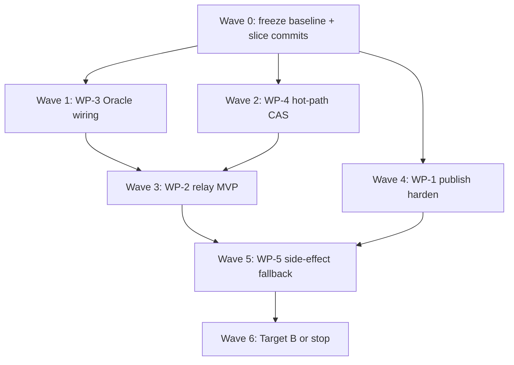

# Interview Remediation Remaining Completion Plan

> **For agentic workers:** REQUIRED SUB-SKILL: Use superpowers:subagent-driven-development (recommended) or superpowers:executing-plans to implement this plan task-by-task. Steps use checkbox (`- [ ]`) syntax for tracking.
>
> **Do not edit** `RULE.md` or the frozen execution plan body (`2026-08-03-rd-bot-interview-remediation-execution-plan.md`).  
> **Do not commit** dirty `resume_optimized.md`.  
> **Do not** default-wire `retrieveIterative` into production retrieval.

**Goal:** Close the interview-credible gaps on branch `fix/interview-remediation-loop` so P0 claims (publication consistency, Host Oracle, container security) and critical P1 fencing/fallback stories are demo-backed—without inventing resume metrics.

**Architecture:** Keep domain contracts in `engine`/`exec`/`rag`; adapters in `bootstrap`. Finish hot-path correctness first (CAS mid-pipeline, Host Oracle on real QA path, Pi credential relay), then fairness/provider distributed pieces, then P2 eval packaging. Ship as **separate WP commits/PRs**, never one mega-PR.

**Tech Stack:** Java 21 / Spring Boot 3.5, PostgreSQL + MyBatis, Docker Pi bridge (`rd-pi-bridge.mjs` / `result-tool.mjs`), existing publication ledger + assertion SPI.

**Audit basis (2026-08-06):** parallel explore agents on WP-1/4, WP-2/5, WP-3, WP-0/6/7/8. Handoff percentages were optimistic—especially WP-3 and WP-4.

---

## 0. Progress retrospective (verified)

### Workspace facts

| Fact | Evidence |
|------|----------|
| Branch | `fix/interview-remediation-loop`, **no commits vs main** |
| Scale | ~94 non-`target` changed/untracked paths; largest: `bootstrap/`, `engine/`, `exec/`, `rag/` |
| Docs | Trackable plans under `docs/superpowers/plans/`; `docs/superpowers/qa/*` **still gitignored** (only `plans/` whitelisted) |
| Dirty private file | `resume_optimized.md` — exclude from all commits |

### Honest completion matrix (vs handoff)

| WP | Handoff | Audit | Exit gate met? |
|----|--------:|------:|----------------|
| WP-0 | ~60% | **~50%** | No (docs not trackable; numbers empty — OK) |
| WP-1 | ~85% | **~80%** | Near (ledger/reconcile real; branch pre-check + E2E/auto-resubmit gap) |
| WP-2 | ~65% | **~63%** scaffold / **~30%** default-prod exit | No (Coding/QA still `bridge` + raw keys) |
| WP-3 | ~70% | **~25–30%** | **No** (gate opt-in; Spring oracle orphaned; no Host-compiled specs) |
| WP-4 | ~80% | **~68%** | **No** (terminal CAS only; MATERIAL→PR_CREATING still upsert) |
| WP-5 | ~60% | **~57%** | Partial (host reject works; no Redis half-open / ledger-before-fallback) |
| WP-6 | ~60% | **~58%** | No (fairness on `recover()` only; no stage commands / 100-task sim) |
| WP-7 | ~50% | **~48%** | Domain only (`retrieveIterative` opt-in — correctly unwired) |
| WP-8 | ~40% | **~45%** | Skeleton OK; no `raw/` runs |

**Overall vs full plan:** roughly **35–45%** engineering slices; **P0 interview exit ~40%** (WP-1 strong, WP-2/3 weak). Section 9 handoff “WP-3 未动” is stale—SPI exists but is **not** production-complete.

### What went well

- WP-1 ledger + UNKNOWN reconcile + marker PR reuse is the strongest demoable story.
- WP-5 host rejection of unsafe coding fallback (`WAITING_POLICY`) + `FAILED_VALIDATION` fix unblocked delivery smoke.
- WP-4 terminal CAS races (cancel/complete/reject) are real and tested.
- WP-7 correctly kept iterative retrieval **out** of default recorder (avoided NEED_INPUT storm).
- WP-8 `verify-package.sh` + 待复现 policy prevent fake resume numbers.

### What went wrong / process debt

1. **Handoff optimism** — counting “files landed” as % toward exit criteria (worst: WP-3 70% vs ~25%).
2. **Uncommitted mega-diff** — blocks review, PR slicing, and interview “show the commit”.
3. **Wiring orphans** — Spring `HostOwnedAssertionGate` with HTTP/SQL never injected into `EngineRequirementExecutorAdapter` (static file-only gate).
4. **Protocol cracks risk** — Host Oracle fields absent from QA prompt / `result-tool.mjs`.
5. **CAS incomplete on hot path** — interview “stale worker after lease expiry” still fails mid-pipeline.
6. **Relay switch without sidecar** — enabling `credential-relay-enabled=true` breaks model auth until bridge consumer exists.

### Interview-safe vs unsafe claims (now)

**Safe:** publication ledger + reconcile; role-scoped Pi hardening (Reviewer/Architect `network=none` + repo `:ro`); terminal task CAS; host rejects unsafe provider fallback; iterative retrieval domain exists but production is single-shot; metrics 待复现.

**Unsafe:** Exactly-Once PR; strong sandbox for Coding; Host independently proves business semantics; full fencing; 100-task fairness; Deep RAG in prod; any resume uplift %.

---

## 1. Definition of “remaining complete”

Two nested targets—implementers must label which target a PR hits.

### Target A — Interview-credible P0/P1 (must finish)

1. WP-0/8 trackable baselines + layout pilot (no fake %).
2. WP-1: branch push idempotency + mandatory ledger (postgres) + crash-window mock E2E + dual-instance publish test.
3. WP-3: Spring gate on QA path + Host-compiled/frozen specs + mandatory when specs exist + `HTTP_JSONPATH` + one exitCode=0 semantic-fail test + prompt/bridge sync.
4. WP-2: Pi credential relay MVP (issuer + HTTP redeem + bridge consumer) + Coding `network=none` when relay on (default may stay false until relay proven).
5. WP-4: CAS for EXECUTING→VALIDATING→PR_CREATING (+ remaining intermediate `markRequirement*`) + lease-expiry race test; guard blind upsert on running tasks.
6. WP-5: ledger check before tool-side-effect fallback + clean output/workspace note on provider switch; Redis half-open **optional** if time-boxed.

### Target B — Full plan exit (deferrable P2 / large P1)

- WP-3 clean-workspace patch replay factory; log/browser assertion types; full CURRENT/REGRESSION assertion scopes.
- WP-2 QA independent workspace copy; controlled egress allowlist; fork-bomb fault tests.
- WP-6 stage commands + SKIP LOCKED + submit-path fairness + 100-task simulation.
- WP-7 offline eval + opt-in flag (still never default).
- WP-8 full Q1–Q12 raw runs + HTML reports with CIs.
- WP-4 fencing token + admin metadata vs status split.
- WP-1 auto-resubmit after reconcile; live GitHub kill tests.

**This plan’s execution order finishes Target A first.** Target B is scheduled after A with explicit stop gates.

---

## 2. File map (remaining ownership)

| Area | Create / modify |
|------|-----------------|
| WP-0 trackability | `.gitignore` (`!docs/superpowers/qa/`), or move to `benchmarks/interview-claims/docs/` |
| WP-1 branch idempotency | `EngineRequirementBranchPublisherAdapter.java`, `RequirementDeliveryEngine.java`, tests |
| WP-3 wiring | `EngineRequirementExecutorAdapter.java`, `EngineRequirementExecutorConfiguration.java`, `HostOwnedAssertionGate.java`, new compiler, `result-tool.mjs`, `RequirementDeliveryEngine` QA contract |
| WP-2 relay | `PiCredentialRelay*` HTTP, `rd-pi-bridge.mjs` / env consumer, `DockerPiAgentExecutor.java`, `application.yaml` comments |
| WP-4 CAS | `RagStreamTaskRegistry.java`, `RdTaskMapper` upsert guard, `RdTaskFencingConcurrencyTest` |
| WP-5 | `RequirementAgentStageOrchestrator.java`, optional Redis half-open store |
| WP-6 (B) | `RequirementDeliveryDispatchService`, stage command store |
| Commits | Exclude `resume_optimized.md`; one WP per commit series |

---

## 3. Execution waves



Parallelism: Wave 1 and Wave 2 can run in parallel after Wave 0. Wave 3 depends on Wave 1 only loosely; Wave 5 depends on WP-1 ledger + WP-2 isolation story.

---

## Wave 0 — Baseline trackability + commit hygiene

### Task 0.1: Make WP-0 docs trackable

- [ ] Decide: `.gitignore` add `!docs/superpowers/qa/` and `!docs/superpowers/qa/*.md` **or** copy into `benchmarks/interview-claims/docs/`
- [ ] Ensure `interview-scenario-acceptance-plan.md` + `fault-injection-matrix.md` are the canonical copies
- [ ] Update handoff matrix % to audit numbers (new handoff section only—do not rewrite 2026-08-03 plan body)
- [ ] Verify: `git check-ignore -v docs/superpowers/qa/fault-injection-matrix.md` shows not ignored (or path under benchmarks)

### Task 0.2: Commit skeleton (when user asks to commit)

- [ ] Commit series suggestion (do not run until user requests):
  1. `docs+benchmarks`: WP-0/8 package + policy test
  2. `wp1-publication`: ledger/reconcile/adapters
  3. `wp2-container-policy`: security policy + Pi mounts (no claim of full relay)
  4. `wp3-oracle-spi`: engine oracle + bootstrap runners (pre-wiring)
  5. `wp4-cas-terminal`: version + terminal CAS
  6. `wp5-provider-gate`: catalog/gate/orchestrator reject
  7. `wp6-fair-recover`: planner + listInFlight
  8. `wp7-iterative-domain`: loop only
- [ ] Always exclude `resume_optimized.md` and `bootstrap/target/**`

### Task 0.3: Layout pilot for WP-8

- [ ] Add `benchmarks/interview-claims/raw/pilot-layout-001/metadata.json` with `sampleN: 0`, `status: layout-verified`, null metrics
- [ ] Expand `faults/F-CAS-01` / `F-SCHED-01` / `F-ORACLE-01` READMEs with **test commands only**
- [ ] Run: `bash benchmarks/interview-claims/runners/verify-package.sh`
- [ ] Run: `./mvnw -pl bootstrap -am -Dtest=InterviewClaimsPackagePolicyTest -Dsurefire.failIfNoSpecifiedTests=false test`

---

## Wave 1 — WP-3 Host Oracle (P0, highest claim risk)

### Task 1.1: Inject Spring gate into adapter (TDD)

- [ ] Write failing test in `EngineRequirementExecutorAdapterTest` (or new class): with Spring-wired HTTP/SQL gate, `HTTP_STATUS` assertion in bundle is executed (not UNSUPPORTED)
- [ ] Inject `HostOwnedAssertionGate` via `EngineRequirementExecutorConfiguration` into `EngineRequirementExecutorAdapter`
- [ ] Remove/ bypass `DEFAULT_HOST_ASSERTION_GATE` file-only static for production path
- [ ] Run adapter/wiring tests

### Task 1.2: Hash integrity on delivery path

- [ ] Test: tampered `hostAssertionBundle.contentHash` → QA protocol failure string contains assertion/hash
- [ ] Implement if missing in gate path used by adapter

### Task 1.3: Host-compiled AssertionSpecBundle (minimal)

- [ ] Add `AssertionSpecCompiler` in `engine/.../oracle/` — map simple acceptance criteria / optional task metadata → specs (start with FILE_EXISTS / HTTP_STATUS / HTTP_JSONPATH stubs)
- [ ] Freeze with `AssertionSpecBundle.freeze`; store hash on task context or QA input manifest owned by Host
- [ ] Gate: when Host has frozen hash, agent must echo matching hash; reject agent-supplied divergent `specs` body (hash-only or Host-reloaded specs)

### Task 1.4: Mandatory gate when Host specs present

- [ ] If frozen specs non-empty and bundle missing → fail QA protocol (no silent no-op)
- [ ] Keep backward compatible no-op only when Host compiled zero specs

### Task 1.5: HttpJsonPathAssertionRunner

- [ ] Implement `HTTP_JSONPATH` runner in `bootstrap/.../oracle/`
- [ ] Unit test: correct path passes; wrong expected fails
- [ ] Register in `HostAssertionOracleConfiguration`

### Task 1.6: Core interview scenario test

- [ ] Integration: agent `status=PASSED`, `exitCode=0`, evidence OK, but Host JSONPath/SQL fails → execution failure with Host-owned message
- [ ] Document as F-ORACLE-01 in fault README with command

### Task 1.7: Protocol sync (prompt + bridge + host)

- [ ] Update `RequirementDeliveryEngine` QA `roleOutputContract` / instructions for `hostAssertionBundle` fields
- [ ] Update `result-tool.mjs` pre-validation (mirror host rules)
- [ ] Run: `cd bootstrap/src/main/resources/executor/pi && npm test`
- [ ] Rebuild Pi images only if resources change and user requests image rebuild (`Dockerfile` / `Dockerfile.qa`)

**Wave 1 stop gate:** Can demo “exitCode=0 but Host fails” with code + test. Do **not** claim clean-workspace replay yet.

---

## Wave 2 — WP-4 hot-path CAS (P1, second claim risk)

### Task 2.1: CAS migrate EXECUTING / VALIDATING / PR_CREATING

- [ ] Extend CAS API if needed for `executionResultJson`-only mid states (already supported)
- [ ] Convert `markRequirementExecuting`, `markRequirementValidating`, `markRequirementPrCreating` to `casTransition`
- [ ] Test: cancel vs validating race — exactly one winner; version +1

### Task 2.2: CAS migrate remaining intermediate states

- [ ] Convert MATERIAL_* / CONTEXT_* / PLAN_* / WAITING_* / REPORTING already done / MERGED as applicable
- [ ] Prefer shared helper to avoid copy-paste bugs
- [ ] Run: `RagStreamTaskRegistry*CasTest` + `RequirementDeliveryEngineTest#shouldExecuteRequirementTaskAndCommitPullRequest`

### Task 2.3: Guard `upsertTask` for running tasks

- [ ] Postgres: reject or no-op status overwrite when existing status is terminal/running without version match (choose: throw on upsert of status change for non-CREATED)
- [ ] Fix `toRow` always writing `version=0` on blind save — preserve version
- [ ] Test in `PostgresRdTaskStoreCasTest` / persistence policy

### Task 2.4: Lease-expiry fencing test

- [ ] Add `RdTaskFencingConcurrencyTest`: worker A holds stale snapshot version; worker B advances; A’s `markRequirementValidating` throws `IllegalStateException`
- [ ] Optional: unify CAS + status event in one persistence call (follow-up if time)

**Wave 2 stop gate:** Honest answer to “stale worker after lease loss” is “DB rejects mid-pipeline CAS”, not only terminal.

---

## Wave 3 — WP-2 credential relay MVP (P0 security)

### Task 3.1: HTTP redeem endpoint (Host)

- [ ] Add bootstrap controller/service: redeem opaque lease → short-lived credential (pattern from `DockerCodingBenchmarkExecutor`)
- [ ] Tests: unknown lease → 401/404; expired → deny; valid → secret once or TTL

### Task 3.2: Bridge consumer

- [ ] In Pi bridge / agent env bootstrap: if `RD_PI_CREDENTIAL_LEASE` set, redeem via Host URL; never log secret
- [ ] `npm test` covering redeem failure fail-closed

### Task 3.3: End-to-end executor test

- [ ] Extend `DockerPiAgentExecutorTest`: relay enabled → no raw key in container env; network `none` for Coding
- [ ] Fix stale `application.yaml` comment (“true fails closed”) to match real wiring
- [ ] Keep default `credential-relay-enabled=false` until Task 3.2 green

### Task 3.4 (optional Target A stretch): QA workspace copy

- [ ] Only if Waves 1–3 done early: copy workspace for QA writable independence

**Wave 3 stop gate:** Can demo opaque lease + network=none with relay **on** in tests. Default prod may still be bridge until ops flip flag.

---

## Wave 4 — WP-1 publication harden

### Task 4.1: Branch push idempotency

- [ ] Before apply/push: `findBranchHead` / marker; if already present → `markBranchConfirmed`, skip re-apply
- [ ] Tests in branch publisher adapter / delivery engine

### Task 4.2: Mandatory ledger when postgres knowledge store

- [ ] Fail closed if ledger bean missing under postgres mode
- [ ] Wiring test

### Task 4.3: Dual-instance + mock crash-window

- [ ] Two threads same `operation_id` → single PR/branch outcome
- [ ] Extend `RequirementPublicationCrashWindowAcceptanceTest` with MockGitHub timeout → UNKNOWN → resume reconcile → no duplicate PR

### Task 4.4 (Target B): Auto-resubmit after reconcile

- [ ] Defer unless interview needs it: REJECTED + PR_PUBLICATION checkpoint → enqueue after PR_CONFIRMED

---

## Wave 5 — WP-5 side-effect-safe fallback

### Task 5.1: Ledger / side-effect check before tool fallback

- [ ] For `TOOL_SIDE_EFFECT` work risk: before ALLOW, require no open unknown publication / explicit clean attempt policy
- [ ] Test: coding fallback blocked when publication UNKNOWN

### Task 5.2: Provider switch hygiene

- [ ] Document + enforce Claude `cleanOutputDirectory` on switch; Pi: refuse multi-provider in-container loop or force new attempt id
- [ ] Prefer new attempt metadata in orchestrator when cross-provider SUCCESS after FAILED_* 

### Task 5.3 (Target B): Redis half-open

- [ ] Shared probe key; two-instance test; wire Claude health path

---

## Wave 6 — Target B (explicit stop / continue)

Stop after Target A unless user prioritizes:

| Slice | WP | Est. | Notes |
|-------|-----|------|-------|
| Clean workspace Host replay | WP-3 | 2–3d | Highest remaining Oracle credibility |
| Stage commands + SKIP LOCKED | WP-6 | 1–2w | Required for 100-task claim |
| submit()-path fairness | WP-6 | 2–3d | Quick credibility bump |
| Opt-in iterative flag + offline eval | WP-7 | 1w | Keep default single-shot |
| Full claims raw runs | WP-8 | ongoing | Only after Target A demos stable |
| Fencing token + admin command split | WP-4 | 3–5d | Nice-to-have after hot-path CAS |

---

## 4. Verification commands (per wave)

```bash
# WP-0/8
bash benchmarks/interview-claims/runners/verify-package.sh
./mvnw -pl bootstrap -am -Dtest=InterviewClaimsPackagePolicyTest -Dsurefire.failIfNoSpecifiedTests=false test

# WP-3
./mvnw -pl bootstrap,engine -am \
  -Dtest=HostAssertionOracleWiringTest,HostOwnedAssertionGateTest,HttpStatusAssertionRunnerTest,AssertionSpecIntegrityTest \
  -Dsurefire.failIfNoSpecifiedTests=false test
# plus new adapter oracle tests when added
cd bootstrap/src/main/resources/executor/pi && npm test

# WP-4
./mvnw -pl rag,bootstrap,engine -am \
  -Dtest=InMemoryRdTaskStoreCasTest,RagStreamTaskRegistryCancelCasTest,RagStreamTaskRegistryCompleteCasTest,RagStreamTaskRegistryRejectCasTest,PostgresRdTaskStoreCasTest,RequirementDeliveryEngineTest#shouldExecuteRequirementTaskAndCommitPullRequest \
  -Dsurefire.failIfNoSpecifiedTests=false test

# WP-2
./mvnw -pl exec,bootstrap -am \
  -Dtest=DockerPiAgentExecutorTest,ProcessContainerRunnerTest,PiAgentExecutorPropertiesTest \
  -Dsurefire.failIfNoSpecifiedTests=false test

# WP-1
./mvnw -pl bootstrap,engine,exec -am \
  -Dtest=RequirementPublicationReconciliationTest,RequirementPublicationCrashWindowAcceptanceTest,EngineRequirementPullRequestPublisherAdapterTest,RequirementDeliveryResumeFromCheckpointTest \
  -Dsurefire.failIfNoSpecifiedTests=false test

# WP-5
./mvnw -pl engine -am \
  -Dtest=ProviderFallbackGateTest,ProviderFallbackPolicyEnforcerTest,RequirementAgentStageOrchestratorTest#host_rejects_coding_fallback_onto_generation_only_provider \
  -Dsurefire.failIfNoSpecifiedTests=false test
```

---

## 5. Agent dispatch guide (how to finish)

Use **subagent-driven-development** with one WP wave per subagent; merge sequentially.

| Order | Subagent focus | Model | Must not |
|-------|----------------|-------|----------|
| 1 | Wave 0 docs/gitignore + WP-8 pilot | fast | invent metrics |
| 2a | Wave 1 WP-3 (parallel) | default | skip protocol sync |
| 2b | Wave 2 WP-4 (parallel) | default | leave upsert unguarded |
| 3 | Wave 3 WP-2 relay | default | flip default relay on without bridge |
| 4 | Wave 4 WP-1 | fast | claim Exactly-Once |
| 5 | Wave 5 WP-5 | fast | default iterative retrieval |
| 6 | Update handoff + interview talking points | fast | edit RULE.md / 2026-08-03 plan body |

After each wave: run that wave’s tests; refresh `2026-08-04-interview-remediation-progress-handoff.md` matrix; do **not** push or open mega-PR.

---

## 6. Interview talking points after Target A

> We separated DB CAS from GitHub side effects with a publication ledger and reconcile. Terminal and mid-pipeline task advances use `rd_tasks.version` CAS. Pi containers are hardened by role; Coding can use opaque credential leases with `network=none` when relay is enabled. QA evidence remains mandatory, and Host-owned assertions can fail a green `exitCode=0` agent report when frozen specs exist. Provider fallback is capability-gated—unsafe tool downgrades go to policy/human, not silent weak models. Fair recovery claim planning exists; we do not yet claim 100-task stage scheduling or resume numeric uplifts.

---

## 7. Explicit non-goals for this completion plan

- Rewriting `RULE.md` or the 2026-08-03 execution plan body
- Committing `resume_optimized.md` changes
- Default-wiring `retrieveIterative`
- One mega-PR for all waves
- Fabricating `metrics.json` percentages
- Claiming Exactly-Once or strong sandbox as absolute truths
