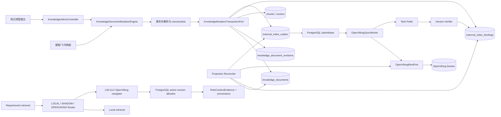
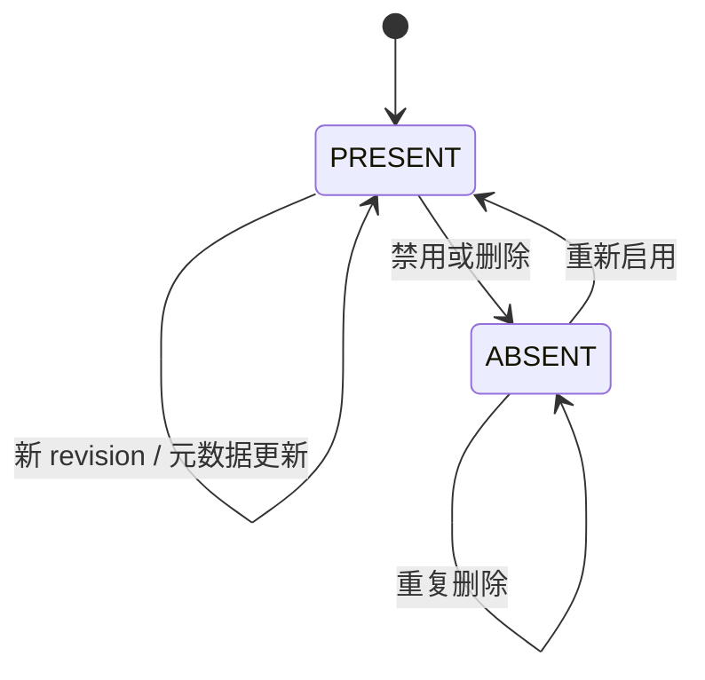
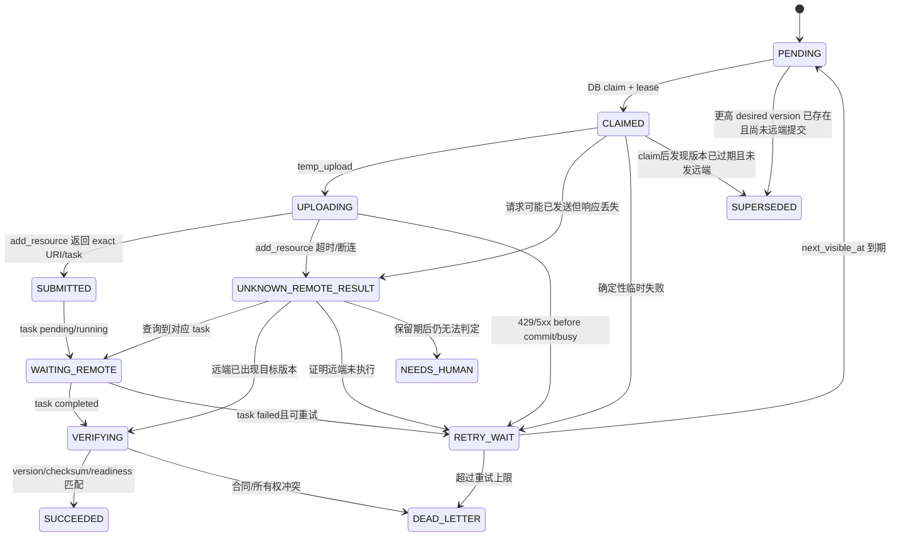
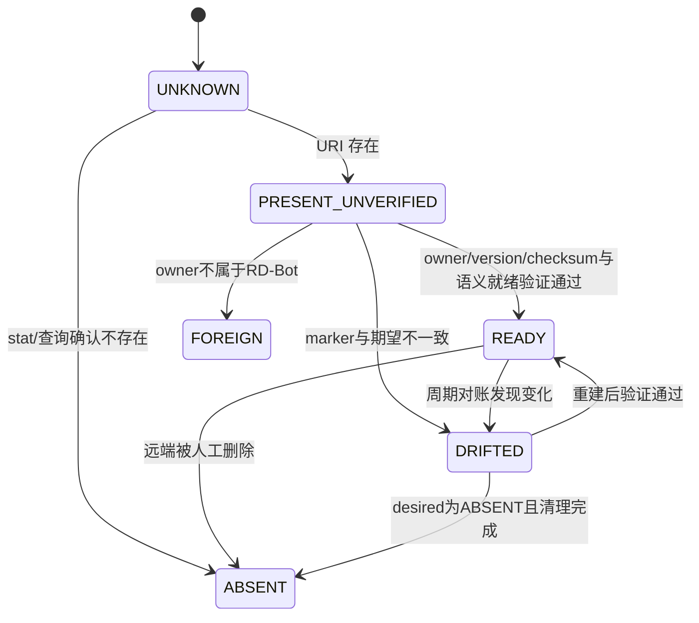
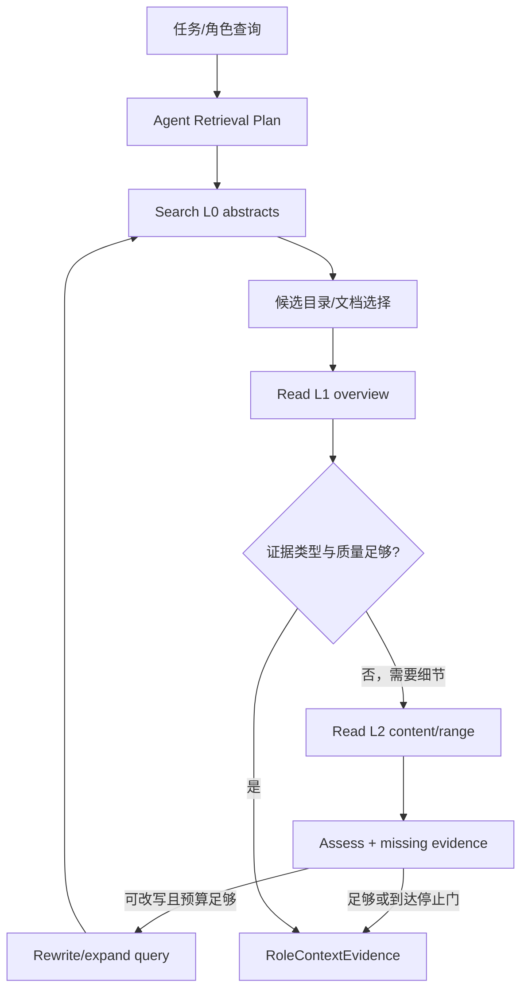

# RD-Bot OpenViking 三层知识与 Agentic RAG 集成实施计划

> 日期：2026-08-13
>
> 状态：待实施
>
> 范围：OpenViking Docker 部署、Java REST 接入、文档同步一致性、管理台可见性、存量迁移、Shadow 检索与三层 Agentic RAG
>
> 基本决策：PostgreSQL 保存 RD-Bot 的权威业务状态与规范内容；OpenViking 是可重建的外部知识投影；消息队列只负责唤醒/加速，不保存业务真值。

## 1. 目标、非目标与最终交付

### 1.1 目标

1. RD-Bot 中每篇逻辑文档拥有稳定身份；更新、重命名、重新分块不能悄悄生成另一个可检索副本。
2. 文档新增、内容刷新、启停、删除、知识库删除能够可靠投影到 OpenViking，并在重复消息、乱序、超时、重启和多 Worker 下最终收敛。
3. OpenViking 中每个资源都能反查 RD-Bot 的知识库、文档、同步版本和 checksum；不能只凭 URI 存在判定同步成功。
4. 管理台能够查看期望状态、远端观测状态、后台任务、失败、死信、漂移和墓碑，并提供安全的重试、验证、对账与重建入口。
5. 当前本地向量检索始终保留为降级通道；OpenViking 先 Shadow，再按知识库切流，支持一键退回 LOCAL。
6. 在可靠摄取与投影完成后，把现有迭代检索扩展为受预算约束的 L0 -> L1 -> L2 Agentic RAG，并复用 RD-Bot 检索 Run/Step/Artifact 审计链。

### 1.2 非目标

- 第一阶段不修改 OpenViking 源码，不把 OpenViking 嵌入 Java 进程。
- 第一阶段不实现多 OpenViking 实例，不启用 OpenViking watch；RD-Bot 自己拥有来源刷新与删除语义。
- 不让 OpenViking Studio 反向修改 RD-Bot 文档；Studio 中的人工改动视为漂移。
- 不在第一阶段删除当前 `knowledge_chunks` / `knowledge_vectors`，也不直接把所有生产检索切到 OpenViking。
- 不承诺跨 PostgreSQL 与 OpenViking 的 Exactly Once；系统采用 at-least-once 调度、幂等目标、版本围栏和对账收敛。
- 不把 OpenViking 当作普通 `VectorStore` 实现；它有资源树、L0/L1/L2、后台任务和运维状态，必须使用独立端口。

### 1.3 最终交付物

- 一份冻结的同步与检索协议 Spec。
- OpenViking 单实例 Docker Compose、固定版本镜像、持久卷、健康检查与备份/重建 Runbook。
- 稳定文档身份、不可变 revision、软删除与外部投影账本的 PostgreSQL 迁移。
- 事务化文档 Mutation Port、OpenViking REST Adapter、持久化 Worker/Poller/Reconciler。
- `/admin/knowledge/:kbId/openviking` 管理页面及配套后台接口。
- 存量文档重复身份审计、回填、全量投影与漂移报告。
- LOCAL / SHADOW / OPENVIKING 三种检索模式，以及 L0/L1/L2 Agent 检索链。
- 单元、PostgreSQL 集成、真实 Docker 合同、故障注入、HTTP 与浏览器验收报告。

## 2. 已验证的当前链路与必须先修的裂缝

### 2.1 当前摄取与管理链

```text
KnowledgeAdminController / IngestionAdminController
    -> KnowledgeWorkspace / IngestionAdminEngine
    -> TaskIngestionEngine
    -> Fetcher -> Parser -> Chunker -> Indexer
    -> KnowledgeDocumentStore / KnowledgeChunkStore / VectorStore
    -> PostgreSQL knowledge_documents / knowledge_chunks / knowledge_vectors
```

关键事实：

- `bootstrap/.../knowledge/KnowledgeAdminController.java` 仍直接调用 `KnowledgeWorkspace` 执行写入、更新和删除。
- `rag/.../knowledge/KnowledgeWorkspace.java:480-547` 依次保存文档、分块和向量，没有覆盖三者与外部投影 Outbox 的显式 PostgreSQL 原子边界。
- `knowledge_documents` 已有 `source_type`、`source_token`、`source_url`、`revision_id`、`checksum`、`raw_content`，可以作为迁移基础。
- `RULE.md` 要求管理台生产数据以 PostgreSQL 为真值，外部客户端放在 `bootstrap`，业务编排放 `engine`，领域契约放 `rag`/`engine`。

### 2.2 当前更新/删除裂缝

| 裂缝 | 现状 | 本计划处理 |
| --- | --- | --- |
| 外部来源刷新产生新 ID | `writeDocumentIfChanged()` 在 checksum/revision 改变时调用 `writeDocument()` 新建文档 | 改为同一逻辑文档追加 revision、原位推进 `sync_version` |
| 重新分块产生新 ID | `rechunkDocument()` 清除旧 chunk 后又调用会分配新 ID 的 `writeDocument()` | 重新分块只重建本地投影，不改变逻辑文档 ID 或 OpenViking 内容版本 |
| 文档立即硬删除 | `deleteDocument()` 直接删向量、chunk、document | 先软删除并写 `desired_state=ABSENT` 墓碑，远端验证不存在且过保留期后再物理清理 |
| 知识库删除级联 | 当前 FK `ON DELETE CASCADE` 会清除文档 | 知识库先进入 `DELETING`，保留投影身份；远端目录删除完成后才允许 purge |
| 多个 Store 分步写 | 文档、chunk、vector 分开调用 | 解析/分块在事务外，完整 Mutation Bundle 在一个 PostgreSQL 事务内提交 |
| 文档状态混用 | `KnowledgeDocumentStatus` 只反映当前知识文档索引状态 | OpenViking 投影使用独立状态，不污染现有文档状态枚举 |

### 2.3 当前检索链

```text
RequirementContextRetrievalRecorder
    -> DeepRetrievalOrchestrator
    -> RequirementKnowledgeSearchPort
    -> ProjectScopedRequirementKnowledgeSearchAdapter
    -> MultiChannelRetrievalEngine / VectorStore
    -> RoleContextEvidence
    -> rd_rag_retrieval_runs / steps / artifacts
    -> RoleContextPackage / Agent stage
```

现有 `DeepRetrievalOrchestrator` 已经具备：

- 单次与显式 opt-in 的多轮检索；
- 最大轮数、Token、耗时和信息增益停止门；
- 每轮 candidate/selected/missing evidence 的审计；
- 按项目绑定知识库的硬 scope。

因此三层 Agentic RAG 不另造一套无审计 Agent，而是在该链路下增加 OpenViking 导航 Provider 和 L0/L1/L2 Step。

## 3. 架构裁决与不可破坏约束

### 3.1 权威边界

| 数据 | 权威来源 | 是否可重建 |
| --- | --- | --- |
| 知识库、逻辑文档、revision、规范内容、启停/删除状态 | PostgreSQL | 否，必须备份 |
| 投影期望版本、Outbox、重试、死信、最后观测 | PostgreSQL | 否，属于同步控制面 |
| RD-Bot 本地 chunk/vector | PostgreSQL 派生数据 | 是 |
| OpenViking 资源树、L0/L1、向量 | OpenViking 内部 FS/VectorDB | 是，可由 RD-Bot 规范内容重建 |
| MQ 消息 | 运输/唤醒 | 是，不得成为真值 |

OpenViking 内部仍以自己的 FS 为内部真值；这里的“OpenViking 是派生投影”指 RD-Bot 与 OpenViking 之间的业务边界，不否定 OpenViking 自身的事务模型。

### 3.2 强制不变量

1. `document_id` 一经创建永久不变；URI 只使用安全的 `knowledgeBaseId/documentId`，不使用名称、URL 或 revision。
2. 同一 `(provider, document_id)` 只有一个绑定和一个正在与远端交互的 operation。
3. `sync_version` 只增不减；任何状态写回都必须带 expected version/CAS 和 lease owner fence。
4. 文档变更、revision、desired projection 和 Outbox 必须在同一 PostgreSQL 事务提交。
5. PostgreSQL 事务内禁止调用 OpenViking、模型、对象存储或 MQ。
6. OpenViking HTTP 2xx 只表示该 HTTP 阶段成功；只有 task terminal + 版本/checksum 验证通过才能进入 `IN_SYNC`。
7. 远端结果未知时，同一文档后续版本不得越过它发往远端；必须先查询、等待、验证或进入人工处理。
8. 删除墓碑和 remote URI 必须存活到远端删除验证、宽限期结束和 purge 完成，不能被 FK cascade 提前清除。
9. Reconciler 只能自动修改带 RD-Bot ownership marker 且位于专属根路径下的资源；未知资源进入 `FOREIGN/QUARANTINED`。
10. 前端和普通日志永远不能拿到 OpenViking root key/user key、完整鉴权头或含密钥的异常。
11. LOCAL 回滚不能依赖 OpenViking 可用，也不能自动删除远端数据。
12. OpenViking 文档内容一律视为不可信证据，不能改变系统提示、工具权限、审批和执行策略。

## 4. 目标架构



### 4.1 为什么首期用 PostgreSQL 工作队列

首期直接 claim Outbox 行：

```sql
SELECT ...
FROM knowledge_external_index_outbox
WHERE status IN ('PENDING', 'RETRY_WAIT')
  AND next_visible_at <= now()
  AND (lease_until IS NULL OR lease_until <= now())
ORDER BY next_visible_at, created_at
FOR UPDATE SKIP LOCKED
LIMIT :batch_size;
```

然后在同一数据库事务更新为 `CLAIMED`、写 `lease_owner/lease_until`。这样没有“DB 提交成功但 MQ 消息没发出”的窗口，足以支持个人项目单实例和未来多 Worker。

未来若接 Redis Stream/RabbitMQ：

- Relay 只发布 `event_id`，broker ACK 后记录 `published_at`；
- Consumer 仍必须回 PostgreSQL claim 对应 operation；
- MQ 重复投递由唯一键、operation 状态和 version fence 吸收；
- 关闭 MQ 后，PostgreSQL扫描仍可恢复，MQ 不是恢复真值。

## 5. 文档身份、revision 与规范内容设计

### 5.1 稳定逻辑文档

文档 URI：

```text
viking://resources/rd-bot/kb/{knowledgeBaseId}/documents/{documentId}/source.md
```

规则：

- 所有 ID 必须是数据库生成的数字字符串，不能接受用户提供的路径片段。
- 知识库重命名、文档重命名、来源 URL 变化不修改 URI。
- OpenViking 返回的 `root_uri` 必须规范化后精确等于请求的 `to`，否则视为合同错误。
- 每个资源写入 ownership/version tags：
  `rd.owner=rd-bot`、`rd.kb_id`、`rd.doc_id`、`rd.sync_version`、`rd.checksum`。
- 规范 Markdown front matter 同时携带这些标记，用于 `content/read` 二次验证；checksum 计算只覆盖规范正文，避免标记字段自引用。

### 5.2 规范内容快照

每次 source mutation 形成不可变 revision：

```text
original bytes / source snapshot
    -> parser(versioned)
    -> normalized Markdown body
    -> canonical checksum
    -> immutable KnowledgeDocumentRevision
    -> local chunks/vector + OpenViking projection
```

P0 只向 OpenViking 上传 RD-Bot 已生成的规范 Markdown，保证双方使用同一份内容快照。PDF、Word、网页原始解析交给 OpenViking的模式放到 P1 合同测试之后，否则 RD-Bot 与 OpenViking 可能在不同时间获取或解析出不同正文。

OpenViking HTTP 添加本地内容必须走：

```text
POST /api/v1/resources/temp_upload
    -> temp_file_id
POST /api/v1/resources { temp_file_id, to, wait:false, processing_mode:"semantic_and_vectors", tags:[...] }
    -> exact root_uri + task_id
GET /api/v1/tasks/{task_id}
    -> terminal
GET attrs/content/search
    -> version/checksum/readiness verification
```

不使用 `watch_interval`：上传文件是一次性快照，而且来源更新已经由 RD-Bot 调度。

### 5.3 mutation 分类

区分“源文档变化”和“本地检索投影变化”：

- Source mutation：上传新内容、飞书刷新、正文编辑、来源同步。递增 `sync_version`，产生 OpenViking UPSERT。
- Metadata mutation：名称、知识类型、检索标签变化。若影响 OpenViking 展示或过滤，同样递增版本并 UPSERT。
- Availability mutation：禁用/删除使 `desired_state=ABSENT`；重新启用使 `desired_state=PRESENT` 并 UPSERT 最新 revision。
- Local projection mutation：重新分块不改变规范正文，不递增 OpenViking 版本，只重建本地 chunk/vector。
- Manual chunk mutation：默认标记为 `LOCAL_ONLY_OVERRIDE`，不能伪装成 OpenViking 已同步。UI 提供“提升为新正文 revision”的显式操作，才能进入 OpenViking。

## 6. PostgreSQL 数据模型与迁移

建议新增独立迁移：

```text
bootstrap/src/main/resources/sql/postgres/p11_openviking_projection.sql
```

该文件按现有 `pN_*.sql` 顺序执行，必须幂等；真实生产升级前先备份数据库。

### 6.1 `knowledge_documents` / `knowledge_bases` 增量字段

`knowledge_documents`：

| 字段 | 用途 |
| --- | --- |
| `sync_version BIGINT NOT NULL DEFAULT 1` | 逻辑文档单调版本 |
| `current_revision_id BIGINT` | 当前不可变 revision |
| `source_identity_key VARCHAR(128)` | 外部来源稳定身份 hash；本地匿名上传可空 |
| `deleted_at TIMESTAMPTZ` | 文档软删除 |
| `purge_after TIMESTAMPTZ` | 墓碑最早清理时间 |
| `superseded_by_document_id BIGINT` | 存量重复文档归档指向 |
| `row_version BIGINT NOT NULL DEFAULT 0` | 文档 CAS |

`knowledge_bases`：

| 字段 | 用途 |
| --- | --- |
| `lifecycle_status VARCHAR(32) DEFAULT 'ACTIVE'` | `ACTIVE / DELETING / DELETED` |
| `deleted_at TIMESTAMPTZ` | 知识库软删除 |
| `purge_after TIMESTAMPTZ` | 最早物理清理时间 |
| `sync_version BIGINT NOT NULL DEFAULT 1` | KB 级删除/恢复操作的单调版本 |
| `row_version BIGINT NOT NULL DEFAULT 0` | CAS |

所有正常列表默认排除 `deleted_at IS NOT NULL` 与 `superseded_by_document_id IS NOT NULL`；同步管理页面可以显式查看墓碑。

外部来源建立 active-only 唯一索引：

```sql
CREATE UNIQUE INDEX ... ON knowledge_documents (knowledge_base_id, source_identity_key)
WHERE source_identity_key IS NOT NULL
  AND deleted_at IS NULL
  AND superseded_by_document_id IS NULL;
```

`source_identity_key` 优先由 `source_type + source_token` 生成，token 缺失时使用规范化
`source_type + source_url`。必须先完成存量重复组审计和 survivor 标记，再创建该唯一索引。

### 6.2 `knowledge_document_revisions`

| 字段 | 约束/说明 |
| --- | --- |
| `id BIGINT PRIMARY KEY` | revision 主键 |
| `document_id BIGINT NOT NULL` | 逻辑文档 |
| `sync_version BIGINT NOT NULL` | 与投影版本一致 |
| `source_revision_id VARCHAR(128)` | 飞书等来源 revision |
| `checksum VARCHAR(128) NOT NULL` | canonical body SHA-256 |
| `canonical_mime_type VARCHAR(128)` | P0 为 `text/markdown` |
| `canonical_content TEXT` | 首期可直接保存；大文件后续改 artifact URI |
| `original_artifact_uri TEXT` | 可选原始文件受控对象 URI |
| `parser_name/parser_version` | 重现解析结果 |
| `created_at` | 创建时间 |

唯一键：

```text
UNIQUE(document_id, sync_version)
UNIQUE(document_id, checksum)  -- 相同正文重复刷新可复用，不递增版本
```

### 6.3 `knowledge_external_index_bindings`

一个 provider 对一个文档一行，分别保存 desired 与 observed，不把 OpenViking 状态塞进 `KnowledgeDocumentStatus`。

| 字段 | 用途 |
| --- | --- |
| `provider` | 首期固定 `OPENVIKING` |
| `knowledge_base_id/document_id` | 本地身份；FK 使用 RESTRICT，不使用 CASCADE |
| `remote_uri` | 确定性 URI，provider 内唯一 |
| `ownership_marker` | `rd-bot:{kbId}:{docId}` |
| `desired_state` | `PRESENT / ABSENT` |
| `desired_version/desired_checksum` | 当前权威目标 |
| `observed_state` | `UNKNOWN / ABSENT / PRESENT_UNVERIFIED / READY / DRIFTED / FOREIGN` |
| `observed_version/observed_checksum` | 最近验证到的远端版本 |
| `projection_status` | 面向 UI 的派生快照 |
| `active_operation_id/remote_task_id` | 当前远端操作 |
| `semantic_config_fingerprint` | OpenViking/模型/Embedding 配置 hash |
| `last_submitted_at/last_verified_at` | 运维时间 |
| `last_error_code/last_error_message` | 脱敏、有界错误 |
| `row_version` | CAS |

唯一键：

```text
PRIMARY KEY(provider, document_id)
UNIQUE(provider, remote_uri)
```

只有在 `desired_state=ABSENT`、`observed_state=ABSENT`、不存在未完成 operation 且超过 `purge_after` 时，物理删除文档才被允许。

### 6.4 `knowledge_external_index_outbox`

| 字段 | 用途 |
| --- | --- |
| `event_id` | Snowflake/UUID，主键 |
| `idempotency_key` | provider + scope + scopeId + version + operation 的稳定 hash |
| `provider` | `OPENVIKING` |
| `operation_type` | `UPSERT_DOCUMENT / DELETE_DOCUMENT / DELETE_KNOWLEDGE_BASE / REBUILD_DOCUMENT / VERIFY_ONLY` |
| `knowledge_base_id/document_id` | DELETE_KB 时 document 可空，但标识不会因软删消失 |
| `sync_version/checksum/remote_uri` | 事件冻结身份 |
| `revision_id/payload_ref` | 指向不可变规范内容 |
| `status` | operation 状态 |
| `remote_task_id/remote_operation_id` | 远端关联 |
| `lease_owner/lease_until` | 多 Worker claim |
| `attempt_count/max_attempts` | 有界重试 |
| `next_visible_at` | 退避时间 |
| `published_at` | 未来 MQ Relay 使用 |
| `last_error_code/last_error_message` | 脱敏诊断 |
| `row_version` | CAS |

唯一键/索引：

```text
UNIQUE(idempotency_key)
UNIQUE(provider, document_id, sync_version, operation_type)
UNIQUE(provider, knowledge_base_id, sync_version, operation_type)
  WHERE document_id IS NULL
```

第二条约束只用于文档 operation；第三条使用 PostgreSQL partial unique index 约束
`DELETE_KNOWLEDGE_BASE` 等 KB 级 operation，避免 `NULL document_id` 绕过唯一性。

Outbox 的 `knowledge_base_id/document_id` 是不可变审计标识，不使用 `ON DELETE CASCADE`；
历史 operation 即使在最终 purge 后也能解释当时操作。Binding 使用 RESTRICT 保护墓碑，
最终 purge 时先删除已验证且过保留期的 binding，再删除本地文档及其 revision。

同文档连续多个未派发 UPSERT 可合并为最新版本：旧行进入 `SUPERSEDED`，但审计记录保留。DELETE/ABSENT 总是压过更低版本 UPSERT。

### 6.5 可选审计表

`knowledge_external_index_events` 保存 operation 状态边、trigger、worker、错误码和时间。若首期希望控制表数量，可以先把状态历史写入统一 operation artifact/log；上线前必须保证至少能审计一次 operation 的完整状态变化，而不是只看最终行。

## 7. 三套独立状态机

### 7.1 Desired Projection 状态



每条边都必须推进 `desired_version`，相同 checksum 的重复来源刷新除外。

### 7.2 Remote Operation 状态



重要限制：只要某 operation 已进入 `SUBMITTED/WAITING_REMOTE/UNKNOWN_REMOTE_RESULT`，同一 `(provider, documentId)` 的更高版本不能发往远端。高版本可以在 PostgreSQL 排队，但必须等旧 operation 得出明确结果，防止 v1 晚完成覆盖 v2 或复活删除文档。

### 7.3 Observed Remote 状态



面向 UI 的 `projection_status` 由三套状态派生：`PENDING / PROCESSING / IN_SYNC / DELETING / DELETED / DRIFTED / FAILED / DEAD_LETTER / NEEDS_HUMAN`。

## 8. 文档变更矩阵

| 入口 | 本地事务 | OpenViking desired | 备注 |
| --- | --- | --- | --- |
| 新建/上传文档 | 建 document + revision + chunks/vectors + binding + UPSERT | PRESENT v1 | 返回本地成功，远端异步 |
| 飞书首次导入 | 同上，保存 source identity | PRESENT v1 | source token/url 归一化 |
| 飞书 revision 更新 | 锁已有 logical doc，追加 revision，替换本地投影，version+1 | PRESENT vN | 不得创建新 documentId |
| 相同 checksum 刷新 | 只更新 source refresh 时间/指标 | 不产生事件 | 幂等 |
| 正文更新 | 追加 revision，version+1 | PRESENT vN | 旧 UPSERT 可在未提交时合并 |
| 重命名/类型/tags | 更新元数据，必要时 version+1 | PRESENT vN | URI 不变 |
| 重新分块 | 替换本地 chunks/vectors | 不变 | 不能新建 doc 或触发 OV |
| 手工 chunk CRUD | 标记 LOCAL_ONLY_OVERRIDE | 不变 | 显式“提升为 revision”后才同步 |
| 禁用文档 | `enabled=false`，version+1 | ABSENT vN | 检索立即由本地 allowlist 排除，不等远端删除 |
| 重新启用 | version+1，引用最新 revision | PRESENT vN | 重新 UPSERT |
| 删除文档 | `deleted_at/purge_after` + version+1 + DELETE | ABSENT vN | 墓碑页面可见 |
| 删除知识库 | KB=`DELETING`，文档均 desired ABSENT，写 DELETE_KB | ABSENT | 远端 KB root 递归删除并逐文档确认 |
| 重复删除 | 复用现有 tombstone/operation | ABSENT | OpenViking rm 本身幂等 |
| 强制重建 | 保留 desired version，生成 REBUILD | PRESENT | 仅管理操作，不推进业务 revision |

所有写入口最终必须收敛到一个 `KnowledgeDocumentMutationEngine`；禁止 Controller、Importer、Scheduler 绕开事务端口直接组合 Store。

## 9. OpenViking REST 合同与错误分类

### 9.1 端口能力

在 `rag` 定义 provider-neutral 的领域契约，建议：

```text
ExternalKnowledgeIndexPort
  submitUpsert(ExternalKnowledgeUpsertCommand)
  inspectTask(String taskId)
  inspectResource(String remoteUri)
  verifyResource(ExternalKnowledgeVersionMarker)
  removeResource(String remoteUri, boolean recursive)
  listTree(String ownedRootUri)
  readiness()
```

在 `bootstrap` 实现：

```text
OpenVikingRestClientAdapter
OpenVikingResponseParser
OpenVikingErrorTranslator
OpenVikingConfiguration
```

客户端使用构造器注入的 Java `HttpClient`，为 connect/request/poll 分别设置超时。请求/响应日志只记录 method、route、status、operation id、耗时和有界 error code，不记录 `X-API-Key` 或原始文档正文。

### 9.2 `wait=false` 的准确语义

对 P0 上传的非 Git 规范 Markdown：`wait=false` 返回前通常已完成来源解析、目标解析和 AGFS 写入，`task_id` 继续跟踪 semantic/embedding 队列。Git 资源才是完整后台导入的特殊情况。无论哪种来源，都不能把 add_resource 响应当成最终检索就绪。

### 9.3 错误分类

| 场景 | 分类 | 动作 |
| --- | --- | --- |
| 连接建立前失败 | RETRYABLE_NOT_SENT | 安全退避重试 |
| 429 | RETRYABLE | 尊重 Retry-After，加抖动 |
| 5xx/断连/请求超时 | UNKNOWN_REMOTE_RESULT | 先查询 task/URI/资源版本，不能立即重放 |
| ResourceBusy/锁冲突 | RETRYABLE_BUSY | 等待原任务结束，不标记删除完成 |
| 401/403 | CONFIGURATION_BLOCKED | 停止自动重试，告警/死信 |
| 400/非法 URI/不支持格式 | CONTRACT_OR_DATA_ERROR | QUARANTINED/死信，需修复数据 |
| task pending/running | WAITING_REMOTE | Poller 续查，不占用 Worker 线程 |
| task failed | RETRYABLE 或 TERMINAL | 按结构化错误码判定 |
| task 404 | UNKNOWN | 查 URI/任务列表；保留期内不假设失败 |
| 2xx 但 root_uri 缺失/不符 | MALFORMED_SUCCESS | 合同错误，禁止写成功 |
| URI owner marker 不符 | FOREIGN | 禁止覆盖/删除，进入人工处理 |

### 9.4 远端版本验证

进入 `READY/IN_SYNC` 必须同时满足：

1. OpenViking `/ready` 健康；
2. task 状态为 `completed`，且没有未处理 errors/warnings；
3. `root_uri` 与期望精确匹配；
4. owner、kbId、documentId、syncVersion、checksum marker 全部匹配；
5. `abstract`/`overview` 可读，或 task queue 明确证明 semantic 已完成；
6. 使用同 tags/URI 的 `find/search` 能召回当前资源；
7. Java 再用 PostgreSQL allowlist 确认该 document 仍启用、未删除且 desired version 未变化。

任何一步失败都不能更新 `observed_version=desired_version`。

## 10. Worker、Poller 与 Reconciler

### 10.1 Worker

`KnowledgeExternalIndexSyncEngine`：

1. claim 一批可见 operation，写 lease。
2. 对每个 operation 再读取 binding，检查 desired version/state。
3. 未发远端且已过期则 `SUPERSEDED`；已发远端的旧 operation仍必须完成判定。
4. UPSERT 读取冻结 revision，不读取可能已变化的 `knowledge_documents.raw_content`。
5. temp upload 成功后持久化 temp/operation correlation；add_resource 返回后立即保存 `task_id/root_uri`。
6. 把长轮询交给 Poller，释放同步 Worker。
7. 所有 settle 使用 `WHERE event_id=? AND status=? AND lease_owner=? AND row_version=?`。

Lease 失效的旧 Worker 可以完成正在进行的 HTTP 调用，但不能写回数据库终态。新 Worker 在接管前先检查远端，不盲目重放。

### 10.2 Poller

- 只扫描 `WAITING_REMOTE/UNKNOWN_REMOTE_RESULT/VERIFYING`。
- 使用独立并发和超时；poll 间隔指数增长并有最大值。
- 保存 task stage 和最后响应摘要，但不依赖 OpenViking 任务永久保留。
- 达到 `unknown-outcome-timeout` 仍无法判断时进入 `NEEDS_HUMAN`，而不是放行后续版本。
- 文档 desired 已变化时，先完成当前 task 判定，再立即调度最新 desired；不能把旧结果写成最新版本。

### 10.3 Reconciler

三类扫描：

1. Local -> remote：active desired 没有成功 operation、binding 太久未验证、dead-letter 经人工恢复后重新入队。
2. Remote -> local：远端缺失、marker 漂移、远端多余资源、foreign ownership、长期 processing。
3. Control-plane repair：过期 lease、operation 与 binding 不一致、墓碑可 purge、OpenViking配置 fingerprint 改变。

默认动作：

- owned + missing/stale：自动生成 REBUILD/DELETE；
- foreign：只告警和展示，不自动覆盖/删除；
- orphan owned：先进入 `ORPHAN_QUARANTINE`，经过宽限期和再次确认才删除；
- fingerprint 改变：批量标记 `REINDEX_REQUIRED`，按限流队列渐进重建。

## 11. Docker、认证、网络与恢复

### 11.1 首期部署约束

- 使用固定 OpenViking 版本或 digest，不使用 `latest`。
- 单实例、`--without-bot`，持久化 `/app/.openviking` 到专用 volume。
- 同一 Docker network 内供 Java 访问；如需本机 Studio，仅绑定 `127.0.0.1:1933`，不暴露公网。
- 配置 `restart: unless-stopped`、CPU/memory/pids 限制和日志轮转。
- liveness 使用 `/health`，readiness 使用 `/ready`；Java 在 `/ready` 失败时停止新 dispatch，但保留 PostgreSQL operation。
- `/metrics` 通过反向代理或宿主网络隔离，不直接公开。

### 11.2 密钥

- `root_api_key` 只用于首次创建 account/user 和系统管理，不作为 Java 日常数据访问 key。
- Java 使用绑定到 RD-Bot 专用 account/user 的 key。
- `application.yaml` 只保存环境变量名/占位符：`OPENVIKING_API_KEY`；不能保存真实 key。
- 后端代理所有管理查询；浏览器不直接请求 OpenViking。
- Admin API 返回错误前统一脱敏 URL query、headers、正文和内部路径。

### 11.3 备份与灾难恢复

主恢复路径：PostgreSQL revision -> 全量重建 OpenViking。OpenViking volume/OVPack 备份只用于缩短恢复时间。

每月/重要升级前执行：

1. PostgreSQL 备份；
2. OpenViking OVPack/volume 快照；
3. 记录镜像 digest 和 semantic config fingerprint；
4. 在隔离目录恢复；
5. 运行一致性检查与 RD-Bot Reconciler；
6. 验证至少一篇文档的 L0/L1/L2 和版本 marker。

OpenViking backup 不包含 `temp/queue` 等内部运行态，恢复后必须重新对账所有非终态 operation。

## 12. 后端模块与代码落点

### 12.1 `rag`：领域模型与端口

建议新增：

```text
rag/src/main/java/com/wish/rd/rag/knowledge/projection/
  ExternalKnowledgeIndexPort.java
  KnowledgeExternalIndexBindingStore.java
  KnowledgeExternalIndexOutboxStore.java
  model/ExternalKnowledgeDesiredState.java
  model/ExternalKnowledgeObservedState.java
  model/ExternalKnowledgeOperationStatus.java
  model/KnowledgeExternalIndexBinding.java
  model/KnowledgeExternalIndexOperation.java
  model/ExternalKnowledgeVersionMarker.java

rag/src/main/java/com/wish/rd/rag/knowledge/revision/
  KnowledgeDocumentRevisionStore.java
  model/KnowledgeDocumentRevision.java
  model/KnowledgeDocumentMutationBundle.java
```

端口不能引用 OpenViking SDK/HTTP DTO。

### 12.2 `engine`：用例与编排

建议新增：

```text
engine/src/main/java/com/wish/rd/engine/knowledge/
  KnowledgeDocumentMutationEngine.java
  KnowledgeMutationTransactionPort.java
  KnowledgeExternalIndexSyncEngine.java
  KnowledgeExternalIndexPollEngine.java
  KnowledgeExternalIndexReconciliationEngine.java
  KnowledgeProjectionAdminEngine.java
```

职责：

- MutationEngine 负责 source/local mutation 分类、预处理和命令构造；
- TransactionPort 负责一个原子数据库提交；
- Sync/Poll/Reconcile 只依赖领域 Store/Port，不直接创建 HttpClient；
- AdminEngine 负责范围校验、重试/验证/重建语义。

### 12.3 `bootstrap`：数据库、HTTP、调度与 Controller

建议新增：

```text
bootstrap/src/main/java/com/wish/rd/bootstrap/openviking/
  OpenVikingConfiguration.java
  OpenVikingProperties.java
  OpenVikingRestClientAdapter.java
  OpenVikingErrorTranslator.java
  OpenVikingSyncDispatcher.java
  OpenVikingTaskPollScheduler.java
  OpenVikingReconciliationScheduler.java

bootstrap/src/main/java/com/wish/rd/bootstrap/persistence/impl/
  PostgresKnowledgeMutationTransactionAdapter.java
  PostgresKnowledgeDocumentRevisionStore.java
  PostgresKnowledgeExternalIndexBindingStore.java
  PostgresKnowledgeExternalIndexOutboxStore.java

bootstrap/src/main/java/com/wish/rd/bootstrap/controller/admin/knowledge/
  KnowledgeProjectionAdminController.java
```

修改现有：

- `KnowledgeAdminController` 的所有 mutation 改为调用 Engine；读取可以暂时复用现有 Workspace。
- `FeishuDocKnowledgeImporter` 改成准备来源快照并调用 MutationEngine。
- `KnowledgeRefreshScheduler` 不再直接触发会新建 document 的路径。
- `KnowledgeWorkspace.rechunkDocument()` 改为保留 documentId，并逐步把生产 mutation 从 Workspace 搬出。
- `KnowledgeMapController` 后续只读取真实 L0/L1 投影或明确标识本地 placeholder，不能把占位 summary 当 OpenViking 摘要。

### 12.4 配置

```yaml
rd:
  knowledge:
    projection:
      mode: ${RD_KNOWLEDGE_PROJECTION_MODE:OFF} # OFF/ASYNC
      provider: ${RD_KNOWLEDGE_PROJECTION_PROVIDER:openviking}
      worker:
        concurrency: ${RD_OPENVIKING_WORKER_CONCURRENCY:2}
        batch-size: ${RD_OPENVIKING_WORKER_BATCH_SIZE:10}
        lease-millis: ${RD_OPENVIKING_WORKER_LEASE_MILLIS:120000}
        max-attempts: ${RD_OPENVIKING_MAX_ATTEMPTS:8}
      poll:
        interval-millis: ${RD_OPENVIKING_POLL_INTERVAL_MILLIS:3000}
        unknown-outcome-timeout-millis: ${RD_OPENVIKING_UNKNOWN_TIMEOUT_MILLIS:1800000}
      reconcile:
        enabled: ${RD_OPENVIKING_RECONCILE_ENABLED:false}
        interval-millis: ${RD_OPENVIKING_RECONCILE_INTERVAL_MILLIS:300000}
  openviking:
    enabled: ${RD_OPENVIKING_ENABLED:false}
    base-url: ${RD_OPENVIKING_BASE_URL:http://127.0.0.1:1933}
    api-key-env: ${RD_OPENVIKING_API_KEY_ENV:OPENVIKING_API_KEY}
    owned-root: ${RD_OPENVIKING_OWNED_ROOT:viking://resources/rd-bot/}
    connect-timeout-millis: ${RD_OPENVIKING_CONNECT_TIMEOUT_MILLIS:3000}
    request-timeout-millis: ${RD_OPENVIKING_REQUEST_TIMEOUT_MILLIS:30000}
  rag:
    knowledge-provider-mode: ${RD_RAG_KNOWLEDGE_PROVIDER_MODE:LOCAL} # LOCAL/SHADOW/OPENVIKING
```

所有开关默认关闭或 LOCAL，确保零配置启动与安全回滚。

## 13. 管理 API 与前端页面

### 13.1 管理 API

```text
GET  /admin/knowledge-base/{kbId}/openviking/overview
GET  /admin/knowledge-base/{kbId}/openviking/documents
GET  /admin/knowledge-base/{kbId}/openviking/documents/{docId}
GET  /admin/knowledge-base/{kbId}/openviking/tree?uri=...
GET  /admin/knowledge-base/{kbId}/openviking/health
POST /admin/knowledge-base/{kbId}/openviking/documents/{docId}/retry
POST /admin/knowledge-base/{kbId}/openviking/documents/{docId}/verify
POST /admin/knowledge-base/{kbId}/openviking/documents/{docId}/rebuild
POST /admin/knowledge-base/{kbId}/openviking/reconcile
GET  /admin/knowledge-base/{kbId}/openviking/dead-letters
POST /admin/knowledge-base/{kbId}/openviking/dead-letters/{eventId}/requeue
```

安全约束：

- `tree?uri` 先解析并验证必须位于该 KB 的 owned root；禁止任意 URI 代理。
- rebuild/delete/requeue 为高风险 mutation，复用后台管理鉴权、CSRF/操作审计约束。
- 返回 DTO 只含脱敏错误；原始 OpenViking response 不透传。
- retry 使用现有 operation 或创建显式新 operation，不直接从 Controller 发 REST。

### 13.2 前端

新增路由：

```text
/admin/knowledge/:kbId/openviking
```

建议文件：

```text
frontend/src/pages/admin/knowledge/OpenVikingKnowledgePage.tsx
frontend/src/services/openVikingKnowledgeService.ts
frontend/src/components/admin/knowledge/OpenVikingStatusBadge.tsx
frontend/src/components/admin/knowledge/OpenVikingOperationTimeline.tsx
```

页面结构：

1. 顶部健康卡：OpenViking ready、镜像/API 版本、semantic fingerprint、最后对账。
2. 汇总卡：IN_SYNC、PENDING、PROCESSING、DRIFTED、FAILED、DEAD_LETTER、DELETED。
3. 文档映射表：文档、desired/observed version/checksum、URI、task、lag、attempt、最后验证。
4. 文档抽屉：L0/L1 预览、operation timeline、错误、source revision、tags、手工操作。
5. Remote Tree：只读浏览受管根；foreign/orphan 使用明显警示。
6. 死信/墓碑页签：删除后的记录仍然可以查看和恢复。
7. “打开 Studio”仅显示服务端配置的安全 URL；不拼 API key。

活动任务每 5 秒轮询，稳定页面停止自动轮询；所有操作后仍以服务端账本为准，不能仅用 Toast 宣称成功。

## 14. Agentic 三层 RAG 设计

可靠同步与 Shadow 验证通过后再启用本节。

### 14.1 Provider Router

```text
LOCAL:
  只运行现有 ProjectScopedRequirementKnowledgeSearchAdapter

SHADOW:
  LOCAL 结果参与任务
  OpenViking 同时运行但只写 retrieval artifacts/metrics

OPENVIKING:
  OpenViking 作为主检索
  超时/不可用时按策略降级 LOCAL，并在 Run 中明确记录 DEGRADED
```

不能静默混用远端旧版本：OpenViking 每条 evidence 都要经过 PostgreSQL allowlist，只有 `enabled=true`、未删除、binding READY、observed=desired 的版本可进入 Agent 上下文。

### 14.2 三层导航循环



每轮至少记录：

- query、scope、OpenViking API 与层级；
- candidate URI、L0 摘要、选择理由；
- 展开的 L1/L2 URI 与版本 marker；
- missing evidence type、information gain、token/latency；
- stop reason、降级原因和最终引用。

### 14.3 预算与停止门

初始默认值，WP-0 基线后可调整：

| 限制 | 默认 |
| --- | ---: |
| 最大轮数 | 3 |
| 每轮 L0 候选 | 20 |
| L1 展开 | 6 |
| L2 展开 | 3 |
| 总 OpenViking 请求 | 15 |
| 总检索 Token | 8,000 |
| 总耗时 | 20 秒 |

停止条件：证据类型满足、连续一轮信息增益低、候选重复、预算耗尽、OpenViking unavailable、需要用户补充输入。预算耗尽返回有证据的部分结果和明确 stop reason，不能无限 follow-up。

### 14.4 Prompt Injection 防线

- L0/L1/L2 放入标记为 `<untrusted_knowledge>` 的数据区。
- 检索 Agent 只能选择查询/URI/层级，不能修改工具权限或调用任意 URL。
- OpenViking URI 必须经过 owned root 和 scope 校验。
- 文档中的指令性文本不能作为 system/developer/tool instruction。
- 对外答案/角色上下文保留 documentId、revision、checksum、URI 和引用范围。

## 15. 分阶段实施工作包

### 总体排期

| 阶段 | 工作包 | 单人估算 | 退出门槛 |
| --- | --- | ---: | --- |
| WP-0 | 协议冻结、基线与 Docker 合同探针 | 2～3 天 | 固定版本 OpenViking 合同可复现 |
| WP-1 | 稳定文档身份、revision、软删除 | 4～7 天 | 所有 source mutation 保留 docId |
| WP-2 | 事务 Mutation + projection/outbox schema | 5～8 天 | DB 原子性与 CAS/lease 测试通过 |
| WP-3 | REST Adapter + Worker/Poller | 4～7 天 | 新增/更新可达到 version-verified IN_SYNC |
| WP-4 | 删除、未知结果、Reconciler | 4～7 天 | 故障矩阵最终收敛，无复活 |
| WP-5 | 管理 API 与前端页面 | 3～5 天 | 重启后完整可观测、可重试 |
| WP-6 | 存量审计、回填与 Shadow 摄取 | 3～6 天 | 100% eligible 文档有明确投影状态 |
| WP-7 | Shadow 检索、三层 Agent RAG 与评测 | 6～10 天 | 质量/引用/延迟门槛通过 |
| WP-8 | 切流、回滚演练和运维文档 | 2～4 天 | LOCAL 回滚不依赖 OpenViking |

单人完整实施约 5～8 周；仅完成可靠投影与管理页面的 MVP（WP-0～WP-5）约 3～5 周。每个 WP 独立 PR，禁止一次性大改全部摄取和检索。

### WP-0：协议冻结与真实 OpenViking 合同

任务：

- 新增 `docs/superpowers/specs/2026-08-13-openviking-projection-protocol-spec.md`，冻结 URI、marker、状态边和错误分类。
- 固定 OpenViking 镜像 version/digest、单实例 Compose 与专用测试 volume。
- 编写只对测试根路径操作的真实合同测试：temp upload、exact `to`、wait=false、task poll、L0/L1、同 URI 增量更新、幂等删除。
- 记录 2xx、busy、task failed、task 404、超时、错误响应的真实 JSON 契约；DTO 不按文档猜测。
- 建立 20～50 篇小型知识样本和当前本地检索基线。

退出标准：合同测试可重复运行、不会访问生产根、清理只删除自己创建的测试 URI。

### WP-1：身份与 mutation 语义修复

任务：

- 增加 revision/soft-delete 字段和 Store。
- `writeDocumentIfChanged` 改为同 source identity 更新已有逻辑文档。
- 修复 `rechunkDocument` 不产生新 documentId。
- 定义手工 chunk `LOCAL_ONLY_OVERRIDE` 语义。
- 删除接口改为软删除并保持当前 HTTP 兼容响应；列表默认隐藏墓碑。
- 为知识库删除增加 `DELETING` 生命周期。

必测：同一飞书 token 连续三个 revision 只有一个 active documentId；相同 checksum 不产生新 revision；rechunk 前后 documentId/syncVersion 不变。

### WP-2：原子 Mutation 与 Outbox

任务：

- 建 `p11_openviking_projection.sql`、Mapper/Row/Store。
- 实现 `KnowledgeMutationTransactionPort` PostgreSQL 适配器。
- 把文档 + revision + chunks/vectors + binding + outbox 写入一个事务。
- claim/lease/CAS、过期 claim 回收、唯一键吸收重复入队。
- 增加结构性 policy test，禁止生产 Controller/Feishu/Scheduler 直接做组合 Store mutation。

必测：事务任一点异常全部回滚；线程池拒绝后 operation 仍是 PENDING；两个 Worker 只能 claim 一次；过期 owner 无法 settle。

### WP-3：OpenViking Adapter、Worker 与 Poller

任务：

- 实现 server-side key 解析、HttpClient、DTO 和错误翻译。
- 实现 UPSERT 两步上传、exact root 校验、task 持久化与 Poller。
- 实现 marker、L0/L1、search 的版本验证。
- 非阻塞 Worker：提交后转 WAITING_REMOTE，不占线程等待。
- 指标：dispatch、submitted、completed、verify failure、latency、queue age。

必测：新增、同 URI v2 更新、OpenViking 重启后继续 poll、task 完成但 marker 错误不能成功。

### WP-4：删除、未知结果与漂移收敛

任务：

- 文档/KB 删除 tombstone；递归删除只作用于专属根。
- `UNKNOWN_REMOTE_RESULT` 查询与人工门禁。
- 同文档 single-flight；更高版本等待旧未知任务。
- Reconciler 扫描 missing/stale/orphan/foreign/fingerprint drift。
- dead-letter、人工 requeue、墓碑 purge job。

必测：v1 超时后 v2/DELETE 排队、v1 晚完成也不能复活；删除 busy 不得标成功；FK cascade 不能抹掉墓碑；foreign URI 不被覆盖。

### WP-5：管理面可见性

任务：

- 实现 overview/list/detail/tree/health/retry/verify/rebuild/reconcile API。
- 新增前端页面、状态徽标、operation timeline、L0/L1 预览、死信和墓碑页签。
- 页面刷新/后端重启后状态不丢失。
- 浏览器/日志/trace 做密钥扫描。

必测：分页过滤、删除 tombstone 可见、错误脱敏、越界 URI 拒绝、所有新 SPA 路由刷新不 404。

### WP-6：存量审计与全量回填

任务：

- 只读扫描重复 source identity：优先 `(kb, source_type, source_token)`，再看规范化 source URL。
- 每组选择 `last_synced_at/created_at/id` 最新的成功文档作为 active survivor；旧行标记 `superseded_by_document_id`，不直接删除历史引用。
- 为所有 active 文档生成 revision v1、binding 与 UPSERT；限流执行。
- 输出 eligible/in-sync/failed/quarantined/duplicate/orphan 报告。
- 回填前后分别备份并验证计数。

退出标准：每个 active eligible 文档只有一个 logical identity 和 deterministic URI；没有静默跳过项。

### WP-7：Shadow 检索与三层 Agent

任务：

- 新增 LOCAL/SHADOW/OPENVIKING Router。
- SHADOW 同时执行但仅 LOCAL 进入任务；OpenViking 结果写 retrieval artifacts。
- 实现 L0 search、L1 overview、L2 read、evidence gate、query refinement。
- 每条 evidence 经过 active-version allowlist。
- 建立 gold questions，比较 Recall@K、引用有效率、上下文 Token、p50/p95 latency、Agent 最终验收通过率。

建议切流门槛：引用 URI/version 有效率 100%；无跨知识库证据；Recall@8 不低于 LOCAL 基线；p95 延迟与预算阈值由 WP-0 基线冻结；没有未解释的降级。

### WP-8：切流与运维

任务：

- 按知识库 allowlist 从 LOCAL -> SHADOW -> OPENVIKING，不做全局一次切换。
- 演练 OpenViking 停机、网络断开、volume 恢复、版本升级与 semantic fingerprint 变化。
- 演练配置切回 LOCAL；任务创建、角色执行和旧检索继续工作。
- 完成运维 Runbook、告警和最终 QA 报告。

## 16. 测试与故障注入矩阵

### 16.1 单元/集成测试

建议新增测试：

```text
rag/.../KnowledgeExternalIndexStateTest.java
rag/.../KnowledgeDocumentRevisionTest.java
engine/.../KnowledgeDocumentMutationEngineTest.java
engine/.../KnowledgeExternalIndexSyncEngineTest.java
engine/.../KnowledgeExternalIndexReconciliationEngineTest.java
bootstrap/.../PostgresKnowledgeMutationTransactionAdapterTest.java
bootstrap/.../PostgresKnowledgeExternalIndexOutboxStoreTest.java
bootstrap/.../OpenVikingRestClientAdapterTest.java
bootstrap/.../OpenVikingProjectionAdminControllerTest.java
bootstrap/.../OpenVikingProductionBoundaryPolicyTest.java
frontend/.../OpenVikingKnowledgePage tests
```

### 16.2 故障矩阵

| 故障点 | 预期结果 |
| --- | --- |
| PostgreSQL commit 前异常 | 文档、revision、binding、outbox 全部不存在 |
| commit 后、Worker 唤醒前崩溃 | PENDING 行被扫描恢复 |
| temp_upload 前断网 | RETRY_WAIT，不产生远端副作用 |
| add_resource 已执行但响应丢失 | UNKNOWN，不立即重放；查询 URI/task 后收敛 |
| task running 时 Java 重启 | PostgreSQL task_id 恢复轮询 |
| OpenViking 重启 | Queue 恢复后 Poller 继续，或 Reconciler重建 |
| Worker lease 过期 | 旧 owner 无法 settle；新 owner 先查远端 |
| 两 Worker 同时 claim | 只有一个持有有效 lease |
| v1 未知、v2 到达 | v2 等待，不能越过 v1 |
| v1 晚完成、desired 已 DELETE v3 | v1 只记录 observed，随后执行 v3 删除，不能复活 |
| 删除遇 ResourceBusy | 保持 DELETING/RETRY，不得写 DELETED |
| 删除不存在 URI | 幂等成功并验证 ABSENT |
| task 404 | 查询 URI/任务列表；无法判定则 NEEDS_HUMAN |
| 手工删除远端资源 | Reconciler 生成 REBUILD |
| 手工改 marker | DRIFTED；owned 才允许重建 |
| deterministic URI 被 foreign 占用 | FOREIGN/NEEDS_HUMAN，禁止覆盖 |
| knowledge base 删除 | 墓碑保留，级联不能丢失 remote URI |
| OpenViking key 错误 | CONFIGURATION_BLOCKED，密钥不出现在错误/页面 |
| Embedding/semantic 配置改变 | REINDEX_REQUIRED，限流重建 |

### 16.3 验证命令

每个 PR 先跑聚焦测试，阶段末运行：

```bash
./mvnw -q -pl rag -am \
  -Dtest=KnowledgeWorkspacePersistenceTest,FeishuDocKnowledgeImporterTest,KnowledgeRefreshSchedulerTest \
  -Dsurefire.failIfNoSpecifiedTests=false test

./mvnw -q -pl engine -am \
  -Dtest=KnowledgeAdminFlowTest,DeepRetrievalOrchestratorTest,DeepRetrievalOrchestratorIterativePolicyTest,RequirementContextRetrievalRecorderTest \
  -Dsurefire.failIfNoSpecifiedTests=false test

./mvnw -q -pl bootstrap -am \
  -Dtest=KnowledgeAdminControllerTest,IngestionAdminControllerTest,PostgresPersistenceCrudIntegrationTest,KnowledgeMapControllerTest \
  -Dsurefire.failIfNoSpecifiedTests=false test

./mvnw -q test

cd frontend
npm run typecheck
npm run build
```

真实 OpenViking smoke 使用显式开关和唯一测试根，例如：

```bash
./mvnw -q -pl bootstrap -am \
  -Drd.openviking.smoke=true \
  -Dtest=OpenVikingRealContractSmokeTest,OpenVikingProjectionFaultInjectionTest \
  -Dsurefire.failIfNoSpecifiedTests=false test
```

实现阶段新增的精确测试类必须补入上述命令；不存在的规划类名不能在实现前误报为已验证。

## 17. 可观测性与告警

RD-Bot 至少暴露：

```text
rd_openviking_outbox_pending_total
rd_openviking_operation_total{status,operation}
rd_openviking_operation_latency_seconds{operation}
rd_openviking_queue_oldest_age_seconds
rd_openviking_retry_total{error_code}
rd_openviking_dead_letter_total
rd_openviking_drift_total{type}
rd_openviking_in_sync_ratio
rd_openviking_task_poll_total{status}
rd_openviking_retrieval_requests_total{mode,outcome}
rd_openviking_retrieval_latency_seconds{level}
rd_openviking_retrieval_fallback_total{reason}
```

初始告警：

- `/ready` 连续 3 次失败；
- oldest pending age 超过 10 分钟；
- dead letter > 0；
- UNKNOWN/NEEDS_HUMAN 超过 30 分钟；
- active 文档 in-sync ratio 低于 99%（回填期间单独静默）；
- foreign/orphan 增长；
- 检索跨 KB allowlist 拒绝 > 0；
- semantic fingerprint 未审批变化。

错误日志必须包含 `eventId/documentId/syncVersion/taskId/errorCode`，但不得包含 API key 或完整文档内容。

## 18. 上线、切流与回滚门禁

### 18.1 上线前必须全部满足

- [ ] PostgreSQL schema 唯一约束、CAS、soft-delete、墓碑保留与向前兼容回滚方案已在真实 PostgreSQL 验证。
- [ ] 所有文档 mutation 入口都通过同一个事务端口；结构测试禁止旁路。
- [ ] 固定版本 Docker 合同验证 temp upload、exact update、task poll、marker 校验和幂等删除。
- [ ] 重复、乱序、未知结果、lease takeover、服务重启、busy delete 和手工漂移均收敛到最新 desired。
- [ ] 100% eligible active 文档有 binding；0 个未解释 duplicate/orphan/dead-letter/unknown。
- [ ] 页面重启后仍显示 pending/failed/dead-letter/deleted，不依赖内存状态。
- [ ] 浏览器 payload、数据库错误、日志和 trace 均未出现凭据。
- [ ] SHADOW 评测达到冻结门槛；引用 version/URI 有效率 100%，没有跨知识库证据。
- [ ] LOCAL 回滚演练成功，OpenViking 停机时现有任务仍可检索并执行。

### 18.2 回滚策略

1. `RD_RAG_KNOWLEDGE_PROVIDER_MODE=LOCAL`：立即停止使用 OpenViking 检索。
2. `RD_KNOWLEDGE_PROJECTION_MODE=OFF`：停止 claim 新 operation；保留 Outbox/墓碑，不删除。
3. 保留 Reconciler 关闭开关；故障期间只读页面仍显示 PostgreSQL 最后状态。
4. 不因软件回滚自动删除 OpenViking 数据；待新版本恢复后继续对账。
5. 数据库迁移优先向前兼容回滚：旧代码忽略新表/字段；已写 revision/outbox 不做破坏性 down migration。

## 19. 建议 PR 拆分

| PR | 内容 | 可独立回滚 |
| --- | --- | --- |
| PR-1 | Spec、Docker Compose、真实合同 smoke | 是 |
| PR-2 | revision、稳定 ID、rechunk 修复、soft delete | 是，需保留新增字段 |
| PR-3 | projection schema、Store、事务 Mutation/Outbox | 是，开关 OFF |
| PR-4 | OpenViking REST Adapter、Worker、Poller | 是，停 Worker |
| PR-5 | DELETE/UNKNOWN/Reconciler/死信 | 是，停调度但保留墓碑 |
| PR-6 | 管理 API 与 OpenViking 页面 | 是 |
| PR-7 | 存量审计/回填工具与报告 | 需备份；只标记不物理删除 |
| PR-8 | LOCAL/SHADOW Router 与评测 | 是，切 LOCAL |
| PR-9 | L0/L1/L2 Agentic RAG | 是，切 SHADOW/LOCAL |
| PR-10 | 按 KB 切流、运维/QA 文档 | 是 |

## 20. 重要验收反例

以下结果不能称为“完成”：

- add_resource 返回 200 就把文档标为已同步；
- MQ 投递成功就认为不会丢事件；
- URI 存在但没有验证 documentId/version/checksum；
- 删除 RD-Bot 行后再尝试从已删除行恢复 remote URI；
- v1 远端结果未知时直接投递 v2；
- 只在前端显示 OpenViking tree，却没有本地 desired/observed/operation 账本；
- OpenViking unavailable 时悄悄返回空 evidence，而不记录 DEGRADED/FAILED；
- 把本地 chunk 手工编辑当作 OpenViking source 已同步；
- 用 Studio 手工清理 orphan 代替可复现 Reconciler；
- 直接把 root key 交给浏览器或存入错误日志；
- 未做 Shadow/回滚演练就移除当前本地检索。

## 21. 官方合同参考

- [OpenViking 资源管理：temp upload、exact `to`、wait、processing mode](https://docs.openviking.ai/zh/api/02-resources)
- [OpenViking 文件系统：stat/tree/rm 与幂等删除](https://docs.openviking.ai/zh/api/03-filesystem)
- [OpenViking 后台任务状态](https://docs.openviking.ai/zh/api/17-tasks)
- [OpenViking 路径锁与崩溃恢复](https://docs.openviking.ai/zh/concepts/09-transaction)
- [OpenViking Docker 部署与健康检查](https://docs.openviking.ai/en/guides/03-deployment)
- [OpenViking 多租户与 user key](https://docs.openviking.ai/zh/concepts/11-multi-tenant)
- [OpenViking 可观测性与 metrics](https://docs.openviking.ai/zh/guides/05-observability)
- [OpenViking OVPack 备份与恢复](https://docs.openviking.ai/zh/api/14-ovpack)

## 22. 实施开始前的冻结结论

以下决策已经足够明确，不应在实现中反复摇摆：

1. 采用 OpenViking REST 集成，不复制其内部三层存储实现。
2. PostgreSQL 是 RD-Bot desired/canonical 真值，OpenViking 是外部投影。
3. 首期使用 PostgreSQL Outbox/工作队列；MQ 后置且只传 event ID。
4. 文档使用稳定 logical ID 和 deterministic URI；revision 不再生成新逻辑文档。
5. 删除使用软删除 + tombstone + 远端验证 + 延迟 purge。
6. 远端 2xx/task completed 都不是单独成功条件，必须验证 owner/version/checksum/readiness。
7. 未知远端结果阻塞同文档后续远端派发，无法判定时进入人工处理。
8. 管理台展示 RD-Bot 同步账本，并只读代理 OpenViking 结构；不把 Studio 当控制面真值。
9. 本地检索保留，先 Shadow，最后按知识库切流。
10. 三层 Agentic RAG 复用现有 retrieval lifecycle、预算、stop gate 与 evidence provenance。
