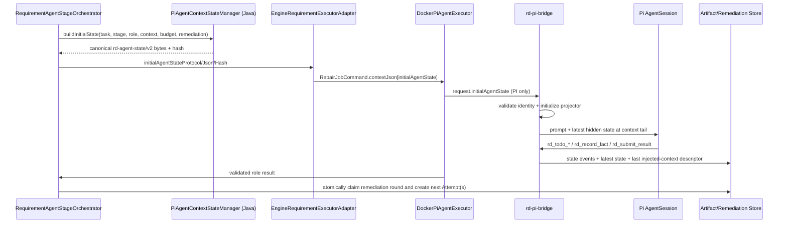

# PI Agent 状态栏与 QA 修复回路后端实施计划

> 日期：2026-08-18  
> 状态：方案已完成代码链路勘察，待创建 OpenSpec change 后实施  
> 实施范围：Java 控制面、Pi executor、`rd-pi-bridge`、结果协议、PostgreSQL 审计与只读管理 API  
> 前端：不在本文实施；交给独立计划 `docs/superpowers/plans/2026-08-18-pi-effective-context-prompt-page-frontend.md`

## 1. 已锁定决策

1. 状态栏及本次新增协议只维护 **PI** runtime，并要求冻结 capability `PI_AGENT_STATE_V2`；未声明 capability 的历史/新 PI Attempt、Claude Code、MODEL_ONLY 和旧 BugFix 链路保持原行为。
2. 每个角色 Attempt 的初始状态由 Java 控制面计算。Pi bridge 不再在启用动态状态时静默创建空状态。
3. 状态栏始终作为隐藏的 `rd-agent-state` custom message 放在每次模型有效上下文的结尾；同一上下文只保留最新一份。
4. TODO 由 Java 预置不可删除的 Host 必做项，Agent 可通过现有 `rd_todo_rewrite` / `rd_todo_update_status` 细化和推进；完成必做项必须引用证据。
5. 对 PI-v2，QA 明确认为缺陷需要 Coding 修复时即可打回，不再由 `PRODUCT_DEFECT|REGRESSION` 白名单决定；legacy 分支仍保留现有分类白名单。
6. PI-v2 QA→Coding 自动修复最多 **2 轮**。初始 Attempt 加两轮修复仍受角色 `attemptNo <= 3` 的硬上限约束；QA 协议重试、宿主验证等其他回路已占用 Attempt 时，可用产品修复轮数会少于 2，系统必须在告警/API 明示“计划上限、已占用、剩余”，不得突破硬上限。Legacy 仍为 1 轮。
7. Pi 协议失败不伪装成产品 Bug：终态协议失败允许 **1 次 QA→QA 新 Attempt**；绝不路由到 Coding。
8. 自动修复轮次与协议重试必须持久化、幂等，不以进程栈里的递归计数作为真值。
9. 管理 API 展示“有效指令上下文”和“最新状态”。“有效上下文”严格定义为静态 `PROMPT_SNAPSHOT` 加最近一次实际注入的状态块，不声称包含 Provider 对话历史或隐藏 reasoning。
10. QA 打回先按来源 Attempt 的冻结 runtime/capability 分流：未声明 v2 capability 的所有历史 Attempt（包括旧 PI、Claude、MODEL_ONLY）保留现有 predicate、结果合同和 1 轮上限；只有 PI + `PI_QA_REMEDIATION_V2` 进入新字段和 2 轮上限。

## 2. 规划前读取与证据分类

### 2.1 当前代码真值

- 生产多角色链路由 `RequirementDeliveryEngine.executeAgentStages(...)` 委托给 `RequirementAgentStageOrchestrator.run(...)`。
- `RequirementAgentStageOrchestrator` 当前只在 QA 结果同时满足 `FAILED`、分类为 `PRODUCT_DEFECT|REGRESSION`、`retryRecommendation=CODING_AGENT` 时创建 Coding + QA Attempt。
- `AgentWorkflowPlan.DEFAULT_QA_REMEDIATION_PASSES` 当前为 `1`；角色 Attempt 硬上限为 `3`。
- Coding 的 QA 打回上下文当前仅通过 `qaRemediationUpstreamJson(...)` 聚合分类、摘要和证据 ID；`upstreamHandoffPromptSection(...)` 最终只渲染一行 remediation 摘要。
- `PiAgentExecutorProperties.dynamicStateEnabled` 当前默认 `false`；`DockerPiAgentExecutor` 把冻结值传给 bridge。
- `agent-state-projector.mjs` 当前由 Node 创建空 `todos` 的初始快照；`context-state-injection.mjs` 已能删除旧状态并把最新状态追加到上下文末尾。
- Pi 已产出 `agent-state-events.jsonl` 和 `agent-state-latest.json`，Java 已收集为 `AGENT_STATE_EVENTS` / `AGENT_STATE_SNAPSHOT`；执行概览只暴露计数和 hash，Prompt API 尚未返回完整安全状态或有效上下文。
- Pi bridge 对 settled-without-submit 已在同一 session 内做一次 bounded recovery；若最终仍失败，Host 当前直接产生协议失败，不会自动创建 QA 新 Attempt。

### 2.2 历史材料仅作为约束来源

以下冻结文档用于保留既有边界，不作为当前实现存在的证明：

- `docs/superpowers/specs/2026-07-26-pi-agent-runtime-integration-design.md`
- `docs/superpowers/specs/2026-07-25-gate-retry-qa-cache-remediation-design.md`
- `docs/superpowers/specs/2026-07-28-pi-qa-protocol-and-workspace-hygiene-spec.md`
- `docs/superpowers/specs/2026-07-14-role-prompt-evidence-view-spec.md`

仓库当前没有与本能力一一对应的 main OpenSpec spec。实施第一步必须新建
`openspec/changes/pi-agent-state-and-qa-remediation-v2/`，只写 delta，不直接修改 `openspec/specs/`。

## 3. 目标链路



所有权边界：

| 生命周期 | 权威所有者 | 责任 |
|---|---|---|
| Attempt 初始状态 | Java `PiAgentContextStateManager` | 目标、时间、阶段、预算、Host TODO、remediation 输入 |
| Attempt 运行中状态 | Pi bridge `AgentStateProjector` | 接受受控工具动作、顺序号、状态快照、注入 |
| 跨 Attempt / 重启 | PostgreSQL + stage artifacts | 最新快照、打回轮次、来源 QA、目标 Attempt、幂等 |
| 页面审计 | Java Controller | 同 stageRunId 精确绑定、脱敏预览、不可用原因 |

### 3.1 运行中“最新”状态

终态 artifact 不能满足运行中页面的“最新状态”。Bridge 每次成功提交 candidate snapshot 或实际注入上下文时，还要发出 bounded normalized event：

- `STATE_SNAPSHOT_UPDATED`：protocol、stage identity、sequence、canonical hash、已脱敏 snapshot；
- `STATE_CONTEXT_INJECTED`：stage identity、独立单调 `injectionSequence`、state sequence/hash、prompt hash、当次准确的已脱敏 injected block、block hash、injectedAt、幂等键 `stageRunId:injectionSequence:blockHash`。

Java event sink 不信任 bridge 已脱敏声明：先按 v2 schema/identity/canonical hash 独立校验，再跑同一 sanitizer 并重算 block hash。它以 stageRunId 为主键 CAS upsert PostgreSQL `rd_agent_stage_state_latest`：

- state：更大 state sequence 才更新；相同 sequence 仅允许相同 hash 的幂等重放，hash 冲突拒绝并告警；
- injection：更大 injectionSequence 才更新；相同 injectionSequence 仅允许相同 id/state/prompt/block hash 的幂等重放，任何冲突或倒退拒绝；
- last injected block 必须原样保存为 bounded sanitized text 或不可变 artifact 引用，不能只保存 state sequence/hash。这样 latest state=12、last injected state=10 时仍能准确展示 sequence 10 的实际注入内容。

该表是运行中跨实例只读投影，不替代 bridge event log；Attempt 结束后最终 `AGENT_STATE_SNAPSHOT` / `AGENT_EFFECTIVE_CONTEXT` artifact 仍归档，projection 标记 finalized。

`RdTaskExecutionOverviewController` 和 role-prompts API 优先读该 live projection，再用终态 artifact 回退；响应带 `source=LIVE_PROJECTION|ARCHIVED_ARTIFACT` 与 `finalized`。Overview 的每个 stage 除 state sequence/hash 外必须暴露 `agentLastInjectionSequence`、`agentLastInjectedStateSequence`、`agentLastInjectedBlockHash`、`agentLastInjectedPromptHash`。因此即使 state 不变、仅发生新一次 context injection，前端 signature 也会变化。

投影 freshness 由 Host 定义，不交给前端猜：配置 `rd.agent-state.projection-stale-millis`（默认 30000）只作用于 active projection；Host 响应显式返回 `stale`、`staleReason`、`lastProjectionAtEpochMillis`、`staleAfterMillis`。finalized archived artifact 不因墙钟时间标 stale。投影写失败只影响观测，需告警，但不得篡改 Agent 内部 state；超过阈值时 API 标 stale，不得谎称最新。

## 4. 状态栏协议

### 4.0 Execution profile capability 是权威配置，不是 Prompt 推断

为避免 capability 只存在于设计文档、运行时却只能靠 runtime/name 猜测，`rd_agent_execution_profiles` 增加
`capabilities_json JSONB NOT NULL DEFAULT '[]'::jsonb`，并以数据库 check 保证根节点为数组；历史行默认空数组，绝不自动获得 v2 能力。同一个 PostgreSQL 迁移同时修改 profile 表和 remediation 表，避免部署顺序出现“代码已读 capability、列尚不存在”的窗口。

Java 新增闭集 `AgentRuntimeCapability`，当前只允许 `PI_AGENT_STATE_V2`、`PI_QA_REMEDIATION_V2`。`AgentExecutionProfile` 增加不可变 `capabilities`：入库和 snapshot 前按枚举名 Unicode code point 顺序排序、去重并输出 canonical JSON；Admin create/update 对未知值、非字符串、以及给非 PI runtime 配置 PI capability 一律返回 4xx，不得忽略。现有 mapper 的无条件 upsert 必须拆成 create-only `INSERT` 和 `UPDATE ... WHERE profile_id=? AND version=?`；capability 变更必须携带现有 optimistic version，并与其他 profile 字段一样令 `version + 1`，零行更新返回 409。因此 resolver 读到的 `(profileId, version, capabilities)` 是一份可冻结配置，Admin 不能用旧 payload 覆盖并发更新。

`AgentExecutionProfileSnapshot` 的 canonical payload 增加排序后的 `capabilities` 和 `profileVersion`，hash 覆盖两者。旧 snapshot decoder 缺字段时只解释为空 capability，不能补推 v2。Profile admin 的读 API原样返回排序后的 capability；发布时由管理员显式更新 canary PI profile，成功后再扩围，不写“所有 PI profile 自动回填”的数据迁移。

### 4.1 Canonical snapshot

新 Attempt 使用 `rd-agent-state/v2`。现有 Java `AgentStateSnapshot` 与 Node v1 projector 字段已经不完全一致，不能把重命名/删除伪装成 v1 additive change。Bridge 只为历史 artifact 保留 v1 只读解析；v1 不允许作为新 Host initial state。Java 与 Node 必须共享同一组 v2 fixture，禁止继续维护两套同名但字段不同的模型。

启用前置条件是冻结 execution profile 同时满足 `runtime=PI`、`PI_AGENT_STATE_V2` capability、Host 全局 kill switch 开启。缺任一条件时不生成 v2 initial state、不注册 state tools、不产出 live/effective-context v2，并逐字保留现有 Pi 请求。不得仅凭“这是新的 PI Attempt”自动启用。

```json
{
  "protocol": "rd-agent-state/v2",
  "sequence": 0,
  "generatedAt": "2026-08-18T10:00:00Z",
  "taskId": "...",
  "stageRunId": "...",
  "role": "QA_AGENT",
  "attemptNo": 1,
  "runtime": "PI",
  "executionProfileSnapshotId": "...",
  "currentGoal": "验证当前交付候选是否满足验收标准",
  "taskStartedAt": "...",
  "stageStartedAt": "...",
  "phase": "RUNNING",
  "budget": {
    "tokenBudgetAvailable": false,
    "effectiveTokenBudget": 0,
    "roleTokenBudget": 0,
    "reservedOutputTokens": 0,
    "consumedTokens": 0,
    "contextBudgetAvailable": true,
    "contextUsedChars": 0,
    "contextMaxChars": 0,
    "deadlineAvailable": false,
    "deadlineAt": null
  },
  "todos": [
    {
      "id": "host-acceptance-001",
      "title": "验证验收标准 1",
      "status": "PENDING",
      "source": "HOST",
      "required": true,
      "acceptanceRefs": ["AC-001"],
      "evidenceRefs": []
    }
  ],
  "facts": [],
  "acceptance": [],
  "recentErrors": [],
  "toolCounts": {},
  "blocker": null,
  "resultStatus": "PENDING"
}
```

强制规则：

- Canonicalization 采用 RFC 8785 JSON Canonicalization Scheme (JCS)，不自创“JSON 标准十进制”：UTF-8、属性按 JCS 排序、ECMAScript number serialization、JCS 字符转义。v2 只允许整数且范围为 `0..9007199254740991`，禁止 NaN/Infinity/负数和 lone surrogate；时间用 RFC 3339 字符串。`initialAgentStateHash` 必须匹配 `^[0-9a-f]{64}$`。Java/Node fixture 对 supplementary Unicode、转义、最大整数和非法 surrogate 必须逐字节一致。
- `RequirementExecutionRequest`、`RepairJobCommand.contextJson`、Pi `request.json`/`protocol.mjs` 明确携带 `initialAgentStateProtocol`、`initialAgentStateJson`、`initialAgentStateHash`，不能只传 JSON 后再让 bridge 自算并自证。
- Bridge 必须逐字段核对 `taskId/stageRunId/role/attemptNo/runtime/executionProfileSnapshotId`，并校验 protocol、canonical bytes 与预期 hash。
- 动态状态开启而上述任一字段缺失、identity 不符、非 canonical、超限或 hash 不符时，Pi Attempt fail-closed 为 `PI_AGENT_STATE_PROTOCOL`；不得退回空状态。
- `currentGoal` 来自任务目标与角色职责的受控模板，不允许直接拼接未截断材料正文。
- `taskStartedAt` 取任务创建/执行起点，`stageStartedAt` 取当前 Attempt 进入 `RUNNING` 的时间；均由 Host 提供。
- 预算 limit 取冻结的任务预算、角色 ledger、RoleContext 字符预算和容器 deadline；每一维都带显式 availability，未知值用 `0/null + available=false`，真实零预算只能 `available=true,value=0`。
- `phase` 是 Host/bridge lifecycle 投影，不由 Agent 工具任意填写。允许单调状态机 `INITIALIZING → RUNNING → VERIFYING → SUBMITTING → TERMINAL`；Java 在进入 executor 前种下 INITIALIZING/RUNNING，bridge 根据生命周期推进，终态不可回退。
- budget limit/availability 在 Attempt 内 immutable；`consumedTokens/contextUsedChars` 由 bridge 从受信 Provider usage/context 事件更新，只能单调不减且不超过 JCS safe-integer 上限。Java live projection只验证并镜像，不反向覆盖 Agent 内部 state；乱序/回退 usage event 被拒绝并告警。
- 状态注入仍使用隐藏 custom message：`<rd-agent-state protocol="rd-agent-state/v2" sequence="N">...</rd-agent-state>`。
- `context` hook 每次先删除旧 `customType=rd-agent-state`，再追加最新状态；测试必须证明其处于 messages 最后一项。

### 4.2 TODO 生成与变更

Java 初始 TODO 使用确定性 ID。不得因数量或字节上限静默丢弃 Host obligation：

1. 一个角色准备项；
2. 正常规模下每条验收标准一个 `HOST required` 项，ID 为 `host-acceptance-%03d`；
3. Coding/QA 的真实验证项；
4. 一个结构化结果提交项；
5. 打回时按 `bugFindingId` 追加 `host-remediation-<id>` 必做项。

边界与溢出规则：

- 每个验收标准始终对应一个独立 locked Host TODO，不做可被“一次 DONE”清空的 aggregate TODO。每项绑定 `acceptanceId`、不可变 `acceptance-obligations.json` attachment 中的完整脱敏 criteria、criteria hash、source RoleContextPackage ID/hash。
- Attachment 使用 `rd-agent-acceptance-obligations/v1` + RFC 8785 JCS；先对完整 criteria 做控制字符/secret/path sanitizer，再 hash，禁止 hash 后截断。最多 32 条，每条 sanitized criteria UTF-8 最多 4096 bytes，整个 canonical attachment 最多 131072 bytes；任一超限、非法 surrogate 或 sanitizer 无法产生完整安全内容时，Java 在 RUNNING 前 fail-closed，不截断、聚合或丢弃。
- Bridge 初始化前必须验证 attachment protocol、存在性、canonical bytes/整体 hash、逐 criteria hash 和 state refs；任一不符 fail-closed。每个 acceptance TODO 独立记录状态和 evidenceRefs，只有该 acceptance 的有效证据才能 DONE。
- Host TODO 上限 32 **包含**角色准备、全部 acceptance、Coding/QA 验证、结果提交和 remediation 项；可用验收槽位按 `32 - fixedHostItems - remediationItems` 计算。超过上限时 Java 在进入 RUNNING 前报 `PI_AGENT_STATE_TOO_MANY_OBLIGATIONS`，不创建截断/聚合状态。
- Agent 自有 TODO 最多 16 项，总 TODO 最多 48 项（Host 32 + Agent 16）；单标题 256 字符、reason/blocker 512、每项 evidence refs 16 个、单 ref 256 字符。Host acceptance ref 固定为 1，不允许 Agent 改写。
- facts 最多 32 条、单条 512 字符；recentErrors 最多 8 条，只保留 `toolName/category/fingerprint/redactedSummary/at`，单摘要 512 字符；禁止持久化原始工具参数和原始 stderr。
- 如果完整 Host obligations attachment 已验证，但状态引用仍超过 `maxInjectedStateBytes`，Java 在进入 RUNNING 前以 `PI_AGENT_STATE_TOO_LARGE` fail-closed；不得截断 obligation 后继续执行。
- facts/error/blocker/title 写入前统一经过 PI state sanitizer：控制字符清理、凭据/header/token/私钥模式脱敏、工作区外绝对路径隐藏、长度限制。API 只返回该已脱敏投影。

工具语义调整：

- `rd_todo_rewrite` 改为“重写 Agent 自有项 + 合并 Host 项”，不得删除、重命名或降低 `HOST required` 项。
- `rd_todo_update_status` 延续状态机；`DONE` 必须有 `evidenceRefs`，`BLOCKED` 必须有原因。
- 结果提交前，bridge 检查所有与角色输出相符的 Host 必做项：成功/PASSED 时必须全部 DONE；FAILED 时允许 BLOCKED，但 blocker 必须进入结果和状态。
- action 继续使用 `expectedSequence` CAS；重复 actionId 必须幂等，过期 sequence 拒绝。
- projector 对 candidate snapshot 先执行 sanitize、全量 schema/cap 校验和 `prepareInjection`；只有确认仍可注入后才提交 sequence、event 和 latest snapshot。被拒 action 不得留下“已接受但下一轮无法注入”的状态。

## 5. 有效上下文审计

新增 `/work/output/agent-effective-context-latest.json`，只保存最近一次真实注入描述，不保存完整会话：

```json
{
  "protocol": "rd-agent-effective-context/v1",
  "stageRunId": "...",
  "injectionSequence": 7,
  "promptContentHash": "...",
  "stateSequence": 12,
  "stateContentHash": "...",
  "stateInjectionText": "<rd-agent-state ...>...</rd-agent-state>",
  "stateInjectionTextHash": "...",
  "compositionOrder": ["PROMPT_SNAPSHOT", "AGENT_STATE"],
  "injectedAt": "..."
}
```

- 新增 artifact type `AGENT_EFFECTIVE_CONTEXT` 并由 `PiWorkspaceArtifactCollector` / `DockerPiAgentExecutor` 收集。
- `stateInjectionText` 受 `maxInjectedStateBytes` 限制且只含协议允许字段；不含 reasoning、工具原始参数、密钥和 Provider 请求。
- API 只有在 Prompt artifact、effective-context descriptor、state identity 的 `stageRunId` 一致且 prompt/block hash 匹配时才组合预览；组合必须使用 descriptor/live projection 保存的准确 injected block，不用 latest snapshot 反推旧 sequence。
- `latestState` 来自最新 `AGENT_STATE_SNAPSHOT`；`effectiveContext` 来自最近一次真正注入。二者 sequence 不同是合法状态，页面需同时展示。

扩展现有只读接口而不是新增并行请求：

```text
GET /admin/rd-tasks/{taskId}/role-prompts
```

`RolePromptStageView` 增加：

- `runtimeType`；
- `latestState`：availability、artifact、sequence、protocol、structured safe fields、preview/hash/truncation，以及 Host-owned stale/reason/lastProjectionAt/staleAfter；
- `effectiveContext`：availability、compositionOrder、prompt/state provenance、独立 injectionSequence、injected state sequence、显式 `injectedBlockHash`、prompt hash、safe composed preview/hash/truncation、Host-owned stale provenance、unavailableReason。`contentHash` 只表示 composed preview，绝不能代替 injectedBlockHash。

非 Pi、冻结配置未启用、产物缺失、hash 不匹配必须返回明确 `unavailableReason`，不得回退到任务级基线 Prompt，也不得把“最新状态”伪装成“已经注入的状态”。

## 6. QA→Coding 协议与路由

### 6.1 Pi QA 结果扩展

保留 `failureCategory` 和 `retryRecommendation` 供展示兼容，但新增以下权威字段：

```json
{
  "status": "FAILED",
  "remediationRequest": {
    "requested": true,
    "targetRole": "CODING_AGENT",
    "reason": "真实验收发现需要修改产品代码",
    "bugFindingIds": ["BUG-001"]
  },
  "bugFindings": [
    {
      "id": "BUG-001",
      "title": "移动端保存按钮不可点击",
      "severity": "BLOCKER|HIGH|MEDIUM|LOW",
      "acceptanceCriteria": ["AC-002"],
      "reproductionSteps": ["..."],
      "expected": "...",
      "actual": "...",
      "evidenceArtifactIds": ["qa-evidence/screenshots/mobile-save.png"],
      "suspectedFiles": []
    }
  ]
}
```

校验分两层，缺一不可：容器内 `result-tool.mjs` 与 Host `AgentRoleResultValidator` 镜像校验 JSON schema/枚举/交叉字段；Host `QaEvidenceBundleValidator` 在 `EngineRequirementExecutorAdapter` 拿到实际 output/manifest 后做权威文件证据校验。只有两层均通过，编排器才接收 remediation request。

- `status != FAILED` 时 `remediationRequest.requested` 必须为 false 且 `bugFindings` 为空。
- requested=true 时 target 必须为 `CODING_AGENT`，`bugFindingIds` 非空且逐一存在。
- 每个 finding 至少关联一条失败的 CURRENT/REGRESSION `acceptanceResults`；其 evidence IDs 必须同时出现在该失败 acceptance 的引用集合和 manifest 中，并由 `QaEvidenceBundleValidator` 证明文件存在、非空、bytes/sha256 与 manifest 一致。只在 JSON 中出现路径不算有效证据。
- 环境、鉴权、基础设施、需求歧义或 flaky 仍可 FAILED，但应 `requested=false`；它们不自动进 Coding。
- `failureCategory` 不再参与打回 allowlist；QA 的显式请求和有效 finding 才是路由依据。
- 新字段只在冻结 capability `PI_QA_REMEDIATION_V2` 下强制；旧 runtime 合同不变。

### 6.2 Host 路由条件

现有 `isCodingRemediationRequested(...)` 保留为 `legacyQaRemediationDecision(...)`，供所有未声明 v2 capability 的历史 Attempt 使用；逻辑仍是 `FAILED + PRODUCT_DEFECT|REGRESSION + CODING_AGENT`、最多 1 轮。新增 `piV2QaRemediationDecision(...)`；只有来源 QA 冻结 snapshot 为 PI 且 capability 为 `PI_QA_REMEDIATION_V2` 时调用。PI-v2 全部满足下列条件才打回：

1. 当前角色为 QA，Pi role result 已通过完整 schema、证据和 manifest 校验；
2. 当前 QA 的冻结 runtime 为 PI 且 capability 为 `PI_QA_REMEDIATION_V2`；
3. `status=FAILED`、`remediationRequest.requested=true`、target 为 Coding；
4. finding/evidence 引用完整；
5. 任务的 PI-v2 `QA_PRODUCT_FIX` 成功 claim 次数 `< PI_QA_MAX_REMEDIATION_PASSES(2)`；该常量/配置只属于 PI-v2 coordinator，不复用 `AgentWorkflowPlan.DEFAULT_QA_REMEDIATION_PASSES`；
6. Coding 和 QA 下一 Attempt 均不超过角色硬上限 3；
7. 来源 QA stageRunId 尚未创建过 remediation round；
8. Host 在写 remediation 事务前已为预分配的 Coding/QA stageRunId **无副作用解析**两个 target profile canonical payload/hash；二者都必须为 PI 且声明所需 state/remediation capability，真正 snapshot row 随 finalization 原子插入。

目标 profile 不能等新 Attempt 派发时再解析，否则管理员改配置后可能形成 PI QA→Claude Coding。新增 side-effect-free `prepareSnapshot(...)`：针对预分配 target stage IDs/attemptNo 返回 bounded canonical snapshot JSON、snapshot ID、integrity hash、source profile ID/version 和 capability，不写数据库。它们进入 durable intent。真实边界是 `RequirementStageFinalizationPort.recordOutcome(...)`，生产实现为 `PostgresRequirementStageFinalizationAdapter.recordOutcome(...)`，调用方为 `RequirementDeliveryDispatchService`。该事务先锁现有 finalization marker，再按 `profile_id` 升序对 intent 中去重后的 source/target profile rows 执行 `SELECT ... FOR UPDATE`，逐行确认 runtime/version/capability 与 prepared payload 一致，最后 CAS 写 `OUTCOME_RECORDED`。Admin update 使用同一 profile row 的 versioned `UPDATE`，由 PostgreSQL 行锁串行化：Admin 先提交则 recordOutcome 发现版本漂移并回滚、不写 intent；recordOutcome 先提交则 marker/intent 获胜，Admin 只能在其提交后更新。锁顺序固定为 `finalization marker -> profile rows(profile_id ASC)`；Admin 单行 profile update 不得在持有其他业务 row lock 时调用，禁止反向获取 marker。该 marker 成功后 profile 配置即退出决策输入，finalization/recovery 只使用 intent 内的 immutable canonical payload/hash，绝不再次查询或复核 live profile。真正 snapshot row 随 target stage + ledger + command 同事务插入；禁止预存 orphan snapshot。

### 6.3 Coding 上下文必须包含完整打回包

当前一行摘要改为 bounded `# QA 打回修复包`：

- remediation round / 来源 QA stageRunId / QA attempt；
- QA summary 与 reason；
- 每个 bugFinding 的 id、severity、验收标准、复现步骤、expected/actual；
- 已校验证据的相对路径和 hash；
- Coding 必做 TODO IDs；
- 明确要求仅修这些 finding，并在结果中逐项给出 changedFiles 与验证证据。

完整 JSON 作为受控 input attachment `qa-remediation/request.json` 传入 Coding；Prompt 只给 bounded 摘要和固定路径。禁止把对象存储 URL、原始浏览器会话或超大日志拼入 Prompt。

## 7. 持久化、幂等与协议失败

新增 remediation ledger（建议迁移名 `p18_pi_agent_remediation_rounds.sql`，实施前确认编号未被并行工作占用）：

```text
rd_agent_remediation_rounds
  id
  task_id
  remediation_kind        QA_PRODUCT_FIX | QA_PROTOCOL_RETRY
  remediation_no
  source_stage_run_id
  source_stage_command_id
  target_role
  target_coding_stage_run_id nullable
  target_qa_stage_run_id
  target_first_command_id
  request_json             bounded, sanitized
  request_hash
  source_task_version
  target_coding_profile_snapshot_id nullable
  target_qa_profile_snapshot_id
  status                   DISPATCH_PENDING | DISPATCHED | COMPLETED | FAILED
  row_version
  lease_owner nullable
  lease_expires_at nullable
  created_at / updated_at
```

同一迁移新增 `rd_agent_stage_state_latest` live projection：`stage_run_id` 主键、task/role/attempt identity、protocol、latest_state_sequence/hash/sanitized_json、last_injection_sequence、last_injected_state_sequence/hash、prompt_hash、injected_block/hash/at、last_projection_at、finalized、row_version、updated_at。state/injection 两套 sequence 分别单调 CAS；stage/task identity 设外键/check，终态 reconciler 对照 archived artifact 校验 hash。`stale` 不作为可漂移布尔列持久化，由 Host 以 active/finalized + last_projection_at + 冻结阈值计算并连同原因返回。

数据库约束：

- unique `(task_id, remediation_kind, remediation_no)`；
- unique `(source_stage_run_id, remediation_kind)`；
- source/target stage 外键、同 task check、kind 对 target role/nullable coding stage 的 check；
- source taskVersion、target attemptNo、冻结 profile snapshot identity 在事务内校验；
- `request_json` 不保存密钥、原始 reasoning 或未验证外部路径。

remediation 不是来源 QA command 完成后的旁路事务，而是该 command 的一种 Host finalization disposition。新增 `PI_QA_REMEDIATION_QUEUED` disposition，并扩展真实的 `RequirementStageFinalizationPort`：`recordOutcome(...)` 原子冻结 plan/intent，`finalize(...)` 由 `PostgresRequirementStageFinalizationAdapter` 在同一事务/CAS 边界完成来源 command/task/stage 与 remediation 对象写入：

现有 dispatcher 在 `OUTCOME_RECORDED` 后可能重启，并仅靠持久化的 `RequirementStageExecutionPlan` 恢复。因此在进入该边界前，Host 必须构造并持久化版本化 `RequirementStageExecutionPlan/v2`，其 optional `piQaRemediationIntent` 至少包含：

```text
intentVersion = PI_QA_REMEDIATION_INTENT_V1
remediationKind
sourceTaskId / sourceTaskVersion / sourceFencingToken
sourceStageRunId / sourceStageCommandId / sourceResultHash
requestJson / requestHash
preallocatedTargetCodingStageRunId nullable / targetQaStageRunId
preallocatedFirstCommandId
targetCodingAttemptNo nullable / targetQaAttemptNo
targetCodingProfileSnapshotId/Json/Hash nullable
targetQaProfileSnapshotId/Json/Hash
sourceProfileId / sourceProfileVersion
targetCodingSourceProfileId/Version nullable
targetQaSourceProfileId/Version
requiredCapabilities
protocolFailureReceiptJson/Hash nullable
createdAt
```

`PostgresRequirementStageFinalizationAdapter.recordOutcome(...)` 在 marker 行锁后、marker CAS 前完成上述 profile rows 升序锁定与最后一次 version/runtime/capability 校验，并原子持久化 role outcome 与这份 immutable intent，随后才进入 `OUTCOME_RECORDED`。Snapshot JSON 使用现有 canonical/integrity contract、bounded 且不含凭据；恢复路径保留 v1 execution-plan 解码：v1/无 intent 走原逻辑；v2 intent 直接调用 finalization，复用完全相同的预分配 IDs 与 snapshot JSON/hash，禁止再次执行 QA、重新生成 request、重新解析或比较 live profile。RoundNo 仍由 finalization task lock 内分配；恢复只校验 intent 自身 canonical bytes/hash、source command/task fence、Attempt/cap claim 与预分配身份，不以 marker 之后发生的 profile 版本/runtime/capability 变化改写已经记录的决策。

1. 锁定并核对来源 command 的 lease owner、taskVersion、fencing token、source stageRunId 与 QA result hash；
2. 锁 task row，重新计算 PI product/protocol round 和剩余 attempt；
3. 校验来源 snapshot 与 intent 中 target canonical snapshot payload/hash/capability；此处只校验 immutable intent，不读取当前 profile row；
4. 来源 QA stage 进入新增终态 `FAILED_REMEDIATION_QUEUED`，来源 command 标记 `SUCCEEDED`（表示 Host 已可靠处理该次 command，不表示 QA 通过）；
5. task 保持 `EXECUTING`，以 CAS 推进 version/fence，不写 `FAILED_NEEDS_HUMAN`；
6. 原子插入 ledger、目标 Attempt(s)、与其 stageRunId 绑定的 target profile snapshot row 和首个 target command，ledger 进入 `DISPATCH_PENDING`；
7. 事务提交后再发布 `QA_REMEDIATION_STARTED`/唤醒 dispatcher。若任一步失败则整笔回滚，原来源 command 按既有 retry/finalization 规则处理。

为避免现有 normal command 唯一索引 `(task_id, role, stage)` 冲突，迁移为 `rd_requirement_stage_commands` 新增：`remediation_round_id`、`target_stage_run_id`、`execution_profile_snapshot_id`。generation 三选一：normal、checkpoint 或 remediation；新增 partial unique `(task_id, role, stage, remediation_round_id)` where remediation_round_id is not null，并修改 normal index 只覆盖两个 generation id 都为空。每个 remediation command 必须外键绑定 ledger、精确 target stageRunId 和冻结 profile snapshot；同一 round 的 Coding→QA continuation 沿用同一个 remediation_round_id，不能再创建 normal identity command。

新增 engine finalization port + bootstrap PostgreSQL adapter，并使用 task row `SELECT ... FOR UPDATE` 或 task-scoped PostgreSQL advisory transaction lock 串行化同一任务决策。锁内重新计算 next round，使两个不同 source QA 失败也不能竞争相同 roundNo。

提交后由现有 dispatcher claim target command；ledger 用 `(row_version, lease_owner, lease_expires_at)` CAS 推进 `DISPATCHED/COMPLETED/FAILED`，不得依赖 `runInternal(...)` 的递归调用完成派发。

增加 reconciler：启动和周期扫描 `DISPATCH_PENDING` 及过期 `DISPATCHED`。正常 finalization 事务提交态必须已经同时存在 ledger、target stages 与首 command；缺任一对象视为不变量破坏并转人工告警，reconciler 不凭空猜 ID。它只按 ledger request_json/hash 与冻结 snapshot 重建受控 attachment/Prompt 输入、重发 wakeup 或回收过期 lease；绝不从进程内 `qaRemediationResultJson` 恢复。重复消费相同 source failure 返回 ledger 已绑定 stage/command IDs；commit-before-wakeup、dispatcher 崩溃或 lease 过期均可收敛，不增加轮次。

协议失败策略：

- Pi bridge/Host 统一输出 immutable `PiProtocolFailureReceipt/v1`，显式包含：`protocolFailureKind`、`missingLifecycleFacts[]`、`resultSubmitted`、`resultSubmissionSource=AGENT_RD_SUBMIT_RESULT|BRIDGE_SYNTHETIC|NONE`、`roleSchemaAccepted`、`acceptedResultDigest`、`agentSettled`、`eventStreamTrusted`、`containerTerminated`、`bridgeRecoveryApplicable`、`bridgeRecoveryIssued`、`bridgeRecoveryExhausted`、`lastResultRejectionKind`、`resultRejectionDigest`、`diagnosticArtifactIds[]`、source identity、createdAt。`acceptedResultDigest` 只允许 Host `AgentRoleResultValidator` 接受来自 Agent 的 `rd_submit_result` 后写入，覆盖已接受 canonical role result；bridge 合成/诊断结果必须标 `BRIDGE_SYNTHETIC` 且永远不能据此命中“已提交结果”。Receipt 使用 canonical JSON + hash，随 role outcome/`piQaRemediationIntent.protocolFailureReceiptJson/Hash` 持久化；编排器/重启恢复只读经 Host validator 验证的 receipt，不解析 errorMessage 或瞬态 EventCapture。
- 只有下表标为 retry 的终态种类可以 claim 一次 `QA_PROTOCOL_RETRY`：

所有 eligible kind 的共同前置谓词：source role=QA、source frozen runtime=PI、capability 匹配、`eventStreamTrusted=true`、`containerTerminated=true`、identity/hash 校验通过、该 task 尚无成功 claim 的 `QA_PROTOCOL_RETRY`。各 kind 再满足下列**完整精确谓词**：

| protocolFailureKind | exact missingLifecycleFacts | resultSubmitted / source | schemaAccepted / acceptedDigest | agentSettled | recoveryApplicable / issued / exhausted | 其他必需事实 | QA→QA |
|---|---|---|---|---:|---|---|---:|
| `SETTLED_WITHOUT_RESULT_SUBMITTED_AFTER_RECOVERY` | `{RESULT_SUBMITTED}` | `false / NONE` | `false / absent` | true | `true / true / true` | `lastResultRejectionKind=NONE` | 是 |
| `RESULT_SUBMITTED_WITHOUT_AGENT_SETTLED` | `{AGENT_SETTLED}` | `true / AGENT_RD_SUBMIT_RESULT` | `true / present` | false | `false / false / false` | accepted digest/hash 与持久化 role result 一致 | 是 |
| `RESULT_SCHEMA_REJECTED_AFTER_RECOVERY` | `{RESULT_SUBMITTED}` | `false / NONE` | `false / absent` | true | `true / true / true` | `lastResultRejectionKind=ROLE_SCHEMA` 且 rejection digest 存在 | 是 |
| `ARTIFACT_MISSING_OR_INVALID` | 任意 | 任意 | 任意 | 任意 | 任意 | artifact validator failure | 否 |
| `EVENT_STREAM_INVALID` | 任意 | 任意 | 任意 | 任意 | 任意 | `eventStreamTrusted=false` | 否 |
| `IDENTITY_OR_STATE_PROTOCOL_MISMATCH` | 任意 | 任意 | 任意 | 任意 | 任意 | identity/state validator failure | 否 |

Host `PiProtocolFailureValidator` 必须 fail-closed：receipt/hash 缺失、missing set 有额外/缺少成员、submission source 与 lifecycle event 不一致、schema accepted 却没有有效 digest、synthetic result 冒充 Agent submit、accepted digest 与持久化 result 不一致、布尔事实矛盾、recovery flags 不符合表格、容器未终止、event stream 不可信、未知 kind 或同时命中多个 kind，一律转人工且不创建任何 Attempt。符合表格的 kind 都只创建 QA 新 Attempt。
- 新 QA Prompt 注入 `# 上一轮 Pi 协议失败`：来源 stage、缺少的 lifecycle、受控诊断 artifact ID、要求先完成 QA 再恰好一次 `rd_submit_result`。
- 不存在结构化 QA 结果也可以走这条 QA→QA 路径；绝不创建 Coding Attempt。
- 第二次协议失败、非 allowlist kind、Attempt 上限不足、目标 QA snapshot 非 PI/capability 缺失时 `FAILED_NEEDS_HUMAN + QA_FAILED`，且 Coding/协议 retry Attempt 数均不变。

## 8. 文件级实施任务

### Task 0：OpenSpec 与协议 fixture

- [ ] 新建 `openspec/changes/pi-agent-state-and-qa-remediation-v2/` 的 proposal、design、delta specs、tasks。
- [ ] 在 delta 中锁定 PI-only、2 次产品修复、1 次协议重试、有效上下文定义及 ledger 幂等性。
- [ ] 新建 Java/Node 共用 JSON fixture：v1 historical read、v2 JCS initial state/canonical bytes/hash（supplementary Unicode、转义、最大 safe integer、未知预算、非法 surrogate/hash mismatch）、state actions/caps/redaction、QA remediation accepted/rejected cases。

### Task 1：Java 初始状态管理器（先测后实现）

主要文件：

- 新建明确版本的 `AgentStateSnapshotV2`；原 `AgentStateSnapshot` 只保留历史兼容，实施时不得无迁移地改写其 v1 语义
- 新建 `engine/.../PiAgentContextStateManager.java`
- `engine/.../model/RequirementExecutionRequest.java`
- `engine/.../RequirementAgentStageOrchestrator.java`
- `bootstrap/.../EngineRequirementExecutorAdapter.java`

测试先证明：角色目标、时间、预算 availability/phase 单调性、确定性 TODO、完整 acceptance attachment/JCS/hash/逐项与总字节上限、逐验收 evidence、Host/总量和注入字节上限 fail-closed、state JCS bytes/hash、initialAgentStateHash 端到端传输、非 Pi 与无 capability Pi 均不生成。

### Task 2：Pi request 与 projector

主要文件：

- `exec/.../pi/impl/DockerPiAgentExecutor.java`
- `bootstrap/.../pi/src/protocol.mjs`
- `bootstrap/.../pi/src/rd-pi-bridge.mjs`
- `bootstrap/.../pi/src/agent-state-projector.mjs`
- `bootstrap/.../pi/src/agent-state-tools.mjs`
- `bootstrap/.../pi/src/context-state-injection.mjs`

先写 Node/Java 契约测试，再让 projector 从 Host initial state 初始化；禁止 fallback empty state。action 测试必须覆盖 sanitizer、总量/字段 cap、Host obligation 不可删除和 pre-commit injectability。只有冻结 `PI_AGENT_STATE_V2` capability 且 kill switch 开启才注册；无 capability 的新/历史 PI 请求必须与当前行为一致。

### Task 3：有效上下文 artifact 与只读 API

主要文件：

- `exec/.../execution/model/RepairArtifactType.java`
- `exec/.../pi/PiWorkspaceArtifactCollector.java`
- `exec/.../pi/impl/DockerPiAgentExecutor.java`
- `bootstrap/.../controller/admin/rdtask/RdTaskRolePromptController.java`
- `bootstrap/.../controller/admin/rdtask/RdTaskExecutionOverviewController.java`
- 新建 live state projection port/PostgreSQL adapter，并接入 normalized event sink
- 对应 Controller/collector tests：显式 injectedBlockHash、injection-only 前进、active stale 阈值/原因/最后时间、finalized 不 stale

### Task 4：Pi QA schema v2

主要文件：

- `bootstrap/.../pi/src/result-tool.mjs`
- `exec/.../result/AgentRoleResultValidator.java`
- `exec/.../result/QaEvidenceBundleValidator.java`
- `bootstrap/.../EngineRequirementExecutorAdapter.java` 的 QA output/manifest 权威校验与已验证 decision 传递
- `engine/.../RequirementAgentStageOrchestrator.java` 的 Pi QA 输出合同
- Node 与 Java 相同 fixture 的双边测试

不得只改 Prompt；Prompt、bridge pre-validation、Host schema validator、Host evidence bundle validator 四处必须一致。Fixture 覆盖 evidence 缺失、空文件、bytes/hash 不符和 finding 未链接失败 acceptance。

### Task 5：持久化 remediation coordinator

主要文件：

- 新建 engine remediation model/store/transaction port
- 扩展 `RequirementStageExecutionPlan` codec 为 v2 optional remediation intent；保留 v1 decode，并让 `OUTCOME_RECORDED` 恢复复用预分配身份而不重跑 QA
- 为 execution profile resolver 增加 side-effect-free prepare API，intent 保存 target canonical snapshot JSON/hash；snapshot row 只在 finalization 事务随 target stage 插入
- 扩展 `engine/.../job/RequirementStageFinalizationPort.java` 与 execution-plan/finalization models：新增 remediation-queued disposition和 profile version claims
- 扩展 `bootstrap/.../persistence/impl/PostgresRequirementStageFinalizationAdapter.java`：`recordOutcome` 按 marker→profile_id 升序加锁并冻结 intent，`finalize` 把来源 command/task/stage、ledger、target attempts/snapshots/command 纳入同一 CAS 事务
- 修改 `bootstrap/.../threading/RequirementDeliveryDispatchService.java`，让首次执行与 `OUTCOME_RECORDED` 恢复都走上述 port；新建 remediation PostgreSQL row/mapper/store，不能再引入一个与真实 finalizer 并列的伪事务适配器
- 扩展 `rd_requirement_stage_commands` generation identity，增加 remediation_round/target stage/profile 绑定，并新增未决 ledger reconciler
- 新建 `bootstrap/src/main/resources/sql/postgres/p18_pi_agent_remediation_rounds.sql`
- `RequirementAgentStageOrchestrator.createQaRemediationAttempts(...)`
- 保持 `AgentWorkflowPlan.DEFAULT_QA_REMEDIATION_PASSES=1` 和 legacy arm D 行为不变；新增 PI capability-scoped `PI_QA_MAX_REMEDIATION_PASSES=2`

事务测试覆盖同 source 重放、两个不同 source 并发争 round、profile 在 `recordOutcome` 前发生 version 漂移时 fail-closed 且不写 intent/目标对象、`OUTCOME_RECORDED` intent 持久化后把 target live profile 从 PI 改为非 PI或移除 capability 再重启且 QA executor 调用次数不增加/target snapshot JSON/hash 不变、finalization rollback 后 target stage/snapshot/ledger/command 全不存在、来源 finalization 前/后崩溃、commit-before-wakeup、重复 command consumption、dispatch lease 过期、reconciler 重启恢复、normal/checkpoint/remediation command identity 共存、Attempt 上限耗尽。

真实 PostgreSQL 并发测试放在 `PostgresRequirementStageFinalizationRealSmokeTest`（或同目录专用 integration test），使用两个独立 transaction/connection 和 latch 制造 Admin versioned update 与 `recordOutcome` 锁竞争，不能用 mock 模拟：断言只有两种合法线性化结果——Admin 先提交时 marker 仍 PREPARED且没有 intent/target；recordOutcome 先锁并提交时 marker 为 `OUTCOME_RECORDED`、intent hash 固定，随后 Admin 更新成功也不改变重启恢复得到的 target snapshot。测试还需用 `pg_locks`/超时断言没有反向锁死，并分别验证两个及以上 target profile 始终按 `profile_id` 升序获取。

### Task 6：Coding 修复包与 QA 协议重试

- [ ] 用 ledger request 生成受控 `qa-remediation/request.json` attachment。
- [ ] 用结构化 bugFindings 替换一行 remediation Prompt。
- [ ] 新增 canonical `PiProtocolFailureReceipt/v1` / validator / protocolFailureKind，持久化全部谓词事实、`resultSubmissionSource`、`roleSchemaAccepted`、accepted result digest 与 receipt hash，实现一次 QA→QA retry；fixture 覆盖每个 eligible kind、缺字段、synthetic/Agent 来源混淆、schema/digest 矛盾、布尔/recovery、hash mismatch，并验证绝不错误创建 Coding Attempt。
- [ ] 更新飞书/工作台 alert，消息带 remediation kind、round 和 source stage。

### Task 7：配置、兼容与发布

- [ ] 新建 `rag/.../model/AgentRuntimeCapability.java` 闭集；扩展 `AgentExecutionProfile.java`、`AgentExecutionProfileSnapshot.java`、`AgentExecutionProfileService.java`、`AgentExecutionProfileStore.java` 与 resolver/codec，使 sorted capability/profileVersion 进入 canonical snapshot/hash。
- [ ] 扩展 `bootstrap/.../persistence/entity/AgentExecutionProfileRow.java`、`.../mapper/AgentExecutionProfileMapper.java`、`.../impl/PostgresAgentExecutionProfileStore.java` 和 `.../controller/admin/agent/AgentExecutionProfileAdminController.java`；把 mapper 无条件 upsert 拆为 create insert + expected-version update；同一个 `p18_pi_agent_remediation_rounds.sql` 对 `rd_agent_execution_profiles` 增加默认空数组的 `capabilities_json`，历史 profile 不回填能力。
- [ ] Profile service/Admin/PG/内存 store/resolver 测试覆盖：unknown capability 拒绝、非 PI capability 拒绝、排序去重与稳定 hash、optimistic version 冲突返回 409、更新 capability 令 version+1、旧行/旧 snapshot 解码为空、restart 前后 snapshot 不漂移。
- [ ] 保留 Host `dynamicStateEnabled` 为全局 kill switch，不把“新 PI Attempt”当隐式 capability；管理员通过 versioned Admin update 为目标 PI profile 显式加入 `PI_AGENT_STATE_V2` / `PI_QA_REMEDIATION_V2`，canary 后再扩大 profile 范围。
- [ ] source 和所有 target execution profile snapshot 冻结 state/remediation capability；`recordOutcome` 前做最后一次 live profile version 校验，marker 后只认 immutable intent，运行/恢复中不再受配置漂移影响。
- [ ] 旧 PI、无 capability 的新 PI、Claude、MODEL_ONLY 测试证明原 request/state-tools/effective-context 行为与 legacy predicate、合同、1 轮上限兼容；PI-v2 测试单独证明状态能力和 2 轮。
- [ ] 修改 bridge 后重建 `Dockerfile` 和 `Dockerfile.qa` 两个 Pi 镜像。
- [ ] 先对一个测试项目 canary，再启用全量 PI profile；kill switch 只关闭新 Attempt 的动态状态，不篡改历史产物。

## 9. 核心验收场景

1. **首轮状态**：新 Pi Attempt 第一次模型调用已在末尾看到非空 Host 状态，包含目标、阶段、开始时间、预算和 TODO。
2. **TODO 更新**：Agent 不能删除 Host 必做项；每条验收独立绑定完整 hash-bound criteria 和自己的 evidence；Host 总项超过 32 时派发前 fail-closed；非法跳转、越界、疑似 secret 和不可注入 candidate 被拒绝且 sequence 不增长；DONE 无对应 evidence 被拒绝；重试 action 不重复生效。
3. **上下文更新**：状态 sequence 增长后，下一次模型上下文只有一份最新状态且处于末尾；有效上下文 artifact 记录同一 sequence/hash。
4. **PI-v2 产品打回 1/2**：QA 可用任意 failureCategory，只要显式请求并给出有效 finding/evidence，就创建 Coding 2 + QA 2。
5. **PI-v2 产品打回 2/2**：第二个有效 QA 请求创建 Coding 3 + QA 3；第三个请求不创建 Attempt，进入人工；legacy runtime 仍最多一轮且仍用现有分类 predicate。
6. **非产品失败**：环境或 flaky 且 requested=false 不进 Coding。
7. **伪造请求**：requested=true 但 finding 缺失、证据未引用、manifest 不匹配，容器内和 Host 均拒绝。
8. **协议失败**：逐个 `protocolFailureKind` 验证 allowlist；第一次 eligible failure 只创建 QA→QA，第二次或非 eligible kind 转人工；Coding attempt 数不变。
9. **并发恢复**：两个实例处理相同或不同 source QA failure 时 roundNo/stage/command 不重复；`OUTCOME_RECORDED` 后重启从 v2 intent 以同一 IDs/snapshots 完成 finalization，QA 不重跑；来源 finalization 原子提交后 task 保持 EXECUTING、source command 已 disposition、target command 可恢复；commit-before-wakeup 重启后由 ledger/command 收敛。
10. **管理 API**：只返回同 stageRunId 的静态 Prompt、最近一次已注入状态和最新状态；非 Pi/旧 Attempt 给出明确原因。
11. **PI-v2 target isolation**：来源已进入 PI-v2 分支后，任一 target profile 为 Claude/MODEL_ONLY/缺所需 capability 时，不创建 remediation Attempt，转人工并留下审计原因；未进入 v2 的历史 Attempt 仍走原 legacy 分支。
12. **状态 capability**：新旧 PI Attempt 未冻结 `PI_AGENT_STATE_V2` 时请求与现状一致，无 v2 initial state/state tools/live projection；显式 capability + kill switch 才启用。
13. **Profile capability 真值与线性化**：历史 profile 默认空；Admin 对未知/非 PI capability fail-closed；capability 更新令 profile version 前进且 snapshot/hash 变化。真实 PostgreSQL 竞态中，Admin 先锁/提交则 `recordOutcome` 回滚且 marker 保持 PREPARED；`recordOutcome` 先按顺序锁定并提交则 immutable intent 获胜，marker 后 live profile 变化不改变已冻结 target runtime/capability，且不存在死锁或第三种中间态。

## 10. 验证命令

实施时至少运行：

```bash
cd bootstrap/src/main/resources/executor/pi && npm test
./mvnw -pl rag,engine -am -Dtest='*AgentState*,*QaRemediation*,RequirementAgentStageOrchestratorTest,AgentWorkflowPlanTest' -Dsurefire.failIfNoSpecifiedTests=false test
./mvnw -pl exec -am -Dtest=DockerPiAgentExecutorTest,AgentRoleResultValidatorTest,QaEvidenceBundleValidatorTest -Dsurefire.failIfNoSpecifiedTests=false test
./mvnw -pl bootstrap -am -Dtest='PiAgentExecutorPropertiesTest,RdTaskRolePromptControllerTest,*Remediation*,TransactionalProxyPolicyTest' -Dsurefire.failIfNoSpecifiedTests=false test
./mvnw -pl bootstrap -am -Dtest=PostgresRequirementStageFinalizationRealSmokeTest -Dsurefire.failIfNoSpecifiedTests=false test
OPENSPEC_NO_UPDATE_CHECK=1 openspec validate --all --strict
git diff --check
```

focused suites 必须新增/点名覆盖 `RequirementStageFinalization` remediation disposition、command generation identity/continuation、legacy QA 一轮不变、PI-v2 两轮、live state/injection 双 sequence CAS 和逐 kind `PiProtocolFailureValidator`；实际类名确定后把通配命令收敛为可审计的精确测试名。

另需精确覆盖：无 `PI_AGENT_STATE_V2` capability 的新/历史 PI 请求完全不变、oversized/非 canonical acceptance attachment 在 RUNNING 前失败、explicit injectedBlockHash、active stale provenance 与 finalized non-stale。

运行态验收还需使用一个全新 PI 任务，保存：role-prompts/overview HTTP 响应、stage/ledger/command/execution-plan 数据、两轮打回的 stage IDs、state/effective-context artifacts、协议失败 QA→QA 证据。另用真实 PostgreSQL 验证 same-source replay、two-source concurrency、`OUTCOME_RECORDED` 前 profile 漂移会阻止 intent、marker 后再发生 PI→非 PI target profile 漂移时重启仍使用原 intent且 QA 不重跑、commit-before-wakeup和上限耗尽。重建两个 Pi 镜像后记录 image ID/digest，并证明其内 bridge/schema 同步。未做这些验证前不得把方案标记为已上线。

## 11. 风险与停止条件

| 风险 | 护栏 |
|---|---|
| Java/Node 状态 schema 再次漂移 | v2 + 共用 fixture + 双边 validator + canonical bytes/hash |
| “最新状态”被误称为“已注入状态” | 两个对象、两个 sequence；effective 只认真实 injection descriptor |
| QA 自由文本导致无限打回 | schema、证据引用、2 轮 ledger、Attempt 3 上限 |
| 重启后递归计数/上下文丢失 | task lock + PostgreSQL ledger + outbox/stage command + reconciler |
| Admin profile 更新与 outcome marker 竞态 | marker→profile_id 升序行锁；Admin expected-version update；真实 PostgreSQL 两连接线性化测试 |
| 协议失败污染产品修复 | 独立 remediation kind；QA→QA only |
| Prompt 膨胀或泄密 | bounded attachment、safe preview、禁止原始日志/reasoning/凭据 |
| 脏工作树与并行实现冲突 | 实施者只改计划列出的文件；开始前重新检查 diff 和迁移编号 |

出现以下任一情况停止自动推进并转人工：身份/hash 不一致、ledger 与 stage 关系不一致、Attempt 上限已耗尽、证据 manifest 不可信、无法确认当前/目标 runtime 均为 PI。
