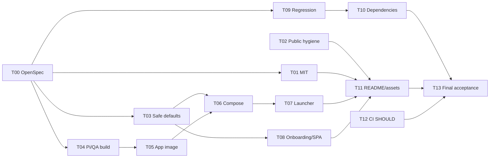

# RD-Bot 个人开源首发整改 Implementation Plan

> **For agentic workers:** REQUIRED SUB-SKILL: Use `superpowers:subagent-driven-development` (recommended) or `superpowers:executing-plans` to implement this plan task-by-task. Steps use checkbox (`- [ ]`) syntax for tracking.

**Goal:** 将 RD-Bot 整理为可按 MIT 许可证发布的个人维护、单机自托管实验项目，并提供从空环境构建、启动、配置、执行一条真实需求、重启保留数据到停止服务的完整 Docker 路径，以及图文并茂且不夸大能力的开源 README。

**Architecture:** 保留现有 Java/Spring/PostgreSQL/Pi/React 架构。前端在镜像构建阶段编译后由 Spring Boot 静态托管；PostgreSQL/pgvector、Redis、MinIO、迁移任务、RD-Bot 后端和 Pi/QA 镜像由 Docker Compose 统一管理。后端通过宿主 Docker socket 启动隔离的 Agent 容器；共享工作区使用“宿主与后端容器相同绝对路径”的 bind mount，credential relay 通过 Compose egress network 回连后端。网络名在默认项目中稳定，在隔离验收栈中可由 env 覆盖。默认只发布宿主 loopback 端口，飞书 HTTP 接入及其他未验证集成默认关闭。

**Tech Stack:** Java 21、Spring Boot、Maven Wrapper、Node.js 22、React、TypeScript、Vite、PostgreSQL 16 + pgvector、Redis 7、MinIO、Docker Engine、Docker Compose v2、Pi bridge、Playwright QA。

**Spec:** 审查来源为 `docs/qa/open-source-readiness-2026-09-08.md`；当前行为基线为 `RULE.md`、`openspec/specs/requirement/delivery-platform/spec.md` 及实现时涉及能力对应的冻结 spec。行为变更先创建新的 OpenSpec delta，不直接修改 `openspec/specs/`。

## Global Constraints

- 目标级别是 **Experimental / Developer Preview**。不承诺公网、多用户、企业认证、高可用、恰好一次执行、全平台或生产 SLA。
- 首发唯一承诺路径是 **单机 Docker + PostgreSQL store + Pi runtime**。memory store、CLAUDE_CODE/MODEL_ONLY、未验证的飞书 HTTP webhook 和 OpenViking 不属于首发支持面。
- 不删除、改名或清空 `RULE.md`。任何行为修改前先读 `RULE.md`、相关 OpenSpec 主 spec、对应冻结 spec 和 `docs/openspec/historical-spec-provenance-audit.md`。
- 不把 mock、静态检查、跳过的测试、旧报告或“容器已启动”写成真实需求交付成功。所有完成结论必须对应当前提交上的命令、退出码和可回读结果。
- 不覆盖用户本地配置，不修改全局 Git 配置，不关闭无关进程，不连接维护者服务器。普通 `down` 不删除卷；清空数据必须是单独命令并要求显式 `--yes`。
- 任何真实 token 只进入 gitignored、权限为 `0600` 的运行时 env 文件或现有加密凭据存储。日志、README、截图、录屏、测试 fixture 和 Git 历史中不得出现真实值。
- Docker socket 只挂载给 RD-Bot 后端。Pi/QA Agent 容器不得获得 Docker socket、宿主密钥目录或上游模型/Git 凭据。
- 修改 Pi bridge、结果工具或 QA 资源后，执行 `npm test`、相关 `DockerPiAgentExecutorTest`、Bootstrap 配置测试，并重建 Pi 与 QA 两个镜像。
- 不重写原审查报告中的数字。后续结果写入新的验收报告，并注明基线 SHA 与验收 SHA。

---

## 1. 发布范围、门槛与现有证据

### 1.1 首发支持范围

首发 README 和 release note 只能承诺下列组合：

| 维度 | 首发承诺 |
| --- | --- |
| 维护形态 | 个人维护、实验性质、无 SLA |
| 部署 | 一台安装 Docker Engine/Desktop 与 Compose v2 的机器 |
| 网络 | 管理台默认仅 `127.0.0.1` 可访问 |
| 数据 | PostgreSQL/pgvector、Redis、MinIO 使用持久卷 |
| Agent | Pi 编码执行器和 Pi QA 执行器 |
| Git | 维护者明确授权的 GitHub 仓库；真实 PR 验收只在测试仓库执行 |
| 模型 | 用户自带 OpenAI/Anthropic compatible provider；项目不内置模型服务 |
| RAG | PostgreSQL 本地路径；OpenViking 默认关闭 |
| 消息集成 | 飞书 IM 与 HTTP webhook 默认关闭，不列为首发可用功能 |
| 故障恢复 | 普通重启与数据保留；异常中断可能需要人工恢复 |

### 1.2 审查基线证据

以下是 2026-09-08 审查在提交 `687af408568462dce78c08d91063780da20ec75f` 上得到的事实，只作为整改输入：

| 编号 | 基线事实 | 对应任务 |
| --- | --- | --- |
| B01 | Maven 全模块共 2,743 项：2,656 通过、11 失败、8 错误、68 跳过 | T09 |
| B02 | frontend contract tests 261/261、typecheck、production build 通过 | T08、T11、T13 |
| B03 | Pi bridge tests 111/111 通过 | T04、T13 |
| B04 | npm audit：frontend 3 high + 5 moderate；Pi 2 high + 1 moderate | T10 |
| B05 | Maven classpath 19 个依赖匹配 81 个公告；尚未完成可利用性分流 | T10 |
| B06 | 6,612 个历史 blob 的模式扫描未确认真实密钥，但不是专用扫描器认证 | T02、T13 |
| B07 | 根 `docker-compose.yml` 只有 PostgreSQL、Redis、MinIO 和 bucket init | T05、T06 |
| B08 | `Dockerfile.qa` 默认依赖已有 `rd-bot/pi-agent-qa:local`，空机器首次构建失败 | T04 |
| B09 | `scripts/bootstrap-db.sh` 要求宿主 `psql`，README 未声明 | T06 |
| B10 | 管理面无鉴权且应用未强制 loopback；cloud 脚本存在固定 mutation token 默认值 | T03 |
| B11 | 飞书 webhook 无来源校验而默认启用 | T03 |
| B12 | `/admin/model-providers` 与 project memories 页面缺 Spring SPA refresh fallback | T08 |
| B13 | README 仍展示 Apache-2.0，缺少可复现的整套 Docker 快速开始与产品素材 | T01、T11 |

原始日志位于本机临时目录 `/private/tmp/rd-bot-open-source-audit/`。不得把该目录整体提交；实施者应在当前提交重新运行验证，筛选后的证据写入 T13 指定的位置。

### 1.3 发布门的优先级

| 级别 | 规则 |
| --- | --- |
| MUST | T00–T09、T11、T13 全部满足；T10 的可触发 critical/high 问题完成修复或有可验证的不可触达说明 |
| SHOULD | 最小 CI、Dependabot、SBOM、更多 OS/arch 验证；允许在首发后补，但 README 不得展示不存在的 badge |
| DEFERRED | RBAC、多用户、公网、webhook 签名实现、高可用、任意崩溃窗口恢复、全依赖零告警、多架构公共镜像 |

只要一个 MUST 验收项失败，结论就是“尚不可发布”。禁止用免责声明替代 MUST 项。

---

## 2. 目标文件布局

实施完成后，开源入口应至少包含以下文件：

```text
RD-Bot/
├── LICENSE
├── README.md
├── README.zh-CN.md
├── CONTRIBUTING.md
├── SECURITY.md
├── THIRD_PARTY_NOTICES.md
├── Dockerfile
├── .dockerignore
├── docker-compose.yml
├── assets/readme/
│   ├── logo.svg
│   ├── hero-dashboard.webp
│   ├── requirement-flow.webp
│   ├── task-workbench.webp
│   ├── task-mobile.webp
│   ├── quickstart.gif
│   └── ASSET_PROVENANCE.md
├── deploy/docker/
│   ├── runtime.env.example
│   ├── application-docker.yaml
│   ├── migrate.sh
│   └── README.md
├── scripts/
│   ├── rd-bot.sh
│   └── docker/
│       ├── doctor.sh
│       └── acceptance.sh
├── .github/workflows/ci.yml             # SHOULD；创建后才展示 CI badge
└── docs/superpowers/qa/
    └── 2026-09-08-personal-open-source-release-acceptance.md
```

`deploy/docker/runtime.env` 是本机生成文件，必须继续被 `.gitignore` 的 `*.env` 规则排除。`runtime.env.example` 只放空值、解释和安全的非秘密默认值。

---

## 3. 实施任务

### T00：建立 OpenSpec 变更和可追踪执行基线

**目的：** 先冻结支持范围和行为合同，避免 Docker、默认配置、迁移与文档由不同 Agent 各自解释。

**Files:**

- Read: `RULE.md`
- Read: `docs/openspec/historical-spec-provenance-audit.md`
- Read: `openspec/specs/requirement/delivery-platform/spec.md`
- Read: 与 Docker executor、provider credential、QA evidence 相关的主 spec 与冻结 spec
- Create: `openspec/changes/prepare-personal-open-source-release/proposal.md`
- Create: `openspec/changes/prepare-personal-open-source-release/design.md`
- Create: `openspec/changes/prepare-personal-open-source-release/tasks.md`
- Create: `openspec/changes/prepare-personal-open-source-release/specs/docker-self-hosting/spec.md`
- Create: `openspec/changes/prepare-personal-open-source-release/specs/local-experimental-security/spec.md`

**Steps:**

- [ ] 记录实施开始时的 `git rev-parse HEAD`、`git status --short`、Docker/Compose/OS/arch 版本；不得覆盖现有 dirty 文件。
- [ ] 在 proposal 中写清个人实验项目范围、非目标、来源审查路径和本计划路径。
- [ ] 在 design 中固定四个关键决定：前端随 Spring Boot 镜像发布；宿主 loopback 端口；Docker socket + same-path workspace bind；固定 egress network + credential relay 回连。
- [ ] 在 docker spec 中写至少六个场景：空环境首次启动、缺配置启动、真实 Agent 容器、普通重启保留数据、迁移只执行一次、普通停止不删卷。
- [ ] 在 security spec 中写至少四个场景：默认 loopback、飞书关闭、无固定 mutation token、Agent 无 Docker socket/上游密钥。
- [ ] 在 tasks.md 中复制本计划 T01–T13 的 checkbox 和验收 ID，不压缩为“完善 Docker/README”等泛化任务。

**Verification:**

```bash
OPENSPEC_NO_UPDATE_CHECK=1 openspec validate prepare-personal-open-source-release --strict
OPENSPEC_NO_UPDATE_CHECK=1 openspec validate --all --strict
```

**Acceptance:**

- [ ] A00-1：两条 validate 命令退出码均为 0。
- [ ] A00-2：每个行为要求都有 `WHEN/THEN` 场景；计划/历史材料没有被写成已实现事实。
- [ ] A00-3：记录当前代码锚点、历史来源和实际命令，满足仓库 OpenSpec 维护要求。

**Evidence:** 保存 OpenSpec 输出、基线 SHA、dirty 清单及使用过的 spec 路径到最终验收报告“E00”。

---

### T01：将项目许可证完整切换为 MIT

**目的：** 让根许可证、构建元数据、包元数据、README 和第三方说明一致，避免“文件是 MIT、badge 或 POM 仍是 Apache”的半切换。

**Files:**

- Modify: `LICENSE`
- Modify: `README.md`
- Modify: `README.zh-CN.md`
- Modify: `pom.xml`
- Modify: `frontend/package.json`
- Modify: `bootstrap/src/main/resources/executor/pi/package.json`
- Create: `THIRD_PARTY_NOTICES.md`
- Inspect: `NOTICE*`, source headers, copied assets, vendored files, Docker base images

**Steps:**

- [ ] 先读取当前 `LICENSE`。若另一个 Agent 已改为 MIT，保留已确认的 copyright holder，只补齐其余元数据；若仍是 Apache-2.0，使用 OSI 标准 MIT 全文，默认署名 `Copyright (c) 2026 wanghehe123`。
- [ ] 在根 POM 增加 `<licenses>`，name 为 `MIT License`、URL 为 `https://opensource.org/licenses/MIT`、distribution 为 `repo`。
- [ ] 为两个 npm package 增加 `"license": "MIT"`；保留 `"private": true`，避免误发布内部包。
- [ ] README 顶部 badge、License 小节和链接统一为 MIT；中英文内容一致。
- [ ] 新建 `THIRD_PARTY_NOTICES.md`，说明项目 MIT 不会改写依赖、容器基础镜像、字体、图标和截图中第三方素材的原许可证；列出实际纳入仓库的非代码素材来源。
- [ ] 搜索所有 `Apache-2.0`、`Apache License`、旧 badge 和旧 license URL。逐项判断是项目声明还是第三方历史引用；只更新项目声明，不删除第三方许可文本。
- [ ] 不从热门项目复制 logo、截图、README 大段文案或装饰素材。只参考信息结构。

**Verification:**

```bash
rg -n "Apache-2\.0|Apache License|apache\.org/licenses" --glob '!target/**' --glob '!node_modules/**'
rg -n '"license"\s*:\s*"MIT"' frontend/package.json bootstrap/src/main/resources/executor/pi/package.json
./mvnw -q -DskipTests help:effective-pom -Doutput=/tmp/rd-bot-effective-pom.xml
rg -n "MIT License|opensource.org/licenses/MIT" /tmp/rd-bot-effective-pom.xml LICENSE README.md README.zh-CN.md
```

**Acceptance:**

- [ ] A01-1：根 `LICENSE` 是完整、未改写语义的 MIT 标准文本。
- [ ] A01-2：README、POM、npm metadata 全部标为 MIT，无项目级 Apache-2.0 残留。
- [ ] A01-3：第三方 notice 保留实际第三方边界；未把依赖错误地宣称为项目自有 MIT 代码。

**Evidence:** 保存 license 文件 SHA-256、effective POM 中 license 片段、残留搜索结果到“E01”。

---

### T02：清理公共发布内容、个人痕迹与敏感材料

**目的：** 保证将当前分支推到公共仓库时不会附带真实凭据、私有任务材料、个人服务器入口或不可授权素材。

**Files:**

- Modify: `.gitignore`
- Inspect/Sanitize: `.env.example`, `application-local.yaml.example`, `.playwright-cli/**`, `deploy/cloud-server/**`, `docs/**`, `qa-runs/**`
- Modify: `SECURITY.md`
- Create/Modify: `CONTRIBUTING.md`

**Steps:**

- [ ] 用 `git ls-files` 建立实际发布清单；不要只扫描工作区，因为已跟踪文件不受新 `.gitignore` 保护。
- [ ] 对当前 HEAD 与所有本地 refs 可达历史运行专用 secret scanner；至少覆盖私钥、GitHub token、云密钥、provider key、带凭据 URL。记录工具版本和规则集。
- [ ] 对图片、GIF、视频和 PDF 做人工检查/OCR；检查姓名、邮箱、内网 IP、绝对路径、任务 ID、仓库 token、聊天内容和浏览器账号信息。
- [ ] 清点 `.playwright-cli/*.yml`、个人简历和历史验收材料。真实私有内容从当前发布分支删除；可公开的测试 fixture 改成明显的 `example-*` 假值。
- [ ] 从推荐入口移除 `deploy/cloud-server/start-backend.sh` 和 `start-cpa-tunnel.sh`。若保留作历史示例，放入明确的 unsupported 区域，去掉个人 IP、固定 token、`StrictHostKeyChecking=no` 和全局 Git 修改。
- [ ] `.gitignore` 增加并验证：运行时 env、工作区、缓存、临时验收日志、生成截图源文件、Docker 本地数据目录；显式保留 `*.example` 和 `assets/readme/**`。
- [ ] `SECURITY.md` 明确支持边界、私密报告方式、无鉴权控制面只能 loopback 使用、Docker socket 风险、飞书未支持。
- [ ] `CONTRIBUTING.md` 给出最小开发环境、分支/测试要求、OpenSpec 入口和安全问题报告方式；不要把内部 Agent 流程写成外部贡献者必须拥有的服务。

**Verification:**

```bash
git ls-files -z | xargs -0 rg -n "(BEGIN (RSA|OPENSSH|EC) PRIVATE KEY|gh[pousr]_[A-Za-z0-9_]{20,}|AKIA[0-9A-Z]{16})" || true
git grep -nE "StrictHostKeyChecking=no|url\..*\.insteadOf|RD_AGENT_RUNTIME_MUTATION_TOKEN=.*[^}]$" -- deploy README.md README.zh-CN.md || true
git check-ignore -v deploy/docker/runtime.env .rd-bot-data/workspaces/example-file
git check-ignore -v deploy/docker/runtime.env.example assets/readme/logo.svg || true
```

**Acceptance:**

- [ ] A02-1：当前树和历史专用扫描均无已确认真实凭据；疑似项逐条有位置、判断和理由。
- [ ] A02-2：公开图片/录屏无敏感数据且有来源记录。
- [ ] A02-3：推荐部署入口不会改全局 Git、跳过 SSH host 验证、连接个人服务器或停止无关进程。
- [ ] A02-4：本地运行文件被忽略，模板和 README 素材可被 Git 跟踪。

**Evidence:** 在“E02”记录 scanner 名称/版本/命令/退出码、疑似项数量与处置；只存指纹和路径，不复制密钥原文。

---

### T03：收紧个人版默认安全边界

**目的：** 在暂不引入登录/RBAC 的前提下，让默认安装只在本机可访问，并使未经验证的外部入口默认关闭。

**Files:**

- Modify: `bootstrap/src/main/resources/application.yaml`
- Create: `deploy/docker/application-docker.yaml`
- Modify: `deploy/cloud-server/application-local.server.yaml`（若仍保留）
- Modify: `deploy/cloud-server/start-backend.sh`（若仍保留）
- Test: `bootstrap/src/test/java/com/wish/rd/bootstrap/ApplicationSecureDefaultsTest.java`
- Test: `bootstrap/src/test/java/com/wish/rd/bootstrap/AgentRuntimeMutationAccessPolicyTest.java`

**Steps:**

- [ ] 在默认配置增加 `server.address: ${SERVER_ADDRESS:127.0.0.1}`。
- [ ] Docker overlay 将容器内 `SERVER_ADDRESS` 设为 `0.0.0.0`，但 Compose 只映射 `127.0.0.1:${RD_BOT_PORT:-18080}:18080`。测试必须同时覆盖两层边界。
- [ ] 将 `FEISHU_IM_ENABLED`、`FEISHU_IM_LOCAL_LISTENER_ENABLED`、`FEISHU_IM_WRITE_BACK_ENABLED` 和 ticket write-back 的默认值改为 false/disabled。Docker 模板再次显式关闭，避免未来主配置漂移。
- [ ] 删除所有公开固定 mutation/upload token 默认值。首次启动可生成 `RD_AGENT_RUNTIME_MUTATION_TOKEN` 到 `runtime.env`；若为空，现有 policy 必须 fail closed。
- [ ] 保持 OpenViking、project-memory worker/reconcile/projection 等非核心功能默认关闭。
- [ ] 不新增“默认 admin/admin”登录作为替代。现有 user/password 模块不得在 README 宣传为安全认证。
- [ ] 在应用启动日志输出一次安全范围摘要：管理地址、飞书开关、Docker executor 状态、store；不得输出 token、PAT、provider key。

**Test first:**

```java
@Test
void defaultConfigurationIsLoopbackAndExternalIntakeIsOff() {
    // 读取 application.yaml，断言默认 SERVER_ADDRESS=127.0.0.1，
    // FEISHU_IM_ENABLED=false，local listener/write-back=false。
}

@Test
void emptyMutationTokenKeepsRuntimeMutationDenied() {
    // 保留现有 fail-closed 行为；不得因为 Docker quick start 而回退固定 token。
}
```

**Verification:**

```bash
./mvnw -pl bootstrap -am \
  -Dtest=ApplicationSecureDefaultsTest,AgentRuntimeMutationAccessPolicyTest \
  -Dsurefire.failIfNoSpecifiedTests=false test
rg -n "changeme|mutation-token:.*[^}]|upload-token:.*[^}]" bootstrap deploy --glob '!target/**' || true
```

**Acceptance:**

- [ ] A03-1：原生默认监听 `127.0.0.1`；Docker 容器内监听全部接口但宿主只发布 loopback。
- [ ] A03-2：无用户配置时飞书入口、listener 和 write-back 均不启动。
- [ ] A03-3：无 token 的运行时修改请求仍被拒绝；仓库不存在公共固定 token。
- [ ] A03-4：启动日志没有泄露凭据。

**Evidence:** 保存 focused tests、`docker compose config` 的端口/开关片段和容器实际 `ss`/宿主 `curl` 结果到“E03”。

---

### T04：修复 Pi/QA 镜像的首次构建链

**目的：** 新用户没有任何 `rd-bot/*:local` 镜像时仍能从源码构建 Pi 和 QA 镜像。

**Files:**

- Modify: `bootstrap/src/main/resources/executor/pi/Dockerfile.qa`
- Modify: `bootstrap/src/main/resources/executor/pi/Dockerfile`（只在构建兼容性需要时）
- Modify: `bootstrap/src/main/resources/executor/pi/README.md`
- Test: `bootstrap/src/test/java/com/wish/rd/bootstrap/DockerAssetPolicyTest.java`
- Test: `bootstrap/src/test/java/com/wish/rd/bootstrap/DockerExecutorConfigurationTest.java`

**Steps:**

- [ ] 先写 policy test：`Dockerfile.qa` 的默认 browser-cache stage 不得引用目标镜像自身或私有 registry。
- [ ] 删除默认 `BROWSER_CACHE_IMAGE=rd-bot/pi-agent-qa:local` 自引用。默认路径应从已构建的 Pi base 安装 Chromium；缓存只能是显式 build arg，且没有缓存时仍可构建。
- [ ] Pi 与 QA 镜像标签由 `runtime.env` 中同一个 `RD_BOT_IMAGE_TAG` 生成；Compose 先构建 Pi，再将其标签传给 QA 的 `PI_BASE_IMAGE`。
- [ ] 浏览器依赖与版本跟随当前 Pi lockfile/CLI 兼容版本。镜像构建执行一个 Playwright 启动检查，不能只检查目录存在。
- [ ] 保持 `/work/input`、`/work/output`、`/work/cache` 权限及非 root Agent 用户；不要把 Docker socket COPY 或 mount 进镜像。
- [ ] 更新 Pi README：正常首次构建、可选镜像缓存、网络失败提示和两镜像重建规则。

**Verification:**

```bash
cd bootstrap/src/main/resources/executor/pi
npm ci
npm test
docker build --pull -t rd-bot/pi-agent:oss-test -f Dockerfile .
docker build --pull --build-arg PI_BASE_IMAGE=rd-bot/pi-agent:oss-test \
  -t rd-bot/pi-agent-qa:oss-test -f Dockerfile.qa .
docker run --rm --entrypoint node rd-bot/pi-agent-qa:oss-test \
  -e "const { chromium } = require('playwright'); chromium.launch({headless:true}).then(b=>b.close())"
./mvnw -pl bootstrap,exec -am \
  -Dtest=DockerAssetPolicyTest,DockerExecutorConfigurationTest,DockerPiAgentExecutorTest \
  -Dsurefire.failIfNoSpecifiedTests=false test
```

若 QA 镜像不暴露 `playwright` Node module，则使用仓库实际 CLI 的等价 `--version` + headless launch 命令，并在证据中写明，不得以 `find /ms-playwright` 代替启动。

**Acceptance:**

- [ ] A04-1：全新标签、无旧 RD-Bot QA 镜像时两次 build 均成功。
- [ ] A04-2：QA 镜像内 Chromium 能实际 headless 启动并退出 0。
- [ ] A04-3：Pi 111 项测试及规定的 Java focused tests 通过。
- [ ] A04-4：Agent 镜像中无 Docker socket 和上游秘密。

**Evidence:** 保存镜像 ID/digest、构建命令/退出码、headless launch 输出、`docker image inspect` 用户与标签到“E04”。

---

### T05：创建可复现的 RD-Bot 应用镜像

**目的：** 宿主只需 Docker，不需 JDK、Maven、Node 或已编译前端，就能构建包含真实管理台和后端的应用镜像。

**Files:**

- Create: `Dockerfile`
- Create: `.dockerignore`
- Modify: `pom.xml` 或 `bootstrap/pom.xml`（仅为可重复打包所需）
- Test: `bootstrap/src/test/java/com/wish/rd/bootstrap/DockerApplicationImagePolicyTest.java`

**Concrete image design:**

1. `frontend-build`: 基于固定 Node 22 bookworm tag，执行 `npm ci`、contract tests、typecheck、`npm run build`。
2. `java-build`: 基于固定 Maven 3.9 + Temurin 21 tag；先复制 POM/wrapper 预取依赖，再复制源码；接收前端 stage 的 `bootstrap/src/main/resources/static/admin`；执行 `./mvnw -pl bootstrap -am -DskipTests package`。
3. `runtime`: 基于固定 Temurin 21 JRE/JDK Linux tag，安装/复制 `bash`、`curl`、`git`、`jq`、Python 3、Node 22/npm 和 Docker CLI。Host verifier 会在后端容器内执行目标仓库命令，README 必须把内置工具链限制为 Node/Java/Python baseline，其他语言由用户提供自定义 runtime profile。
4. 使用非 root 应用用户；Docker socket 访问通过 Compose `group_add` 注入宿主 socket GID。不得在镜像内启动 Docker daemon。
5. `ENTRYPOINT` 使用 `java -jar`；容器只运行一个前台进程并正确转发 SIGTERM。

**Steps:**

- [ ] 写静态 policy test，要求多 stage、Java 21、Node 22、非 root `USER`、无 `COPY .env`、无硬编码秘密。
- [ ] `.dockerignore` 排除 `.git`、所有 `target/`、`node_modules/`、worktree、`.rd-bot-data/`、`qa-runs/`、本地 env、IDE/cache；保留 Maven wrapper、源码、lockfile 和 README assets。
- [ ] 固定所有 base image tag；不使用 `latest`。如使用 digest，保留可读 tag + digest，并在升级任务中更新。
- [ ] 加 OCI labels：source、revision build arg、license=MIT、title、description。
- [ ] healthcheck 请求容器内 `http://127.0.0.1:18080/admin` 或经实测稳定的只读健康入口；不能调用有副作用 API。
- [ ] 构建日志不得包含 env 文件或凭据。BuildKit secret 只在确实需要私有依赖时使用；公共首发构建不应需要私有 registry。

**Verification:**

```bash
docker build --pull --no-cache \
  --build-arg VCS_REF="$(git rev-parse HEAD)" \
  -t rd-bot/app:oss-test .
docker image inspect rd-bot/app:oss-test
docker history --no-trunc rd-bot/app:oss-test
./mvnw -pl bootstrap -am \
  -Dtest=DockerApplicationImagePolicyTest \
  -Dsurefire.failIfNoSpecifiedTests=false test
```

**Acceptance:**

- [ ] A05-1：无宿主构建工具参与时，`docker build --no-cache` 成功。
- [ ] A05-2：镜像包含当前验收 SHA 的前端与后端；`/admin` 返回管理台而非旧 bundle。
- [ ] A05-3：最终容器默认用户不是 root；Docker daemon 未运行在容器内。
- [ ] A05-4：image history 和 OCI config 无秘密、个人路径与维护者私有地址。

**Evidence:** 保存 image inspect、history 机密扫描、jar/build SHA、静态资源 hash 到“E05”。

---

### T06：扩展 Compose，接通完整应用、迁移、持久化与 Agent 网络

**目的：** 用一个 Compose project 启动完整依赖，并让容器化后端能继续通过宿主 Docker daemon 创建 Pi/QA 容器。

**Files:**

- Modify: `docker-compose.yml`
- Create: `deploy/docker/runtime.env.example`
- Create: `deploy/docker/application-docker.yaml`
- Create: `deploy/docker/migrate.sh`
- Create: `deploy/docker/README.md`
- Test: `bootstrap/src/test/java/com/wish/rd/bootstrap/DockerComposeReleasePolicyTest.java`
- Test: `scripts/docker/tests/compose_contract_test.sh`

**Required services:**

| Service | Required behavior |
| --- | --- |
| `postgres` | 固定 pgvector/PG16 tag；内部 5432；持久卷；健康检查 |
| `redis` | 固定 Redis 7 tag；内部端口；持久卷；健康检查 |
| `minio` | 固定 MinIO release tag；数据卷；健康检查；不默认向宿主发布 console |
| `minio-init` | 等待 MinIO，幂等创建 bucket，失败非零 |
| `migrations` | 使用容器内 `psql`，按 numeric `pN_` 顺序应用 SQL，写入 checksum ledger |
| `pi-agent` | build-only profile，产出 Pi image，不作为常驻服务 |
| `pi-agent-qa` | build-only profile，依赖已构建 Pi image，不作为常驻服务 |
| `rd-bot` | 应用镜像；等待 database/migrations/bucket；loopback 发布 18080；挂 Docker socket 和 same-path workspace |

**Steps:**

- [ ] 删除 `container_name`，让不同 `COMPOSE_PROJECT_NAME` 的验收栈不会冲突。
- [ ] 基础设施默认只在 Compose 网络可达；如为调试保留宿主端口，放到显式 `debug-ports` profile 且仍绑定 loopback。
- [ ] 为 volumes 定义 PostgreSQL、Redis、MinIO、RD-Bot artifacts/logs/cache；workspace 使用由 launcher 解析的绝对 bind path。
- [ ] launcher 写入 `RD_BOT_WORKSPACE_ROOT=/absolute/repo/.rd-bot-data/workspaces`。Compose 将这个绝对路径 mount 到容器内相同绝对路径，并设置 `RD_EXECUTOR_DOCKER_WORKSPACE_ROOT` 为同一个值，使宿主 daemon 能把源路径挂进 Agent 容器。
- [ ] 将 `/var/run/docker.sock` 只读写挂给 `rd-bot`，并通过 `DOCKER_GID` 做 `group_add`。禁止 privileged，禁止把 socket 挂给其他 service。
- [ ] 定义稳定且可覆盖的 egress network：`runtime.env` 默认 `RD_BOT_EGRESS_NETWORK=rd-bot-egress`，Compose 使用 `name: ${RD_BOT_EGRESS_NETWORK}`。隔离验收栈必须写入带 run-id 的唯一网络名。`rd-bot` 在该网络上使用 alias `rd-bot`。
- [ ] Docker overlay 设置 `RD_EXECUTOR_PI_NETWORK_MODE=${RD_BOT_EGRESS_NETWORK}` 与 `RD_EXECUTOR_PI_CREDENTIAL_RELAY_URL=http://rd-bot:18080/internal/pi/credential-relay/proxy`。验证 `DockerPiAgentExecutor` 创建 task-local internal network，只有 hardened sidecar 再加入 egress network。
- [ ] Compose 只读挂载 `deploy/docker/application-docker.yaml`，并通过 `SPRING_CONFIG_ADDITIONAL_LOCATION=file:/config/application-docker.yaml` 显式加载；启动日志与 environment endpoint 的脱敏结果要证明 overlay 实际生效，不能仅证明文件存在。
- [ ] 数据源、Redis、MinIO URL 全部使用 Compose service DNS；不得沿用 `127.0.0.1`/`host.docker.internal` 作为容器间默认地址。
- [ ] `migrate.sh` 创建 `rd_schema_migrations(name primary key, sha256, applied_at)`；按 `pN_` 数字、文件名字典序排序。已记录且 checksum 相同则跳过；checksum 变化则失败并提示人工处理。
- [ ] 每个迁移文件与 ledger insert 在同一 transaction 中。首版至少防止普通重复启动再次执行 `p8_zz_default_qa_v2.sql`；不要求证明任意并发/崩溃窗口。
- [ ] `rd-bot` 使用 `depends_on` 的 health/success 条件；迁移或 bucket init 失败时应用不得静默启动。
- [ ] `runtime.env.example` 不放真实值。Postgres/MinIO/password/mutation token 由 launcher 首次生成；provider/GitHub 凭据留空并在 UI/日志显示“未配置”。

**Compose contract assertions:**

```text
1. host port = 127.0.0.1:${RD_BOT_PORT}:18080
2. only rd-bot mounts /var/run/docker.sock
3. no service is privileged
4. no infrastructure port is publicly published by default
5. rd-bot waits for successful migrations and minio-init
6. all persistent stores have explicit volumes
7. workspace source and target resolve to the same absolute path
8. Pi relay URL resolves through the run-specific egress network
```

**Verification:**

```bash
docker compose --env-file deploy/docker/runtime.env config --quiet
bash scripts/docker/tests/compose_contract_test.sh
./mvnw -pl bootstrap -am \
  -Dtest=DockerComposeReleasePolicyTest,DockerExecutorConfigurationTest \
  -Dsurefire.failIfNoSpecifiedTests=false test
```

**Acceptance:**

- [ ] A06-1：`docker compose config` 成功，且 contract 八项全部通过。
- [ ] A06-2：迁移从空库成功；第二次运行显示全部跳过，QA profile version 不再增加。
- [ ] A06-3：应用容器可以经 socket 创建、查看并清理一个项目作用域测试容器；测试容器能读写 same-path workspace。
- [ ] A06-4：Pi task container 无 egress，relay sidecar 能解析并访问 `rd-bot`；Agent 容器无 socket。

**Evidence:** 保存 resolved Compose 的脱敏副本、volume/network inspect、迁移 ledger 前后查询、workspace roundtrip 文件 hash 到“E06”。

---

### T07：提供单一、幂等、可诊断的 Docker 操作脚本

**目的：** README 只给用户一个入口，且启动、停止、重启、诊断和日志行为稳定可预期。

**Files:**

- Create: `scripts/rd-bot.sh`
- Create: `scripts/docker/doctor.sh`
- Create: `scripts/docker/acceptance.sh`
- Create: `scripts/docker/tests/launcher_test.sh`
- Modify: `.gitignore`

**Command contract:**

```text
./scripts/rd-bot.sh doctor          # 只读检查，不修改系统
./scripts/rd-bot.sh up              # 首次生成 env，按序构建镜像并启动
./scripts/rd-bot.sh status          # 服务、健康、镜像和管理地址
./scripts/rd-bot.sh logs [service]  # 跟随或打印日志，不含秘密
./scripts/rd-bot.sh restart         # 不删数据
./scripts/rd-bot.sh down            # 不删卷、不删工作区
./scripts/rd-bot.sh purge --yes     # 只删除本 Compose project 的卷与 .rd-bot-data
```

**Steps:**

- [ ] 脚本使用 `set -euo pipefail`，从脚本自身位置解析仓库根目录；从任意 cwd 调用行为一致。
- [ ] 仅要求 Docker + Compose v2。`doctor` 检查 daemon、Compose、socket、端口占用、可用磁盘、CPU/内存、目录可写性、当前架构；对最低资源只报告实测结论，不预先虚构数字。
- [ ] 首次创建 `deploy/docker/runtime.env`，权限 `0600`。随机秘密使用系统安全随机源；已存在文件不覆盖。
- [ ] 自动探测 Docker socket GID，写入 `DOCKER_GID`；无法访问时给出针对 Docker Desktop/Linux 的明确错误，不用 `sudo chmod 666`。
- [ ] 构建顺序固定：Pi → QA → app；任一步失败立即非零并打印失败服务和下一条诊断命令。
- [ ] `up` 使用稳定 Compose project name `rd-bot`，等待 health；成功才打印 `http://127.0.0.1:${RD_BOT_PORT}/admin`。
- [ ] `up` 在 provider/GitHub 凭据缺失时仍可启动管理台，但打印“运行 Agent 前还需配置”，不能创建 mock 成功任务。
- [ ] `down` 只 `docker compose down`。`purge` 必须同时要求子命令和 `--yes`，再次输出将删除的 project/目录；不得使用宽泛 `docker system prune`。
- [ ] 对脚本做 shell 语法和行为测试。行为测试用临时 env/假的 `docker` 可执行文件验证参数、构建顺序、不会 `down -v`、不会改 global Git。

**Verification:**

```bash
bash -n scripts/rd-bot.sh scripts/docker/*.sh scripts/docker/tests/*.sh
bash scripts/docker/tests/launcher_test.sh
./scripts/rd-bot.sh doctor
./scripts/rd-bot.sh up
./scripts/rd-bot.sh status
./scripts/rd-bot.sh restart
./scripts/rd-bot.sh status
./scripts/rd-bot.sh down
```

**Acceptance:**

- [ ] A07-1：新 clone 中只安装 Docker 的用户能按单一命令启动，不需要 psql/JDK/Maven/Node。
- [ ] A07-2：重复 `up` 和 `restart` 不重置 secret、不删卷、不重复有副作用迁移。
- [ ] A07-3：缺 Docker、端口冲突、socket 无权限、镜像构建失败、迁移失败都返回非零并给可执行诊断。
- [ ] A07-4：`down` 保留数据；只有 `purge --yes` 清理本项目数据。

**Evidence:** 保存首次/重复启动时长、exit code、生成文件权限、失败场景输出和数据 ID 前后对比到“E07”。

---

### T08：补齐生产管理台首次配置与 SPA 刷新路径

**目的：** Docker 启动后的核心页面可直达、可刷新；无 provider/Git 配置时用户知道下一步，而不是看到空白或隐式失败。

**Files:**

- Modify: `bootstrap/src/main/java/com/wish/rd/bootstrap/admin/AdminFrontendController.java`
- Modify: `frontend/src/App.tsx`（仅在路由或 onboarding 文案需要时）
- Modify: provider/repository settings 页及其 service（按当前实际文件）
- Test: `bootstrap/src/test/java/com/wish/rd/bootstrap/AdminFrontendControllerTest.java`
- Test: `frontend/test/viteProxy.test.ts`
- Add: 对应 onboarding/empty-state contract test

**Steps:**

- [ ] 先新增失败测试：`/admin/model-providers` 和 `/admin/projects/{id}/memories` 直接 GET 应返回 SPA index。
- [ ] 在 Spring controller 增加准确 fallback；API、静态 asset 和 evidence content 路由不得被兜底吞掉。
- [ ] Docker 首次启动首页展示 checklist：配置模型供应商 → 创建/选择项目 → 配置授权仓库 → 提交需求。每一步链接到真实页面。
- [ ] provider key 只提交到现有安全凭据接口，不写 localStorage、URL、console 或截图。
- [ ] 未配置 provider、模型、Git 凭据或 allowlist 时，创建任务前给明确错误和修复链接；不得自动切 mock provider 或把失败显示为完成。
- [ ] project memory 页面若不在首发支持范围，保留页面但标 Experimental/unsupported；直刷不能 404。

**Verification:**

```bash
./mvnw -pl bootstrap -am \
  -Dtest=AdminFrontendControllerTest \
  -Dsurefire.failIfNoSpecifiedTests=false test
cd frontend
node --experimental-strip-types --test test/*.test.ts
npm run typecheck
npm run build
```

**Acceptance:**

- [ ] A08-1：`/admin`、model providers、project detail、task detail、project memories 直接访问和刷新均返回正确页面。
- [ ] A08-2：API 404 仍是 API 404，不被 SPA HTML 替代。
- [ ] A08-3：无凭据时 UI 明确处于未配置状态，无 mock 成功。
- [ ] A08-4：凭据不进入浏览器持久存储、URL、console 或 network response body。

**Evidence:** 保存 focused tests、五个路由的 HTTP status/content-type、无配置页面截图和浏览器 console/network 脱敏摘要到“E08”。

---

### T09：修复/分流当前回归，建立首发核心测试集

**目的：** 消除审查中 11 failure + 8 error；若某项确属首发不支持模块，必须用窄豁免和已知限制说明，而不是 `maven.test.failure.ignore=true`。

**Known failure groups:**

| 组 | 已知证据 | 处理方向 |
| --- | --- | --- |
| W1 | 7 个 Bootstrap context error 共同缺 `ProjectMemoryMutationAuthorizer` | postgres 与 memory wiring 分开；unsupported memory 必须 fail closed，context 可启动 |
| W2 | `CleanHostVerifierWorkspaceFactoryTest` 把 CommonJS `require()` 写入 `.mjs` | fixture 改 `.cjs` 或改 ESM import，保留真实 Node 行为 |
| W3 | SQL policy tests 对 alias/字符串做旧断言 | 改为当前 SQL 语义或准确 alias，不能删除约束 |
| W4 | retry command ID 顺序漂移 | 捕获实际 command ID/assert 关联，不依赖全局序号 |
| W5 | HOST_VERIFY 专用恢复路线与旧预期冲突 | 按当前 spec 验证专用路线，保留状态/证据身份 |
| W6 | dispatch test double 未把 source command 收敛为 succeeded | 修 fixture 状态；另加生产 guard 断言 |
| W7 | implementation/model package isolation 列出多项现存类 | 真正的包边界违规移动；有意保留项用逐类、带理由 allowlist，禁止 wildcard |
| W8 | in-memory transaction wiring 旧期望 | 依据首发“不支持 memory”定义 fail-closed contract，不伪造 postgres 能力 |

**Files:** 以当前 Surefire 报告为准；至少包括：

- `bootstrap/src/test/java/com/wish/rd/bootstrap/RequirementStageCommandPersistencePolicyTest.java`
- `bootstrap/src/test/java/com/wish/rd/bootstrap/MultiAgentOrchestrationSqlPolicyTest.java`
- `bootstrap/src/test/java/com/wish/rd/bootstrap/ImplementationPackageIsolationPolicyTest.java`
- `bootstrap/src/test/java/com/wish/rd/bootstrap/ModelPackageIsolationPolicyTest.java`
- `bootstrap/src/test/java/com/wish/rd/bootstrap/AdminFrontendControllerTest.java`
- `bootstrap/src/test/java/com/wish/rd/bootstrap/CleanHostVerifierWorkspaceFactoryTest.java`
- `engine/src/main/java/com/wish/rd/engine/admin/projectmemory/**`
- 对应 dispatch/retry/HOST_VERIFY/in-memory tests 和必要生产文件

**Steps:**

- [ ] 在当前 HEAD 先重跑 `./mvnw -fae test`，生成新的失败清单；若与审查不同，以新日志为准并解释差异。
- [ ] W1 先写 memory/postgres 两个 wiring tests。未配置可信 operator 时 authorizer 必须 deny；不能为让 context 起来而 permit-all。
- [ ] W2 修测试 fixture 扩展名/模块语法，并断言 verifier 确实启动服务、执行检查、回收进程。
- [ ] W3–W6 先证明生产行为符合当前 spec，再更新旧断言；如果生产行为不符合，则修生产代码和回归测试。
- [ ] W7 逐类判断。allowlist 每项写“为何不是 public domain model/为何必须处于该 package”，并设专门测试禁止新增未审查违规。
- [ ] W8 将 memory 路径标为 unsupported/fail-closed，同时保证 Docker/PostgreSQL context 启动测试通过。
- [ ] 定义 `scripts/test-open-source-core.sh`，只包含首发支持路径的 focused suite；它是快速门，不替代最终全量 Maven。
- [ ] 最终正常执行 `./mvnw test`；禁止 `-Dmaven.test.failure.ignore=true` 作为通过证据。

**Core suite minimum:**

```text
Docker application/compose/config policy
PostgreSQL store wiring and migrations
RequirementDeliveryEngine / dispatch / retry / audit / finalization
DockerPiAgentExecutor / credential relay / workspace / HOST_VERIFY
GitHub code platform adapter and publication
Admin controllers and provider credential flow
QA evidence validation
```

**Verification:**

```bash
env -u SPRING_CONFIG_ADDITIONAL_LOCATION ./scripts/test-open-source-core.sh
env -u SPRING_CONFIG_ADDITIONAL_LOCATION ./mvnw -fae test
```

**Acceptance:**

- [ ] A09-1：core suite 退出 0，且没有 ignore-failure 参数。
- [ ] A09-2：全量 Maven 0 failure/0 error；环境依赖 real-smoke 可保持显式 skipped。
- [ ] A09-3：memory path 不被 README 宣传；其 fail-closed wiring 有测试。
- [ ] A09-4：测试修改没有通过删除断言、无界 wildcard allowlist 或 mock 生产成功来“变绿”。

**Evidence:** 保存 before/after Surefire 汇总、19 个原失败的处置表、core/full 命令与退出码到“E09”。

---

### T10：升级依赖并按可触达性分流漏洞

**目的：** 优先消除首发容器和实际请求链上的高风险依赖，同时保留诚实、可复核的剩余风险记录。

**Files:**

- Modify: `pom.xml` 和必要 module POM
- Modify: `frontend/package.json`, `frontend/package-lock.json`
- Modify: `bootstrap/src/main/resources/executor/pi/package.json`, `package-lock.json`
- Modify: `docker-compose.yml`, `Dockerfile`, Pi Dockerfiles 的 base image tags
- Create: `docs/superpowers/qa/2026-09-08-open-source-dependency-triage.md`
- Optional SHOULD: `.github/dependabot.yml`

**Steps:**

- [ ] 重新生成 Maven、frontend npm、Pi npm 和 image scanner 报告；记录扫描时间、数据库版本和 direct/transitive/test/runtime scope。
- [ ] 先升级同一兼容线的补丁版本：Spring Boot/Spring/Tomcat/Netty/pgjdbc、PostCSS/Browserslist/nanoid、brace-expansion/undici 等。每批升级后跑对应 focused tests。
- [ ] React Router、Pi package 或其他跨 major/0.x minor 升级单独处理，先列 API breaking changes，再改代码与浏览器/bridge tests。
- [ ] 对每个 remaining critical/high 建表：advisory、resolved version、路径、runtime 是否打包、攻击前置、RD-Bot 是否到达、修复版本、决定、证据。
- [ ] 运行时可达且影响宿主代码执行、路径穿越、请求走私、凭据或数据泄露的 critical/high 未修复时阻断首发。
- [ ] 仅测试依赖、未启用模块或不可达代码可以延期，但必须有依赖路径和配置/代码锚点，不能只写“误报”。
- [ ] 固定 Compose/base image tag；禁止 `latest`。扫描 app、Pi、QA、postgres、redis、minio 镜像。
- [ ] 生成 CycloneDX 或 SPDX SBOM 是 SHOULD；若生成则随 release artifact 发布，不把包含本地路径/私有 registry 的原始文件直接提交。

**Verification:**

```bash
cd frontend && npm audit --package-lock-only --json
cd bootstrap/src/main/resources/executor/pi && npm audit --package-lock-only --json
./mvnw -fae test
# 使用实施环境可用的 Trivy/Grype/OSV-Scanner 扫描三个自建镜像及 lockfiles。
```

**Acceptance:**

- [ ] A10-1：首发 runtime 可触达的 critical/high 为 0，或发布被阻断。
- [ ] A10-2：剩余项逐条有适用性判断、缓解和复查条件；不写“零漏洞”泛化结论。
- [ ] A10-3：依赖升级后 core/full tests、frontend、Pi 和 Docker smoke 仍通过。
- [ ] A10-4：所有发布镜像有固定 tag，扫描报告能对应 image digest。

**Evidence:** dependency triage 文档本身作为“E10”；原始 JSON 放 gitignored `qa-runs/`，验收报告记录 SHA-256。

---

### T11：重写 README，并制作可公开的图文素材

**目的：** 让陌生开发者在两分钟内理解 RD-Bot，在只安装 Docker 的前提下完成启动，并能分辨当前能力、实验能力和计划。

**Files:**

- Rewrite: `README.md`（英文主入口）
- Create/Rewrite: `README.zh-CN.md`（中文完整版本）
- Create: `assets/readme/logo.svg`
- Create: `assets/readme/hero-dashboard.webp`
- Create: `assets/readme/requirement-flow.webp`
- Create: `assets/readme/task-workbench.webp`
- Create: `assets/readme/task-mobile.webp`
- Create: `assets/readme/quickstart.gif`
- Create: `assets/readme/ASSET_PROVENANCE.md`
- Link: `deploy/docker/README.md`, `CONTRIBUTING.md`, `SECURITY.md`, `LICENSE`

**Reference projects and what to borrow:**

| Official project | Borrow only this information pattern |
| --- | --- |
| [n8n](https://github.com/n8n-io/n8n) | 一句话定位 → Key Capabilities → Docker Quick Start → Resources/Support |
| [Open WebUI](https://github.com/open-webui/open-webui) | 顶部 banner/demo、醒目的 self-hosted 入口、Docker launcher 和 troubleshooting 导航 |
| [Dify](https://github.com/langgenius/dify) | 语言切换、产品截图、能力分组、self-host 文档入口 |
| [Immich](https://github.com/immich-app/immich) | 对实验/快速迭代风险给清晰警示，并把长运维文档移到专门页面 |

这些仓库只用于结构基准。不要复制其文案、品牌、图像、badge 组合或许可证说明。

**README.md required order:**

1. 居中的 logo、`RD-Bot`、一句话：把需求拆为可审计的 Manager/Execute/Audit 交付链。
2. 语言切换、MIT、Java 21、React、Docker、build 状态 badge。只有真实 CI 存在并通过时才加 build badge。
3. `Experimental` 提示：个人本机自托管；无鉴权；不要暴露公网。
4. 16:9 hero screenshot 和 10–20 秒 quickstart GIF。
5. “Why RD-Bot”：输入、四角色/MEA、证据、Host Verify、PR/交付输出。
6. “How it works”：一张图展示 Requirement → Manager → Coding MEA → QA/Host Verify → Delivery；PostgreSQL 是状态真相，Agent 容器是执行面。
7. “Quick Start”：先列 requirements，再给 **唯一主命令** `./scripts/rd-bot.sh up`、地址、首次配置三步和停止命令。
8. “First real task”：配置 provider、授权测试仓库、创建项目、提交小需求、查看四角色产物、打开最终 PR/结果。
9. “Screenshots”：工作台桌面、需求链、移动视图；每张有 alt text 和一句真实说明。
10. “Current capabilities”：表格分 Current / Experimental / Planned。不可把旧 repair queue、memory、OpenViking 或未验收恢复能力列为 Current。
11. “Configuration”：只展示变量名和假值；链接 Docker 配置说明。
12. “Operations”：doctor/status/logs/restart/down/purge，明确 down 保留数据。
13. “Security model”：loopback、无登录、Docker socket、Agent credential relay、飞书关闭。
14. “Troubleshooting”：Docker socket、端口、镜像下载、迁移失败、provider 未配置、资源不足。
15. “Development / Testing”：原生依赖、核心命令、OpenSpec、贡献链接。
16. “Roadmap / Known limitations”：个人维护、支持矩阵、异常恢复限制、memory/公网/RBAC 未支持。
17. “License / Acknowledgements”。

**Asset production rules:**

- [ ] 使用当前验收 SHA 和专用 demo 数据集启动本地 Docker 栈后重新截图。禁止复用未检查的个人生产截图。
- [ ] 页面中只出现 `example-org/hello-rd-bot`、假 provider 名和新建演示 task；遮盖 token、邮箱、绝对路径、IP、真实仓库/任务 ID。
- [ ] `hero-dashboard.webp` 目标 1600×900；桌面图 1440×900；移动图 390×844；保证文本在 GitHub 页面缩放后仍可读。
- [ ] `quickstart.gif` 只展示 terminal up → 管理台首页 → 一个已完成的演示结果；20 秒以内、循环自然、建议小于 8 MiB。
- [ ] 每张图片做视觉复核和 OCR；`ASSET_PROVENANCE.md` 记录生成方式、源页面、拍摄 SHA、是否含第三方素材及许可证。
- [ ] Mermaid 架构图须在 GitHub 渲染正常；如果导出 SVG，检查无外部字体/脚本/追踪链接。
- [ ] 优化图片后再提交；不要提交录制原视频、浏览器 profile、HAR 或未经脱敏的截图源。

**README copy constraints:**

- 所有命令必须从新 clone 实际复制执行；禁止 `<your-token>` 出现在可误复制命令中，敏感配置只放 env 文件说明。
- 每项能力标 Current/Experimental/Planned；每个数字型成绩必须链接当前证据，否则删除。
- 快速开始前十屏内不要堆内部类名、历史阶段编号、未完成计划或面试材料。
- 保留足够架构说明，但把长开发细节移到 `CONTRIBUTING.md`/Docker 文档。
- 英文与中文的命令、支持范围、安全警告和许可证必须一致；截图可以共用。

**Verification:**

```bash
# 所有 README shell block 由脚本抽取到临时目录后做 bash -n/实际 dry run。
rg -n "Apache|production-ready|enterprise-ready|zero vulnerabilities|100%" README.md README.zh-CN.md
git diff --check -- README.md README.zh-CN.md assets/readme
# 使用 Markdown renderer 或 GitHub preview 检查图片、锚点、Mermaid 和相对链接。
```

**Acceptance:**

- [ ] A11-1：陌生用户只读 README 可在无宿主开发工具的机器完成 Docker 首次启动。
- [ ] A11-2：中英文命令和边界一致，所有内部链接/图片/锚点有效。
- [ ] A11-3：至少 4 张静态图 + 1 个短 GIF，全部通过敏感信息/OCR/来源检查。
- [ ] A11-4：Current 能力均有当前实现或验收证据；Experimental/Planned 没有混入已完成区。
- [ ] A11-5：README 首屏明确 MIT、Experimental、local-only 和 Docker quick start。

**Evidence:** 保存链接检查、代码块执行、图片尺寸/大小/hash、OCR 结果、两种视口渲染截图到“E11”。

---

### T12：增加最小公共 CI 与仓库健康检查（SHOULD，完成后纳入 badge）

**目的：** 防止 MIT、Docker、README 和核心回归在公开协作后立即漂移。

**Files:**

- Create: `.github/workflows/ci.yml`
- Optional: `.github/dependabot.yml`
- Optional: `.github/ISSUE_TEMPLATE/bug_report.yml`
- Modify: `README.md`, `README.zh-CN.md`（仅在 CI 真实存在后加 badge）

**Jobs:**

1. `license-and-secrets`: license consistency、示例文件 secret rules、README links。
2. `backend`: Temurin 21，运行 core suite；资源允许时运行全量 Maven。
3. `frontend`: `npm ci`、Node tests、typecheck、build。
4. `pi`: `npm ci`、111 项 tests。
5. `docker`: build app/Pi/QA，运行 Compose static config 和无凭据启动 smoke；不运行真实外部 PR。

**Steps:**

- [ ] pin action major 或 commit SHA，最小化 permissions；默认 `contents: read`。
- [ ] 缓存只按 lockfile key；不缓存 env、workspace、Docker socket 或验收产物。
- [ ] 不把 fork PR secrets 传入 workflow；真实 provider/GitHub E2E 保留手工验收。
- [ ] CI badge 指向实际 workflow 和默认分支；没有 CI 时 README 不留灰色/伪 badge。

**Acceptance:**

- [ ] A12-1：公开 PR 无 secrets 也能完成静态和单元门。
- [ ] A12-2：workflow permissions 最小，日志无秘密。
- [ ] A12-3：README badge 与真实 workflow 状态一致。

**Evidence:** 首次成功 run URL 和各 job conclusion 记录到“E12”。若首发延期本任务，README 不展示 build badge，验收报告记为 SHOULD-DEFERRED，不影响 MUST 结论。

---

### T13：在干净环境完成 Docker 真实验收并给出发布结论

**目的：** 用当前候选提交证明“文档中的首发支持路径”真实成立，并形成另一个审查者可以复核的证据包。

**Files:**

- Modify: `scripts/docker/acceptance.sh`
- Create: `docs/superpowers/qa/2026-09-08-personal-open-source-release-acceptance.md`
- Create local only: `qa-runs/open-source-release-<timestamp>/`（gitignored）
- Modify: README Known limitations / support matrix based on measured results

**Acceptance environment:**

- 使用独立 clone 或干净 worktree，不使用当前工作区的 `target/`、`node_modules/`、旧 app/Pi/QA tag 或既有数据卷。
- 使用唯一 Compose project `rd-bot-oss-acceptance-<run-id>` 和唯一 image tag。不得删除用户已有镜像/卷来制造“干净”；通过唯一命名证明不依赖它们。
- 至少在一套明确记录的 OS/arch/Docker 组合验收。macOS Docker Desktop 可以作为首版唯一支持环境；README 不因此声称 Linux/x86_64 已验证。
- 真实 PR 验收只在专用测试仓库执行。若会对外创建 PR，而当前会话没有明确授权，执行者应先准备好所有本地步骤，最后请求一次授权。

**Phase A — clean build and boot:**

- [ ] 运行 `doctor`，保存环境/资源信息。
- [ ] 用唯一 tag、`--pull` 构建 Pi、QA、app；确认没有引用旧 RD-Bot image。
- [ ] `up` 从空卷启动；等待 Postgres、Redis、MinIO、bucket、migrations、app 全部健康。
- [ ] 从宿主访问 `/admin`；从另一台/非 loopback 接口确认默认不可访问（若测试环境允许）。
- [ ] 验证 `/admin/model-providers` 直达/刷新，记录 console/network 无错误。

**Phase B — local API/UI smoke without external credentials:**

- [ ] 创建并回读一个测试项目；创建并回读一条小需求草稿或未执行任务。
- [ ] 确认无 provider/Git 凭据时显示明确 blocked/unconfigured，而不是完成或无限 retry。
- [ ] 验证 MinIO bucket、PostgreSQL rows、Redis connectivity 和 artifact/log volume。
- [ ] 验证 Pi/QA 镜像存在且后端能创建 project-scoped probe container；probe 读写 same-path workspace。

**Phase C — real core delivery:**

- [ ] 配置一个测试 provider、模型和专用 GitHub 测试仓库；只使用最小权限 token/installation。
- [ ] 提交一个有界需求，例如“在示例仓库增加 `/healthz` 返回固定 JSON，并补一项真实测试”。
- [ ] 记录 requirement ID、各 stageRunId/attempt、Pi command、QA criteriaId、HOST_VERIFY、artifact/evidence IDs 和最终 publication/PR identity。
- [ ] 验证四角色产物可读取，Coding MEA 关系不串 attempt，QA 引用了 console/network/trace/desktop/mobile evidence（仅在该任务需要浏览器 QA 时）。
- [ ] 打开真实 PR/交付结果，核对 commit、分支、测试输出和任务状态一致。不能以 mock adapter 或 resultPreview 替代。

**Phase D — restart and failure boundaries:**

- [ ] 记录项目/任务/artifact/迁移 ledger ID；执行 `restart`；再次回读同一 ID 和管理页。
- [ ] 再执行一次 `up`；确认 secrets 未变化、迁移未重复、QA default profile version 未增长。
- [ ] 人为提供缺失 provider 配置跑一条测试请求，确认清晰失败且没有伪成功/无限 retry。
- [ ] 执行 `down` 后确认卷仍存在；再次 `up` 回读数据。验收临时栈结束时只能清理本 run-id 的资源。

**Required verification commands:**

```bash
env -u SPRING_CONFIG_ADDITIONAL_LOCATION ./scripts/test-open-source-core.sh
env -u SPRING_CONFIG_ADDITIONAL_LOCATION ./mvnw -fae test

cd frontend
node --experimental-strip-types --test test/*.test.ts
npm run typecheck
npm run build

cd ../bootstrap/src/main/resources/executor/pi
npm test

cd ../../../../../..
PYTHONDONTWRITEBYTECODE=1 python3 -m unittest discover \
  -s .agents/skills/rd-bot-project-autopilot/scripts/tests
python3 -m unittest discover -s scripts/swebench/tests
OPENSPEC_NO_UPDATE_CHECK=1 openspec validate --all --strict

./scripts/docker/acceptance.sh
```

`acceptance.sh` 必须默认执行无外部写操作的 A/B/D smoke。真实 PR 的 Phase C 通过显式 `RD_OSS_ACCEPTANCE_LIVE=1` 开启，并在缺凭据时返回 `BLOCKED`，不得假装 PASS。

**Acceptance report schema:**

```markdown
# RD-Bot Personal Open Source Release Acceptance

- Candidate SHA:
- Started/finished at:
- Host OS/arch:
- Docker/Compose:
- Image digests: app / pi / qa
- Environment scope: clean project name and volume names

## Gate table
| ID | Result PASS/FAIL/BLOCKED/DEFERRED | Evidence | Limitation |

## Commands
| Command | Started | Exit | Log SHA-256 | What it proves |

## Real delivery identity
| requirementId | stageRunId/attempt | commandId | criteriaId | evidence IDs | PR URL/number |

## Security and dependency triage
## Restart/data preservation
## Known limitations
## Release decision
```

**Final acceptance:**

- [ ] A13-1：A00–A11 全部 PASS；A12 可为 SHOULD-DEFERRED；不得有未解释 FAIL。
- [ ] A13-2：clean build/boot、无凭据边界、真实核心交付、restart/data preservation 全部有当前 SHA 证据。
- [ ] A13-3：README 命令与验收命令逐字一致；README 图片来自该候选或记录了可解释的更早候选。
- [ ] A13-4：验收报告没有 secret，链接/ID 可回读，原始日志有 hash；任何跳过项明确写边界。
- [ ] A13-5：只有全部 MUST 通过时报告结论写“可以按 MIT 个人实验项目开源”。否则列出阻断 ID、复现命令和下一修改文件。

---

## 4. 总体验收矩阵

交给独立 Reviewer 时，只需按本表复核，不需要重新理解整份历史审查。

| Gate | 必须证明的结果 | 最低证据 |
| --- | --- | --- |
| G01 License | 项目级声明全部 MIT，第三方边界保留 | LICENSE hash、effective POM、残留搜索 |
| G02 Public hygiene | 无确认凭据/私有材料，危险个人脚本不再是入口 | scanner 版本与结果、tracked 清单、图片 OCR |
| G03 Local security | 默认 loopback、飞书关闭、token fail closed | config tests、resolved Compose、监听实测 |
| G04 Image bootstrap | app/Pi/QA 可从源码首次构建 | unique image IDs、no-cache build、Chromium launch |
| G05 Full compose | 全服务健康、迁移幂等、数据持久 | service health、ledger、volume/network inspect |
| G06 Agent plumbing | 后端可建 Agent；same-path workspace 与 relay 有效 | probe hash、network inspect、无 socket/secret 证明 |
| G07 Operator UX | 单一脚本启动/日志/重启/停止，不破坏数据 | launcher tests、failure cases、IDs before/after |
| G08 Admin onboarding | 核心 SPA 可直刷，无配置反馈真实 | HTTP/browser evidence、console/network |
| G09 Regression | core 与全量 Maven 正常通过 | Surefire summary、exit 0、无 ignore failures |
| G10 Dependencies | runtime 可达 critical/high 已处理 | triage 表、lockfiles、image digests |
| G11 README | 快速开始可复制，图文脱敏，能力分层真实 | command replay、link check、assets provenance |
| G12 Real delivery | Pi → QA/HOST_VERIFY → 真实交付/PR | exact IDs、artifacts、PR identity、回读结果 |
| G13 Restart | restart/down/up 后数据和迁移状态正确 | row/artifact IDs、ledger/version before/after |

---

## 5. 实施顺序与并行边界



- T01、T02、T03、T04、T09 可在 T00 完成后并行，但各 Agent 必须声明文件所有权，不能覆盖他人修改。
- T05 依赖 T04 的镜像标签/构建约定；T06 依赖 T03/T05；T07 依赖 T06；T11 应在真实 Docker 命令稳定后定稿。
- T10 的依赖升级应单独成提交，不与 Docker wiring 或大规模 README 改写混在同一提交。
- T13 必须由未主导实现的 Reviewer 复核 diff 与证据。高风险项重点看 Docker socket、relay 网络、secret handling、迁移幂等和真实 PR 身份。

建议提交边界：

```text
docs(openspec): define personal open source release contract
chore(license): switch project metadata to MIT
chore(public): sanitize release contents and security guidance
fix(config): make local experimental defaults fail closed
fix(pi): support clean QA image builds
build(docker): add reproducible application image
feat(docker): run the complete local stack with migrations
feat(cli): add safe Docker lifecycle commands
fix(admin): support onboarding and production SPA refresh
test(release): restore core and full regression gates
chore(deps): patch supported runtime dependencies
docs(readme): add bilingual visual self-hosting guide
ci: add public repository checks
docs(qa): record clean release acceptance evidence
```

---

## 6. Reviewer 拒绝条件

出现任一项应直接判为 FAIL，并返回对应任务修改：

- README 写“一键部署成功”，但 Compose 没有 app service、Pi/QA 首次构建或真实 Agent 验收。
- 宿主端口绑定 `0.0.0.0`，同时没有完整认证；或仅靠 README 警告公网风险。
- Agent/QA 容器获得 Docker socket、宿主 home、provider key、GitHub PAT 或应用完整 env。
- Compose/脚本仍使用维护者个人服务器、固定仓库、固定 token、`StrictHostKeyChecking=no`、全局 Git rewrite 或 `docker system prune`。
- `Dockerfile.qa` 默认引用自身旧 tag，或 clean build 实际命中维护者已有镜像。
- `up/restart` 每次无条件重跑 p8 seed，导致 profile version 漂移；或 `down` 删除卷。
- 用 `maven.test.failure.ignore=true`、删测试、通配 allowlist、mock adapter 或 skipped real-smoke 宣称通过。
- README badge、能力、性能、漏洞或支持平台没有当前证据。
- MIT 只改 LICENSE，POM/npm/README 仍显示 Apache；或错误删除第三方 license notice。
- 截图/GIF 含真实 token、个人仓库、邮箱、绝对路径、任务材料或未授权第三方素材。
- 真实核心验收没有 exact requirement/stage/command/evidence/publication identity，或最终 PR 只存在于 mock response。

---

## 7. 完成定义

实施者只有在以下条件全部满足后才能将计划勾为完成：

- [ ] T00–T11、T13 的所有 MUST checkbox 均已勾选并有证据；T12 有 PASS 或明确 SHOULD-DEFERRED。
- [ ] OpenSpec strict validation、core/full Maven、frontend、Pi、Python 和 Docker acceptance 命令均按本计划执行；结果如实记录。
- [ ] 新 clone + 空卷 + 唯一镜像 tag 完成首次启动，宿主无需 JDK/Maven/Node/psql。
- [ ] 配置专用 provider/GitHub 测试凭据后，完成一条真实 Pi 编码、QA/HOST_VERIFY 和真实交付/PR 链。
- [ ] restart/down/up 后项目、需求、证据、artifact 与 migration ledger 可回读，普通命令不删数据。
- [ ] README 中英文、MIT、图片、快速开始、安全边界和已知限制与当前候选一致。
- [ ] 最终独立 review 没有未解决 MUST finding；验收报告给出明确“可发布”或带阻断 ID 的“不可发布”。

计划本身不代表这些项目已经实现或通过。它将原审查转化为可执行整改合同；真正的开源结论只由 T13 当前候选验收产生。
