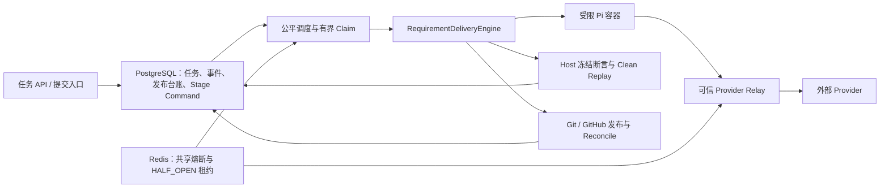
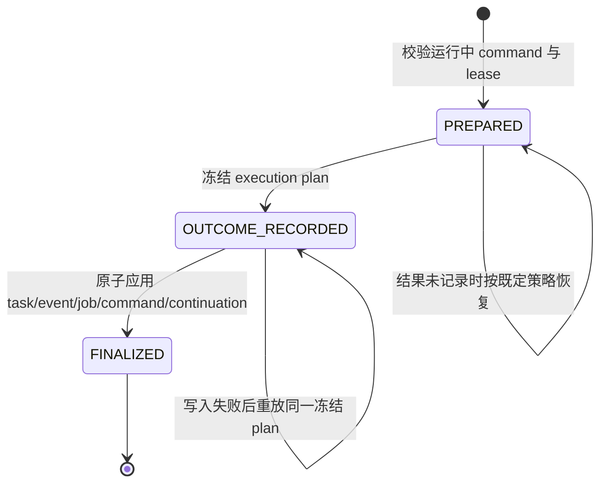

# RD-Bot WP-1～WP-6 改动说明与测试验收方案

> 完成状态：WP-1～WP-6 已完成实现、定向测试、真实基础设施验收和独立复核。
> 主体验收日期：2026-08-09；E4 最终原子收口日期：2026-08-10。
> 基线提交：`6116570c3b6c86e53ed9beff66a34ae3e100d22b`；本次交付仍位于未提交的工作区中。
> 范围边界：WP-7、WP-8 已由用户明确取消，不属于本次交付，也不作为本次完成阻塞项。

## 1. 文档目的

本文说明 RD-Bot 本轮 P0/P1 整改到底解决了什么问题、为什么要这样改、主要方案如何协作，以及应如何测试和验收。内容覆盖 WP-1～WP-6 和最终 E4 收口，不把历史计划中的 WP-7、WP-8 描述为已完成。

本文的事实依据包括：

- `docs/superpowers/plans/2026-08-08-rd-bot-interview-remediation-full-completion-plan.md`
- `docs/superpowers/qa/2026-08-09-rd-bot-interview-remediation-p0-p1-completion-review.md`
- `docs/superpowers/qa/interview-scenario-acceptance-plan.md`
- `docs/superpowers/qa/fault-injection-matrix.md`
- `docs/superpowers/qa/evidence/2026-08-09-p0-p1-acceptance-evidence.json`
- 2026-08-10 E4 定向测试、真实 PostgreSQL smoke、独立 Sol review 和 Goal verifier 结果

前三份 2026-08-09 QA 文档保留了当时的阶段性状态，其中部分标题仍写着 `Sol review pending`；最终状态以本文第 10 节记录的 2026-08-10 独立复核结果为准。

## 2. 改造背景

RD-Bot 的需求交付不是一次普通的本地函数调用，而是一条跨越任务状态、Agent 执行、容器、Provider、Git、GitHub、数据库、Redis 和 QA 判定的长链路。链路中的任何一步都可能发生超时、进程退出、网络结果未知、重复投递、并发抢占或依赖不可用。

原有实现已经具备需求任务、Agent 执行和发布等基础能力，但若直接用于多实例、长时间运行和自动恢复，会暴露六类核心风险：

1. 远端写入成功而本地超时时，系统无法确认是否已推送或已创建 PR，重试可能制造重复副作用。
2. 不受信任的 Pi 容器可能接触长期 Provider 密钥或直接访问公网，隔离边界不够清晰。
3. Agent 既参与实现又能影响验收断言、工作目录或目标服务，存在“自己定义考题、自己判分”的风险。
4. 任务状态缺少贯穿全链路的版本和 fencing token，旧 worker 可能覆盖新状态；任务快照与时间线事件也可能不一致。
5. Provider 降级缺少完整的能力、风险和副作用判断，熔断状态若只在 JVM 内存中保存，多实例会作出相互冲突的决定。
6. 整条工作流直接执行，缺少持久 stage command、租约、有限重试、公平性和资源配额，进程崩溃后难以从准确位置恢复。

因此，这次整改的目标不是增加更多业务页面或 Agent 角色，而是把现有交付链路改造成可识别、可隔离、可验证、可并发控制、可恢复且默认失败关闭的执行系统。

## 3. 总体设计原则

本次改造遵循以下原则：

- **Host 掌握权威信息**：长期凭证、断言规格、共享状态、发布判断和恢复决策由可信 Host 持有。
- **不确定时停止副作用**：无法确认远端状态、Provider 副作用或共享控制面状态时，不盲目重放或静默降级。
- **意图先冻结、结果后提交**：对外操作使用不可变 operation ID、候选补丁哈希和冻结后的结果计划建立身份。
- **状态修改使用 CAS 和 fencing**：旧 worker 不能通过重新读取最新版本来伪装成新 worker。
- **恢复复用已记录事实**：恢复只重放冻结计划或执行 reconciliation，不重新猜测已经发生的远端行为。
- **测试覆盖真实边界**：除了单元测试，还使用真实 PostgreSQL、Redis、Docker 和 HTTP 读回验证关键声明。

总体关系如下：



## 4. WP-1：发布幂等、远端对账与原子提交

### 4.1 原因

Git push、创建 PR 和本地数据库提交无法天然组成一个分布式事务。例如远端 push 已成功，但客户端在收到响应前超时，本地只能看到“调用失败”。如果随后直接重试 push 或创建 PR，可能产生重复提交、重复 PR，或者错误复用其他任务留下的分支。

### 4.2 改动方案

1. 每次发布生成不可变 `operationId`，并计算候选补丁 `candidatePatchSha256`。
2. 推送提交写入两个可核对 marker：

   ```text
   rd-operation-id: <operationId>
   rd-candidate-patch-sha256: <candidatePatchSha256>
   ```

3. 远端分支或 PR 只有在 operation marker 和 patch marker 都匹配时才可复用。只有分支 SHA 一致不再足够；marker 冲突进入 `NEEDS_HUMAN`。
4. 远端查询不可用或结果未知时，系统进入 reconciliation，等待再次核实，不直接重放远端写入。
5. 任务快照、时间线事件和 publication ledger 的最终确认在 PostgreSQL 中原子提交；其中任何一项失败时整体回滚。
6. reconciliation 确认远端成功后，按 `operationId` 幂等写入唯一 continuation command，使工作流自动继续，不要求人工重新提交。

### 4.3 达成效果

- timeout-after-push 和 GitHub 201-before-local-commit 都能通过 marker 找回原操作。
- 两个实例同时恢复同一 operation 时，只能产生一个可领取的 continuation。
- 系统提供的是 **marker-backed idempotency + fail-closed reconciliation**，不是对所有外部系统的通用 Exactly Once 保证。

## 5. WP-2：Pi 容器凭证与运行隔离

### 5.1 原因

Pi 容器执行 Agent 生成或驱动的工作，不能被当作可信凭证边界。长期 Provider 密钥一旦进入容器环境变量、命令行、事件、日志或产物，就可能被读取或外泄；容器若能任意访问公网，也会绕过 Host 的审计和限流。

### 5.2 改动方案

1. Pi 容器不再接收长期 Provider 密钥，只拿到绑定 `task/stage/provider/expiry/maxCalls` 的 opaque lease。
2. 每个任务创建独立 Docker internal network；Pi 只加入内部网络，无法直接访问公网。
3. 可信 relay sidecar 同时连接内部网络和出站网络，校验 lease、允许的方法和路径、请求/响应大小、调用次数与截止时间，再由 Host 侧注入真实凭证。
4. relay 输出结构化且脱敏的审计事件，不把秘密写入环境、参数、inspect、artifact 或原始 Pi 事件。
5. 根据 Agent 角色限制挂载：Architect/Review 只读仓库，Coding 仅能写任务仓库，QA 使用独立候选补丁副本。
6. 增加只读 rootfs、PID、内存、执行超时和清理约束；credentialed execution 无法建立 relay 或内部网络时在容器创建前失败关闭。

### 5.3 达成效果

真实 Docker 验收覆盖了秘密搜索、任意公网访问、跨任务 lease、只读挂载、Host 路径写入、PID/内存压力和超时清理。结论只适用于已记录的镜像和配置，不扩展成对任意未来镜像的无条件保证。

## 6. WP-3：Host 权威断言与 Clean Replay

### 6.1 原因

如果 Agent 可以自行提交测试断言、替换 workspace、修改 base URL，或者把截图当作业务成功依据，那么 QA 结果可以通过改变判定条件而不是修复代码来“变绿”。此外，在 Coding 残留工作区验证会把未声明文件带入结果，无法证明候选补丁可独立复现。

### 6.2 改动方案

1. Host 编译结构化断言并在 QA 前冻结 assertion bundle，持久化 `taskId`、`stageRunId`、scope、canonical specs、content hash 和 version。
2. Agent 只允许回显 bundle hash 和 evidence reference，不能定义、替换、关闭或迁移 Host 断言。
3. CURRENT 与 REGRESSION 两个 scope 独立执行并分别给出证据，避免只证明当前用例而破坏已有行为。
4. 候选补丁在全新的 verifier checkout 中重放，Host 从可信 execution profile 构造 workspace 和运行上下文。
5. Host runner 覆盖 FILE、HTTP status/JSONPath、只读 SQL、LOG required/forbidden pattern 和 browser DOM/ARIA/route state。
6. SQL runner 限制为单条只读 SELECT/CTE、允许 schema 和只读事务；HTTP/browser 在 clean replay 启动的目标应用上执行，而非访问无关的预先存在服务。
7. Prompt、`rd-pi-bridge.mjs`、`result-tool.mjs` 和 Host validator 同步协议字段与校验规则。

### 6.3 达成效果

Agent 输出不再是验收真值，Host 冻结断言和 clean replay 才是语义判定来源。截图仍可作为证据，但不能单独证明业务正确。

## 7. WP-4：任务 CAS、fencing 与快照/事件一致性

### 7.1 原因

多 worker 场景下，worker A 读取任务后可能长时间执行；worker B 已推进任务时，A 若仍能按 task ID 直接写回，就会覆盖更新后的状态。另一个问题是任务快照已经更新、时间线事件写入失败，从而出现“当前状态已变化，但审计轨迹不存在”的不一致。

### 7.2 改动方案

1. 任务快照携带不可变 `version` 和 `fencingToken`，所有状态变更都传递并校验这两个值。
2. PostgreSQL 更新必须同时匹配：

   ```sql
   WHERE id = :id
     AND version = :expected_version
     AND status = :expected_status
     AND fencing_token = :expected_fencing_token
   ```

3. 成功 CAS 后递增版本/栅栏值；旧 worker 的 stale write 直接失败，不能在写前重新读取最新版本规避 fencing。
4. 限制 blind upsert，只允许初始创建或不改变状态/版本的元数据路径。
5. PostgreSQL 通过事务原子提交 task snapshot 和 timeline event。
6. 内存实现通过 `InMemoryRdTaskStore.executeAtomically()` 的可重入锁，把 `before snapshot -> CAS -> event save -> rollback` 包在同一锁边界内；事件写入失败时恢复完整 task/status/version/fencing snapshot。
7. requirement task 暂停接口改用通用 `pauseTask()`，消除旧的 bug-fix-only 强制类型转换。

### 7.3 达成效果

- PostgreSQL 和内存实现都能拒绝 stale worker。
- event 写入失败不会留下已推进的 task；并发 writer 也不能在补偿回滚期间进入并被旧快照覆盖。
- 真实 HTTP 暂停链路从原先“数据库已暂停但响应 500”修复为响应 200，且任务、版本、fencing 和事件读回一致。

## 8. WP-5：Provider 能力、降级与分布式熔断

### 8.1 原因

Provider 不是可任意互换的。不同 Provider 支持的工具、上下文和风险等级不同；如果第一次调用可能已执行外部副作用，切换 Provider 重新执行可能再次写入远端。单机内存熔断也无法约束多个 RD-Bot 实例，可能让多个实例同时进行 HALF_OPEN 探测。

### 8.2 改动方案

1. 调用前使用 capability/risk gate，确认候选 Provider 满足当前工作所需工具和风险条件。
2. 引入持久 side-effect ledger，记录 Provider 工具操作身份和提交状态；缺失、未知或未提交的副作用证据会阻止自动 fallback。
3. Provider 改变时创建新的 clean attempt，不沿用可能被前一个 Provider 污染的执行目录。
4. 所有 Provider 调用都必须通过共享 circuit decision，不保留“所有 circuit 都 open 时仍调用最后一个候选”的绕过路径。
5. Redis 保存跨实例 OPEN/HALF_OPEN/CLOSED 状态和探测租约，同一时刻只允许一个 HALF_OPEN probe。
6. 生产模式缺少 Redis 权威状态时启动失败关闭；内存模式只用于明确配置的本地或隔离测试。

### 8.3 达成效果

Provider 降级从“调用失败就换一个”变为“能力匹配、风险允许、旧副作用已确认、共享熔断放行后才创建新 attempt”。本次没有调用真实外部 Provider，因此验收结论聚焦于策略、共享状态和失败关闭行为。

## 9. WP-6 与 E4：持久调度、原子收口和确定性恢复

### 9.1 WP-6 原因与方案

原先直接执行整条工作流时，线程既承担长时间执行，也承担等待重试；进程崩溃后难以判断哪个 stage 已经完成，多个 worker 也可能重复执行。高优先级、大项目或稀缺 Docker/browser 资源还可能造成其他项目饥饿。

WP-6 将工作流拆为持久化 `RequirementStageCommand`：

1. command 记录 task version、fencing token、role/stage、attempt、deadline、resource class、project、Provider、lease owner/until、priority 和 `nextVisibleAt`。
2. PostgreSQL 使用 `FOR UPDATE SKIP LOCKED` 有界领取到期 command，保证并发实例中只有一个 claimant。
3. submit 和 recovery 进入同一套调度入口，不保留绕过持久 command 的整流程直接执行路径。
4. 每次只执行一个有界 stage，成功后持久化结果并创建下一 command；限流和资源不足通过延后 `nextVisibleAt` 重排，不占用 worker 睡眠。
5. retry、lease reclaim 和 dead-letter 都有上限。
6. 调度同时应用项目公平性、priority aging、per-project in-flight、Provider、Docker 和 browser quota。
7. 100-task 虚拟时间模拟验证多个项目和优先级在 429/5xx 压力下仍能获得服务，重试和队列保持有界。

### 9.2 E4 为什么还需要最终收口

持久 command 解决了“工作从哪里继续”，但 stage 完成仍涉及多项写入：任务 mutation、timeline event、当前 job/command 状态、下一 command 或终态。如果这些写入分散进行，任何中间崩溃都可能留下“任务已变但 command 未完成”或“command 已完成但 continuation 未创建”的裂缝。

因此 E4 增加 `RequirementStageFinalizationPort`，把一次 stage 的结束分成三个持久状态：



关键约束是：

- `OUTCOME_RECORDED` 后恢复只解码并重放同一 frozen plan，不重新调用 Agent 或重新规划。
- task CAS 失败必须阻止当前 command 完成和下一 command 入队。
- PostgreSQL adapter 在一个事务中完成相关持久化；内存 finalizer 用同一原子边界模拟该契约。
- publication、job、command 或 continuation 任一写入失败，都保留可确定恢复的 marker。

### 9.3 最后关闭的两个 blocker

#### Blocker 1：跨 attempt 的 retry mutation 丢失

原实现会在第一次可重试 attempt 清空失败 mutation。command 虽然能被重新领取，但最终 attempt 重放的是已经丢失 mutation 的计划，结果是 command 进入 dead-letter，而 task 没有进入 `FAILED_RETRYABLE`。

最终修改为：

- retry plan 始终保存原始失败 mutation。
- 非最终 attempt 只把 job/command 标记为 retryable，并保留 `OUTCOME_RECORDED`，延迟应用 task mutation。
- 最终 reclaimed attempt 重放同一 frozen plan，此时应用 `FAILED_RETRYABLE` task CAS 和 event，再把 command 有界地送入 dead-letter。

这保证了中间重试不提前推进 task，而重试耗尽时 task、timeline 和 command 终态一致。

#### Blocker 2：内存 task/event 补偿存在并发覆盖窗口

原内存 `CoordinatedRdTaskStatePersistence` 先 CAS task 再写 event。event 失败后虽然尝试回滚，但并发 writer 可能在 CAS 与回滚之间进入，随后被旧 snapshot 覆盖。

最终修改为：

- `InMemoryRdTaskStore.executeAtomically()` 复用 store 的可重入锁。
- 读取 before snapshot、执行 CAS、保存 event 和失败回滚都在同一锁边界内。
- rollback 恢复完整 status/version/fencing snapshot；并发 writer 必须等回滚结束后才能进入。

这使内存实现的故障语义与 PostgreSQL 事务契约保持一致，而不是依赖有并发漏洞的事后补偿。

## 10. 测试与验收方案

### 10.1 验收原则

每个工作包至少同时提供一个成功用例和一个故障注入用例。验收从小到大分为五层：

1. **纯逻辑测试**：marker、CAS、fencing、capability/risk gate、retry、fairness 和状态机。
2. **适配器与协议测试**：PostgreSQL mapper/transaction、Redis state store、Pi bridge/result tool、Host runners。
3. **真实基础设施 smoke**：真实 PostgreSQL、Redis 和 Docker，而不是 mock 代替基础设施声明。
4. **真实 HTTP 生命周期**：通过 API 创建、读取、暂停、再读取，并回查 PostgreSQL snapshot/event/material。
5. **跨模块回归与独立复核**：执行 focused suites、full reactor、`git diff --check`，再由只读 Sol reviewer 和独立 Goal verifier 检查需求与证据。

### 10.2 WP-1～WP-6 主体验收结果（2026-08-09）

| 验收层 | 结果 | 主要证明内容 |
|---|---:|---|
| Focused Maven | 239/239，0 failure/error/skip | WP-1～WP-6 跨 rag/engine/exec/bootstrap 回归 |
| Pi Node protocol | 80/80 | bridge、result tool 与协议行为 |
| Real Docker | 8/8，0 skipped | 凭证、网络、挂载、PID/内存/超时隔离 |
| Real PostgreSQL | 4/4 | stage claim、task CAS/原子事件、publication commit/continuation |
| Real Redis | 3/3 | 共享熔断、单一 HALF_OPEN probe、缺依赖失败关闭 |
| Real HTTP + DB read-back | 通过 | create/read/pause/read/timeline 与数据库副作用一致 |
| Full Maven reactor | 共 1769 tests | WP-1～WP-6 为 0 failure；剩余 2 failures、26 errors 全部来自已取消 WP-7/WP-8，且未隐藏 |

真实 HTTP 验收记录的 task 为 `7492061439520280576`：创建、读取、暂停、再次读取和 timeline 均返回 200；数据库读回为 `status=CREATED`、`paused=true`、`version=1`、`fencing_token=2`，并存在 CREATED、PAUSED 两条事件及一条带 SHA-256 内容哈希的 material。

### 10.3 E4 最终收口结果（2026-08-10）

| 验收层 | 结果 | 主要证明内容 |
|---|---:|---|
| RAG + engine focused | 63/63 | task/event 原子边界、stage plan、retry/reclaim/finalization |
| Bootstrap focused | 37/37 | dispatcher 恢复用例、PostgreSQL stage command/finalization adapter |
| Real PostgreSQL stage finalization | 1/1，0 skipped | 晚期故障整体回滚，并保留 `OUTCOME_RECORDED` 可恢复 marker |
| Real PostgreSQL task-state atomic | 2/2，0 skipped | event 失败回滚与 stale/concurrent write 隔离 |
| `git diff --check` | 通过 | 无空白错误 |
| 独立 Sol review | `REVIEW: PASS` | 无 Critical / Important findings |
| 独立 Goal verifier | `VERDICT: PASS` | WP-1～WP-6 契约与最终证据均满足 |

其中 63 个测试由以下类构成：

- `InMemoryRdTaskStoreCasTest`、`RagStreamTaskRegistryCancelCasTest`、`RagStreamTaskRegistryAtomicPersistenceTest`
- `RequirementStageCommandStoreTest`、`InMemoryRequirementStageFinalizationPortTest`
- `RequirementDeliveryStageProposalTest`、`RequirementDeliveryStageExecutionTest`

37 个 Bootstrap 测试由以下范围构成：

- `RequirementDeliveryDispatchServiceWiringTest`：5 个测试
- `RequirementDeliveryDispatchServiceTest`：4 个 finalization/recovery 定向方法，不是该类的全部测试
- `PostgresRequirementStageFinalizationAdapterTest`：17 个测试
- `PostgresRequirementStageCommandStoreTest`：11 个测试

其中“从 `OUTCOME_RECORDED` 确定性恢复且不重新规划”的行为由 dispatcher/finalizer focused tests 证明；真实 PostgreSQL smoke 的证明边界是事务回滚和 marker 保留。

### 10.4 重点故障验收矩阵

| 场景 | 预期结果 | 对应范围 |
|---|---|---|
| push 成功后客户端超时并发重试 | 远端只有一个 operation；marker 匹配后恢复，不盲推 | WP-1 |
| GitHub 创建成功、本地提交前崩溃 | 找回带 marker 的 PR；task/event/publication 原子收口 | WP-1 |
| Pi 直连公网或读取长期密钥 | 访问失败，秘密不出现在 env/log/artifact/inspect | WP-2 |
| lease 跨 task/stage 复用 | relay 拒绝请求 | WP-2 |
| Agent 篡改 bundle hash/workspace/spec | Host 拒绝结果 | WP-3 |
| 命令退出 0 但 HTTP/SQL 业务值错误 | Host semantic assertion 失败 | WP-3 |
| stale version/fencing worker 写入 | CAS 失败，snapshot/event 不被污染 | WP-4 |
| event save 失败 | task 完整回滚；并发 writer 不被补偿覆盖 | WP-4 / E4 |
| 两实例竞争 HALF_OPEN | Redis 只允许一个 probe | WP-5 |
| Provider 副作用状态未知 | 禁止自动 fallback 或重放 | WP-5 |
| 两 worker 领取同一到期 command | `SKIP LOCKED` 只产生一个 claimant | WP-6 |
| finalization 任一写边界失败 | 保留 marker，恢复重放 frozen plan，不重复 Agent 工作 | E4 |
| retry 跨 attempt 直至耗尽 | 最终 task/event 为 `FAILED_RETRYABLE`，command 才 dead-letter | E4 |

### 10.5 复现命令

以下命令是主体验收与 E4 收口的最小可复现集合。真实基础设施命令要求对应 PostgreSQL、Redis 或本地 Docker 已准备好；敏感值必须通过运行环境注入并保持脱敏。

```bash
# Pi protocol
cd bootstrap/src/main/resources/executor/pi
npm test

# E4: RAG + engine focused，预期 63/63
./mvnw -pl rag,engine -am \
  -Dtest=InMemoryRdTaskStoreCasTest,RagStreamTaskRegistryCancelCasTest,RagStreamTaskRegistryAtomicPersistenceTest,RequirementStageCommandStoreTest,InMemoryRequirementStageFinalizationPortTest,RequirementDeliveryStageProposalTest,RequirementDeliveryStageExecutionTest \
  -Dsurefire.failIfNoSpecifiedTests=false test

# E4: Bootstrap focused，预期 37/37
./mvnw -pl bootstrap -am \
  -Dtest=RequirementDeliveryDispatchServiceWiringTest,RequirementDeliveryDispatchServiceTest#finalizationFailurePreservesRecordedOutcomeForLeaseRecovery+recoveryUsesAlreadyAppliedDispositionWhenTheAuthoritativeSnapshotMatchesRecordedPlanPostState+recoveryFinalizesOutcomeRecordedPlanWithoutReplanningOrExecutingTheStage+recoveryReplaysTheOriginalRetryableFailurePlanAtTheFinalAttempt,PostgresRequirementStageFinalizationAdapterTest,PostgresRequirementStageCommandStoreTest \
  -Dsurefire.failIfNoSpecifiedTests=false test

# Real Docker isolation
./mvnw -pl bootstrap -am \
  -Dtest=PiRealDockerIsolationAcceptanceTest \
  -Drd.integration.pi-docker-isolation.enabled=true \
  -Dsurefire.failIfNoSpecifiedTests=false test

# Real PostgreSQL: WP-1/WP-4/WP-6 与 E4
./mvnw -pl bootstrap -am \
  -Dtest=PostgresRequirementStageCommandRealSmokeTest,PostgresRdTaskStateAtomicRealSmokeTest,PostgresRequirementPublicationContinuationRealSmokeTest,PostgresRequirementStageFinalizationRealSmokeTest \
  -Drd.integration.postgres.enabled=true \
  -Drd.executor.docker.circuit-breaker.state-store=memory \
  -Dsurefire.failIfNoSpecifiedTests=false test

# Real Redis
./mvnw -pl bootstrap -am \
  -Dtest=RedisModelHealthStateStoreIntegrationTest,ModelHealthStoreConfigurationTest \
  -Drd.bot.redis.test=true \
  -Dsurefire.failIfNoSpecifiedTests=false test

# 全仓回归与格式检查
./mvnw test
git diff --check
```

`./mvnw test` 在当前交付范围下不是全绿验收门槛，因为用户明确取消的 WP-7/WP-8 仍保留已知失败；验收时必须核对失败归属，不能把这些失败删除、跳过或改写成成功，也不能把新的 WP-1～WP-6 失败误归为范围外。

## 11. 验收通过标准

本次范围通过需要同时满足：

1. WP-1～WP-6 的 focused tests 全绿，且每个 WP 至少有一组成功/故障成对证据。
2. 需要真实基础设施支撑的声明分别通过 PostgreSQL、Redis、Docker 或 HTTP 验收，不能只用 mock 证明。
3. publication 不确定结果只能 reconcile；Provider 副作用未知只能等待或转人工，均不得盲重放。
4. Pi 中不存在长期 Provider 密钥，credentialed execution 缺少 relay 时失败关闭。
5. Host frozen assertion、clean replay、CURRENT/REGRESSION 分离和 evidence reference 规则保持一致。
6. task mutation、timeline event、stage command 和 continuation 的 CAS/事务/恢复行为满足 E4 状态机。
7. retry 耗尽后 task/event/command 终态一致；event 写入失败后内存与 PostgreSQL 都不留下半提交状态。
8. 独立 reviewer 无 Critical/Important finding，独立 verifier 返回 PASS。
9. WP-7/WP-8 失败继续被明确披露，不被当成本次成功，也不阻塞已约定的 WP-1～WP-6 完成范围。

上述标准已由第 10 节证据满足。

## 12. 明确边界与非声明

为了避免把局部证据扩大成生产级绝对承诺，本次交付明确不作以下声明：

- 不宣称外部系统通用 Exactly Once；只声明 marker 支撑的幂等和失败关闭 reconciliation。
- 不宣称截图是业务真值；截图只是 evidence，Host assertion 才负责语义判定。
- 不宣称已经完成真实外部 Provider 调用或 GitHub 生产写入；本次相关验收使用策略测试、本地 bare Git 和受控适配器/fixture。
- 不宣称 WP-6 已完成两小时生产压力测试；证据是确定性 100-task 虚拟时间 simulation 加真实 PostgreSQL claim smoke。
- 不宣称 WP-7 的迭代检索提升、WP-8 的 benchmark package 或简历指标已完成。
- 不宣称整个 dirty worktree 中的所有文件都属于本轮改动；本文只说明 WP-1～WP-6 和 E4 的已验收范围。

## 13. 后续维护规则

后续修改这些链路时，应继续遵守以下守则：

1. 新增 Host 侧结果校验规则时，同步修改 Prompt、Pi bridge/result tool 和 Host validator，避免容器内预校验与 Host 终验不一致。
2. 改动 Pi bridge 或 QA skill resource 后，重建 Pi 与 Pi QA 两个镜像，再跑 Node protocol 和真实 Docker 验收。
3. 发布身份继续同时使用 operation ID 和 candidate patch hash；未知远端结果不得退化为直接重试。
4. 新状态写入继续携带 expected status/version/fencing；不得恢复 blind status upsert。
5. 新 Provider fallback 路径必须经过 capability、risk、side-effect ledger 和共享 circuit gate。
6. stage finalization 新增写入边界时，必须补充“写入失败 + 恢复重放”的 fault test，并保证只重放 frozen plan。
7. 扩大完成范围前单独授权并验收 WP-7/WP-8，不能仅通过消除现有失败来反向宣称其完成。
