# MEA P3 Manager 交接文档

日期：2026-09-06  
仓库：`/Users/wish233/Documents/RD-Bot`  
OpenSpec change：`openspec/changes/archive/2026-09-06-mea-manager-decision-command/`（**已归档**）
主 spec：`openspec/specs/requirement/manager-decision-command/spec.md`。代码已于 `3fcd7db6` 推到 `origin/main`；归档本身尚未单独 commit。

状态分类（`docs/openspec/historical-spec-provenance-audit.md`）：

- 本文 + 紧凑证据 JSON = **当前代码与真机证据**（可被下一 Agent 当入口）。
- `docs/superpowers/plans/2026-09-04-mea-next-phases-waimai.md` Task 11 = **计划/决策**（P3-W1 退出条件仍以该表为准，但「必须 COMPLETED+PR」不是该表原文）。
- `docs/superpowers/specs/2026-09-03-rd-bot-mea-agent-handoff.md` = **阶段 1 历史交接**；不要按它第 0 节从零做 `mea-audit-only-writeback`，也不要按它「不要做阶段 3」停手。

---

## 1. 结论（先读这段）

**三角色流转已经在真机上证明。** 主证据是 waimai 任务 **W1e `7502196308401328128`**：

1. 第一轮 Coding 只做首页标记，**没有**实现缺口页。
2. HOST_VERIFY 成功 → Manager round 1 `EXECUTE QA`。
3. 第一轮 QA 协议完整、产品缺口（AC-001/002 `COMPLETED`，AC-003 `PENDING`）→ Manager round 2 **`EXECUTE CODING`，合同点名 `AC-003`**，世代 `MANAGER_GAP_FIX`。
4. 缺口 Coding → HOST_VERIFY → Manager round 3 `EXECUTE QA`，**同一** `remediation_round_id=7502206490577604609`。
5. 第二轮 QA + `auditQa` 后 AC-001/002/003 与 `GATE-QA-EVIDENCE` 均为 `COMPLETED`。
6. **在 AC-003 仍为 PENDING 期间，command 表里没有 `DETERMINISTIC_REVIEW`。** 复核只出现在三 AC 全部 COMPLETED 之后（Manager round 4 `DONE`）。

这就是 P3-W1 阶段退出条件（计划 Task 11 原文），**不是**「QA 全绿后 Manager 只回放 `requirementDeliveryOrder()` 进复核」。后者是 3.0，W1 `7502036764404617216` COMPLETED PR #38 只证明 3.0。

**P3 开发任务已完成**：`tasks.md` 1.1–4.3、5.1，以及真机挖出的 host 硬化（协议完整 QA → Manager、GAP_FIX 附件白名单、GAP_FIX 再入新开 QA attempt、协议完整产品失败把 QA **阶段**标 `SUCCEEDED`、ENVIRONMENT 不得走 Manager）。P3-W2/W3 有代码和单测，**本轮没有真机 ASK / pause**。

**明确不声称：**

| 不声称 | 原因 |
|---|---|
| W1e / 后续任务 `COMPLETED` + PR | W1e 死在复核恢复 `cannot recover delivery result, successful stage missing: QA_AGENT`；用户本轮不要求收口到 COMPLETED |
| 12:26 云端 jar 的「QA 阶段 SUCCEEDED」修复已被真机证明 | 修复打进 W1e 之后的 jar；W1f 在第一轮 QA 就因 OpenCode 401 / 缺生命周期聚合挂了 |
| P3-W2 / P3-W3 真机 | 只有单测 |
| 本机 ENVIRONMENT 守卫已在云端 | 2026-09-06 下午才合进工作区，VM 仍是 12:26 jar |

---

## 2. 给下一个 Agent 的入口

```text
你在 /Users/wish233/Documents/RD-Bot。P3 Manager 已归档。

先读：
1. 本文件 docs/superpowers/qa/2026-09-06-mea-p3-manager-handoff.md
2. docs/superpowers/qa/2026-09-06-mea-p3-w1e-triangle-evidence.json
3. RULE.md 3.5.3（Manager 双权威 / MANAGER_GAP_FIX / WAITING_USER_INPUT / paused claim）
4. AGENTS.md（Pi QA、不要把缺生命周期当成事件顺序证据）
5. openspec/specs/requirement/manager-decision-command/spec.md（当前行为真值）
6. openspec/changes/archive/2026-09-06-mea-manager-decision-command/（归档 artifacts）
7. docs/superpowers/plans/2026-09-04-mea-next-phases-waimai.md Task 11（退出条件原文）

不要：
- 未经用户要求就 git commit、push
- 直接改 openspec/specs/；后续行为必须新 change + delta
- 重开架构（见第 8 节冻结决策）
- 续跑 DEAD_LETTERED / FAILED 任务；要 COMPLETED 就新开 W1g，唯一标记
- 把 W1 COMPLETED PR #38 当成 P3-W1 阶段退出
- rsync .env.opencode.local / application-local.yaml
- pkill -f bootstrap jar（用 deploy/cloud-server/start-backend.sh，按 /proc cmdline 杀）

若用户要真机 CLOSED-LOOP COMPLETED：先 package+rsync+restart（必须带上本机 ENVIRONMENT 守卫和 QA 阶段 SUCCEEDED 修复），再提交新任务，见第 9 节。
```

---

## 3. 三角色是什么

MEA 交付主链上的三个 **Agent 角色**是 Coding / Manager / QA。HOST_VERIFY 是宿主 durable command，不是第四个 Agent。

```mermaid
flowchart LR
  C1[CODING 普通世代] --> HV1[HOST_VERIFY]
  HV1 --> M1[MANAGER_DECIDE]
  M1 --> Q1[QA]
  Q1 --> M2[MANAGER_DECIDE]
  M2 -->|"阻断 AC PENDING"| C2[CODING MANAGER_GAP_FIX]
  C2 --> HV2[HOST_VERIFY 同 round]
  HV2 --> M3[MANAGER_DECIDE 同 round]
  M3 --> Q2[QA 同 round]
  Q2 --> M4[MANAGER_DECIDE 退出世代]
  M4 -->|"全部阻断 AC COMPLETED"| R[DETERMINISTIC_REVIEW]
```



冻结形状（不要重开）：

- 插入点只在 **HOST_VERIFY 成功/SKIPPED_DOCS_ONLY** 和 **协议有效 QA** 之后。Coding 成功仍只续 `HOST_VERIFY`。
- 额外 Coding 身份是 `AgentRemediationKind.MANAGER_GAP_FIX(2)`，形状对齐 `HOST_VERIFY_FIX`：Coding 目标非空、**QA 列为空**、**不要求** `piQaRemediationV2Enabled`。禁止复用 `QA_PRODUCT_FIX`。
- command 名 `MANAGER_DECIDE:<sourceCommandId>`。D2 世代退出：上一条是 QA 且下一条是 `MANAGER_DECIDE:*` 时 **不** 复制 `remediation_round_id`。
- 同一 `remediation_round_id` 从缺口 Coding 传到随后 HOST_VERIFY、该轮 Manager、QA。
- ASK → `WAITING_USER_INPUT`（不是 `WAITING_APPROVAL`）。`paused=true` 永不 claim。

---

## 4. 主证据：W1e 三角色

| 项 | 值 |
|---|---|
| 任务 | `7502196308401328128` |
| 项目 | `codex-run-test-waimai` / `7499721648870920192` |
| 仓库 | `https://github.com/wanghehe123/rd-bot-waimai-acceptance-20260624-141045.git` |
| 提交时间 | 2026-09-06 10:49 +08 |
| 标题 | 顾客首页展示 P3-W1E-HOMEPAGE 标记且禁止首轮实现缺口页 |
| AC | 构建；首页 `P3-W1E-HOMEPAGE`；`/customer/p3-w1e-gap` 含 `P3-W1E-GAP-ROUTE`（**禁止首轮实现**） |
| 终态 | `FAILED_RETRYABLE`：`cannot recover delivery result, successful stage missing: QA_AGENT` |
| `state_version` | 9（三 AC 已 COMPLETED 时） |
| 本机副本 | `tmp-mea-waimai-shadow/p3-w1e/`（gitignored） |
| 摘录 | `docs/superpowers/qa/2026-09-06-mea-p3-w1e-triangle-evidence.json` |

### 4.1 Command 链（只列角色之后）

时间均为 UTC，来自 `latest.json`：

| 时间 | 状态 | stage | kind | round |
|---|---|---|---|---|
| 03:10:46 | SUCCEEDED | `ROLE_EXECUTION:CODING_AGENT` |  |  |
| 03:13:25 | SUCCEEDED | `HOST_VERIFY` |  |  |
| 03:13:25 | SUCCEEDED | `MANAGER_DECIDE:7502201602179207168` |  |  |
| 03:30:11 | SUCCEEDED | `ROLE_EXECUTION:QA_AGENT` |  |  |
| 03:30:12 | SUCCEEDED | `MANAGER_DECIDE:7502202272282185728` |  |  |
| 03:38:58 | SUCCEEDED | `ROLE_EXECUTION:CODING_AGENT` | **MANAGER_GAP_FIX** | `7502206490577604609` |
| 03:41:35 | SUCCEEDED | `HOST_VERIFY` | MANAGER_GAP_FIX | 同左 |
| 03:41:35 | SUCCEEDED | `MANAGER_DECIDE:7502208702544482304` | MANAGER_GAP_FIX | 同左 |
| 04:09:47 | SUCCEEDED | `ROLE_EXECUTION:QA_AGENT` | MANAGER_GAP_FIX | 同左 |
| 04:09:47 | SUCCEEDED | `MANAGER_DECIDE:7502209358856589312` |  | **空（退出世代）** |
| 04:10:34 | DEAD_LETTERED | `DETERMINISTIC_REVIEW` |  |  |

### 4.2 Manager 决策

| round | source | route | executor | targets | rationale |
|---|---|---|---|---|---|
| 1 | HOST_VERIFY `7502201602179207168` | EXECUTE | QA_AGENT | [] | host-verify succeeded; continue QA |
| 2 | QA `7502202272282185728` | EXECUTE | **CODING_AGENT** | **`["AC-003"]`** | pending blocking acceptance [AC-003] |
| 3 | HOST_VERIFY `7502208702544482304` | EXECUTE | QA_AGENT | [] | host-verify succeeded; continue QA |
| 4 | QA `7502209358856589312` | **DONE** | DETERMINISTIC_REVIEW | [] | all blocking requirements completed |

Round 2 `bounded_contract` 原文：`只修复以下已审计缺口，禁止扩大范围：AC-003`。

### 4.3 「PENDING 时不进复核」的快照钉

来自 poller 落盘（不是事后回忆）：

| 文件 | AC-003 | `DETERMINISTIC_REVIEW` | GAP_FIX |
|---|---|---|---|
| `snapshot-p080.json` | PENDING | **无** | Coding **RUNNING** |
| `snapshot-p157.json` | PENDING | **无** | Coding/HV/Manager SUCCEEDED，第二轮 QA **RUNNING** |
| `snapshot-p158.json` | COMPLETED | 首次出现 | 第二轮 QA 已 SUCCEEDED，随后 Manager DONE |

`audited-state.json` head：`AC-001/002/003`、`GATE-BUILD`、`GATE-STATIC`、`GATE-QA-EVIDENCE`、`GATE-WORKSPACE-INTEGRITY` 均为 `COMPLETED`；`ART-PR` 仍 `PENDING`（从未走到发布）。

### 4.4 W1e 为什么不是 COMPLETED（与三角色正交）

command 层两条 QA 都是 `SUCCEEDED`，但 `recoverExecutionResult` / `LatestSucceededStageLocator` 要的是 **AgentStageRun** 最新 QA 为 `SUCCEEDED`。W1e 跑的 jar 还把协议完整、产品失败的 QA **阶段**留在 `FAILED_NEEDS_HUMAN`，复核无法把 `FAILED_NEEDS_HUMAN` 改成 `SUCCEEDED`（`AgentStageTransitions`）。

修复已在后续代码里（见 §6.4），**真机未再证明**。不要把这条失败读成「Manager 又跳进了复核」：复核发生时三 AC 已经 COMPLETED。

Poller `verdict=PASS_MANAGER_GAP_FIX_ENQUEUED` 在三 AC 完成后仍保留，是启发式标签，不是 Manager 又派了一次缺口。

---

## 5. 对照与挖洞史（都在同一项目）

| 实验 | 任务 ID | 终态 | 证明了什么 | 洞 |
|---|---|---|---|---|
| **W1** | `7502036764404617216` | **COMPLETED** [PR #38](https://github.com/wanghehe123/rd-bot-waimai-acceptance-20260624-141045/pull/38) | 3.0：HV → Manager → QA → Manager DONE → 复核 → 发布 | 第一轮 Coding **实现了 AC-003**；只有 2 个 Manager round，无 `MANAGER_GAP_FIX`。**不是阶段退出。** |
| **W1b** | `7502048568933486592` | FAILED_NEEDS_HUMAN | 第一轮 Coding 听话（缺口页不存在） | 产品失败 QA（AC-003 FAIL、`requested=false`、v2 关）bounce 空，**没有 Manager**。本机 `tmp-mea-waimai-shadow/` **没有** W1b 目录；ID 记在 W1e `meta.json` parentTaskIds。 |
| **W1c** | `7502060281951031296` | FAILED_RETRYABLE | QA→Manager GAP_FIX 已入队；合同点名 AC-003 | 缺口 Coding：`attachments without initial state are restricted to Host remediation packages` |
| **W1d** | `7502183328116772864` | FAILED_RETRYABLE | GAP_FIX Coding + HOST_VERIFY 跑通 | 第二轮 QA：`agent stage is terminal before execution: QA_AGENT FAILED_NEEDS_HUMAN`（attempt 1 仍终态，没开 attempt 2） |
| **W1e** | `7502196308401328128` | FAILED_RETRYABLE | **三角色 + auditQa 阶段退出条件** | 复核恢复缺 QA 阶段 SUCCEEDED |
| **W1f** | `7502220631853895680` | FAILED_NEEDS_HUMAN | 无（未到 GAP_FIX） | 第一轮 QA ~45 min 后 OpenCode relay **401**（约 330KiB 请求）；`Pi result requires RESULT_SUBMITTED followed by AGENT_SETTLED`。按 AGENTS.md 当 **缺生命周期聚合**，不是事件顺序被破坏，也不是 Manager 回归。AC 仍全部 PENDING。 |

W1c/W1d 的 Manager round 2 已经是 `EXECUTE CODING` + `AC-003`，与 W1e 同类；它们证明路由，不构成完整「再 QA + auditQa」。

---

## 6. 代码地图（符号，不要靠行号）

### 6.1 主路径

`RequirementDeliveryDispatchService.submit` → `EngineRequirementStageExecutor.plan` → `RequirementDeliveryEngine.planStage` → `DeterministicAuditor` → `RequirementStageFinalizationPort.recordOutcome` / `finalize`。

| 职责 | 符号 |
|---|---|
| HV/QA 成功后续 Manager | `RequirementDeliveryEngine.planHostVerifyStage` / `planRoleExecutionStage` |
| 决策纯函数 | `ManagerPolicy.decide` |
| 铸造缺口 | `RequirementDeliveryEngine.buildManagerGapFixIntent`、`ManagerGapFixPackageBuilder` |
| 协议完整产品失败 → 续 Manager | `PiQaRemediationPlanner.protocolCompleteAcceptanceReport`（bounce intent 仍优先） |
| GAP_FIX 再入新开 QA | `RequirementDeliveryEngine.ensureFreshQaAttemptForManagerGapFix` |
| QA 阶段标 SUCCEEDED 以便复核恢复 | `RequirementAgentStageOrchestrator.runInternal`（`protocolCompleteQaGap`） |
| 世代复制 / 退出 | `RequirementDeliveryDispatchService.continuationCommand`、`shouldCopyRemediationGeneration`、`nextRoleTarget` |
| 决策落库 | `PostgresManagerDecisionStore`、`p22_task_manager_decisions.sql` |
| GAP_FIX mint Coding、QA 列空 | `PiRemediationFinalizationWriter` |
| ASK / 回答 | `RequirementUserAnswerTransactionPort`、`POST /admin/rd-tasks/{id}/answer`、`USER_ANSWER_RESUME:<sourceCommandId>` |
| 纯度扫描 | `ManagerDecisionPurityPolicyTest` |

### 6.2 真机挖出的硬化（P3 开发的一部分）

1. **W1b：产品失败 QA 也要进 Manager**  
   `planRoleExecutionStage`：bounce 为空且 `protocolCompleteAcceptanceReport` → 保持 `EXECUTING`、`CommandDisposition.SUCCEEDED`、continuation `MANAGER_DECIDE:<qaCommandId>`、`attachRoleClaims` / `auditQa`。

2. **W1c：附件白名单**（无 Pi state v2 时与 HOST_VERIFY_FIX 同类）  
   - `RequirementExecutionRequest` compact ctor 允许 `attachments/manager-gap-fix/request.json`  
   - `EngineRequirementExecutorAdapter.inputAttachments` → `manager-gap-fix/request.json`  
   - `RepairWorkspaceFactory.safeAttachmentFilename` 允许嵌套该路径  
   协议：`rd-manager-gap-fix-request/v1`。

3. **W1d：第二轮 QA 必须新 attempt**  
   在 `planRoleExecutionStage` 的 `ensureRequirementStages` 之后：若 QA + `MANAGER_GAP_FIX`，且最新 QA 已是 `FAILED_NEEDS_HUMAN` / `FAILED_RETRYABLE` / `SUCCEEDED`，且 `attemptNo < MAX_ROLE_ATTEMPTS`（3），铸造 `pendingStage` attempt N+1。  
   D2 仍：round 的 QA 列为空；attempt 在 execute 时 mint，不是 round 目标行。

4. **W1e：复核要 QA 阶段 SUCCEEDED**  
   orchestrator：`!roleResult.success()` 但 QA + 协议完整 + **不是** `isCodingRemediationRequested` → `RESULT_COLLECTING → VERIFYING → SUCCEEDED`，仍返回 `RequirementExecutionResult.failure` 让引擎去 Manager。bounce/`requested=true` 仍 `FAILED_NEEDS_HUMAN`。

5. **5.1 回归：ENVIRONMENT 不得当产品缺口**（2026-09-06 下午，本机）  
   `protocolCompleteAcceptanceReport` 排除 `ENVIRONMENT` / `AUTHENTICATION` / `QA_INFRASTRUCTURE` / `FLAKY` / `REQUIREMENT_AMBIGUITY`。否则 `shouldNotReturnEnvironmentQaFailureToCoding` 会从 `FAILED_NEEDS_HUMAN` 变成 `REJECTED`（Manager/复核误吃环境失败）。**尚未部署到 VM。**

### 6.3 W2 / W3（代码完成，未真机）

| 行为 | 测试锚 |
|---|---|
| ASK → `WAITING_USER_INPUT` | `ManagerPolicyTest`；engine plan ASK 迁移 |
| `POST .../answer` + `USER_ANSWER_RESUME` | `RdTaskControllerTest` |
| `nextStageFor(WAITING_USER_INPUT)` 失败关闭 | `RequirementDeliveryDispatchServiceTest` |
| paused / WAITING_USER_INPUT 不 claim（SQL join `rd_tasks`） | 同 Dispatcher 测试 `pausedAndWaitingUserInputAreNotClaimableExceptAnswerResume` |
| 前端徽标 ≠ `WAITING_APPROVAL`；`answerRdTask` | `frontend/test/roleWorkbenchModel.test.ts`、`viteProxy.test.ts` |

---

## 7. P3 任务清单收口

`openspec/changes/archive/2026-09-06-mea-manager-decision-command/tasks.md`：

- 1.1–4.3、5.1：原先已勾。5.1 在 2026-09-06 **带上后续硬化测试重跑**（命令见 §11）。
- 5.2：改为记录真机 W1 路由证据；W2/W3 标明仅单测。**不要把勾选理解成真机 ASK/pause 已跑。**
- 2.6 / 2.7 / 3.7：本轮补记真机硬化。

`RULE.md` 3.5.3 已含 Manager 双权威与验证命令，不要删/改名/清空该文件。

---

## 8. 冻结决策（不要重开）

来自 change design D1–D6 与计划 Task 11：

1. `MANAGER_DECIDE:<sourceCommandId>`，不要裸 `MANAGER_DECIDE`。
2. 缺口用 `MANAGER_GAP_FIX`，不要 `QA_PRODUCT_FIX`，不要插在 Coding 与 HOST_VERIFY 之间。
3. Manager 纯函数 + store；`ManagerDecisionPurityPolicyTest` 禁止 `RepairExecutorPort` / workspace / Docker / Pi executor。
4. ASK 新状态，不复用 `WAITING_APPROVAL`；BugFix 图不加该状态。
5. 不改 `COMPLETED` 写入者集合、gate-mode 默认 ENFORCE、QA 指纹、SUCCESS 观测分子。
6. 真机项目永远是 `codex-run-test-waimai`；不要另开项目「做对照」。
7. Pi 镜像：Manager 本身是 host-side。只有改了 bridge / QA skill / `result-tool.mjs` / criteriaId 才重建 `Dockerfile` 与 `Dockerfile.qa`。

---

## 9. 若用户下一步要什么

### 9.1 真机再证明 CLOSED-LOOP（W1g）

用户没要求就不要开。若要求：

1. **先部署本机 jar**（含 ENVIRONMENT 守卫 + QA 阶段 SUCCEEDED）。  
   ```bash
   ./mvnw -pl bootstrap -am -DskipTests package
   rsync -az --exclude '.git' --exclude 'node_modules' --exclude 'target' \
     --exclude 'frontend/node_modules' --exclude 'application-local.yaml' \
     --exclude '.env.opencode.local' --exclude '.env.*.local' \
     --exclude 'tmp-codex-memory-run' --exclude 'tmp-mea-waimai-shadow' \
     ./ ubuntu@106.55.13.166:~/RD-Bot/
   ssh ubuntu@106.55.13.166 'mkdir -p ~/RD-Bot/bootstrap/target'
   rsync -az bootstrap/target/bootstrap-0.1.0-SNAPSHOT.jar \
     ubuntu@106.55.13.166:~/RD-Bot/bootstrap/target/bootstrap-0.1.0-SNAPSHOT.jar
   ```
   重启：`echo "=== RESTART $(date -Is) ===" >> /tmp/rd-bot-backend.log` 然后 `bash ~/RD-Bot/deploy/cloud-server/start-backend.sh`。等 **标记之后** 新的 `Started RdBotApplication`。确认 overlay **无 SHADOW**、gate-mode **ENFORCE**。
2. **新任务**，唯一标记（例如 `P3-W1G-HOMEPAGE` / `/customer/p3-w1g-gap` / `P3-W1G-GAP-ROUTE`）。禁止首轮实现缺口页。不要 resume W1e/W1f。
3. 提交：`POST /admin/rd-tasks/requirements` 再 `POST /admin/rd-tasks/{id}/submit`。
4. 观测与 W1e 相同的 command/decision 形状；复核应能 `recoverExecutionResult`。QA 可能 15–45+ 分钟；Next.js 必须生产 `build && start`。OpenCode 401 是基础设施，不是 Manager 回归。
5. 证据写入 `tmp-mea-waimai-shadow/p3-w1g/` 与 VM `/tmp/mea-p3-w1g/`。Poller 读 `latest.json` 不是 `task.json`。

Postgres：`p22_task_manager_decisions.sql` 已在 VM 应用过；command 表主键是 `id` 不是 `command_id`。waimai fetch 用 `~/mirror/waimai.git` `insteadOf`；push 仍 GitHub + PAT。

### 9.2 P3-W2 / P3-W3 真机

用户没要求就不要开。代码路径已在 §6.3。W2 不要占用 `WAITING_APPROVAL`。W3 确认 claim SQL 真的 join 到暂停行。

### 9.3 归档后的后续

P3 已于 2026-09-06 归档。后续 Manager 行为变更必须新开 change + delta，禁止直接改 `openspec/specs/requirement/manager-decision-command/spec.md`。归档文件本身若要进远程，需用户再要求 commit/push。

---

## 10. 运维雷区（已付过学费）

- `PiQaRemediationIntent` 字段是 `requestJson()`，不是 `remediationRequestJson()`。
- `@Transactional` Spring Bean **不得 `final`**（`TransactionalProxyPolicyTest`）。
- 不要对 bootstrap jar `pkill -f`。
- 不要 rsync 密钥文件。
- 缺 `RESULT_SUBMITTED`/`AGENT_SETTLED` 当缺生命周期聚合，不证明事件顺序错了。
- 不要无限 follow-up prompt，也不要自动跨 runtime fallback。
- 任务工作区清 `output/` 必须持锁；保留 `repo/` 与 `cache/`。

---

## 11. 本轮实际跑过的验证命令

前端（2026-09-06，exit 0；node test 35 pass + `tsc --noEmit`）：

```bash
cd frontend && node --experimental-strip-types --test \
  test/viteProxy.test.ts test/rdTaskRolePromptPresentation.test.ts test/roleWorkbenchModel.test.ts \
  && npm run typecheck
```

Maven（2026-09-06，ENVIRONMENT 守卫之后，全部 BUILD SUCCESS）：

| 模块 | 结果 |
|---|---|
| rag `RdTaskTransitionPolicyTest` | 5 |
| engine 指定类合计 | 155（含 `RequirementDeliveryEngineTest` 43、orchestrator 52、stage-execution 41、planner 9、policy 6、codec 4） |
| exec `RepairWorkspaceFactoryTest#shouldPreserveManagerGapFixNestedAttachmentPath` | 1 |
| bootstrap 指定类合计 | 115 |

```bash
./mvnw -pl rag -Dtest=RdTaskTransitionPolicyTest -Dsurefire.failIfNoSpecifiedTests=false test
./mvnw -pl engine -am -Dtest=ManagerPolicyTest,RequirementDeliveryStageExecutionTest,RequirementDeliveryEngineTest,RequirementStageExecutionPlanCodecTest,RequirementAgentStageOrchestratorTest,PiQaRemediationPlannerTest -Dsurefire.failIfNoSpecifiedTests=false test
./mvnw -pl exec -am -Dtest=RepairWorkspaceFactoryTest#shouldPreserveManagerGapFixNestedAttachmentPath -Dsurefire.failIfNoSpecifiedTests=false test
./mvnw -pl bootstrap -am -Dtest=RequirementDeliveryDispatchServiceTest,RdTaskControllerTest,PiAgentRemediationSqlPolicyTest,ManagerDecisionPurityPolicyTest,RequirementCompletionWriterPolicyTest,PiRemediationFinalizationWriterTest -Dsurefire.failIfNoSpecifiedTests=false test
```

`OPENSPEC_NO_UPDATE_CHECK=1 openspec validate --all --strict`：2026-09-06，15 passed / 0 failed。

硬化单测名字（必须继续绿）：

- `PiQaRemediationPlannerTest#protocolCompleteAcceptanceReportDetectsFailedCurrentGap`（含 ENVIRONMENT 为 false）
- `RequirementAgentStageOrchestratorTest#durableManagerGapFixInjectsAttachmentWithoutQaV2Capability`
- `RequirementAgentStageOrchestratorTest#protocolCompleteQaProductFailureMarksStageSucceededForReviewRecovery`
- `RequirementDeliveryStageExecutionTest#managerGapFixQaReentryOpensFreshAttemptWhenPreviousQaStageIsTerminal`
- `RequirementDeliveryStageExecutionTest#managerGapFixQaReentryOpensFreshAttemptWhenPreviousQaSucceeded`
- `RepairWorkspaceFactoryTest#shouldPreserveManagerGapFixNestedAttachmentPath`
- `RequirementDeliveryEngineTest#shouldNotReturnEnvironmentQaFailureToCoding`

---

## 12. 已验证 vs 推断

**已验证（代码 + 落盘 JSON / 任务行）：**

- W1e command/decision/AC 时间线与 PENDING 快照不含复核。
- W1 是 3.0 COMPLETED，无 GAP_FIX。
- W1c 附件拒绝；W1d QA 终态阻塞第二轮；W1f 第一轮 QA 缺生命周期。
- 上列单测与前端测试在本机 2026-09-06 重跑且绿；`openspec validate --all --strict` 15 passed。

**推断 / 未再测：**

- W1b 细节来自先前会话记录 + W1e parentTaskIds，本机无 `p3-w1b/` 副本。
- W1e 缺口 Coding 具体改了哪些文件（会话记录提到 `P3W1EGap.tsx`）；三角色证明不依赖文件名。
- 12:26 之后的 QA 阶段 SUCCEEDED 修复在真机上的闭环。
- 云端 JVM 在交接撰写时未必仍是 pid 867675；再部署前重新看 `/tmp/rd-bot-backend.log` 的 restart 标记。

**机密：** 本文与 JSON 摘录不含 PAT、`.env.opencode.local`、模型 key。不要把它们写进 docs。

---

## 13. 阅读与证据路径

| 路径 | 用途 |
|---|---|
| `docs/superpowers/qa/2026-09-06-mea-p3-manager-handoff.md` | 本交接 |
| `docs/superpowers/qa/2026-09-06-mea-p3-w1e-triangle-evidence.json` | W1/W1c/W1d/W1e/W1f 紧凑摘录 |
| `tmp-mea-waimai-shadow/p3-w1{,c,d,e,f}/` | 本机原始快照（gitignored） |
| VM `ubuntu@106.55.13.166` `/tmp/mea-p3-w1{c,d,e,f}/` | 云端副本 |
| `openspec/specs/requirement/manager-decision-command/spec.md` | 归档后主 spec |
| `openspec/changes/archive/2026-09-06-mea-manager-decision-command/` | 已归档 change |
| `bootstrap/src/main/resources/sql/postgres/p22_task_manager_decisions.sql` | 决策表 + GAP_FIX CHECK |
| `docs/superpowers/plans/2026-09-04-mea-next-phases-waimai.md` | P3 退出条件原文 |
| `docs/superpowers/specs/2026-09-03-rd-bot-mea-transformation-plan.md` | 九阶段背景；K6 |
| `docs/superpowers/specs/2026-09-03-rd-bot-mea-agent-handoff.md` | 阶段 1 历史入口 |
