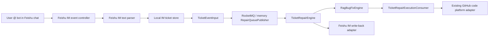

# Feishu IM Ticket Ingestion Design

## Goal

Replace the blocked Feishu Helpdesk ticket entry with a personal-developer-friendly Feishu IM bot entry while preserving the existing RD-Bot repair pipeline: ticket normalization, RocketMQ scheduling, RAG context packaging, Docker execution, and GitHub PR creation.

## Background

The real Helpdesk smoke reached Feishu's permission checks but cannot proceed for a personal developer account because Helpdesk is only available on supported commercial editions. The reference project `EMIYAttk/Intelligent_work_order_Agent` uses a different model: the bot receives Feishu IM messages, creates a local `TK-*` ticket number, and sends the result back to the chat. RD-Bot should adopt this IM entry pattern without replacing its existing standard ticket and repair abstractions.

## Architecture

The new provider is `feishu-im`. It lives in `bootstrap` and adapts Feishu IM events into RD-Bot's existing standard ticket model.



Dependency direction remains unchanged:

- `bootstrap` owns Feishu HTTP/event parsing, IM API calls, local store, and Spring configuration.
- `engine` continues to consume `TicketEventInput` and `RepairTicketMessage`.
- `rag` continues to expose `TicketProviderPort`, `TicketUpdatePort`, `TicketSnapshot`, and `TicketMessage`.

## Provider Selection

Add a provider selector:

```yaml
rd:
  repair:
    ticket:
      provider: mock
```

Supported values:

- `mock`: current local deterministic adapter.
- `feishu-helpdesk`: enterprise/commercial Helpdesk path; existing implementation remains.
- `feishu-im`: new personal-developer-friendly IM bot path.

`mock` remains the zero-config default. Enabling IM mode requires:

```yaml
rd:
  repair:
    ticket:
      provider: feishu-im
      ingestion:
        default-source: feishu-im
  feishu:
    im:
      enabled: true
      app-id: ${FEISHU_APP_ID:}
      app-secret: ${FEISHU_APP_SECRET:}
      require-at-mention: true
      write-back:
        enabled: false
```

## Feishu App Setup

For the personal developer path, do not configure Helpdesk ID or Helpdesk token. Configure a normal custom app bot:

- Enable bot capability.
- Subscribe to message receive events, especially group messages that mention the bot.
- Grant permissions for receiving bot mention messages and sending single/group chat messages.
- Add the bot to the test chat.
- For real Feishu callback testing, expose the RD-Bot callback URL through deployment or tunneling. Local automated tests use HTTP event fixtures instead of Feishu network callbacks.

## IM Text Contract

The first implementation parses simple line-based keys. If keys are missing, the entire message becomes the ticket description and priority defaults to `P2`.

```text
系统: waimai
仓库: github.com/example/waimai
分支: main
优先级: P1
问题: 下单接口 500
日志: NullPointerException at OrderService.create
期望: 下单成功
实际: 返回 500
```

Field mapping:

| IM key | `TicketSnapshot` field |
| --- | --- |
| 系统 | `customFields.problemSystem` |
| 仓库 | `customFields.repository` |
| 分支 | `customFields.branch` |
| 优先级 | `priority` |
| 问题 | `customFields.symptom`, title fallback |
| 日志 | `customFields.logs` |
| 期望 | `customFields.expectedResult` |
| 实际 | `customFields.actualResult` |

`TicketSnapshot.source` is `feishu-im`, and `chatId` is the Feishu `chat_id` so write-back can use the IM send-message API.

## Runtime Behavior

1. Feishu posts a message receive event to `POST /feishu/im/events`.
2. The controller accepts Feishu URL verification by returning `challenge`.
3. Non-text messages are ignored with `accepted=true, ignored=true`.
4. Group messages without bot mention are ignored when `require-at-mention=true`.
5. Text messages are parsed into an internal ticket and stored in the local IM ticket store.
6. The controller emits `TicketEventInput` with event type `feishu.im.message.created_v1`.
7. Existing queue publishing handles RocketMQ or memory mode.
8. `TicketRepairEngine` later reads the ticket through `TicketProviderPort`.
9. When write-back is enabled, `TicketUpdatePort.sendMessage` sends a text message to the original `chat_id`.

## Error Handling

- Empty or invalid JSON callback bodies return `400`.
- URL verification always returns the `challenge`.
- Unsupported events are ignored with a 200 response to avoid Feishu retries.
- Feishu IM API errors return `TicketUpdateResult.failure` and must not expose app secret or access token.
- The local store is synchronized and returns immutable snapshots.

## Testing

Follow TDD:

1. Add failing tests for text parsing and fallback behavior.
2. Add failing tests for local store read/write and immutable snapshots.
3. Add failing controller tests for URL verification, mention filtering, ticket creation, and queue publication.
4. Add failing adapter tests for disabled write-back and IM API request shape.
5. Implement minimal production code to pass each test.
6. Run focused Maven tests:

```bash
./mvnw -pl bootstrap -am -Dtest=FeishuImTicketParserTest,FeishuImTicketStoreTest,FeishuImMessageControllerTest,FeishuImTicketAdapterTest -Dsurefire.failIfNoSpecifiedTests=false test
./mvnw -pl engine -Dtest=TicketRepairEngineTest test
```

7. Run broader verification when focused tests pass:

```bash
./mvnw -pl bootstrap -am test
./mvnw test
```

## Acceptance Criteria

- `rd.repair.ticket.provider=feishu-im` wires exactly one `TicketProviderPort` and one `TicketUpdatePort` for the IM path.
- `rd.repair.ticket.provider=mock` remains the default and existing tests continue to pass.
- Helpdesk implementation remains available for commercial tenants and is not deleted.
- IM event fixtures can create an internal ticket, publish a repair queue message, and expose the ticket through `TicketProviderPort`.
- Queue messages still contain only routing metadata and do not contain full ticket text, logs, app secret, tenant token, or Helpdesk token.
- No Java `gh` CLI adapter is introduced; GitHub PR creation remains through the existing Java code platform adapter.
