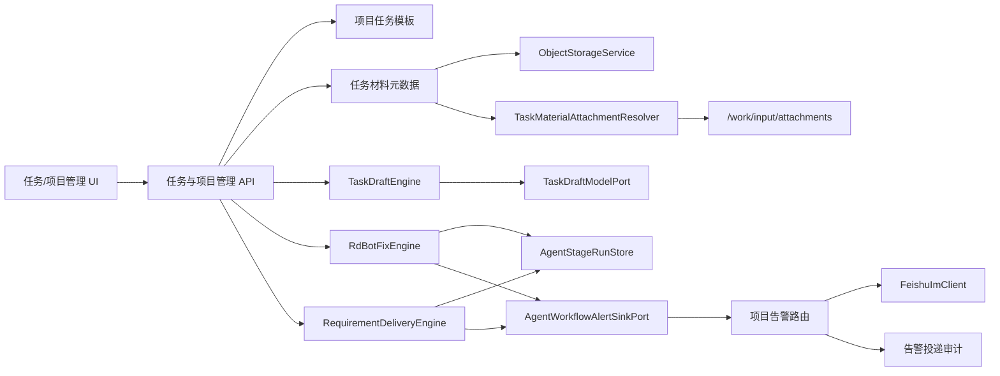

# RD 任务输入、执行透明度与项目告警技术方案

日期：2026-07-10

## 1. 目标

本方案同时解决四个已由管理台截图和源码链路确认的问题：

1. `BUG_FIX` 任务没有阶段运行记录，执行概览错误地按需求四角色计算为 `0/24`。
2. 飞书告警只能使用全局单会话配置，默认关闭，没有项目级收件人、完成告警和投递审计。
3. 任务材料上传只支持需求任务，上传内容被统一按 UTF-8 文本读取，图片没有持久化、预览和执行器消费链路。
4. 新建任务表单字段多，没有项目模板和基于现有证据的 AI 结构化补全。
5. 项目飞书收件人使用混合文本框，群聊和个人目标难以分别维护；预算语义仍使用 USD，不符合运营侧以人民币管理阈值的习惯。

目标不是为页面增加四个孤立控件，而是补齐 RD-Bot 的控制面闭环：

`输入证据 -> 执行阶段 -> 预算/失败事件 -> 项目通知 -> 人工补充/恢复 -> 可审计交付`

## 2. 已确认的真实链路

### 2.1 Bug 修复

`RdTaskController.create/submit -> RdBotFixEngine.runBugFix -> RagBugFixEngine -> AcceptancePlanGeneratorPort -> BugFixExecutor -> EngineBugFixExecutorAdapter -> RepairExecutorPort -> CodePlatformPort`

当前 `RdBotFixEngine` 只推进主任务状态，没有调用 `AgentStageRunStore`，而 `RdTaskExecutionOverviewController` 只读取 `rd_agent_stage_runs`，这是截图中“暂无阶段记录”的直接原因。

### 2.2 需求交付

`RdTaskController.createRequirement/submit -> RequirementDeliveryEngine -> AgentStageRunStore -> RoleContextPackageStore -> RequirementExecutorPort -> EngineRequirementExecutorAdapter -> RepairExecutorPort`

需求任务已有四角色阶段记录，不允许为了兼容 Bug 修复而退回单角色全链路。

### 2.3 飞书告警

`RequirementDeliveryEngine -> AgentWorkflowAlertSinkPort -> EngineAgentWorkflowAlertSink -> RepairAlertSinkPort -> FeishuImRepairAlertSink -> FeishuImClient`

当前接收目标来自 `rd.feishu.im.alert.chat-id`，投递结果只在 JVM 内存中保存；项目表和管理 API 没有告警配置。

### 2.4 任务材料

`RdTaskController.materials/upload -> TaskMaterialStore -> rd_task_materials -> RoleContextBuilder.contentPreview`

现有上传接口只接受需求任务，并将全部字节转成 UTF-8 文本。`ObjectStorageService` 已提供 S3/内存实现，Docker 工作区的 `/work/input` 已只读挂载，适合复用为附件链路。

## 3. 总体架构

## 4. 功能 A：Bug 修复阶段真值

### 4.1 阶段定义

扩展 `AgentRole`，增加只用于 Bug 修复的阶段角色：

- `BUG_EVIDENCE_COLLECTOR`：工单、日志、人工材料和项目快照就绪。
- `BUG_RAG_RETRIEVER`：RAG 检索和证据包生成。
- `BUG_ACCEPTANCE_PLANNER`：验收计划生成与校验。
- `BUG_CODING_AGENT`：隔离环境编码、测试和 PR 结果回收。

`AgentRole.requirementDeliveryOrder()` 保持原四角色；新增 `AgentRole.bugFixOrder()`。执行概览必须根据 `taskType` 选择顺序，禁止把两套角色混排。

### 4.2 阶段记录器

新增 `BugFixStageRecorder`，职责仅限：

- 按 `(taskId, role, attemptNo)` 创建阶段运行。
- 对失败终态创建新 attempt，不复活旧记录。
- 按合法状态机推进 `PENDING -> CONTEXT_READY -> DISPATCHING -> RUNNING -> RESULT_COLLECTING -> VERIFYING -> SUCCEEDED`。
- 保存 `INPUT/PROMPT/RESULT` 产物，绑定到 `AgentStageRun`。
- 执行失败时写 `FAILED_RETRYABLE` 或 `FAILED_NEEDS_HUMAN`，保留错误分类。

`RdBotFixEngine` 只在实际边界调用记录器，不自行拼装数据库行。

### 4.3 展示契约

`GET /admin/rd-tasks/{taskId}/execution-overview` 返回：

- `workflowType`: `BUG_FIX` 或 `REQUIREMENT`。
- `stageRuns`: 当前任务类型对应的阶段。
- `progressTotal`: 当前顺序长度乘以 6，不再固定使用需求角色。
- `currentRole/currentStageStatus`: 当前任务类型的最新未完成阶段。

前端为 Bug 阶段提供中文名称，并展示 attempt、provider、耗时、产物预览和错误原因。

## 5. 功能 B：项目级飞书告警

### 5.1 项目告警配置

新增 `rd_project_alert_configs`，每个项目一条配置：

- `project_id`：主键并引用 `rd_projects.id`。
- `enabled`：项目告警总开关。
- `recipients_json`：收件人数组，元素为 `{type: CHAT_ID|OPEN_ID, value: ...}`。
- `event_types_json`：启用事件数组。
- `budget_threshold_cny`：项目预算告警阈值，单位为人民币元。
- `failure_threshold`：可重试失败达到多少次后发送“失败过多”。
- `created_at/updated_at`。

管理接口：

- `GET /admin/projects/{projectId}/alert-config`
- `PUT /admin/projects/{projectId}/alert-config`

首期事件：

- `TASK_COMPLETED`
- `TASK_BLOCKED`
- `TASK_FAILED`
- `RETRY_EXHAUSTED`
- `BUDGET_EXCEEDED`
- `QA_FAILED`

### 5.2 投递审计

新增 `rd_alert_deliveries`：

- `id/task_id/project_id/alert_type`
- `recipient_type/recipient_id`
- `status`: `SENT` 或 `FAILED`
- `provider_message_id/failure_code/failure_message`
- `idempotency_key`
- `created_at`

幂等键为 `taskId + alertType + stageRunOrRepairRecordId + recipientType + recipientId`。同一事件不得重复打扰同一收件人。

### 5.3 路由规则

`FeishuImRepairAlertSink` 保持唯一 `RepairAlertSinkPort` 实现，并升级为项目感知路由：

1. 根据 `alert.taskId` 查询任务及 `projectId`。
2. 查询项目配置并映射事件类型。
3. 对 `STAGE_FAILED_RETRYABLE` 使用 `attemptNo >= failureThreshold` 判断是否发送。
4. 对 `BUDGET_WARNING` 使用项目人民币阈值；没有项目阈值时沿用执行器人民币阈值。
5. 对匹配的 `CHAT_ID/OPEN_ID` 调用 Feishu API。
6. 每次投递写审计表；失败不能反向打断任务。
7. 全局 `FEISHU_IM_ALERT_CHAT_ID` 只保留为系统级兜底，且与项目收件人去重。

告警正文必须包含 `taskId/project/阶段/状态/原因/nextAction/管理台链接`，并继续执行 secret 脱敏。

## 6. 功能 C：图片材料与执行器附件

### 6.1 上传与存储

修改材料上传接口，使 `BUG_FIX` 和 `REQUIREMENT` 都可使用。规则：

- 允许 `image/png`、`image/jpeg`、`image/webp`、`image/gif` 及现有文本格式。
- 单文件最大 10 MiB，单任务最多 10 个附件。
- 二进制写入 `ObjectStorageService` 的 `rd-task-materials` bucket。
- `rd_task_materials.artifact_uri` 保存对象 URI；数据库不保存二进制和 base64。
- 图片 `content_preview` 只保存文件名、MIME、尺寸等安全摘要，不按 UTF-8 解码。
- 内容 hash 以原始字节计算。

新增材料类型 `SCREENSHOT` 和 `REFERENCE_IMAGE`。

### 6.2 预览

新增：

- `GET /admin/rd-tasks/{taskId}/materials/{materialId}/content`

接口校验材料归属后从对象存储读取，返回原 MIME、`Content-Disposition:inline` 和 `Cache-Control:private`。前端仅对 `image/*` 渲染缩略图，其他材料仍显示文本预览和下载入口。

### 6.3 执行器消费

新增 `RepairInputAttachment` 并扩展 `RepairJobCommand.attachments`。旧构造器保留，默认空列表。

`TaskMaterialAttachmentResolver` 只解析有 `artifactUri` 的允许类型材料，并在 bootstrap 适配层读取对象存储。`RepairWorkspaceFactory` 将附件写入：

`/work/input/attachments/<safe-filename>`

`context.json` 增加附件 manifest。Bug 和需求执行 prompt 都明确要求先检查该目录；模型不支持视觉时仍可通过文件名、上下文摘要和后续 OCR/图像描述扩展降级，不伪称已理解图片内容。

## 7. 功能 D：项目模板与 AI 辅助填充

### 7.1 项目模板

新增 `rd_project_task_templates`，主键为 `(project_id, task_type)`。字段：

- `name`
- `actual_behavior`
- `expected_behavior`
- `reproduction_steps`
- `affected_scope`
- `acceptance_criteria_json`
- `requirement_body`
- `expected_result`
- `created_at/updated_at`

接口：

- `GET /admin/projects/{projectId}/task-templates/{taskType}`
- `PUT /admin/projects/{projectId}/task-templates/{taskType}`

项目管理页面提供“模板”配置；新建任务选择项目后可以一键应用，不覆盖用户已经填写的非空字段，除非用户明确确认覆盖。

### 7.2 AI 结构化补全

新增 engine 端口和用例：

- `TaskDraftModelPort`
- `TaskDraftEngine`
- `TaskDraftRequest`
- `TaskDraftResult`

管理接口：

- `POST /admin/rd-task-drafts/complete`

输入只包含用户当前填写内容、项目公开信息和材料安全摘要；输出固定字段：

- Bug：`actualBehavior/expectedBehavior/reproductionSteps/affectedScope/acceptanceCriteria`
- 需求：`requirementBody/expectedResult/acceptanceCriteria`
- 通用：`missingFields/evidence/confidence/aiGenerated`

模型输出必须通过结构化校验。AI 不得自动提交任务；前端展示“AI 草稿”标记，用户确认后才进入普通保存流程。缺少模型密钥时接口返回 `available=false` 和可读原因，不回退为伪 AI 结果。

## 8. 前端交互

保持现有安静、工作台式视觉，不新增营销式页面：

- 新建任务弹窗增加顶部“项目模板”选择和 `AI 补全` 命令按钮。
- 附件区域支持拖拽/多选、缩略图、删除和大小提示。
- 任务详情材料区支持图片预览和“补充材料”。
- 项目列表操作区增加图标按钮“模板”和“告警”，复杂配置放独立弹窗。
- 二进制开关使用 Checkbox，事件类型使用 Checkbox 组。
- 飞书收件人改为“群聊告警”和“个人用户告警”两个独立可编辑列表；每个列表右侧使用带 Tooltip 的 `Plus` 图标添加一行，行内使用 `Trash2` 图标删除。两个列表都允许为空；保存时去除空行并按类型和值去重。
- 群聊输入只接受非空 `oc_` 前缀 chat ID，个人输入只接受非空 `ou_` 前缀 open ID；显示占位符而不是要求用户输入 `CHAT_ID:`/`OPEN_ID:` 前缀。

## 9. 安全与失败处理

- 不保存或回显飞书 app secret、模型 API key。
- 文件名去路径、拒绝目录穿越和符号链接；MIME 与扩展名双校验。
- 图片不进入 prompt base64，避免上下文爆炸和日志泄漏。
- Feishu 投递失败只写投递审计，不修改任务成功状态。
- AI 返回非法 JSON、字段缺失或超时，返回 `available=false`，保留用户原输入。
- 阶段失败必须创建新 attempt，禁止转换终态旧记录。

## 10. 验收不变量

1. 已成功完成的 Bug 任务必须至少有四条阶段记录，且不再显示需求角色的空 `0/24`。
2. 项目告警配置重启后仍存在；匹配事件只向配置收件人发送一次并有投递审计。
3. 图片上传后 PostgreSQL 只有元数据，对象存储有原字节；详情页能预览，执行工作区能看到附件文件。
4. 模板应用不覆盖用户非空字段；AI 草稿必须标识来源且不能自动执行。
5. 所有新增管理数据使用 PostgreSQL 真值，不使用 JVM `Map` 作为生产实现。
6. 所有 secret 扫描无明文凭证。

## 11. 增补：收件人编辑与人民币预算

本节在 2026-07-10 经用户确认，覆盖已落地的项目告警配置实现。

### 11.1 收件人编辑契约

前端把当前后端的 `recipients: [{type, value}]` 映射为两个状态数组：

- `chatRecipients: string[]` 对应 `CHAT_ID`。
- `userRecipients: string[]` 对应 `OPEN_ID`。

点击任意栏目标题右侧的 `Plus`，只向该数组追加一个空字符串；点击行内 `Trash2` 只删除该行。空白数组是合法配置，表示该项目没有这一类型的接收人。保存时：

1. `trim` 每个值，过滤空行。
2. 校验群聊为 `oc_` 前缀、用户为 `ou_` 前缀；非空但格式错误时阻止保存并定位到对应栏目。
3. 重新组装为原有 API 的 `[{type: CHAT_ID, value}, {type: OPEN_ID, value}]`，保持后端和投递审计契约不变。
4. 后端继续允许空收件人数组；启用项目告警但没有收件人时不向外部系统发送，记录本地可诊断结果而不改变任务状态。

桌面端两个列表并排，窄屏下堆叠。每个列表独立显示空状态，不使用一个混合大文本框。

### 11.2 人民币预算契约

RD-Bot 的预算域统一使用人民币元（CNY）。模型或 provider 返回的 USD 只允许在 provider 边界短暂存在，进入执行预算、任务概览、项目阈值和告警前必须规范化为 CNY。

- 固定换算率：`1 USD = 7.20 CNY`。
- 新配置项：`rd.financial.cny-per-usd: 7.20`，环境变量为 `RD_FINANCIAL_CNY_PER_USD`。不调用实时汇率服务，防止同一任务因汇率波动产生不可复现的告警结果。
- 全局执行器配置更名为 `budget-alert-cny`，默认值为 `36.00`，即原 `$5.00` 的等价金额。
- API/前端字段统一使用 `estimatedSpendCny`、`budgetAlertCny`、`budgetThresholdCny`；UI 使用 `¥` 和 `zh-CN` 金额格式，不再显示 USD。
- 预算比较和告警 metadata 均使用 CNY。保留原始 provider 成本值仅限私有解析/调试，不进入管理 API、Feishu 告警或持久化预算真值字段。
- 金额内部使用 `BigDecimal` 保留 4 位小数，展示保留 2 位；例如 `$0.12` 规范化为 `¥0.8640`，页面显示 `¥0.86`。

### 11.3 已有 PostgreSQL 数据迁移

为避免重复执行 SQL 时重复换算，迁移采用新增列而不是就地反复乘法：

1. 增加 `rd_project_alert_configs.budget_threshold_cny`，初始允许为空。
2. 仅当 CNY 列为空时执行 `round(budget_threshold_usd * 7.20, 4)`；此后 CNY 列成为唯一生产读取/写入字段。
3. 保留 `budget_threshold_usd` 作为只读历史列，后续独立大版本迁移再删除，避免回滚和灰度期间丢失审计信息。
4. 项目配置中已有 `7.5000 USD` 阈值迁移后必须为 `54.0000 CNY`；新写入不再更新 USD 列。

### 11.4 验收标准

1. 群聊、个人用户任一列表可以单独为空；两个列表都为空也能保存，并且后端收到空 `recipients`。
2. 点击 `Plus` 只增加对应类型的输入行，删除只影响目标行；保存后的 `GET` 能恢复到对应两个栏目。
3. 非空且没有 `oc_`/`ou_` 前缀的值无法保存；旧 `CHAT_ID:`/`OPEN_ID:` 文本框格式不再出现在 UI。
4. 全局、项目、任务概览和 Feishu 预算字段不再暴露 `Usd` 命名或 `$` 符号，统一返回/显示 CNY。
5. `$0.12` 的 provider 费用按固定汇率形成 `0.8640 CNY`；`36.00 CNY` 阈值与原 `$5.00` 的告警边界一致。
6. PostgreSQL 迁移连续执行两次后，已有 `7.5000 USD` 只换算一次并保持 `54.0000 CNY`。

## 12. 非目标

- 本轮不实现视频转写。
- 本轮不宣称所有 provider 都原生支持视觉；只保证附件被安全交付给执行环境。
- 本轮不实现飞书卡片按钮审批；保留 `nextAction` 和任务链接。
- 本轮不自动修改用户输入或自动提交 AI 草稿。
- 本轮不接入实时外汇、汇率历史曲线或多币种选择；CNY 是唯一面向用户和预算域的货币。

## 13. 增补：新建任务图片确认与本地开发反馈闭环

### 13.1 待上传图片确认

- 新建任务选择图片后，在操作栏下方展示缩略图卡片；卡片包含真实预览、文件名、文件大小和删除按钮。
- 删除只影响尚未提交的前端待上传列表；创建任务时仅上传剩余图片。
- 多次选择图片时追加并去重，继续执行单张 10 MiB、最多 10 张及 PNG/JPEG/WebP/GIF 限制。
- 关闭或重新打开新建任务弹窗时撤销所有临时 Object URL，避免浏览器内存泄漏。

### 13.2 模板与 AI 操作反馈

- “应用模板”依赖已选择项目；未选择项目时必须显示可见提示，不能静默返回。
- 管理端所有 `sonner` 通知必须由应用根节点挂载的 `Toaster` 承接，同时保留旧 `rd-bot-toast` 宿主以兼容历史页面。
- Vite 开发服务器必须把 `/admin/rd-task-drafts` 转发到 Spring Boot；导航 bypass 仅用于页面 GET，不得吞掉草稿 POST。
- Spring Boot 接口不可用和模型凭证未配置是两类错误：前者显示 HTTP/网络错误，后者使用接口返回的 `available=false` 原因，不伪造 AI 草稿。

### 13.3 增补验收

1. 选择两张图片后显示两张缩略图，删除一张后计数与提交列表都只剩一张。
2. 删除后可再次选择同一文件，文件输入值必须在每次选择后清空。
3. 未选择项目点击“应用模板”能看到“请先选择项目”；选择项目后模板内容填入空字段且不覆盖非空字段。
4. 通过 `localhost:5173` 调用 AI 补全时请求由 Vite 转发，不能再返回 Vite 的 404；无模型凭证时显示后端的可读原因。
