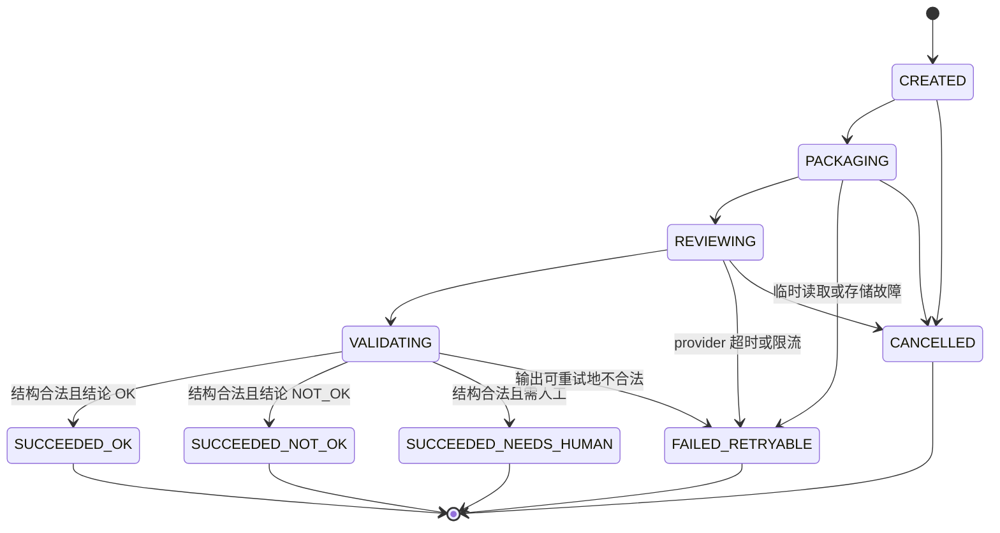

# RD 任务阶段重试与 AI 交付评审设计

日期：2026-07-13

## 1. 目标

本设计交付两个相互衔接的控制面能力：

1. 失败任务可在任务详情右上角发起重试，并从真实失败检查点继续，而不是从头重复已成功阶段。
2. 需求四角色执行结束后，把任务材料、RAG 检索过程与结果、角色上下文、Prompt、角色结果、测试和交付产物完整纳入 AI 评审，由模型输出结构化结论并作为 PR 发布前的强门禁。

本设计不改变四角色顺序，也不把 AI 评审伪装成第五个 `AgentRole`。任务、角色阶段、RAG 检索、AI 评审仍是四层独立状态机，通过 ID 和事件关联。

## 2. 已确认决策

- 采用独立 `TaskRetryEngine` 与独立 `AiReviewRun`，不把恢复逻辑放进 Controller，也不把模型调用塞进现有规则复核器。
- AI 评审自动发生在四角色及确定性复核通过之后、PR 发布之前，同时允许人工重新评审。
- AI 评审是强门禁：`NOT_OK` 或 `NEEDS_HUMAN` 阻止 PR 发布，任务进入 `FAILED_NEEDS_HUMAN`。
- AI 评审必须返回建议重试角色；用户点击重试后从该角色创建新 attempt，不能修改旧终态记录。
- 模型或基础设施临时故障进入 `FAILED_RETRYABLE`，不把“模型不可用”误判成业务 `NOT_OK`。
- 所有生产可见状态和评审结果以 PostgreSQL 为真值；内存实现只用于单测或显式 memory profile。
- 管理 API、日志和页面只展示脱敏预览；评审模型输入由受控打包器从可信 Store 读取，不允许页面回传原始上下文。

## 3. 方案选择

### 3.1 采用方案：独立控制面状态机

`TaskRetryEngine` 负责定位恢复点、生成重试 attempt 和重新派发。`AiDeliveryReviewEngine` 负责上下文快照、模型调用、结构校验、门禁决策和审计。

优点：

- 确定性规则复核与概率型 AI 评审边界清楚。
- AI 评审可单独重试、取消、审计，不污染 `AgentStageStatus`。
- 任务重试可覆盖角色、RAG、AI 评审和 PR 发布，不依赖错误字符串猜测。
- 后续可以更换评审模型或评分规则，而不修改四角色执行器。

### 3.2 不采用：扩展 `RequirementDeliveryReviewer`

现有 `RequirementDeliveryReviewer` 只做确定性 JSON/产物完整性校验。直接加入模型调用会把“证据不完整”“模型超时”“模型认为不通过”混成同一种失败，且难以单独重试和观测。

### 3.3 不采用：新增第五个 `AgentRole`

AI 评审消费的是整条交付链路，而非一个角色的局部上下文。作为第五角色会破坏既有四角色顺序、角色上下文独立性、阶段进度统计和经验类型映射。

## 4. 状态模型

### 4.1 任务重试检查点

新增 `TaskRetryCheckpoint`：

- `checkpointId`
- `taskId`
- `sourceTaskStatus`
- `failurePhase`
- `retryFromRole`
- `failedStageRunId`
- `failedRetrievalRunId`
- `failedAiReviewRunId`
- `attemptNo`
- `reason`
- `status`
- `createdAt / startedAt / finishedAt`

`failurePhase` 固定为：

- `MATERIAL`
- `CONTEXT`
- `PLAN`
- `POLICY`
- `RAG`
- `AGENT_ROLE`
- `DETERMINISTIC_REVIEW`
- `AI_REVIEW`
- `PR_PUBLICATION`

检查点状态为 `CREATED, DISPATCHED, SUCCEEDED, FAILED_RETRYABLE, FAILED_NEEDS_HUMAN, CANCELLED`。

每次重试创建新检查点，禁止覆盖历史。并发重试同一失败快照时，只允许一个检查点通过幂等键 `(taskId, sourceTaskVersion, failurePhase, retryFromRole)` 创建成功，其他请求返回 `409` 和已创建的检查点信息。

### 4.2 AIReviewRun 状态机



终态 Run 不得原地复活。重新评审创建 `attemptNo + 1` 的新 Run，通过 `parentRunId` 关联。

### 4.3 AI 评审决策

模型输出决策固定为：

- `OK`：允许进入 `PR_CREATING`。
- `NOT_OK`：任务进入 `FAILED_NEEDS_HUMAN`，必须包含问题和 `retryFromRole`。
- `NEEDS_HUMAN`：证据冲突、需求本身不明确或无法自动判断；任务进入 `FAILED_NEEDS_HUMAN`。

模型/provider 失败不产生以上业务决策，而是 `FAILED_RETRYABLE`。达到最大模型尝试次数后转任务 `FAILED_NEEDS_HUMAN`，错误类型明确为 `AI_REVIEW_PROVIDER_EXHAUSTED`。

## 5. 从失败阶段重试

### 5.1 恢复点解析

`TaskRetryPointResolver` 只读取结构化状态，不从自由文本错误消息推断：

1. 查询最新 `AiReviewRun`。若任务因 AI 评审失败，使用其 `retryFromRole`。
2. 查询每个角色最新 `AgentStageRun`。若存在最新失败 attempt，恢复点为最早失败角色。
3. 查询与失败角色绑定的 RetrievalRun。若其失败且角色尚未开始，恢复点为 `RAG` 并绑定该角色。
4. 若角色全部成功，根据任务状态事件和持久化阶段标记区分 `DETERMINISTIC_REVIEW`、`AI_REVIEW`、`PR_PUBLICATION`。
5. 无法得到唯一恢复点时拒绝自动重试，返回 `409 RETRY_POINT_AMBIGUOUS`，不得退化为从头执行。

权威恢复点是 `TaskFailureRecoveryService.snapshot()` 读到的 durable provenance，而不是“最新失败 AgentStageRun”启发式。`TaskRetryEngine.preview()` 必须返回同一 `retryPoint()`，否则发布失败会出现 `/failure-recovery` 200、`/retry-preview` 409。技术耗尽与发布失败如何写 provenance、GitHub 422 如何视为缺席，见 `docs/superpowers/specs/2026-08-13-requirement-publication-preflight-and-retry-provenance-spec.md`。

### 5.1.1 派发真值与提交边界

普通需求交付和 umbrella 提交仍以 `rd_requirement_delivery_jobs` 为持久化派发真值：先落 job，再由 worker 租约领取。checkpoint-bound 阶段重试是窄化例外；其 `PostgresRequirementRetryDispatchTransactionAdapter.initialize(...)` 在一个初始化事务内写入任务 `RECOVERING` 快照/状态事件、retry checkpoint、替换 attempt 与 binding、以及首个 `rd_requirement_stage_commands` 行，并把 checkpoint 提交为 `DISPATCHED`。该 command 是重试派发真值，不应为同一 retry 无条件再建 umbrella job。

该事务提交前的任一失败必须整体回滚上述写入，任务不得停留在 `RECOVERING`。提交成功后，`RequirementTaskRetryDispatcherAdapter.dispatch(checkpointId)` 只按 checkpoint 中的精确 command ID 唤醒持久化 `PENDING` command；本地线程池拒绝不构成准备失败，不得补偿已提交的 checkpoint、任务或 attempt。进程重启和调度恢复也必须领取同一 command ID；只有在同一原子事务证明该 command 不可用时才能补偿。

### 5.2 各恢复点行为

| 恢复点 | 保留内容 | 新建内容 | 继续位置 |
| --- | --- | --- | --- |
| `RAG` | 旧 RetrievalRun/Artifact | 新 RetrievalRun attempt | 对应角色上下文重建 |
| `AGENT_ROLE` | 上游成功阶段及其产物 | 失败角色 `attemptNo + 1`、新角色上下文和 RAG Run | 失败角色 |
| `DETERMINISTIC_REVIEW` | 四角色成功结果 | 新规则复核记录 | 确定性复核 |
| `AI_REVIEW` | 四角色、RAG、规则复核结果 | 新 AIReviewRun | AI 评审 |
| `PR_PUBLICATION` | 全部评审成功结果 | 新 PR 发布 attempt | PR 发布 |

AI 评审返回 `retryFromRole=CODING_AGENT` 时，旧 `CODING_AGENT` 和 `QA_AGENT` 记录保持不变；创建新的 CODING attempt，QA 在新的编码成功后创建新的 attempt。上游 `REQUIREMENT_REVIEWER` 和 `SOLUTION_ARCHITECT` 成功记录可复用，但新角色上下文必须重新绑定最新 RAG/上游证据版本。

### 5.3 任务状态

重试入口只接受 `REJECTED, FAILED_RETRYABLE, FAILED_NEEDS_HUMAN`。不接受 `COMPLETED, CANCELLED, DEAD_LETTERED, DELETED`。

合法链路：

`失败终态 → RECOVERING → 对应业务状态 → 后续正常状态`

任务快照和状态事件必须由同一事务端口写入。普通交付由持久化 `rd_requirement_delivery_jobs` 重新派发；checkpoint-bound 重试由同一初始化事务持久化的 `rd_requirement_stage_commands` 精确 command 重新派发。两条路径均不能依赖 Controller 线程直接执行。

验收至少覆盖：初始化写入任一点失败时完整回滚；初始化已提交但本地调度被拒绝时仍可从 `DISPATCHED` checkpoint、`RECOVERING` task 和 `PENDING` command 恢复；以及重启后 dispatcher 只能按 checkpoint 的 command ID 领取。

## 6. AI 评审输入

### 6.1 完整上下文清单

`AiReviewPackageBuilder` 按固定顺序构建不可变快照：

1. 任务元数据、需求正文、预期结果和验收标准。
2. 用户材料元数据、hash 和可安全读取的正文；二进制材料只提供可信解析结果与 URI，不内联原始字节。
3. 需求基础上下文、计划和策略决策。
4. 每个 RetrievalRun 的 scope、query、计划、状态事件、通道结果、候选内容、最终证据、质量报告和上下文包。
5. 四角色每个 attempt 的状态和失败信息；模型主输入使用各角色最新成功 attempt，同时保留旧失败 attempt 摘要供审计。
6. 四角色的 RoleContextPackage、Prompt、Result 和附属产物。
7. 编码变更文件、测试命令、日志、QA 验收证据和确定性交付复核结果。
8. 已存在的 PR 发布信息；首次自动评审时该项为空，PR 发布失败后的人工重评可包含历史 attempt。

每个输入段包含 `sourceType, sourceId, contentHash, contentLength, redacted, content`，使模型结论可以引用来源。

### 6.2 上下文预算

默认最大单次模型输入 `80_000 chars`，由 `RD_AI_REVIEW_MAX_INPUT_CHARS` 覆盖。

当完整输入超过预算时，不允许静默截断：

1. 按 `TASK / RAG / ROLE / QA / DELIVERY` 分区生成 part。
2. 每个 part 单独调用同一评审模型生成带引用的中间判断。
3. 最终调用消费全部 part 结论和完整 source manifest，生成最终决策。
4. Package 记录 `partCount, sourceCount, totalChars, omittedSourceCount`；`omittedSourceCount` 必须为 `0` 才允许完成评审。

这保证所有上下文均被模型处理，同时避免把无界正文强塞进一次调用。

## 7. 模型契约

`engine` 新增 `AiDeliveryReviewModelPort`，`bootstrap` 实现 provider 适配器。核心模块不依赖外部 SDK。

模型必须只返回一个 JSON object：

```json
{
  "decision": "OK",
  "score": 92,
  "summary": "需求实现与验收标准一致",
  "retryFromRole": "",
  "dimensions": [
    {"name": "requirement_alignment", "score": 95, "reason": "...", "sourceIds": ["..."]},
    {"name": "rag_evidence_quality", "score": 90, "reason": "...", "sourceIds": ["..."]},
    {"name": "technical_design", "score": 90, "reason": "...", "sourceIds": ["..."]},
    {"name": "code_delivery", "score": 90, "reason": "...", "sourceIds": ["..."]},
    {"name": "qa_acceptance", "score": 95, "reason": "...", "sourceIds": ["..."]}
  ],
  "findings": [
    {"severity": "HIGH", "title": "...", "detail": "...", "sourceIds": ["..."], "suggestion": "..."}
  ]
}
```

校验规则：

- 禁止 code fence、尾随 token 和非 object 根节点。
- `score` 与维度分数必须在 `0..100`。
- `NOT_OK` 必须至少有一个 `HIGH` 或 `CRITICAL` finding，并提供合法 `retryFromRole`。
- `retryFromRole` 只能为四个需求角色之一；`OK` 时必须为空。
- 所有 `sourceIds` 必须存在于本次 Package manifest，禁止模型编造引用。
- 未满足契约时本次模型 attempt 失败，不得使用规则文本冒充 AI 结果。

## 8. 持久化

新增 SQL `bootstrap/src/main/resources/sql/postgres/p3_task_retry_ai_review.sql`：

- `rd_task_retry_checkpoints`
- `rd_ai_review_runs`
- `rd_ai_review_events`
- `rd_ai_review_artifacts`

`rd_ai_review_artifacts` 类型包括：

- `INPUT_MANIFEST`
- `INPUT_PART`
- `MODEL_REQUEST`
- `MODEL_RESPONSE`
- `VALIDATION_REPORT`
- `FINAL_REPORT`

数据库只保存脱敏预览、hash、对象 URI 和 metadata。完整模型请求/响应若超过数据库预览预算，通过既有对象存储端口保存，URI 与 hash 落库。Run 状态更新与 Event 插入必须同一事务，使用乐观锁 version；领取评审任务使用数据库租约和 `FOR UPDATE SKIP LOCKED`，禁止 JVM `synchronized`。

迁移脚本必须可重复执行两次，并在真实 PostgreSQL 中用 `to_regclass` 验证四张表存在。

## 9. 编排接入

需求主流程调整为：

`四角色完成 → VALIDATING(确定性复核) → VALIDATING(AiReviewRun 活跃) → PR_CREATING → COMMITTED`

不扩张 `AgentRole`。任务主状态暂复用 `VALIDATING` 表达确定性复核和 AI 评审，具体子阶段由 `AiReviewRun` 表达，避免增加大量 `RdTaskStatus` 并破坏既有兼容性。

`RequirementDeliveryEngine` 在确定性复核通过后调用 `AiDeliveryReviewEngine.startOrReuse(taskId)`：

- `SUCCEEDED_OK`：继续 PR 发布。
- `SUCCEEDED_NOT_OK / SUCCEEDED_NEEDS_HUMAN`：写任务人工失败、告警和失败经验。
- `FAILED_RETRYABLE`：任务进入 `FAILED_RETRYABLE`，允许右上角重试。
- 活跃 Run：异步任务保持 `VALIDATING`，Worker 完成后继续派发。

AI 评审不得在 HTTP 请求线程同步等待外部模型。提交评审前先持久化 Run/Job，再由 Worker 领取。

## 10. 管理 API

新增：

- `GET /admin/rd-tasks/{taskId}/retry-point`
- `POST /admin/rd-tasks/{taskId}/retry`
- `GET /admin/rd-tasks/{taskId}/retry-checkpoints`
- `GET /admin/rd-tasks/{taskId}/ai-reviews`
- `POST /admin/rd-tasks/{taskId}/ai-reviews`
- `GET /admin/ai-reviews/{runId}`
- `GET /admin/ai-reviews/{runId}/timeline`
- `GET /admin/ai-reviews/{runId}/artifacts`
- `POST /admin/ai-reviews/{runId}/retry`
- `POST /admin/ai-reviews/{runId}/cancel`

非法任务状态、重复并发重试或非法 Run 转移返回 `409`；未知 ID 返回 `404`；参数错误返回 `400`。所有响应使用 record，不返回原始密钥、完整 Prompt、完整材料或模型思维链。

## 11. 管理端

### 11.1 失败重试

任务详情右上角在可重试失败态显示 `RotateCcw` 图标按钮和 Tooltip“从失败阶段重试”。点击后打开确认弹窗，展示：

- 失败阶段
- 失败角色
- 旧 attempt
- 将保留的成功阶段
- 将重新执行的阶段
- 失败原因

确认成功后显示新检查点和 attempt，刷新任务、阶段、RAG、AI 评审和时间线。请求期间按钮禁用，避免重复提交。

### 11.2 AI 评审面板

任务详情增加独立“AI 评审”全宽区块，不嵌套在 RAG 卡片中：

- Run/attempt、状态、模型、耗时、总分和决策。
- 五个维度评分。
- Findings 列表，支持按严重度扫描。
- 每个 finding 的来源引用，可跳到 RAG Run 或角色产物。
- 输入覆盖率、part 数、source 数和上下文预算。
- 活跃 Run 每 `2s` 轮询，终态停止。
- 人工重新评审按钮创建新 attempt，不修改旧 Run。

移动端弹窗使用单列布局和内部滚动；长 ID、hash、Prompt/Result 预览必须换行，不得横向撑破页面。

## 12. 日志、指标和告警

日志统一使用 `[AI_REVIEW]`：

- `START`
- `PACKAGE`
- `PART`
- `MODEL_CALL`
- `DECISION`
- `FAILURE`

日志只包含 taskId/runId/attempt、计数、hash、脱敏预览和错误分类。

新增指标：

- `rd_bot_task_retry_total{phase,result}`
- `rd_bot_ai_review_total{decision,status}`
- `rd_bot_ai_review_duration_seconds`
- `rd_bot_ai_review_input_chars`
- `rd_bot_ai_review_part_total`
- `rd_bot_ai_review_finding_total{severity}`
- `rd_bot_ai_review_provider_failure_total{category}`

告警必须包含 `taskId, runId, decision, retryFromRole, reason, nextAction`，覆盖 provider 耗尽、AI 强门禁阻断和非法引用。

## 13. 安全边界

- Package 构建前统一执行凭证、Authorization、Cookie、token、个人信息和仓库密钥脱敏。
- 模型只能接收当前 task/project 的 Store 数据；任何跨项目 RAG、artifact 或 context ID 立即失败并增加 scope violation 指标。
- 用户材料中的指令属于不可信内容，系统 Prompt 明确要求仅将其作为评审证据，不能改变评审协议或调用工具。
- 模型输出不执行命令、不修改代码、不创建 PR，仅生成结构化评审结论。
- 页面和列表接口不返回完整模型请求、完整文档或思维链。

## 14. 测试与验收

### 14.1 自动化

- 重试点解析：每种 failure phase、歧义检查、不可重试终态。
- 阶段重试：旧 attempt 不变、新 attempt 递增、上游成功复用、下游重新创建。
- 并发：同一失败快照并发重试只有一个成功。
- Package：包含任务、RAG 全过程、四角色上下文/Prompt/Result、QA 和规则复核；跨项目数据为 0。
- 超预算：所有 source 被 part 覆盖，`omittedSourceCount=0`。
- 模型输出：OK、NOT_OK、NEEDS_HUMAN、非法 JSON、非法引用、非法分数、provider 超时。
- 门禁：NOT_OK 不创建 PR，OK 才进入 PR 发布。
- API：正常 2xx、未知 404、非法转移/重复提交 409。
- 前端：失败态显示重试按钮；终态评审停止轮询；长文本无溢出。

### 14.2 真实验收

至少记录以下证据：

1. 构造 `CODING_AGENT` 失败任务，点击右上角重试；数据库出现 coding attempt 2，reviewer/architect 无新 attempt，随后 QA 创建新 attempt。
2. 构造 PR 发布失败任务，重试后只增加 PR 发布 attempt，不新增四角色 attempt。
3. 完成一条需求四角色链；AI 输入清单能反查全部 RAG Run/Artifact、四角色 Context/Prompt/Result 和 QA 证据。
4. AI 返回 `NOT_OK`；任务进入 `FAILED_NEEDS_HUMAN`、无 PR、页面显示 finding 与引用。
5. 从 AI 建议角色重试；新阶段 attempt 完成后创建 AIReviewRun attempt 2，旧评审保持不变。
6. AI 返回 `OK`；任务进入 PR 发布并保留最终评审报告。
7. provider 超时；Run=`FAILED_RETRYABLE`，不产生伪造业务决策。
8. 桌面与移动浏览器检查右上角按钮、确认弹窗、评审评分和长内容。
9. PostgreSQL 反查同一 taskId 下 checkpoint、stage、retrieval、review 和 task event，禁止拼接不同任务证据。
10. 验收启动的 Spring Boot/Vite 实例在验证结束后全部关闭，并用端口反查确认。

证据报告写入：

`docs/qa/2026-07-13-task-stage-retry-ai-delivery-review-acceptance.md`

证据目录：

`qa-runs/task-stage-retry-ai-review/<timestamp>/`

## 15. 完成定义

以下条件全部满足才算完成：

- 失败任务可以从可证明的失败检查点继续，旧终态 attempt 不被修改。
- AI 模型实际消费完整需求执行上下文或其无遗漏分片，页面可追溯输入覆盖。
- AI `NOT_OK` 能阻止 PR，修复后可从建议角色重试。
- PostgreSQL、API、日志、指标和管理端均可查询重试与评审事实。
- 模块测试、全量 Maven、前端 typecheck/build、真实 HTTP/DB/浏览器验收完成。
- 所有本轮启动的测试服务关闭，无遗留监听端口。
