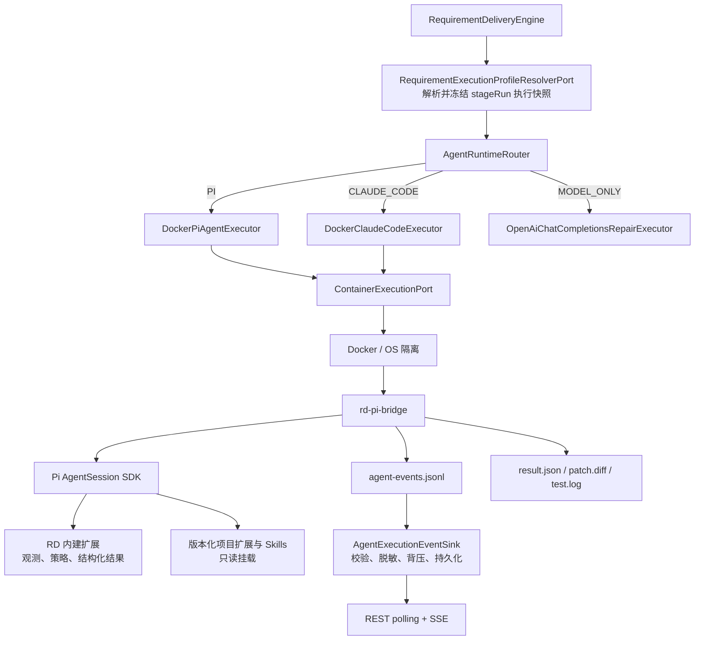
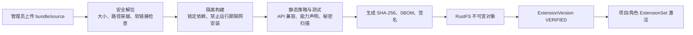

# RD-Bot Pi Agent 运行时接入设计草案

> 日期：2026-07-26  
> 状态：架构决策已确认，待按实施计划落地  
> 范围：执行器切换、Pi SDK 事件接入、扩展 H1 注入、已裁决边界记录

## 1. 已确认方向与决策状态

用户已经确认的方向：

1. RD-Bot 要引入 Pi Agent，而不是只做一次对比实验。
2. Java 继续作为调度、接口、状态、审计和安全控制面。
3. Pi SDK 的可二次开发性、扩展机制和热更新能力必须真正进入架构，不能只把 `claude` 命令替换成 `pi` 命令。
4. 有产品、安全或一致性影响的边界不得在实现中被默认决定；2026-07-26 用户已经完成 D1-D19 裁决。

三个主问题已经确认：执行前使用 Java Executor Router，不靠镜像隐式切换；监听采用 L2 单向流式输出，不实现双向控制；扩展热更新首期只实现 H1，即下一次 stage/container 生效。第 11 节保存 D1-D19 的完整裁决和原始上下文。

## 2. 结论先行

### 2.1 不应只靠 Docker 镜像切换执行器

Docker 镜像只解决“容器里装了什么”，不能解决以下差异：

- 启动命令和控制协议不同；
- Claude `stream-json` 与 Pi SDK/RPC 事件模型不同；
- Provider、模型、认证环境变量和错误分类不同；
- 扩展、Skill、会话和热更新生命周期不同；
- 结果结束条件、Token 统计和产物命名不同；
- 当前 `DockerClaudeCodeExecutor` 内部仍有大量 Claude 专属逻辑。

建议方向是：**在创建 Docker 请求之前，由 Java 路由器选择执行器；Docker 继续作为被选执行器的隔离底座。**

### 2.2 Java 不需要重写 Pi SDK

建议在 Pi 基础镜像中放置一个很薄的 Node.js 适配层 `rd-pi-bridge`：

- 容器内：`rd-pi-bridge` 直接使用 `@earendil-works/pi-coding-agent` SDK；
- 容器外：Java 只面对 RD-Bot 自己版本化的 NDJSON 协议和产物契约；
- Pi SDK 升级造成的 API 变化收敛在 bridge 内，不扩散到 Java 业务层；
- Java 仍然拥有运行时选择、Docker 生命周期、停止、审计、事件持久化、扩展授权和回滚能力。

Pi 官方也把 SDK 定位为 Node/TypeScript 同进程集成，把 RPC 定位为跨语言和进程隔离集成。因此，首版可用 SDK bridge 获取最强扩展能力；若后续需要 Java 实时 steer/follow-up，再在 bridge 上增加双向控制协议，而不是让业务层直接依赖 Pi 的内部类型。

### 2.3 扩展不进入镜像，进入“执行资源快照”

Pi 基础镜像只固定：

- 精确版本的 Pi 包；
- `rd-pi-bridge`；
- RD-Bot 内建观测和结构化结果扩展；
- Git、CA、`jq` 等稳定工具链；
- 非 root 用户和 `/work` 目录契约。

项目扩展、Skill 和 Prompt 以经过校验的版本化 bundle 存入 RustFS，执行前由 Java 解析、校验、缓存并只读挂载。这样可以在**不改变镜像摘要**的情况下变更 Pi 能力。

## 3. 当前代码链路核验

```mermaid
flowchart LR
    A["RequirementDeliveryEngine\n创建并运行 stageRun"] --> B["EngineRequirementExecutorAdapter\n构造 RepairJobCommand"]
    B --> C["RoleAwareRepairExecutor\n启用时为规划角色选择 model-only"]
    C --> D["DockerClaudeCodeExecutor\n工作区、Provider、容器、校验、产物"]
    D --> E["ProcessContainerRunner\ndocker run 同步等待"]
    E --> F["rd-claude-entrypoint\nclaude stream-json"]
    F --> G["result.json / patch.diff / test.log\nclaude-events.jsonl"]
    G --> H["DockerExecutionRegistry\n文件轮询 Token 与轨迹"]
    H --> I["RdTaskExecutionOverviewController"]
    I --> J["TaskRoleWorkbench\n每 1.5 秒轮询"]
```



### 3.1 当前选择发生在哪里

- `RequirementDeliveryEngine` 在角色 stage 进入 `RUNNING` 后调用 `RequirementExecutorPort`，并把 `stageRunId` 传入执行请求：`engine/src/main/java/com/wish/rd/engine/requirement/RequirementDeliveryEngine.java:1324-1360`。
- `EngineRequirementExecutorAdapter` 在真正执行前查询项目 `(projectId, role)` 运行时 Profile，把 `runtimeImage`、`runtimeAgentType` 和校验摘要放进 `RepairJobCommand.policyJson`：`bootstrap/src/main/java/com/wish/rd/bootstrap/executor/impl/EngineRequirementExecutorAdapter.java:281-325`。
- `RoleAwareRepairExecutor` 仅在 `openai-chat.enabled=true` 且 model-only executor 存在时，把规划角色路由到 model-only；默认配置关闭时，规划角色仍进入当前 coding executor：`bootstrap/src/main/java/com/wish/rd/bootstrap/executor/impl/RoleAwareRepairExecutor.java:26-35`。
- `DockerClaudeCodeExecutor.runtimeImage()` 只有在 `runtimeAgentType=CLAUDE_CODE` 且镜像已验证时才替换镜像：`exec/src/main/java/com/wish/rd/exec/repair/docker/impl/DockerClaudeCodeExecutor.java:914-924`。
- `EngineBugFixExecutorAdapter` 也直接消费同一个 `RepairExecutorPort`，但其请求没有 `stageRunId` 或 execution snapshot：`bootstrap/src/main/java/com/wish/rd/bootstrap/executor/impl/EngineBugFixExecutorAdapter.java:112-118`。因此把 Router 设为全局 `@Primary` 会同时影响旧 BugFix 链路，不能把它当作需求交付链路内部的局部改动。

因此，当前所谓运行时 Profile 实际只是“Claude Code 兼容镜像选择”，还不是“Agent 执行器选择”。

### 3.2 当前数据模型的限制

- `ProjectRuntimeProfileService.SUPPORTED_AGENT_TYPE` 被固定为 `CLAUDE_CODE`：`rag/src/main/java/com/wish/rd/rag/project/runtime/ProjectRuntimeProfileService.java:16-17`。
- PostgreSQL 约束同样要求 `agent_type = 'CLAUDE_CODE'`，主键是 `(project_id, role)`：`bootstrap/src/main/resources/sql/postgres/p7_project_runtime_profiles.sql:1-18`。
- Profile 必须携带 Dockerfile、镜像、SHA-256 和验证结果。它表达的是“项目定制镜像”，无法完整表达 Provider、模型、扩展集合、会话策略、降级策略和协议版本。

### 3.3 当前执行器的耦合点

`DockerClaudeCodeExecutor` 已超过两千行，同时拥有：

- 仓库准备和发布；
- QA 候选补丁保护和仓库不可变检查；
- Claude Provider 轮询、熔断与认证环境变量解析；
- Claude Skill 路径和环境变量；
- 容器请求构造；
- Claude Token、API 错误和事件解析；
- 角色 JSON、QA 证据和通用 `result.json` 校验；
- 产物收集、预览、脱敏和元数据。

直接在该类中加入大量 `if (PI)` 会让每个生命周期分支同时维护两套协议，不适合作为长期方案。

### 3.4 当前实时观测并非真正流式

- `ContainerRunnerPort.run()` 是同步接口，只在容器结束后返回：`exec/src/main/java/com/wish/rd/exec/repair/docker/ContainerRunnerPort.java:11-19`。
- `ProcessContainerRunner` 异步读完整 stdout/stderr，但在进程结束前不向上游发布内容：`bootstrap/src/main/java/com/wish/rd/bootstrap/executor/impl/ProcessContainerRunner.java:42-112`。
- 运行中轨迹来自宿主机轮询挂载的 `claude-events.jsonl`：`exec/src/main/java/com/wish/rd/exec/repair/docker/impl/DockerExecutionRegistry.java:114-134`。
- 前端每 1.5 秒请求一次轨迹：`frontend/src/components/admin/rdtask/TaskRoleWorkbench.tsx:738-778`。

Pi 接入应借机把内部观测升级为真正的事件流，同时保留现有 REST 轮询作为兼容回退。

## 4. 目标架构



### 4.1 核心边界

1. `RequirementExecutionProfileResolverPort`：Engine 在 `DISPATCHING -> RUNNING` 前调用的端口，把动态项目配置解析并持久化为一次不可变执行快照；bootstrap 提供实现。
2. `AgentRuntimeRouter`：只根据已验证快照选择已注册执行器，不解析 Docker 细节。
3. `DockerPiAgentExecutor`：处理 Pi Provider、资源挂载、bridge 协议、Pi 结果和事件。
4. `DockerClaudeCodeExecutor`：首期保持现状，作为生产回退和对照组。
5. `ContainerExecutionPort`：承载容器启动、停止和输出事件，不理解 Pi 或 Claude。
6. `AgentExecutionEventSink`：接收统一事件，负责序号、脱敏、限流、实时分发和归档。
7. `AgentExtensionResolver/Materializer`：只选择已批准版本，并生成本次 stage 的资源快照目录。

### 4.2 避免一次性大重构

首期不应先把 `DockerClaudeCodeExecutor` 抽成万能模板。更稳妥的顺序是：

1. 保留现有 Claude 执行器行为；
2. 新建独立 Pi 执行器，通过相同 `RepairExecutorPort` 返回结果；
3. 只提取已经被两边证明相同的逻辑，例如工作区准备、仓库守卫、通用产物和结构化结果校验；
4. 等 Pi canary 稳定后，再把 `DockerExecutionRegistry`、Token 和轨迹类型去 Claude 化。

## 5. 问题一：执行前如何切换

### 5.1 三种方案

| 方案 | 做法 | 优点 | 主要问题 |
| --- | --- | --- | --- |
| A. 只换 Docker 镜像 | 继续进入 `DockerClaudeCodeExecutor`，Profile 指向 Pi 镜像 | 改动最少 | 命令、Provider、事件、结果、Skill 路径全是 Claude 语义，长期会形成条件分支网 |
| B. Java 执行器路由 | Profile 先解析出 `runtimeType`，Java 在创建容器前选择 Pi/Claude/model-only 执行器 | 边界清晰，可审计，可单测，可独立回滚 | 需要新增执行快照和 Spring 装配 |
| C. 一个完全通用 Docker Agent Executor | 所有差异都配置化为插件 | 终局统一 | 首期抽象风险最高，容易把两套真实差异藏进配置对象 |

**已决定：选择 B。Java 在容器创建前路由执行器；C 只作为未来可能的收敛方向。**

### 5.2 一次 stage 的选择流程

在 `DISPATCHING -> RUNNING` 之间增加不可变快照：

```text
AgentExecutionProfileSnapshot
  snapshotId
  stageRunId / attemptNo
  runtimeType                 PI | CLAUDE_CODE | MODEL_ONLY
  runtimeVersion              Pi/Claude bridge 协议版本
  imageReference + imageDigest
  providerId + modelId + thinkingLevel
  extensionSetVersion
  extensions[{id, version, sha256}]
  skills[{id, version, sha256}]
  toolPolicyVersion
  sessionPolicy
  fallbackPolicy
  resolvedAtEpochMillis
  resolvedFrom                project-role / task override / global default
```

执行顺序：

1. Engine 找到当前 `stageRunId` 和 `attemptNo`。
2. Engine 在 `DISPATCHING` 状态调用 `RequirementExecutionProfileResolverPort`；bootstrap 实现根据已批准配置解析并持久化完整快照。
3. Resolver 返回 `executionProfileSnapshotId`；Engine 先把该 ID 绑定到 stage/request，再把 stage 转为 `RUNNING`。
4. `EngineRequirementExecutorAdapter` 只按 ID 读取已冻结快照并构造 `RepairJobCommand`，不再读取项目 Profile 的 latest 值。
5. Router 根据快照内的 `runtimeType` 选择执行器。
6. 执行器只能使用快照中的镜像、Provider、模型和扩展版本，不能再次读取“当前最新配置”。
7. 新的 retry attempt 可以重新解析新快照；已经运行的 attempt 默认不漂移。

这能避免管理员在任务运行期间修改 Profile 后，同一个 Attempt 的重试、事件和产物无法解释。

### 5.3 首期迁移建议

已按 D1=A 确认以下 canary 顺序：

1. `CODING_AGENT` 可选择 Pi；
2. `QA_AGENT` 继续 Claude Code + 现有 Playwright QA 镜像；
3. `REQUIREMENT_REVIEWER`、`SOLUTION_ARCHITECT` 保持当前路由：启用 `openai-chat` 时走 model-only，否则仍走当前 Claude coding executor；
4. Pi 达到结果完整率、事件完整性和回滚标准后，再讨论 QA 或其他角色。

原因不是 Pi 不能做 QA，而是当前 QA 镜像、证据 manifest、仓库不可变守卫和浏览器工具已经形成一套较重的专用协议。把执行器迁移和 QA 协议迁移绑在一个版本里，会放大排障面。

## 6. 问题二：如何更好监听 Pi，并让它输出有用信息

### 6.1 不监听“文本日志”，监听 SDK 生命周期

Pi 已提供 `AgentSession.subscribe()` 和细粒度事件。RD-Bot bridge 应订阅并归一化：

- `agent_start`、`agent_end`、`agent_settled`；
- `turn_start`、`turn_end`；
- `message_start/update/end`；
- `tool_execution_start/update/end`；
- `auto_retry_start/end`、`compaction_start/end`；
- `extension_error`、Provider 响应状态；
- 扩展生命周期中的 `session_start/shutdown`、`resources_discover`、`tool_call`、`tool_result`。

**完成状态必须使用 `agent_settled`，不能使用 `agent_end`。** Pi 官方明确说明 `agent_end` 后仍可能自动重试、压缩重试或处理 follow-up。

### 6.2 RD-Bot 统一事件协议

建议 bridge 的 stdout 只输出 `rd-agent-event/v1` NDJSON，stderr 只输出受控运行日志。每条事件至少包含：

```json
{
  "schema": "rd-agent-event/v1",
  "sourceSequence": 42,
  "timestamp": "2026-07-26T12:00:00.000Z",
  "executionId": "...",
  "taskId": "...",
  "stageRunId": "...",
  "attemptNo": 1,
  "runtimeType": "PI",
  "sessionId": "...",
  "provider": "...",
  "model": "...",
  "type": "TOOL_COMPLETED",
  "correlationId": "tool-call-id",
  "payload": {}
}
```

bridge 可先产生单调递增的 `sourceSequence`；Java `AgentExecutionEventSink` 校验事件后再分配用于持久化、SSE `Last-Event-ID` 和去重的权威 `sequence`。普通 Pi/扩展日志必须重定向到 stderr，stdout 出现非协议行、超大行或非法 envelope 时由 Java 记录协议错误，不能当作普通事件透传。若后续第三方扩展无法可靠约束 stdout，再把 Pi 放入 child worker，并用 Node IPC 与 bridge 控制进程隔离协议流和普通日志。

推荐的用户可见事件类型：

| 类别 | 事件 | 有用字段 |
| --- | --- | --- |
| 生命周期 | `RUNTIME_READY`, `AGENT_STARTED`, `AGENT_SETTLED`, `RUNTIME_STOPPED` | 版本、会话、耗时、结束原因 |
| Turn | `TURN_STARTED`, `TURN_COMPLETED` | turnIndex、持续时间、工具数量 |
| 可见消息 | `ASSISTANT_TEXT_DELTA`, `ASSISTANT_TEXT_COMPLETED` | 脱敏文本、是否截断 |
| 工具 | `TOOL_STARTED`, `TOOL_PROGRESS`, `TOOL_COMPLETED`, `TOOL_BLOCKED` | 工具名、参数摘要、退出码、耗时、受影响路径 |
| Provider | `PROVIDER_REQUESTED`, `PROVIDER_RESPONDED`, `PROVIDER_RETRYING` | 状态码、重试等待、错误类别，不记录密钥和完整请求体 |
| 上下文 | `COMPACTION_STARTED`, `COMPACTION_COMPLETED` | 原因、压缩前后 Token |
| 资源 | `RESOURCES_LOADED`, `RESOURCES_RELOADED`, `EXTENSION_FAILED` | 扩展/Skill ID、版本、SHA-256、诊断 |
| 使用量 | `USAGE_UPDATED` | input/output/cache/total/cost、是否最终值 |
| 结果 | `RESULT_SUBMITTED`, `RESULT_REJECTED`, `ARTIFACT_WRITTEN` | schema 版本、校验错误、产物名和摘要 |

不应向 UI 或普通数据库输出：隐藏思维链、完整 Provider 请求、完整工具参数、原始工具结果、环境变量值、认证 Header、超大 stdout。Pi 的 thinking delta 可以用于内部“正在思考”状态，但不能原样展示或归档。

### 6.3 让 Pi 稳定地产出结构化结果

不要只在 Prompt 中要求“写 `result.json`”。内建扩展应注册 `rd_submit_result` 工具：

1. 工具注册使用 Pi 支持的 TypeBox schema，例如 `Type.Object({ result: Type.Any() })`；不要假定任意 JSON Schema 都能直接作为 Pi tool parameter schema；
2. 工具接到 `result` 后，使用 bridge 新增的 AJV 校验器按版本化 `/work/input/result.schema.json` 做容器内快速校验；该 schema 需用 fixture 与现有 Java `StructuredResultValidator` 保持语义一致；
3. 通过后原子写入 `/work/output/result.json`；
4. 发出 `RESULT_SUBMITTED`；
5. 返回 `terminate: true` 作为停止提示，同时在 bridge 内记录 `resultAccepted=true`；
6. bridge 在 `agent_settled` 后再次读取并验证文件；容器退出后 Java 仍用 `exec/src/main/java/com/wish/rd/exec/repair/result/StructuredResultValidator.java` 做最终权威校验。只有 `resultAccepted`、最终文件校验和执行结束状态一致，Java 才能判定成功。

Pi 官方支持自定义工具返回 `terminate: true`，但它只是批次级停止提示：同批已完成工具若并非全部 terminate，仍可能继续 follow-up。因此不能把该字段单独当成结束判据。上述双重校验仍比当前 Claude 入口脚本依赖 Prompt 后再补一个失败 JSON 更可靠。

### 6.4 Java 侧监听的三个层级

| 层级 | 机制 | 适用范围 |
| --- | --- | --- |
| L1 兼容 | bridge 同时追加 `agent-events.jsonl`，Java 沿用文件轮询 | 最快打通，约 1.5 秒可见延迟 |
| L2 推荐 | 新增流式容器端口，逐行消费 `docker run` stdout，并同步追加事件文件 | 真正实时、可背压、容器退出前可观测 |
| L3 交互 | Java 与 bridge 保持双向 RD-Bot NDJSON；bridge 再调用 SDK 的 steer、follow-up、abort、reload | 需要产品明确要运行中干预才实施，Java 仍不直接绑定 Pi RPC 类型 |

建议新增端口而不是直接破坏现有同步接口：

```java
public interface ManagedContainerRunnerPort {
    ContainerExecutionHandle start(
            ContainerRunRequest request,
            ContainerOutputListener listener
    );
}

public interface ContainerOutputListener {
    void onStdoutLine(String line);
    void onStderrLine(String line);
    void onExit(ContainerRunResult result);
}
```

实现必须处理：严格 LF JSONL、单行大小上限、UTF-8 分片、序号单调性、重复事件去重、消费者背压、超时、监听器异常隔离和落盘失败。Pi RPC 官方特别说明不能使用会把 Unicode 分隔符视作换行的通用 reader。

### 6.5 API 与 UI 演进

首期保留现有：

```text
GET /admin/rd-tasks/{taskId}/stage-runs/{stageRunId}/execution-trace
```

但返回类型从 `ClaudeExecutionTraceSnapshot` 泛化为 `AgentExecutionTraceSnapshot`，事件增加 `runtimeType`、Provider、模型、turn、usage 和资源版本。

随后增加：

```text
GET /admin/rd-tasks/{taskId}/stage-runs/{stageRunId}/execution-events
Accept: text/event-stream
Last-Event-ID: <sequence>
```

SSE 从 Java 内存环形缓冲和持久化游标读取；现有 1.5 秒轮询仍作为断线回退。Raw Pi JSON 不直接穿过 Controller。

## 7. 问题三：不换镜像注入和热更新扩展

### 7.1 扩展 bundle 契约

每个发布版本是不可变 bundle，例如：

```text
rd-pi-extension-bundle/
  rd-extension.json
  package.json
  extensions/
    index.ts
  skills/
    optional-skill/SKILL.md
  node_modules/                 # 已构建并锁定的运行依赖
  checksums.json
  sbom.json
```

`rd-extension.json` 至少包含：

```text
id / version / sha256
entrypoints[] / skillPaths[]
piVersionRange / rdBridgeProtocolRange
targetOs / targetArch / nodeAbi
capabilities[]                 filesystem, shell, network, provider-hook, result-writer
allowedRoles[] / allowedProjects[]
dependenciesDigest
publisher / signature / publishedAt
defaultEnabled
```

含原生 Node addon 的 bundle 还必须与 Pi 镜像的 OS、CPU 架构和 Node ABI 匹配。首个里程碑建议直接拒绝 native addon；需要时再由发布器构建并签名多平台变体，不能把宿主机生成的 `node_modules` 原样挂入容器。

### 7.2 发布链路



运行容器中不得执行 `npm install`、`pi install` 或从 Git 拉取最新代码。依赖必须在发布阶段构建进 bundle；运行阶段只校验和加载。这既保证可重复，也避免安装脚本在持有 Provider 密钥的容器中执行。

### 7.3 执行前注入

1. Resolver 冻结本次 `ExtensionSet` 的确切版本。
2. Materializer 从 RustFS 下载到宿主机内容寻址缓存，例如 `_pi-resources/cache/<sha256>`。
3. 校验对象长度、SHA-256、签名、manifest、Pi/bridge 兼容范围。
4. 为 `stageRunId` 创建专用资源快照目录，只包含本次允许的链接或只读副本。
5. Docker 启动时挂载到 `/opt/rd-agent/resources:ro`。
6. H1 首期由 `rd-pi-bridge` 在启动时读取一次不可变 `active.json`，校验所有路径仍位于本次 stage 资源根目录，再用 `DefaultResourceLoader` 和显式 extension/Skill 路径完成发现。
7. 关闭普通扩展/Skill 自动发现，避免仓库中的 `.pi/extensions` 或 `.agents/skills` 绕过控制面；是否允许项目本地资源由 D7 单独决定。

H1 的 manifest 在容器运行期间绝不修改，manifest 中禁止绝对路径、`..`、软链接逃逸和未在执行快照中的摘要。未来若重新批准 H2，不能只固定一次 `DefaultResourceLoader.additionalExtensionPaths`；届时需要独立 `RdResourceLoader` 在 reload 时重建资源列表，但该实现不进入首期。

### 7.4 三种“热”级别

| 级别 | 行为 | 是否换镜像 | 一致性风险 |
| --- | --- | --- | --- |
| H1 下一次执行生效 | 新 stage/container 解析当前激活 ExtensionSet | 否 | 最低，推荐首版 |
| H2 同容器空闲点 reload | 预先挂载稳定资源根目录，宿主机原子更新 `active.json`，bridge 在 `agent_settled` 后触发 `ctx.reload()` | 否 | 中等，必须审计 reload 前后版本 |
| H3 运行中强制 reload | abort/quiesce 当前 turn，替换资源并 reload，再决定重放或继续 | 否 | 高，涉及工具副作用和幂等性 |

Docker 不能在容器启动后凭空增加新 mount。要实现 H2/H3，必须在启动时就挂载一个该 stage 专属的稳定资源根目录。宿主机可以在这个已挂载目录中原子加入新版本，并原子替换 `active.json`；容器保持只读，不能修改资源。每次 reload 前，bridge 必须核对新 manifest 已由 Java 控制面授权，不能接受扩展自行改写激活指针。

Pi 的 `ctx.reload()` 会依次触发旧扩展 `session_shutdown(reason=reload)`、重新加载资源、再触发 `session_start(reason=reload)` 和 `resources_discover(reason=reload)`。reload 返回后，旧 handler 的调用帧仍是旧代码，因此控制扩展必须把 reload 当作该 handler 的终点。

当前 RD-Bot 容器是一事一结、执行完即退出；仅增加稳定 mount 并不会自动获得 H2。H2 还要求 bridge 在 `agent_settled` 后进入有 TTL 的 idle 状态、Java 保持可寻址控制通道，并定义空闲回收、服务重启和孤儿容器清理。若 D8 选择 H1，这些长生命周期语义都不进入首期。

### 7.5 回滚

- Extension version 永不原地覆盖；激活操作只移动逻辑指针。
- H1 回滚只需把项目/角色 ExtensionSet 指回旧版本，下一次 Attempt 生效。
- H2 回滚必须在 Pi 空闲点执行，形成新的 `RESOURCES_RELOADED` 审计事件。
- 每个结果和事件归档都记录完整资源快照，不能只记录“latest”。
- 加载失败时是 fail-closed 还是降级到基础 Pi，由 D9 决定，不在代码里默认吞错。

## 8. 数据模型与 API 草案

### 8.1 不建议只扩充当前 `rd_project_runtime_profiles`

当前表代表“验证过的项目 Docker 镜像”，而新的概念代表“角色执行策略”。建议保留现表作为 `RuntimeImageProfile`，另建控制面模型：

```text
ProjectAgentExecutionProfile
  projectId + role
  runtimeType
  runtimeImageProfileId? / baseImageRef
  providerId / modelId / thinkingLevel
  extensionSetId
  toolPolicyId
  sessionPolicy
  fallbackPolicy
  enabled
  version / updatedAt

AgentExtension
  extensionId / name / owner / capabilities

AgentExtensionVersion
  extensionId + version
  artifactUri / sha256 / signature / status
  piVersionRange / bridgeProtocolRange

AgentExtensionSet
  setId + version
  members[{extensionId, version, enabled, configHash}]

AgentExecutionProfileSnapshot
  snapshotId / stageRunId
  完整解析后的不可变 JSON + hash
```

是否新建表还是扩展现表由 D3 决定。若选择扩表现有 Profile，必须先删除数据库中 `agent_type = 'CLAUDE_CODE'` 的硬约束，并处理 Dockerfile 字段对 `MODEL_ONLY`/Pi 基础镜像并不总适用的问题。

### 8.2 管理 API 草案

```text
GET  /admin/projects/{projectId}/agent-execution-profiles
PUT  /admin/projects/{projectId}/agent-execution-profiles/{role}

POST /admin/agent-extensions
GET  /admin/agent-extensions/{extensionId}/versions
POST /admin/agent-extensions/{extensionId}/versions/{version}/verify

POST /admin/agent-extension-sets
PUT  /admin/projects/{projectId}/agent-execution-profiles/{role}/extension-set

GET  /admin/rd-tasks/{taskId}/stage-runs/{stageRunId}/execution-profile
GET  /admin/rd-tasks/{taskId}/stage-runs/{stageRunId}/execution-events
POST /admin/rd-tasks/{taskId}/stage-runs/{stageRunId}/runtime-commands
```

最后一个控制 API 只有在 D5 选择运行中 steer/reload 时才实现。任务提交 payload 不得直接携带任意镜像、宿主机路径、扩展 URI 或未注册 Provider 凭据。

## 9. 文件级实施分解

以下是实施顺序，不代表未决边界已经批准。

### Phase 0：固定协议与基线

- 新建通用 `AgentRuntimeType`、`AgentExecutionProfileSnapshot`、`AgentRuntimeEvent` 和 JSON schema。
- 为现有 Claude 轨迹准备兼容适配器，不立即删除 `ClaudeExecutionTraceParser`。
- 固化当前 SWE-bench、交付完整率、平均耗时和事件 UI 作为迁移基线。
- 为 Pi bridge 准备录制事件 fixture，所有 Java 解析测试不依赖真实模型。

候选目录：

```text
exec/src/main/java/com/wish/rd/exec/repair/runtime/
exec/src/test/resources/pi-events/
bootstrap/src/main/resources/executor/pi/protocol/
```

### Phase 1：最小 Pi SDK 容器

- 新增 `bootstrap/src/main/resources/executor/pi/Dockerfile`。
- 新增 `rd-pi-bridge.mjs`，使用 `createAgentSession`、`DefaultResourceLoader`、`SessionManager`。
- 新增内建 `rd-observability`、`rd-result-submit` 和 `rd-policy-gate` 扩展。
- 输出通用 `agent-events.jsonl`、`result.json`、`patch.diff`、`test.log`、`runtime-meta.json`。
- 镜像固定 Pi 精确版本，禁止使用 `latest` 进入生产。

### Phase 2：Java 路由与 Pi 执行器

- 在 engine 增加 `RequirementExecutionProfileResolverPort`，由 `RequirementDeliveryEngine` 在 `DISPATCHING -> RUNNING` 前解析并持久化快照。
- `RequirementExecutionRequest` 增加 `executionProfileSnapshotId`；Engine 只传快照引用，不把可变项目配置复制到请求。
- 新增 `DockerPiAgentExecutor implements RepairExecutorPort`。
- 新增 `PiAgentExecutorProperties` 和独立 Spring Configuration。
- 新增需求交付专用 `AgentRuntimeExecutorPort` 与 `AgentRuntimeRouter`；Router 内部持有 `AgentRuntimeType -> RepairExecutorPort` 策略映射。
- bootstrap 实现 Resolver；`EngineRequirementExecutorAdapter` 只消费已冻结 snapshot，禁止在 `RUNNING` 后再次查询 latest Profile。
- `EngineRequirementExecutorConfiguration` 显式把专用 Router 注入 `EngineRequirementExecutorAdapter`，不把 Router 注册成全局 `@Primary RepairExecutorPort`。Resolver 把当前 `RoleAwareRepairExecutor` 的隐式角色规则冻结成显式 `runtimeType`。若 Profile 明确要求未注册的 runtime，应在 `DISPATCHING` 失败，不能静默改道。
- 不修改或迁移 `EngineBugFixExecutorAdapter`；Spring context 回归测试必须证明遗留 BugFix 仍解析到原有执行器，不会因为新增 Pi strategy 意外改道。
- 保留 `DockerClaudeCodeExecutor` bean 名和行为，避免已有调用与测试大面积失效。

重点修改候选：

```text
engine/src/main/java/com/wish/rd/engine/requirement/RequirementExecutionProfileResolverPort.java
engine/src/main/java/com/wish/rd/engine/requirement/model/RequirementExecutionRequest.java
engine/src/main/java/com/wish/rd/engine/requirement/RequirementDeliveryEngine.java
exec/src/main/java/com/wish/rd/exec/repair/runtime/AgentRuntimeRouter.java
exec/src/main/java/com/wish/rd/exec/repair/runtime/AgentRuntimeExecutorPort.java
exec/src/main/java/com/wish/rd/exec/repair/pi/DockerPiAgentExecutor.java
bootstrap/src/main/java/com/wish/rd/bootstrap/executor/PiAgentExecutorProperties.java
bootstrap/src/main/java/com/wish/rd/bootstrap/executor/AgentRuntimeExecutorConfiguration.java
bootstrap/src/main/java/com/wish/rd/bootstrap/executor/impl/EngineRequirementExecutionProfileResolver.java
bootstrap/src/main/java/com/wish/rd/bootstrap/executor/impl/EngineRequirementExecutorAdapter.java
```

### Phase 3：通用事件与真正流式监听

- 新增 `ManagedContainerRunnerPort`，`ProcessContainerRunner` 提供流式实现，旧 `run()` 保留兼容。
- 新增 `AgentExecutionRegistry`，RunningExecution 增加 runtime、model、资源快照和统一 usage。
- `ContainerRunResult.claudeEventsJsonl` 泛化为事件产物集合，避免再增加 `piEventsJsonl` 平行字段。
- `RepairArtifactType.CLAUDE_EVENTS` 迁移为通用 `AGENT_EVENTS`，保留旧类型读取兼容。
- Controller 和前端类型去 Claude 化，再增加 SSE。

### Phase 4：扩展仓库与只读注入

- 新增扩展、版本、集合、项目角色绑定 Store 和 PostgreSQL migration。
- 复用 `ObjectStorageService` 存 RustFS 私有对象。
- 新增安全解包、校验、内容寻址缓存和 stage 资源快照 Materializer。
- Docker mount 只接受 Materializer 生成的受控绝对路径，不接受 API 传入路径。
- 管理 UI 展示版本、能力、兼容范围、校验状态和回滚目标。

### Phase 5：CODING_AGENT canary

- 只对明确配置的项目/角色启用 Pi；无配置时保持当前行为。
- 同一模型、同一 Provider、同一 base commit、同一 Prompt 和预算做成对测试。
- 任何 fallback 都记录原运行时、目标运行时、原因、工作区策略和扩展快照。
- 达到验收标准后再扩大项目范围。

### Phase 6：未来另行决策，不属于当前实施范围

- H2 同容器空闲点 reload；
- Java steer/follow-up；
- Pi QA 镜像和现有 QA 证据协议适配；
- 会话跨 Attempt 恢复；
- 最终抽取 Claude/Pi 共享执行模板。

## 10. 验收与回归门槛

### 10.1 路由与审计

- 每个 `stageRunId` 在进入 `RUNNING` 前都有不可变执行快照和 hash。
- 运行中修改项目 Profile 不改变当前 Attempt。
- UI 可看到 runtime、Provider、model、镜像摘要和扩展版本。
- 未配置 Pi 的项目行为与当前版本一致。

### 10.2 Pi 结果

- 成功执行必须通过 `rd_submit_result` 或等价的服务端严格校验。
- `agent_settled`、容器退出码、`result.json` 三者不一致时不得误报成功。
- `patch.diff`、测试日志、角色 handoff 和 QA 候选补丁规则不因运行时切换失效。

### 10.3 事件

- fixture 中事件不丢失、不乱序；断线重连可用 sequence 续传。
- 高频 `message_update/tool_update` 有聚合和背压，不拖死 Docker stdout。
- 用户可见轨迹不含密钥、认证 Header、隐藏思维链和未脱敏原始工具结果。
- Raw 与 normalized 事件的保留策略由 D11 明确后才上线。

### 10.4 扩展

- 改变扩展版本后，Pi 镜像 digest 保持不变。
- bundle 被篡改、签名错误、路径穿越、软链接逃逸或 API 不兼容时不能加载。
- 事件和结果能精确回溯到 extension set version 和每个 SHA-256。
- 可在不删除旧版本的情况下回滚，下一 Attempt 使用旧版本并可验证。
- 容器不能写入挂载的扩展目录。

### 10.5 安全与隔离

- Pi 始终在 Docker/受控沙箱内运行。Pi 官方明确说明自身没有内建 sandbox，扩展与 Pi 进程具有相同权限。
- Provider 凭据只注入需要它的容器和进程，不进入事件、`docker-meta.json` 或扩展 bundle。
- 项目仓库中的 `.pi/extensions`、`.pi/settings.json` 和 `.agents/skills` 默认是否加载，必须由 D7 明示。
- 项目仓库中的 `AGENTS.md`/`CLAUDE.md` 是否进入上下文，必须由 D17 明示；不能把“拒绝仓库扩展代码”等同于“拒绝仓库提示上下文”。
- Extension 发布构建与持有生产 Provider 凭据的执行容器隔离。

### 10.6 建议验证命令

```bash
./mvnw -pl exec,bootstrap,rag,engine -am test
```

```bash
npm --prefix frontend run test
npm --prefix frontend run build
```

另外需要真实 Docker 验收：基础 Pi 镜像 smoke、事件流、停止、扩展版本切换、回滚、篡改拒绝、真实 Provider、相同仓库的 Pi/Claude 配对执行。

## 11. 已裁决决策记录与原始上下文

以下决定由用户于 2026-07-26 明确确认。各项保留选项和影响说明作为后续审计上下文，实施以“已决定”为准。

### D1：首期迁移哪些角色

- A：仅 `CODING_AGENT` 可使用 Pi，QA 保留 Claude；规划角色保持当前路由，即启用 `openai-chat` 时走 model-only，否则仍走 Claude coding executor。
- B：`CODING_AGENT + QA_AGENT` 同时迁移。
- C：所有当前 Docker 角色都可选 Pi。
- 影响：B/C 会同时触碰 QA evidence、浏览器镜像、只读仓库守卫和角色输出协议。
- 已决定：A。

### D2：运行时选择优先级

- A：只允许项目-角色 Profile，解析后冻结到 Attempt。
- B：允许管理员在任务级覆盖项目 Profile，仍冻结到 Attempt。
- C：允许普通任务 payload 指定运行时。
- 影响：优先级不明确会导致任务不可复现；C 还扩大镜像和扩展注入面。
- 已决定：B。任务覆盖必须是受权限控制的注册 Profile ID，不能是自由文本。

### D3：Profile 数据模型

- A：扩展当前 `rd_project_runtime_profiles`。
- B：保留它作为镜像 Profile，新增 `ProjectAgentExecutionProfile`。
- 影响：A migration 少，但 Dockerfile/image 字段与 model-only、Pi 扩展策略语义冲突。
- 已决定：B。

### D4：Java 与 Pi 的首版控制方式

- A：Pi `--mode json` 一次性命令。
- B：Pi `--mode rpc`，Java 直接实现 RPC client。
- C：Node `rd-pi-bridge` 使用 SDK，Java 面向 RD 自有 NDJSON。
- 影响：A 最轻但二次开发受限；B 跨语言直接但 Java 绑定 Pi 协议；C 多一层 bridge，但最能隔离 SDK 变化并承载自定义工具。
- 已决定：C。

### D5：是否需要运行中人工干预

- A：首期只支持启动、观察、停止；不支持 steer/follow-up。
- B：支持 steer 和 follow-up。
- C：再支持暂停、切模型、主动压缩和 reload。
- 影响：B/C 要求双向容器会话、控制权限、命令幂等和 UI。
- 已决定：A。首期不实现 steer、follow-up、reload 等双向控制，也不预建不被 L2 使用的双向协议。

### D6：Pi 失败后是否自动切 Claude Code

- A：不自动切，当前 Attempt 失败后由人工/重试策略创建新 Attempt。
- B：自动新建 Attempt，并使用全新 checkout 切到 Claude。
- C：在同一 Attempt、同一工作区继续 Claude。
- 影响：Pi 可能已产生部分文件和工具副作用。C 会让 Claude 继承不可解释的中间状态；当前 Claude Provider fallback 也复用工作区，这一行为不能直接照搬到跨运行时 fallback。
- 已决定：A。Pi 失败不会自动切换 Claude；后续动作由现有人工/重试流程显式创建新 Attempt。

### D7：扩展来源和信任边界

- A：只允许平台管理员发布并签名的扩展，项目只能选择版本。
- B：项目管理员可以上传，平台隔离构建和校验后发布到本项目。
- C：自动加载目标仓库中的 `.pi/extensions`/`.agents/skills`。
- 影响：Pi 扩展可执行任意代码，Skill 可指示模型执行命令。C 会让被修复仓库进入控制面。
- 已决定：A。首期仅加载平台管理员发布并验证的扩展。

### D8：首期热更新级别

- A：H1，只保证下一次 stage/container 生效。
- B：增加 H2，在同容器 `agent_settled` 空闲点 reload。
- C：增加 H3，允许运行 turn 中止后 reload。
- 影响：B 需要稳定资源 mount 和 reload 控制；C 涉及工具副作用、重放和幂等。
- 已决定：A。首期只实现 H1，不实现长生命周期容器和 reload 控制通道。

### D9：扩展加载失败策略

- A：fail-closed，当前 Attempt 失败，不启动基础 Pi。
- B：非必需扩展可跳过，必需扩展 fail-closed。
- C：全部跳过并运行基础 Pi。
- 影响：B/C 可能让执行能力和结果协议悄悄变化。
- 已决定：A。任何已选扩展加载失败都 fail-closed；内建结果、策略和观测扩展同样不得跳过。

### D10：Pi Session 是否持久化

- A：每个 Attempt 使用 `SessionManager.inMemory()`，结束即销毁。
- B：Session 文件归档到 RustFS，但新 Attempt 默认不恢复。
- C：retry/fallback 自动恢复旧 Session。
- 影响：C 可节省上下文，但可能携带旧扩展状态、旧 Provider、失败工具上下文和敏感内容。
- 已决定：B。Session 归档但新 Attempt 不自动恢复；保留时长仍需作为上线参数确认。

### D11：事件保留与展示

- A：只保存归一化、脱敏事件；不保存 raw Pi event。
- B：归一化事件进普通存储，raw event 进受限对象存储并短期保留。
- C：完整 raw event 长期保留。
- 影响：raw event 可能含 Prompt、代码、工具参数/结果和 Provider 元数据。
- 已决定：B。具体保留时长、下载权限和加密策略仍是上线前必须填写的运行参数。

### D12：Provider 密钥进入容器的方式

- A：沿用最小环境变量注入。
- B：Java 签发短期凭据或通过内部 inference proxy，容器不持有长期密钥。
- C：Pi 在宿主机，工具转入容器。
- 影响：A 实施快；B 安全边界更好但需要网关；C 会让扩展运行在宿主机，违背当前隔离直觉。
- 已决定：A。只注入所选 Provider 需要的最小环境变量，不持久化明文值。

### D13：Provider 配置是否统一

- A：为 Pi 单建 provider 配置。
- B：抽象统一 `ModelProviderProfile`，分别映射到 Claude 和 Pi。
- 影响：当前 Docker 配置只接受 Anthropic-compatible Provider，而 Pi 支持 `openai-completions`、`openai-responses`、`anthropic-messages` 和 Google API。A 快但重复，B 需要兼容矩阵。
- 已决定：B。首期即建立统一 `ModelProviderProfile`，分别适配 Claude、Pi 和 model-only。

### D14：QA 何时迁移 Pi

- A：Pi coding canary 稳定后单独立项。
- B：首期同步做 Pi QA 基础镜像和全部证据协议。
- 影响：B 把 Agent 迁移、Playwright、证据完整性和仓库不可变四类风险绑在一起。
- 已决定：A。

### D15：扩展依赖构建策略

- A：只允许单文件、无第三方依赖扩展。
- B：允许依赖，但由隔离发布器锁版本、构建并把运行依赖放入 bundle。
- C：运行容器启动时联网 `npm install`。
- 影响：A 限制能力；B 增加发布基础设施；C 不可重复且扩大供应链风险。
- 已决定：B。依赖必须在隔离发布阶段锁定并打入 bundle，运行容器禁止联网安装。

### D16：排队中和运行中任务遇到 Profile 更新

- A：进入 `DISPATCHING` 时解析；排队任务使用当时最新版本，运行中不变。
- B：任务提交时就冻结所有角色版本。
- C：每个 Provider/runtime retry 都重新读取 latest。
- 影响：A 平衡可更新性与 Attempt 可复现；B 最可复现但长任务可能使用旧扩展；C 无法稳定审计。
- 已决定：A。

### D17：仓库上下文文件如何进入 Pi

- A：允许 Pi 隐式发现并加载目标仓库中的 `AGENTS.md`/`CLAUDE.md`。
- B：关闭 Pi 的隐式项目上下文发现，由 Java 在执行前读取、审计、冻结，再通过 SDK `agentsFilesOverride` 替换为显式上下文快照。
- C：完全忽略仓库上下文文件。
- 影响：Pi 对项目扩展/Skill 的 trust 保护不等于对上下文文件的保护；隐式加载会让实际指令不在 RD-Bot 当前 prompt artifact 中，削弱审计和复现。C 又可能丢失真实项目约束。
- 已决定：A。允许 Pi 按默认上下文规则隐式加载仓库 `AGENTS.md`/`CLAUDE.md`；bridge 必须记录实际加载路径和 hash，且 D7 的平台扩展限制保持不变。

#### Superseded（2026-08-01）

本裁决已被 `docs/superpowers/specs/2026-08-01-role-context-optimization-validation-and-improvement-plan.markdown` 的 **D4（repo root-only + 精确 nested allowlist）** 取代，不得再作为当前实施真值。

迁移约束：

1. 历史 v1 attempt / artifact 继续可读；不重写旧 stage。
2. 新 attempt 目标协议为 `rd-pi-request/v2` + `rd-runtime-context-policy/v1`；root-only 为强制语义。
3. 新镜像默认拒绝 v1；紧急回滚使用上一镜像 digest，而不是在新镜像中恢复隐式嵌套发现。
4. 决策与风险接受见 `docs/superpowers/specs/2026-08-01-role-context-p3-0-decision-and-risk-acceptance.md`。

（保留上文“已决定：A”作为历史记录，不得删除。）

### D18：旧 BugFix 链路是否同时接入 Pi

- A：首期只迁移 Requirement Delivery；`EngineBugFixExecutorAdapter` 明确固定 Claude。
- B：BugFix 同步增加自己的 execution profile/snapshot 后才可选 Pi。
- C：所有没有 snapshot 的 `RepairJobCommand` 都按全局 default runtime 路由。
- 影响：当前 BugFix 请求没有 `stageRunId` 和角色快照。C 改动最少，但一次全局配置变化就可能让旧链路无审计地切换运行时。
- 已决定：BugFix 链路将废除，所有新执行进入 Requirement Delivery；本次 Pi 计划不迁移或增强 BugFix。Router 上线前必须确保其 Spring 装配不会让遗留 BugFix 调用意外进入 Pi。

### D19：Pi 的工具、文件系统和网络权限

- A：权限与当前 Claude 容器基本一致，只依靠 Docker 隔离和现有 allowlist。
- B：按角色绑定 `toolPolicyVersion`，同时限制可写路径、危险命令和网络出口；扩展只能进一步收紧，不能放宽宿主侧策略。
- C：除 Provider/inference proxy 和已批准依赖外完全禁网，并使用最小工具集。
- 影响：Pi 本身没有 sandbox，扩展与 Pi 进程权限相同。只用 `tool_call` hook 做拦截不能替代 Docker、只读挂载、用户权限和网络层强制；C 最安全，但会影响依赖下载、浏览器 QA 和访问外部文档。
- 已决定：B。按项目/角色绑定 `toolPolicyVersion`；宿主侧策略是上限，扩展只能收紧权限。

## 12. 明确不在首期偷偷加入的范围

- 不把所有 Claude 角色一次性切到 Pi。
- 不允许任务 payload 指向任意镜像、扩展 URL 或宿主机路径。
- 不把 Pi 或扩展放到 Docker 外运行。
- 不默认自动加载仓库内 `.pi` 代码。
- 允许 Pi 加载仓库 `AGENTS.md`/`CLAUDE.md`，但不把仓库 `.pi`/Skill 代码随之视为可信资源。
- 不做 H2/H3 reload、长生命周期容器或 turn 中强制热更新。
- 不做跨运行时同工作区无痕 fallback。
- 不让没有 execution snapshot 的旧调用按全局 latest 自动切到 Pi。
- 不把 Pi 扩展 hook 当作唯一安全沙箱。
- 不因接入 Pi 而删除现有 Claude 执行器和回归路径。

## 13. 官方能力依据

- Pi SDK：<https://pi.dev/docs/latest/sdk>
- Pi RPC：<https://pi.dev/docs/latest/rpc>
- Pi JSON 事件：<https://pi.dev/docs/latest/json>
- Pi Extensions 与 reload 生命周期：<https://pi.dev/docs/latest/extensions>
- Pi Skills：<https://pi.dev/docs/latest/skills>
- Pi Packages：<https://pi.dev/docs/latest/packages>
- Pi 自定义 Provider/模型：<https://pi.dev/docs/latest/models>
- Pi 安全边界：<https://pi.dev/docs/latest/security>
- Pi 容器化：<https://pi.dev/docs/latest/containerization>
