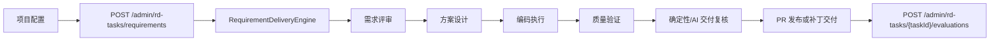
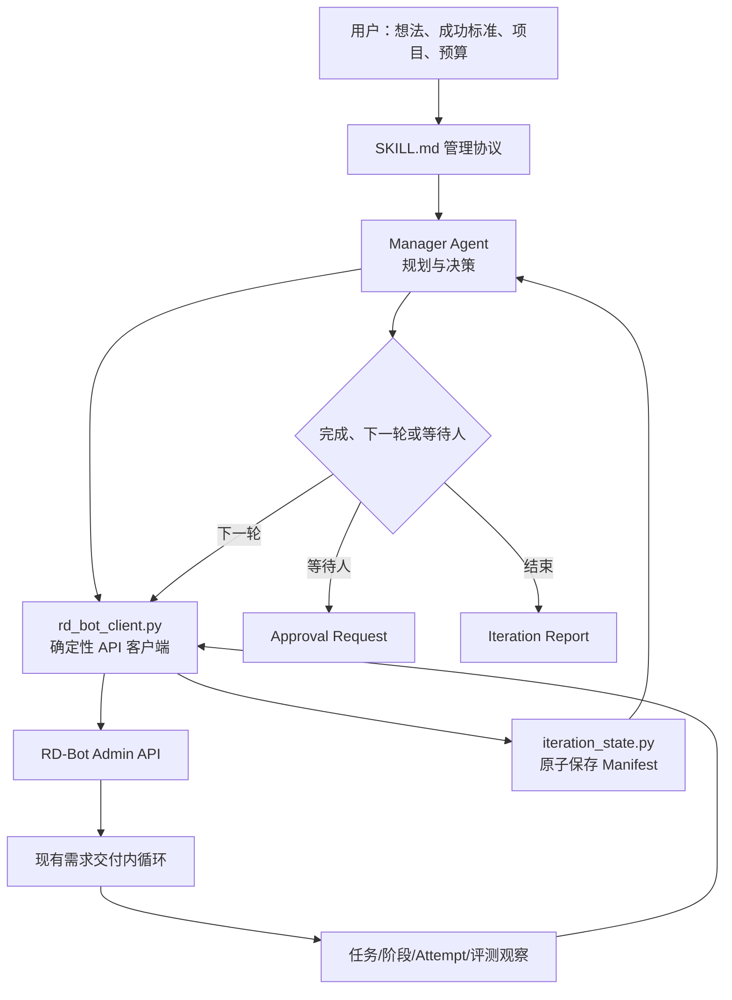
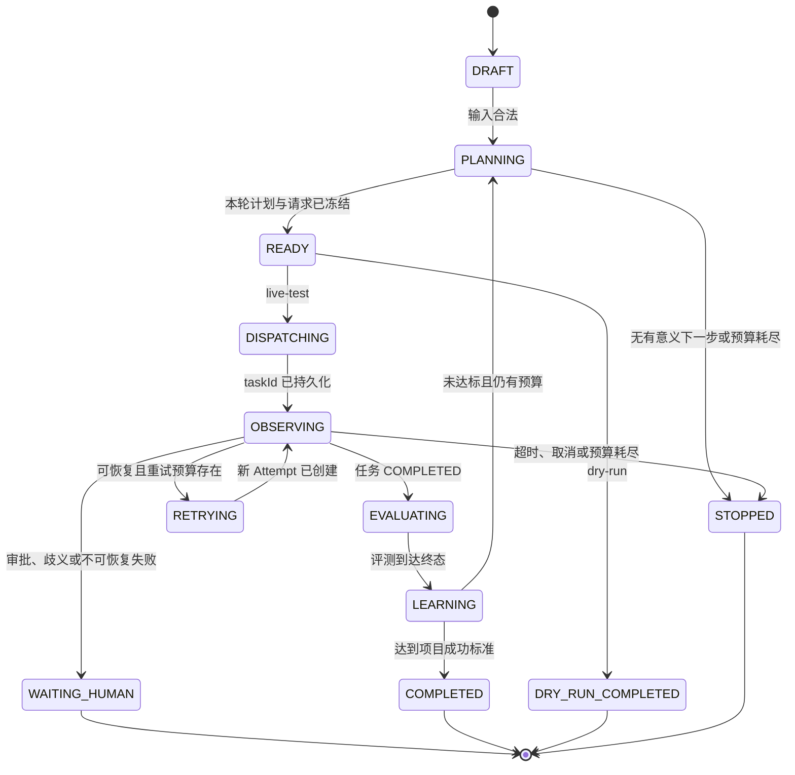

# RD-Bot 项目自治迭代 Skill 验证版设计

> 日期：2026-07-27
>
> 状态：设计已确认，待实施计划
>
> 范围：测试用外部控制 Skill、两轮单任务串行迭代、现有 Admin API 复用
>
> Skill 暂定名：`rd-bot-project-autopilot`

## 1. 目标与已确认边界

本设计验证一个项目级外循环：用户只提供项目、初始想法、成功标准和预算，AI 作为项目管理者，把想法压缩成一个当前最有价值的需求，交给 RD-Bot 的现有需求交付链路执行；任务结束后读取真实状态、角色阶段、产物和评测结果，再决定结束、调整下一轮需求或等待人工处理。

已确认的第一版边界：

1. 这是测试功能，不新增生产数据库表、不新增后台页面、不改造 `RequirementDeliveryEngine`。
2. 采用“项目内自治”：AI 可以规划、创建任务、观察运行、进行一次结构化重试并发起下一轮。
3. 第一版默认最多两轮，每轮最多一个活动需求任务，禁止并发派发。
4. AI 可以让 RD-Bot 创建分支和 PR，但不能自动合并、部署、扩权、读取新密钥或执行破坏性操作。
5. Skill 必须同时提供 `dry-run` 和受限的 `live-test`；默认进入 `dry-run`，只有显式选择 `live-test` 才能创建真实任务。
6. 所有决策必须引用真实 `taskId`、`stageRunId`、Attempt、评测 Run 或事件证据，不能只相信模型的完成声明。

## 2. 方案选择

### 2.1 采用：外部控制 Skill

`rd-bot-project-autopilot` 是调用 RD-Bot 的宿主侧 Agent Skill，不是安装到 `REQUIREMENT_REVIEWER`、`SOLUTION_ARCHITECT`、`CODING_AGENT` 或 `QA_AGENT` 容器内的角色 Skill。

两类 Skill 必须保持边界清楚：

- 项目自治 Skill：位于 RD-Bot 外层，决定“下一件值得做的事”，调用受控客户端，并维护项目迭代状态。
- 角色执行 Skill：由现有 `SkillInstallationEngine` 和 `RoleAllowlistSkillPolicyGate` 治理，只增强一个 RD 任务中某个角色的执行能力。

外部控制方式的优点：

- 直接复用现有项目、任务、角色、评测、重试、策略和审计能力；
- 不引入新的持久化和分布式调度问题；
- 验证失败时可以删除 Skill 和测试运行目录，不影响 RD-Bot 主状态机；
- 验证成功后，Manifest 和决策规则可以迁移为原生 `AutonomousProjectRun`。

### 2.2 暂不采用：RD-Bot 原生自治运行

原生方案需要新增项目自治 Run、租约、幂等键、并发领取、恢复、预算扣减和管理 API。它适合验证后的第二阶段，但不适合测试版。

### 2.3 暂不采用：GitHub Issue 作为主控制面

Issue 驱动适合跨组织协作，但会把项目外循环绑定到 GitHub，并重复 RD-Bot 已有任务管理能力。第一版只把 PR 作为交付出口，不把 Issue 当作真值源。

## 3. 同类产品提炼

本方案只吸收可迁移的控制模式，不复制产品界面：

| 产品 | 可借鉴模式 | 在 RD-Bot 中的落点 |
| --- | --- | --- |
| [Google Jules](https://jules.google/docs/) | 先生成计划、隔离环境执行、展示活动与 Diff、由人发布 PR | `dry-run` 计划、Docker/Pi 或 Claude 执行、任务轨迹、PR 人工处理 |
| [GitHub Copilot cloud agent](https://docs.github.com/en/copilot/concepts/agents/cloud-agent) | 从任务到分支/PR，人工检查后合并 | Skill 可创建任务和 PR，但不能合并 |
| [OpenHands](https://docs.openhands.dev/sdk/guides/security) | 动作风险分类与按风险确认 | 确定性审批矩阵，不由模型自行放行高风险动作 |
| [Devin](https://docs.devin.ai/work-with-devin/advanced-capabilities) | Playbook、运行复盘、知识沉淀、受预算约束的会话 | Skill 工作流、Iteration Report、下一轮 Lessons、Token/轮次预算 |
| [SWE-agent](https://github.com/SWE-agent/SWE-agent/blob/main/docs/usage/trajectories.md) | 保存 thought/action/observation 轨迹和可复现实验配置 | 保存引用 ID、动作、观察和 Manifest；不持久化私有推理原文 |

核心结论是：自治并不等于无限执行。成熟实现都把任务范围、运行环境、计划、证据、预算和人工交付门禁放在 Agent 外部。

## 4. 当前 RD-Bot 已验证链路



当前入口和控制点：

1. `RdProjectController` 提供 `/admin/projects` 项目读取与维护。
2. `RdTaskController.createRequirement()` 通过 `/admin/rd-tasks/requirements` 创建需求任务，可绑定项目、材料、验收标准、Token 覆盖和 `autoExecute`。
3. `RdTaskController.submit()` 通过 `/admin/rd-tasks/{taskId}/submit` 派发任务。
4. `RequirementDeliveryEngine.submit()` 构建材料、上下文、计划和策略决策，再按四角色顺序执行。
5. `WAITING_APPROVAL` 必须通过 `/admin/rd-tasks/{taskId}/approve` 人工放行；Skill 不得代替人调用该入口。
6. `TaskRetryEngine` 基于结构化失败检查点创建新 Attempt；旧阶段记录不可覆盖。
7. `EvaluationController.createForTask()` 通过 `/admin/rd-tasks/{taskId}/evaluations` 从真实任务快照创建评测 Run。
8. `RequirementDeliveryEngine` 的单任务终点是 `COMPLETED`、各类失败、等待审批或取消；它不会根据项目目标自动创建下一需求。

因此第一版只补第 8 点之后的项目外循环，不复制四角色内循环。

## 5. 目标架构



### 5.1 Manager Agent

Manager Agent 负责概率型工作：

- 把想法整理为项目章程；
- 从未完成目标和上一轮证据中选择一个最小垂直需求；
- 生成标题、预期结果、可验证验收标准和材料；
- 根据结构化观察选择 `COMPLETE`、`NEXT_ITERATION`、`RETRY` 或 `WAITING_HUMAN`；
- 生成面向人的最终报告。

Manager Agent 不能直接运行任意 `curl`，也不能自行修改 Manifest 中已经记录的历史事实。

### 5.2 确定性客户端

`rd_bot_client.py` 只提供受限动作：

- 检查 RD-Bot 健康状态；
- 读取目标项目和预算配置；
- 创建一个需求任务；
- 提交、暂停或读取任务；
- 读取任务时间线、阶段、Attempt、轨迹摘要和交付结果；
- 对符合规则的失败创建一次重试；
- 创建并观察任务评测；
- 输出脱敏、大小受限的结构化 JSON。

客户端必须使用动作枚举和参数校验，不提供通用 HTTP 代理、任意 URL 或任意请求体透传能力。

### 5.3 本地运行状态

测试运行写入 `qa-runs/autopilot/<runId>/`：

```text
qa-runs/autopilot/<runId>/
├── manifest.json
├── charter.md
├── iterations/
│   ├── 01-plan.json
│   ├── 01-observation.json
│   ├── 01-evaluation.json
│   └── 01-decision.json
├── approval-request.md
└── final-report.md
```

`manifest.json` 是该测试 Run 的本地真值源，使用临时文件加原子 rename 写入。服务重启后，Skill 可以从 Manifest 恢复观察，但不能伪造 RD-Bot 内部状态。

## 6. Iteration Manifest 契约

顶层字段：

```json
{
  "schemaVersion": "rd-bot-autopilot/v1",
  "runId": "autopilot-...",
  "mode": "dry-run",
  "projectId": "...",
  "idea": "...",
  "successCriteria": ["..."],
  "status": "DRAFT",
  "limits": {
    "maxIterations": 2,
    "maxActiveTasks": 1,
    "maxRetriesPerTask": 1,
    "maxElapsedMinutes": 120,
    "maxTokenBudget": 200000
  },
  "usage": {
    "iterations": 0,
    "tasksCreated": 0,
    "retries": 0,
    "elapsedMinutes": 0,
    "observedTokens": 0
  },
  "iterations": [],
  "pendingApproval": null,
  "stopReason": "",
  "createdAt": "...",
  "updatedAt": "..."
}
```

每轮至少记录：

- `iterationNo`、目标、假设和验收标准；
- 创建请求摘要和幂等键；
- `taskId` 及任务最终状态；
- 每个角色的最新 `stageRunId`、`attemptNo` 和状态；
- PR/补丁、测试、QA 和评测 Run 引用；
- 失败分类、证据引用、决策和下一轮理由；
- 本轮 Token、耗时和重试消耗。

禁止在 Manifest 中记录 Provider 密钥、完整环境变量、未脱敏 Prompt、私有思考链或大段任务产物。完整产物只保存 RD-Bot 已授权 URI 和 hash。

## 7. 项目外循环状态机

项目外循环状态与 RD 任务状态必须分开：



状态迁移只由 `iteration_state.py` 的确定性校验器写入。Manager Agent 提交决策建议，不直接覆盖 `status`。

## 8. 单轮执行协议

### 8.1 输入收敛

Skill 首先读取：

- RD-Bot Base URL，默认只允许本机地址；
- `projectId`；
- 一段初始想法；
- 至少一个可观察成功标准；
- `dry-run` 或 `live-test`；
- 可选预算覆盖，但不得超过测试版硬上限。

缺少项目、成功标准或项目仓库信息时停止，不允许模型猜测。

### 8.2 规划

每轮只选择一个可以由现有四角色闭环交付的最小需求。计划必须包含：

- 用户可感知结果；
- 明确非目标；
- 2 到 6 条可执行验收标准；
- 必需的现有材料或路径；
- 为什么这一轮比其他候选项优先；
- 本轮通过后如何判断项目目标是否已经满足。

计划冻结后生成内容 hash。恢复运行时若 hash 不一致，进入 `WAITING_HUMAN`，不静默改写请求。

### 8.3 派发与观察

`live-test` 按以下顺序执行：

1. 确认当前 Run 没有活动任务。
2. 使用 `runId + iterationNo + planHash` 生成本地幂等键。
3. 创建 `autoExecute=false` 的需求任务，先把 `taskId` 写入 Manifest。
4. 再调用 `/submit`，避免请求已执行但本地尚未保存 ID 的窗口。
5. 以有上限的退避轮询任务、阶段、Attempt 和评测状态。
6. 对用户展示或报告时使用最新 Attempt，但保留旧 Attempt 引用。
7. 进入终态后生成不可变 observation，再允许 Manager Agent 决策。

测试版不并发派发，不需要跨进程锁。若发现 Manifest 中已有非终态任务，必须恢复观察该任务，不得创建第二个任务。

### 8.4 评测与决策

任务 `COMPLETED` 不等于项目目标完成。Skill 必须：

1. 创建 task-run evaluation；
2. 等待评测终态并读取汇总、日志和允许读取的产物；
3. 把任务验收、QA 证据、评测结论和项目成功标准逐项对齐；
4. 只有全部硬性标准有真实证据时才能决定 `COMPLETED`；
5. 未达标时生成一条新的、范围更小的需求，而不是重放同一 Prompt。

## 9. 重试、审批与停止规则

### 9.1 自动重试

只允许同时满足以下条件时自动重试一次：

- RD-Bot 返回结构化可恢复状态或明确恢复检查点；
- 不需要策略审批、密钥、外部账号或需求澄清；
- 本任务还未消耗重试预算；
- 失败指纹与上一失败不同，或新的重试明确改变恢复点/证据。

禁止根据自由文本猜测重试角色，禁止通过重新创建任务绕过 `TaskRetryEngine`。

### 9.2 必须人工处理

以下情况进入 `WAITING_HUMAN`：

- 任务处于 `WAITING_APPROVAL` 或 `FAILED_NEEDS_HUMAN`；
- 需要合并 PR、发布、生产写入、权限升级、新密钥或外部登录；
- 需求与现有架构约束冲突；
- 评测证据互相冲突；
- 同一失败指纹连续出现两次；
- 计划 hash、项目配置或目标在运行中发生不可解释变化。

Skill 生成 `approval-request.md`，包含建议动作、风险、证据 ID 和拒绝后的安全替代方案，但不会自动批准。

### 9.3 硬停止

任一条件满足即停止：

- `maxIterations`、`maxElapsedMinutes` 或 `maxTokenBudget` 已达到；
- 用户或 RD-Bot 取消任务；
- 项目成功标准已经满足；
- 无法生成不重复且可验证的下一需求；
- RD-Bot 服务不可用超过有界观察窗口；
- Manifest 校验失败或出现多个活动任务。

## 10. Skill 包结构

```text
rd-bot-project-autopilot/
├── SKILL.md
├── agents/
│   └── openai.yaml
├── scripts/
│   ├── rd_bot_client.py
│   ├── iteration_state.py
│   └── validate_manifest.py
├── references/
│   ├── rd-bot-api-map.md
│   ├── iteration-contract.md
│   └── policy-and-stop-rules.md
└── assets/
    └── iteration-manifest.schema.json
```

职责划分：

- `SKILL.md`：触发条件、管理循环、何时读取 references、决策输出契约。
- `agents/openai.yaml`：Skill 的展示名称、描述和默认调用 Prompt。
- `rd_bot_client.py`：受限 HTTP 动作和脱敏 JSON 输出。
- `iteration_state.py`：初始化、合法迁移、原子写入、运行恢复和预算累计。
- `validate_manifest.py`：Schema、历史不可变性、活动任务唯一性和预算检查。
- `references/`：把详细 API、状态和策略从 `SKILL.md` 中分离，按需加载。

实现时使用 `skill-creator` 的脚手架和快速校验流程。Skill 首版放在仓库可审查目录；通过验证后再决定是否安装到用户级共享 Skill 根目录。

## 11. 安全与隐私

1. Base URL 默认只接受 `localhost`、`127.0.0.1` 和显式允许的测试域名。
2. 认证值只从环境变量读取，日志和 Manifest 只记录变量名，不记录值。
3. 所有 HTTP 响应在写盘前经过字段 allowlist、长度限制和密钥模式脱敏。
4. Skill 不暴露任意 shell 或任意 HTTP 工具；实际代码修改继续发生在 RD-Bot 的隔离执行器中。
5. `dry-run` 不允许产生任何写请求。
6. `live-test` 只允许项目、任务、重试和评测相关的固定路由。
7. `/approve`、任务删除、评测取消、PR merge 和部署路由不在客户端动作表中。
8. 任务材料只引用明确提供的路径/URI；禁止递归上传主目录或未声明目录。
9. 报告展示可见摘要和证据引用，不保存或要求模型暴露私有思考链。

## 12. 可观测性与报告

每轮 observation 至少输出：

- 当前任务状态、耗时、累计 Token；
- 四角色最新 Attempt 及成功/失败状态；
- 使用的 `stageRunId`、上下文包和关键产物引用；
- 失败阶段、恢复点和失败指纹；
- QA 验收与 task-run evaluation 结果；
- PR 或补丁交付引用；
- 继续/停止决定、理由和下一步。

最终报告区分三种结果：

- `GOAL_ACHIEVED`：成功标准逐项有证据；
- `BOUNDED_STOP`：预算或测试上限到达，但没有安全阻断；
- `HUMAN_REQUIRED`：存在必须由人处理的审批、歧义或风险。

报告不得把 `RD task COMPLETED` 直接翻译成 `project goal achieved`。

## 13. 测试策略

### 13.1 脚本单元测试

- Manifest 初始化和 Schema 校验；
- 所有合法/非法状态迁移；
- 两轮、单活动任务、一次重试预算；
- 原子写入后的恢复；
- 响应脱敏和长度限制；
- dry-run 零写请求；
- 高风险路由不可达。

### 13.2 HTTP 合约测试

使用本地假服务或现有测试夹具覆盖：

- 项目不存在；
- 创建成功但提交失败；
- 提交成功后进程中断并恢复观察；
- `WAITING_APPROVAL`；
- 可重试失败与新 Attempt；
- `COMPLETED` 后评测成功/失败；
- RD-Bot 超时、异常 JSON 和大响应。

### 13.3 真实验收

在测试项目运行：

1. 一次 `dry-run`，确认没有创建任务；
2. 一次单轮 `live-test`，确认创建任务、观察四角色并触发评测；
3. 一次两轮 `live-test`，第一轮评测未满足目标，第二轮需求必须引用第一轮证据且不能重复；
4. 人工制造 `WAITING_APPROVAL`，确认 Skill 停止且没有调用审批入口；
5. 检查 `qa-runs/autopilot/<runId>/` 的 Manifest、证据引用和最终报告。

## 14. 验收标准

- [ ] Skill 可从一个想法生成项目章程和一个最小、可验收需求。
- [ ] `dry-run` 不产生任何 RD-Bot 写请求。
- [ ] `live-test` 默认最多两轮、每轮一个活动任务、每任务一次自动重试。
- [ ] 进程中断后从 Manifest 中已有 `taskId` 恢复观察，不创建重复任务。
- [ ] 每个继续/停止决定均引用真实任务、阶段、Attempt 或评测证据。
- [ ] `WAITING_APPROVAL`、`FAILED_NEEDS_HUMAN`、合并和部署均停在人类门禁前。
- [ ] 任务完成后必须触发 task-run evaluation，不能只依据模型总结宣布成功。
- [ ] Manifest 和报告不包含密钥、完整私有 Prompt 或私有思考链。
- [ ] Skill 包通过元数据和结构快速校验，脚本测试全部通过。
- [ ] 真实验收留下可审查的 `qa-runs/autopilot/<runId>/` 证据。

## 15. 非目标与后续演进

第一版不做：

- 管理后台 Autopilot 页面；
- 多任务并行和跨项目协调；
- 自动 Issue/PR 评论、自动 merge 或部署；
- 新数据库表、租约调度或服务端恢复 Worker；
- 自动修改 Skill 自身；
- 用模型自由文本代替结构化评测和状态。

验证通过后再考虑第二阶段：把 Manifest 升级为 PostgreSQL `AutonomousProjectRun`，增加服务端租约、幂等创建、预算账本、管理 API 和可视化页面。迁移时必须保留本设计的项目外循环/任务内循环分层，以及所有人工审批边界。

## 16. 设计阶段验证

| 检查 | 命令 | 预期 |
| --- | --- | --- |
| 设计文件存在 | `test -f docs/superpowers/specs/2026-07-27-rd-bot-project-autopilot-design.md` | 退出码 0 |
| 无明文密钥形态 | `rg -n '(sk-[A-Za-z0-9]{16,}|Bearer [A-Za-z0-9._-]{16,})' docs/superpowers/specs/2026-07-27-rd-bot-project-autopilot-design.md` | 无匹配 |
| 必要门禁存在 | `rg -n 'dry-run|WAITING_APPROVAL|maxIterations|task-run evaluation' docs/superpowers/specs/2026-07-27-rd-bot-project-autopilot-design.md` | 四类规则均存在 |
| Git 范围受控 | `git diff --cached --name-only` | 只有本设计文件 |
