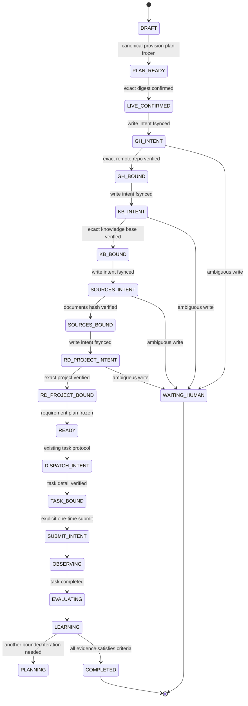

# RD-Bot 项目自治 Skill 实际项目孵化设计

> 日期：2026-07-27
>
> 状态：方案 A 已确认，待实施计划
>
> 范围：从一句用户想法创建新的 GitHub 私有仓库、RD-Bot 项目、受控项目文档和首个需求任务

## 1. 目标

把现有 `rd-bot-project-autopilot` 从“对现有 RD-Bot 项目做有限迭代”扩展为一个宿主侧项目孵化器。用户只需给出一个想法，例如“制作一个健身打卡网页”，Skill 将把该想法收敛成可审阅的项目计划；在用户确认计划摘要后，真实创建新的 GitHub 仓库、RD-Bot 知识库和项目、受控的项目文档，以及首个 RD-Bot 需求任务。

此功能仍是测试版外部 Skill，不在 RD-Bot 服务中新增自治运行实体、数据库表或后台页面。

## 2. 采用方案 A

采用“两阶段真实孵化”：

1. **计划阶段，默认只读**：从用户想法生成规范化的 Provision Plan，包含仓库、项目、文档、首轮需求、验收标准、预算和不可执行的预览。
2. **一次确认后受控写入**：用户通过 Plan SHA-256 显式确认。Skill 按固定顺序创建资源，并将每一步的意图和实际返回 ID 持久化。
3. **交付阶段**：创建 `autoExecute=false` 的需求任务，再显式提交一次；之后复用现有任务观察、评测和最多两轮迭代能力。

不会采用“用户一句话后无需确认立即创建远程资源”的模式，也不会把 GitHub Issue 当作项目真值源。

## 3. 第一版边界

### 3.1 允许的远程副作用

只允许以下经过确认的动作：

1. 使用当前 `gh` 已登录的**个人账号**创建一个新的**私有** GitHub 仓库。
2. 在创建仓库时启用 `auto_init`，保证 RD-Bot 获得可用的默认分支。
3. 创建 RD-Bot 知识库和受限的 Markdown 项目文档。
4. 创建并启用 RD-Bot 项目，绑定知识库和刚创建的仓库。
5. 创建一个 `autoExecute=false` 的需求任务，并仅调用一次 `/submit`。
6. 在任务完成后创建任务评测，并进行最多一次结构化重试和第二轮需求迭代。

### 3.2 明确禁止

第一版不支持下列行为，即使调用方提供额外参数也必须失败关闭：

- 组织仓库、公开仓库、内部仓库、仓库转移、协作者、Secrets、Actions 配置；
- 采用未带本 Run 标识的同名既有仓库；
- 读取、打印、落盘或转发 GitHub / Provider 凭据；
- 从 URL、磁盘或第三方服务摄取资料；
- Git clone、push、任意 shell、任意 `gh` 参数或任意 REST 请求；
- RD-Bot 的审批、停止、删除、取消、合并、部署和任意未列入白名单的 API；
- 自动清理已经创建的 GitHub 仓库、项目、知识库或任务。

失败后只输出创建资源的 ID、URL 和人工清理清单。

## 4. 用户交互和确认协议

### 4.1 输入

自然语言入口只要求一个想法。Skill 可以补充询问项目显示名、仓库 slug、成功标准和预算；未提供时以确定性规则生成候选值，但不会在未确认前写入远端。

计划必须包含：

- `repository.owner`：只能等于 `gh api user` 返回的当前登录用户；
- `repository.name`：小写 GitHub slug，包含短 `runId` 后缀；
- `repository.visibility=private`、`autoInit=true`；
- RD-Bot 项目键、名称、描述、默认分支和知识库名称；
- 受控 Markdown 文档标题、内容哈希和来源；
- 首轮需求标题、预期结果、2 至 6 条验收标准、材料引用和 Token 预算；
- 硬上限：最多 2 轮、1 个活动任务、每任务 1 次重试、120 分钟和 200000 Token。

### 4.2 Plan digest

Skill 以 canonical JSON 持久化 `provision-plan.json`，计算 SHA-256。真实写入需要同时满足：

```text
--live-provision
--confirm-plan-sha256 <exact digest>
RD_BOT_AUTOPILOT_LIVE_PROVISION=1
```

确认收据写入 Manifest。任何仓库名、项目字段、文档哈希、任务请求、预算或版本变更都会改变 digest，并使旧确认失效。

## 5. 可恢复状态机

Manifest 升级为版本化的 `rd-bot-autopilot/v2`，并保留读取 v1 只读运行的兼容路径。Provisioning 状态和现有任务迭代状态保持分层：



每次远程 POST 前必须先原子写入并 fsync `*_INTENT`。返回后只允许绑定经 GET 验证的精确实体。进程崩溃、连接重置或响应解析失败时禁止盲目重发；必须进入精确 reconciliation。

`resume --run-id` 只能重新观察、执行精确验证后的实体绑定，或显式中止。它不能编辑历史状态或重新发送不确定的写请求。

## 6. GitHub 适配器

新增一个窄的 `github_client.py`，所有子进程均使用 argv 数组、`shell=False`、超时和输出长度上限。它只允许四类固定命令：

```text
gh auth status
gh api user
gh api --method POST /user/repos ...
gh api /repos/{authenticatedOwner}/{validatedRepoName}
```

预检先确认 `gh auth status` 成功，再通过 `gh api user` 获取唯一可用 owner。创建请求固定为私有、`auto_init=true`，并带有精确 marker：

```text
[autopilot:<runId>:github:<sha12>]
```

仓库名称冲突不会自动采用资源。只在仓库描述/标识、owner、visibility、default branch 和不可变请求字段全部匹配时绑定一个精确实体；零个或多个候选一律 `WAITING_HUMAN`。

适配器绝不读取或记录 `gh` Token，且会过滤子进程输出中的凭据形态。

## 7. RD-Bot 项目和资料适配器

根据真实 Controller 契约，客户端只新增下列精确 API：

```text
POST /knowledge-base
POST /knowledge-base/{knowledgeBaseId}/docs/write
POST /admin/projects
GET  /knowledge-base/{knowledgeBaseId}
GET  /knowledge-base/{knowledgeBaseId}/docs
GET  /admin/projects/{projectId}
```

`RdProjectController` 的请求必须完整包含 `projectKey`、`name`、`description`、`repositoryUrl`、`repoOwner`、`repoName`、`defaultBranch`、`enabled` 和 `knowledgeBaseId`。项目只能绑定当前 Run 创建并验证的私有仓库和知识库。

资料只使用由用户想法生成的 UTF-8 Markdown，第一版固定为：

1. `project-charter.md`：目标、非目标、受众、成功标准和预算；
2. `delivery-brief.md`：首轮垂直需求、验收标准和已知约束。

每份文档均限制字节数、进行敏感信息扫描、写入 source=`user_idea` 或 `autopilot_generated`、生成器版本和 SHA-256。任务材料只引用这些验证过的文档 ID 和哈希，不接受外部 URL 或本地文件。

## 8. 任务派发、观察和评测

项目创建并验证后，复用现有受限路径：

1. 创建 `autoExecute=false` 的需求任务，标题带精确 Run marker；
2. 读取任务详情，逐项验证项目、标题、`acceptanceCriteriaJson`、预算和材料引用；
3. 只调用一次 `/admin/rd-tasks/{taskId}/submit`；
4. 观察任务、Stage Run、Attempt 和 Token 用量；
5. 完成后创建评测，并以真实评测、QA 和工作区证据决定结束或下一轮；
6. 遇到审批、未知状态、预算不足、歧义写入或外部依赖时停止于 `WAITING_HUMAN`。

`acceptanceCriteriaJson` 必须以 canonical JSON 字符串发送，不能把数组直接传给 Controller。累计 Token、单任务预算、绝对运行时限和轮询上限都必须在代码中检查。

## 9. 幂等、并发和审计

- 对 Run 目录和 `owner/repositoryName` provisioning key 分别使用 `fcntl.flock`；
- 所有可远程搜索实体带 marker、请求指纹和不可变字段校验；
- 远端创建永远不是 exactly-once。只允许“零、一个、多候选”的确定性分支；
- Manifest 和 artifact 只存 ID、URL、哈希、状态、有限摘要和环境变量名，不存密钥、完整 Prompt 或私有推理；
- 每个外部调用都有请求类型、时间、结果摘要和已脱敏错误类别；
- 工作区写入仅限 `qa-runs/autopilot/<runId>/`，并保留前后指纹验证。

## 10. 测试和验收

必须先以 mocked HTTP 和 mocked `gh` 子进程测试以下场景：

1. dry-run 从不调用 `gh` 写入或 RD-Bot POST；
2. digest 缺失、错误或计划漂移时拒绝所有写入；
3. owner 非认证个人账号、仓库非 private、非法 slug、组织仓库和公开仓库全部被拒绝；
4. 每个 write intent 前的崩溃点、连接错误和不可解析响应都不会重发；
5. zero/one/multiple reconciliation、已有同名未标记仓库和验证失败的人工绑定；
6. 资料 hash/provenance、敏感信息过滤、大小限制和任务材料绑定；
7. v1 Manifest 兼容、v2 resume、锁冲突、运行超时、预算耗尽和未知状态；
8. 没有任何禁止的 `gh` 命令、HTTP 路由、Git 命令、审批、删除、合并或部署动作。

只有上述契约测试通过后，才运行一次真实 dry-run。真实 live 验证必须由用户再次提供一个明确的 disposable 私有仓库任务和最终 digest 确认；验证结束只报告资源，不执行清理。

## 11. 影响范围

主要修改范围限定为：

- `.agents/skills/rd-bot-project-autopilot/` 的状态、客户端、CLI、文档、schema 和测试；
- `docs/superpowers/` 的设计、计划和 QA 证据。

不修改 RD-Bot 后端 Controller、数据库 schema、前端或角色执行引擎。
