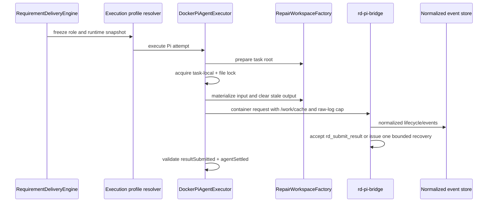

# Pi QA 协议与工作区卫生护栏

日期：2026-07-28
状态：已实施。2026-08-13 私有仓 docs-only 冒烟验证了 Pi 主路径。QA `provider-attempts` 隔离是延后特性，对应测试已 `@Disabled`。
范围：Pi 运行时的 QA 结果提交、事件留存、任务级依赖缓存、重试并发隔离、provider compat 与 QA 元数据通道。

## 1. 问题

### 症状

任务 `7487668615836209152` 的 QA Attempt 4 以
`Pi result requires RESULT_SUBMITTED followed by AGENT_SETTLED` 进入
`FAILED_NEEDS_HUMAN`。同时，重复的编码/QA attempt 反复安装依赖，私有原始
Pi 事件日志持续膨胀。

### 已验证根因

1. 宿主校验 `DockerPiAgentExecutor.validateResult(...)` 仅判断
   `resultSubmitted` 与 `agentSettled` 两个事实；旧错误文字把它描述成“先后
   顺序”，但代码并不保存足以证明顺序违规的断言。
2. 该 Attempt 的历史事件显示 session 已 settled，但没有成功接受
   `rd_submit_result`；因此是缺少提交，不是已经证实的事件排序故障。
3. Pi 已有 `/work/cache` 挂载，但 npm/pip/yarn 未被指向该目录；容器退出后
   容器本地缓存消失，下一 attempt 会重新下载。
4. 原始 Pi 事件是私有诊断材料，过去没有大小上限。此任务单个文件曾约 1.78 GiB，
   是磁盘增长的主要来源，不能只把问题归咎于 `node_modules`。

## 2. 已验证执行链

关键边界：

- `engine/.../RequirementDeliveryEngine`：生成角色提示词、补救上下文和 QA 要求。
- `bootstrap/.../EngineRequirementExecutionProfileResolver`：冻结每个 attempt 的
  runtime/profile；Pi 不再被编码角色专属校验错误地拒绝。
- `exec/.../pi/impl/DockerPiAgentExecutor`：取得任务锁、注入缓存/日志上限、清理输出、
  消费规范化事件并作宿主校验。
- `bootstrap/.../executor/pi/src/rd-pi-bridge.mjs`：唯一可接受结构化结果的
  `rd_submit_result` 边界；普通页面消费规范化事件，不读取原始 session 思考内容。

## 3. 护栏规则

### 3.1 结果生命周期

- Pi 成功必须同时有 `RESULT_SUBMITTED` 和 `AGENT_SETTLED`；失败诊断必须分别记录
  哪一个缺失，不能把聚合缺失描述成已证实的顺序问题。
- 若 session settled 但尚未提交结果，bridge 最多发送一次恢复提示。恢复提示只能要求
  调用 `rd_submit_result`，不得重复执行任务、安装依赖或无限 follow-up。
- `rd_submit_result` 在 bridge 内校验完整角色协议。QA 提交必须包含真实验收和证据字段；
  不得由 bridge 伪造浏览器、命令或回归证据。
- 不能自动回退到另一运行时。需要人工重试时，保留失败 Attempt 和规范化事件作为证据。

### 3.1.1 Provider compat 与 QA 元数据通道

- `opencode-go` 不接受 `developer` 角色。必须把
  `compat: { supportsDeveloperRole: false, supportsReasoningEffort: false }` 放在
  **`models[0]`**。写在 provider 根上会被 Pi `applyExtension` 丢掉，表现为 HTTP 400。
- 宿主 docs-only 判定只读 `dockerMetadataJson`。Pi 必须把 `QaExecutionMetadataKeys`
  写入该通道，细节见 QA spec §3.3。改 bridge 或 QA skill 后重建
  `Dockerfile` 与 `Dockerfile.qa`。

### 3.2 缓存、日志与清理

- 缓存只允许任务本地目录：`cache/ -> /work/cache`。注入
  `npm_config_cache`、`PIP_CACHE_DIR`、`YARN_CACHE_FOLDER`；禁止跨任务共享可写缓存。
- `RD_EXECUTOR_PI_MAX_RAW_EVENT_BYTES` 默认 `16777216`。达到上限时停止写入**原始**
  私有日志，但继续生成规范化运行时事件；在 `docker-meta.json` 记录
  `maxBytes`、`writtenBytes` 与 `truncated`。
- 新 attempt 只能删除同任务的 `output/` 内容，且必须在任务锁内执行。`repo/` 与
  `cache/` 必须保留，以便复用 checkout 和依赖缓存。
- 工作区锁必须覆盖 `input/` 物化、输出清理、仓库准备、容器运行和结果收集。不能先
  调用 `RepairWorkspaceFactory.create(...)` 再取锁，否则并发 attempt 仍会覆盖 prompt。
- 历史清理先按文件、大小和打开状态盘点；只删除已关闭的私有原始事件。不得批量删除
  源码、候选补丁、数据库、Docker volume 或仍被运行时占用的文件。

### 3.3 重试和可读轨迹

- 失败阶段可从同角色或上游角色开始恢复，不能跳过失败角色；回退上游时必须把下游失败
  反馈写入恢复 prompt。
- 角色工作台的可读轨迹只投影脱敏后的规范化事件。可见过程说明不等于隐藏 reasoning；
  不得把 `thinking_delta`、原始 session 或未脱敏工具参数展示到页面。
- 归档轨迹必须按 `sequence` 去重并支持加载更早记录；不能再以固定最近 120 条替代完整
  诊断路径。

## 4. 验收标准

- [x] 成功路径要求同时存在 `RESULT_SUBMITTED` 与 `AGENT_SETTLED`；诊断分别记录缺失项，不把聚合缺失写成顺序违规。
- [x] Bridge 对 settled-without-submit 最多一次恢复提示；`rd_submit_result` 在容器内 fail-closed。
- [x] `/work/cache` 与 raw-event 上限由 executor 注入；新 attempt 只清 `output/`。
- [ ] **延后（测试已 `@Disabled`，不要为变绿改生产 mount）**：Pi QA 使用 `provider-attempts/` 独立 candidate workspace，同时挂载任务级 `/work/cache`。`RepairWorkspaceFactory.createProviderAttempt` 的现有语义是 Claude **provider fallback** 隔离，不是 QA vs coding 隔离。当前 Pi QA 与 reviewer/architect 一样挂载任务 `repo/:ro`；docs-only 冒烟已在该模型上跑通。
- [x] 2026-08-13 GitHub 私有仓 docs-only 冒烟已跑通完整角色→QA→PR；见 publication/provenance spec。

## 5. 验证命令

| 检查 | 命令 | 预期 |
| --- | --- | --- |
| Bridge 协议 | `cd bootstrap/src/main/resources/executor/pi && npm test` | 全部 Node 测试通过 |
| Pi 执行器 | `./mvnw -pl exec -am -Dtest=DockerPiAgentExecutorTest -Dsurefire.failIfNoSpecifiedTests=false test` | 缓存、清理、锁和协议测试通过；两条 `@Disabled` 隔离测试不跑 |
| Pi Spring 配置 | `./mvnw -pl bootstrap -am -Dtest=PiAgentExecutorPropertiesTest -Dsurefire.failIfNoSpecifiedTests=false test` | 上限配置测试通过 |
| 后端装配 | `./mvnw -pl bootstrap -am install -DskipTests` | 新 executor JAR 被安装 |
| 运行态 | `curl --noproxy '*' http://127.0.0.1:18080/admin/rd-tasks/<taskId>` | 返回 200；状态与审计记录一致 |

## 6. 失败处置

| 症状 | 先查什么 | 处置 |
| --- | --- | --- |
| 缺少 `RESULT_SUBMITTED` | 规范化事件、bridge `RESULT_REJECTED/PROTOCOL_ERROR` | 修正角色协议或使用一次恢复提示；不要把错误泛称为顺序问题 |
| 每次都重新下载依赖 | 容器环境、`/work/cache` mount、任务 cache 内容 | 恢复包管理器环境变量；不要清理 repo/cache |
| 磁盘异常增长 | `output/private/pi-raw-events.jsonl` 的大小、打开状态 | 删除已关闭的历史原始日志；保留占用中或交付证据文件 |
| 并发 retry 覆盖输入 | `WorkspaceExecutionLease` 的锁边界 | 锁前仅允许创建/校验任务根目录；所有 input/output 操作移入锁内 |
| QA 声称通过但无证据 | QA result 和 `qa-evidence/manifest.json` | 以 fail-closed 拒绝；不得由宿主补造证据 |
