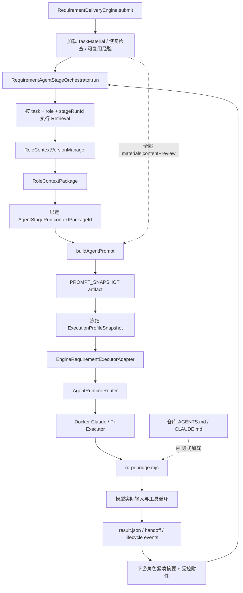

# 2026-08-01 RD-Bot 角色上下文优化验证与改进方案

## 1. 文档状态

- 状态：`DECIDED / D1-D10 已裁决，待实施`
- 范围：需求交付四角色链路中的上下文构建、版本化、Prompt 渲染、角色交接、重试恢复、运行时动态状态、Pi 隐式项目上下文与审计复现。
- 不包含：本轮不修改实现、不变更数据库、不重建 Pi 镜像、不执行真实任务。
- 飞书输入：[RD-Bot 上下文优化方案](https://my.feishu.cn/wiki/FLYTwUHzDiFFhXkBuDXcNRA0n3f)，通过 `lark-cli docs +fetch` 以 user 身份只读获取，`document_id=LoQrdnzCcoNKvuxCQLOchNGfnQb`，`revision_id=61`。
- 历史验证：[2026-08-01 角色上下文「尚未验证不确定项」历史任务验证报告](2026-08-01-role-context-uncertain-items-historical-validation.md)，基于 4 个 MERGED 任务、管理台 API 与 PostgreSQL 只读证据。
- 仓库证据：当前工作树，分支 `main`，HEAD `0f91e781bcc51ef888923218d19bb907bfe4c55b`。工作树存在大量未提交修改；其中 `RequirementDeliveryEngine.java`、`DockerPiAgentExecutor.java`、`rd-pi-bridge.mjs` 已修改，`RequirementAgentStageOrchestrator.java` 尚未跟踪。因此本文描述的是“当前工作树行为”，不等同于该 HEAD 的已提交行为。
- 审计方式：飞书 CLI 读取 + 单个低消耗代码探索代理 `gpt-5.6-terra`（max）只读追踪；补充证据来自历史验证报告中的管理台 API、PostgreSQL 和工作区只读检查。未使用并行审计；本方案文档本身未执行代码测试。
- 本次 P2/P3 细化：未再派子代理、未调用真实模型或 provider；只对既有结论涉及的 result validator、artifact store、Pi SDK hook、resource loader、Adapter/Router/Executor 做定向只读复核，并把尚需真实运行的项目明确标为 P2/P3-V2 以上验证门。

## 2. 执行结论

飞书方案的总方向正确，但只能判定为“原则正确、实现边界尚不完整”，不能直接按原文落地。

正确的部分是：

1. 不再用持续膨胀的单一 Prompt 承载所有规则、事实和运行状态。
2. 分开全局规则、角色合同、任务基线、按需证据和 Harness 动态状态。
3. 将时间、工作目录、工具失败、TODO 和验收覆盖等高频变化信息放在稳定前缀之后。
4. 区分声明事实、实测事实和模型推断。
5. 由 Harness 维护权威状态，不把状态真值交给模型自由改写。
6. 删除角色合同与通用“编码、测试、PR”执行指令之间的冲突。

但当前代码还存在四个比“增加状态栏”更基础的缺口：

1. `RoleContextVersionManager` 把每次都会变化的 `retrievalRunId` 纳入语义签名，导致证据未变也可能创建新上下文版本。
2. `RoleContextPackage.maxChars` 只约束所选证据的标题和摘要；实际 Prompt 仍拼接全部 `materials.contentPreview`，真实模型输入可绕过角色选择和预算。
3. `RoleContextBuilder` 允许首条证据突破字符预算，且 `maxChars=0` 表示无限制，预算不是硬约束。
4. Pi 会隐式加载仓库中的 `AGENTS.md` / `CLAUDE.md`；这些文本不在主机侧 `PROMPT_SNAPSHOT` 中，仅凭 Prompt artifact 无法复原模型实际看到的完整输入。

因此，推荐实施顺序是：先建立“实际执行输入清单与硬预算”，再增加动态状态栏；否则状态栏只是向一个仍不可完整审计、不可可靠限额的 Prompt 再追加内容。

历史任务验证进一步收敛了结论：

- 4 个 MERGED 任务包含 38 条 stage attempt、37 个角色上下文包、58 条成功检索、37 份 Prompt/Result 和 37 份执行 Profile；全部 Profile 都是 Pi，说明主链路已在真实交付中运行，而非纸面设计。
- 所有角色的真实 Prompt 都出现通用“完成需求编码、测试并准备 PR”指令，REQUIREMENT_REVIEWER 和 SOLUTION_ARCHITECT 的角色冲突已被生产样本直接证实，应作为 Phase 1 第一优先级。
- 历史 Prompt 长度明显大于 `RoleContextPackage.usedChars`，证明两者不是同一预算口径；样本材料较短，因此不能单靠这批数据量化全量材料旁路的最坏影响。
- Pi 事件中已有 `usage.cacheRead/cacheWrite`，且存在非零 `cacheRead`；管理台尚未聚合真实 token/cache 指标，Phase 0 可以复用现有事件字段而非从零采集。
- 33/33 份 `AGENT_RUNTIME_META` 的 `contextFiles` 为空，历史样本未触发嵌套规则加载；root-only 策略对这些样本预计无行为变化，但仍需另选多层 `AGENTS.md` 仓库做 rehearsal。
- Prompt/package/retrieval/profile/handoff/S3 链路与源码高度一致；本地 workspace 已清理、事件预览会截断，完整 replay 仍不能只依赖历史 `file://` URI。

## 3. 已验证的现有链路



图中的两条虚线是当前最重要的预算与审计旁路：全量材料绕过角色上下文选择；Pi 隐式规则文件绕过主机 Prompt 快照。

| 阶段 | 当前已验证行为 | 代码证据 |
| --- | --- | --- |
| 任务入口 | `submit()` 加载材料和恢复检查，建立检索记录并进入角色编排。 | `engine/src/main/java/com/wish/rd/engine/requirement/RequirementDeliveryEngine.java:664-697, 1231-1263, 1346-1364` |
| 角色检索 | 每个待执行角色按 `taskId/role/stageRunId/upstream` 进行 stage-bound retrieval。 | `engine/src/main/java/com/wish/rd/engine/requirement/RequirementAgentStageOrchestrator.java:198-253, 838-864` |
| 上下文绑定 | 检索后生成或复用角色上下文包，并把 `contextPackageId` 绑定到当前 stage attempt。 | `RequirementAgentStageOrchestrator.java:253-257, 815-820` |
| Prompt 留档 | 保存 `PROMPT_SNAPSHOT`，记录完整内容哈希和最多 20,000 字符预览，再绑定 stage。 | `RequirementAgentStageOrchestrator.java:564-583, 696-703, 886-933` |
| 上游交接 | 下游读取紧凑摘要、结构化 handoff 清单和受校验附件，不直接串接完整上游结果。 | `RequirementAgentStageOrchestrator.java:1096-1151, 1192-1355, 1435-1438` |
| QA 回流 | QA 产品缺陷或回归可创建新的 Coding 与 QA attempt，新 attempt 重新检索并重新绑定上下文。 | `RequirementAgentStageOrchestrator.java:385-405, 2151-2180` |
| Profile 冻结 | `DISPATCHING` 时按 `stageRunId` 读取或保存不可变执行 Profile，并校验 task/role/attempt。 | `bootstrap/src/main/java/com/wish/rd/bootstrap/executor/impl/EngineRequirementExecutionProfileResolver.java:70-107` |
| Adapter / Router | Adapter 把 Prompt、角色上下文 JSON、handoff 清单和材料哈希交给 Router；Router 只消费冻结快照。 | `bootstrap/src/main/java/com/wish/rd/bootstrap/executor/impl/EngineRequirementExecutorAdapter.java:314-472`; `exec/src/main/java/com/wish/rd/exec/repair/runtime/AgentRuntimeRouter.java:18-57` |
| Pi 执行 | Pi executor 写入请求和策略，结果同时要求 `resultSubmitted` 与 `agentSettled` 生命周期聚合。 | `exec/src/main/java/com/wish/rd/exec/repair/pi/impl/DockerPiAgentExecutor.java:184-305, 650-740, 1322-1394` |
| Pi Bridge | Bridge 加载资源、创建 session，并仅在已 settle 但未提交结果时补一次恢复提示。 | `bootstrap/src/main/resources/executor/pi/src/rd-pi-bridge.mjs:43-279` |

`RESULT_SUBMITTED` 和 `AGENT_SETTLED` 缺失只证明生命周期聚合不完整；当前逻辑没有据此校验两者严格先后顺序，不能把该错误解释为 event ordering 违规。

## 4. 飞书方案逐项验证

| 飞书主张 | 判定 | 代码核验与修正 |
| --- | --- | --- |
| 当前角色 Prompt 混入互斥职责和多个输出协议 | 正确 | 角色合同之外仍会加入通用需求执行基线；真实 Prompt 还拼入全量材料。应按角色渲染唯一合同，禁止评审/架构角色收到编码与 PR 指令。 |
| 上下文应分成全局规则、角色 Skill、任务基线、按需证据、动态状态 | 正确 | 当前已有 RoleContext、Prompt artifact、handoff、Profile snapshot 等骨架，但缺少统一的实际输入 manifest 和动态状态 ledger。 |
| 静态前缀稳定、动态状态追加在末尾有利于 KV Cache | 原理合理，未验证收益 | 动态状态不应改写系统前缀；但不同 provider/runtime 的 cache 边界、命中率和计费未在本轮实测。必须以 provider usage/cache metadata 验证，不能直接承诺降本比例。 |
| 每条用户消息和工具响应都加时间戳 | 有条件采用 | 时间戳应来自 Harness、使用 UTC 或带时区的 ISO-8601、按事件记录。不要对与时序无关的静态输入重复加“当前时间”，否则增加 token 和 cache 分叉。 |
| 工具调用计数可阻止盲目重试 | 方向正确 | 计数键不能只用工具名，应使用 `stageAttempt + tool + canonicalArgsHash + normalizedErrorFingerprint`。确定性错误可第一次即停止；网络、限流和并发冲突应使用独立退避策略，不能机械三次停止。 |
| TODO 作为外部记忆 | 正确，但原文存在控制权矛盾 | 模型可以提出 TODO 变更，Harness 必须校验和持久化；状态栏只能渲染 Harness 接受后的权威状态。不能同时允许模型自由重写 TODO，又声称状态栏不可被模型修改。 |
| 详细错误应包含完整参数和调用栈 | 不应原样采用 | 完整参数可能含凭据、正文、绝对路径和隐私数据；完整栈也会放大 Prompt。模型应收到脱敏、有界的错误 envelope，原始诊断只进入私有 artifact。 |
| 注入当前时间、工作目录、OS、Shell、Python 版本 | 部分正确 | `cwd/repoRoot/branch/runtime` 应来自 executor 实测；只有实际影响决策的环境字段才进入状态栏。版本信息必须带 observation 证据，不能把上游声明当作当前实测。 |
| 只有本轮 `OBSERVED` 可写 `environmentNotes` | 原则正确但过严 | 上游实测事实可以复用，但必须携带 `stageRunId/repoRevision/observedAt/commandHash` 并通过新鲜度策略；同名分支已移动、工作区已变化或环境已重建时必须重新验证。 |
| 历史经验只能参考，不能覆盖当前仓库 | 正确 | 当前会注入最多 5 条可复用经验；应明确标记为 `HISTORICAL`，优先级低于当前 revision 的 observed evidence。 |
| 动态状态栏由 Harness 生成并使用递增序列号 | 正确 | 还需补充 stage attempt 作用域、CAS/单调序列、事件来源、压缩后的保留规则以及跨 runtime 一致性。 |
| 压缩时只保留最新状态栏 | 方向正确 | Pi bridge 当前关闭 compaction。第一阶段应由主机做确定性裁剪；若将来启用 runtime compaction，必须保存压缩输入/输出哈希和预算决策。 |
| 文档给出的 15 次对 21 次、60% 对 95% 指标可证明收益 | 未验证 | 飞书文档没有附可审计实验来源、样本、模型、任务集和统计口径。不得写入验收目标；应在 RD-Bot 自有任务集上做 A/B 或 shadow evaluation。 |

## 5. 现有实现的确定问题

### 5.1 上下文语义指纹包含运行期 ID

`RoleContextVersionManager.semanticSignature()` 将 `retrievalRunId` 纳入签名：

- `engine/src/main/java/com/wish/rd/engine/requirement/RoleContextVersionManager.java:67-119`

新 attempt 会生成新的 stage-bound retrieval。即使证据内容、顺序、验收标准和风险均未改变，`retrievalRunId` 变化仍会导致签名变化，从而生成新 package version。这与 `docs/superpowers/specs/2026-07-11-rd-bot-immediate-control-plane-optimization-design.md:124-148` 中“语义相同则复用”的目标不一致。

修正规则：

- 语义签名排除 package ID、version、retrieval run ID、创建/采集时间。
- 签名纳入真正影响模型决策的内容哈希、顺序、role、验收标准、风险、handoff、恢复反馈和预算策略版本。
- 每次 retrieval run 仍单独保存，并通过关联记录指向复用的 package，不能为了复用而丢失检索审计。

### 5.2 RoleContext 预算没有覆盖真实 Prompt

`RoleContextBuilder` 只按证据标题和摘要计算字符数：

- `rag/src/main/java/com/wish/rd/rag/context/RoleContextBuilder.java:45-83, 91-140`

实际 Prompt 又通过 `materialPrompt(materials)` 拼入全部材料的 `contentPreview`，其中包含历史经验：

- `RequirementAgentStageOrchestrator.java:886-1001, 1042-1055, 2600-2621`

因此，当前 `RoleContextPackage.maxChars` 不能代表模型输入上限，也不能证明某个角色只看到了被其上下文包选中的证据。

修正规则：

- Prompt 的材料正文只能来自已选择、已裁剪、已排序的 evidence excerpts。
- 大材料使用摘要、内容哈希和受控附件/检索指针；不得由另一个未受预算约束的 helper 再次全量注入。
- 预算统计必须覆盖最终渲染输入，而不是中间 Context DTO。

### 5.3 字符预算不是硬上限

当尚未选入任何证据时，首条 evidence 即使超出 `maxChars` 仍会进入；`maxChars=0` 会跳过限制：

- `RoleContextBuilder.java:64-70, 119-126`

修正规则：

- 用明确的 `maxInputTokens` 代替含义模糊的 `maxChars`；字符数只作为 tokenizer 不可用时的保守 fallback。
- 禁止用 `0` 同时表达默认值、无限制或禁用。推荐 `null=使用模型默认预算`，正整数为显式上限，非法值启动失败。
- 单条超限必须执行确定性策略：裁剪并保留 source hash，或只留摘要/引用；不能静默突破上限。

### 5.4 主机 Prompt 快照不能完整复原 Pi 输入

Pi bridge 在 session 创建前加载仓库规则文件，并记录路径、哈希和字节数：

- `bootstrap/src/main/resources/executor/pi/src/rd-pi-bridge.mjs:100-121`
- `bootstrap/src/main/resources/executor/pi/src/resource-loader.mjs:111-134`

允许的文件名为任意层级的 `AGENTS.md` / `CLAUDE.md`，而主机 `PROMPT_SNAPSHOT` 在进入 Pi 前已经保存。仅看 Prompt artifact 无法知道 Pi 最终附加的完整文本。

修正规则：

- 生成 `RuntimeContextManifest`，至少保存 path、content hash、bytes、load order、scope、trust decision 和拒绝原因。
- Manifest 必须绑定 `stageRunId` 和 execution profile，并作为 stage artifact 保存。
- 默认只允许 repo root 规则文件；若需要层级继承，必须定义深度、覆盖顺序、总字节预算和排除目录。

## 6. 目标上下文模型

### 6.1 指令优先级

从高到低固定为：

1. 平台不可变安全规则与凭据边界。
2. RD-Bot runtime 协议与当前角色合同。
3. 受信任仓库规则文件，受 manifest、路径 allowlist 和预算约束。
4. 当前任务基线与验收标准。
5. 当前 revision 的实测证据。
6. 上游 handoff 与恢复反馈。
7. 历史经验和模型推断。

下层与上层冲突时不得折中合并；Harness 应在执行前报告冲突并保留来源，角色 Prompt 只呈现裁决后的有效合同。

### 6.2 `RoleExecutionInputManifest`

建议新增不可变的执行输入清单，作为所有 runtime 的统一真值：

```json
{
  "schemaVersion": 1,
  "taskId": "...",
  "stageRunId": "...",
  "role": "SOLUTION_ARCHITECT",
  "attemptNo": 1,
  "roleContract": {"version": "...", "contentHash": "sha256:..."},
  "taskBaseline": {"artifactId": "...", "contentHash": "sha256:..."},
  "evidence": [{
    "sourceId": "...",
    "sourceType": "TASK_INPUT",
    "factKind": "DECLARED",
    "contentHash": "sha256:...",
    "excerptHash": "sha256:...",
    "truncated": false,
    "selectedReason": "..."
  }],
  "handoffs": [{"artifactId": "...", "contentHash": "sha256:..."}],
  "recovery": {"sourceStageRunId": "...", "contentHash": "sha256:..."},
  "runtimeContextPolicy": {
    "protocol": "rd-runtime-context-policy/v1",
    "policyHash": "sha256:...",
    "mode": "ROOT_ONLY",
    "expectedFiles": [{"path": "AGENTS.md", "contentHash": "sha256:..."}]
  },
  "expectedArtifacts": {
    "agentEvents": {"artifactId": "...", "logicalName": "agent-events.jsonl"},
    "agentStateEvents": {"artifactId": "...", "logicalName": "agent-state-events.jsonl"},
    "agentStateSnapshot": {"artifactId": "...", "logicalName": "agent-state-latest.json"},
    "runtimeContextManifest": {"artifactId": "...", "logicalName": "runtime-context-manifest.json"}
  },
  "budget": {
    "model": "...",
    "maxContextTokens": 200000,
    "reservedOutputTokens": 16000,
    "estimatedInputTokens": 42000,
    "estimatorVersion": "..."
  },
  "semanticSignature": "sha256:..."
}
```

第一阶段建议复用现有 stage artifact 存 JSON，避免立即新增数据库表。只有在需要按字段检索、聚合统计或建立强唯一约束时，再评估规范化表和 migration。

### 6.3 事实模型

建议从自由字符串 `environmentNotes[]` 演进为带来源的 `facts[]`：

| 字段 | 含义 |
| --- | --- |
| `kind` | `DECLARED / OBSERVED / INFERRED / HISTORICAL` |
| `statement` | 有界、脱敏的一行事实 |
| `sourceArtifactId` | 来源 artifact；无来源不得标为 `OBSERVED` |
| `stageRunId` | 观察或推断发生的 attempt |
| `repoRevision` | 与仓库事实绑定的 revision |
| `observedAt` | ISO-8601 带时区时间 |
| `commandHash` | 验证命令的哈希；原命令进入受控 artifact |
| `freshnessPolicy` | `SAME_WORKSPACE / SAME_REVISION / TTL / ALWAYS_RECHECK` |

兼容方案：保留现有 `environmentNotes[]` 一个协议版本，只允许 Harness 从 `facts[kind=OBSERVED]` 派生，模型不再直接写无来源字符串。任何 JSON schema、`result-tool.mjs` 或 host validator 的变更必须同步更新角色合同，否则会形成 prompt/bridge/host 协议裂缝。

### 6.4 动态 `AgentStateSnapshot`

状态栏应是 append-only 事件投影，不是模型记忆摘要。推荐字段：

- `sequence`、`generatedAt`、`taskId`、`stageRunId`、`role`、`attemptNo`；
- repo root、cwd、branch、revision、runtime、允许/禁止操作；
- Harness 接受后的 TODO 及状态；
- 验收标准覆盖状态和证据引用；
- 工具计数、最近错误 fingerprint、连续重复次数和下一策略；
- 已验证环境事实摘要；
- `result.json`、`handoff/next.md`、必要 QA evidence 的写入/校验状态；
- 当前输入预算、输出预留、已消费 usage；
- blocker、operator decision 与恢复来源。

权威规则：

1. 状态按 `stageRunId` 隔离，不跨 attempt 原地覆盖。
2. `sequence` 必须数据库 CAS 或单 writer 单调递增；模型只读取最大有效序列。
3. 模型只能通过受控 action 提议 TODO/事实变更，Harness 校验后生成下一快照。
4. 旧快照可以从活跃 Prompt 中删除，但原始事件和最终快照必须保留审计。
5. 状态栏只包含有界摘要和 artifact 引用，不复制完整日志、堆栈、源码或密钥。

### 6.5 错误与重试策略

不要把“第三次一律停止”写成全局规则。应先分类：

| 错误类型 | 默认策略 |
| --- | --- |
| 参数、路径、权限、协议校验等确定性错误 | 第一次失败即分析；修正前禁止原参数重试。 |
| 相同工具 + 相同规范化参数 + 相同错误 fingerprint | 第二次必须改变策略；第三次进入替代方案或 blocker。 |
| rate limit、网络抖动、provider unavailable | 有界指数退避，遵守 provider retry-after 和 stage 总预算。 |
| stale write、lease/CAS 冲突 | 重新读取权威状态后有限重试，不得复活旧 attempt。 |
| destructive 或需要新权限的操作 | 不自动重试，进入审批/人工决策。 |

给模型的错误 envelope 只包含：分类、脱敏摘要、字段级校验错误、参数哈希、attempt count、可行动建议和 raw artifact ID。完整参数、栈和原始 provider payload 留在受限 artifact。

## 7. 分阶段改进计划

### Phase 0：协议基线与度量

目标：在不改变角色行为前先能回答“模型实际看到了什么、用了多少预算、为何升版”。

1. 新增 audit-only 的 `RoleExecutionInputManifest` 与 `RuntimeContextManifest` artifact；Phase 0
   先忠实记录当前隐式加载行为，不在同一步改变规则文件策略。Phase 3 再把同一数据模型升级为
   request v2 的强制 root-only preflight，禁止并存两套 manifest 真值。
2. 记录角色合同、任务基线、evidence、handoff、恢复反馈、仓库规则文件和 execution profile 的 ID/hash/order/bytes。
3. 为最终 host Prompt 保存精确 byte/token 估算；保留当前预览 API，但明确其不是完整复现源。
4. 从现有 Pi `AGENT_EVENTS` 的 usage 对象聚合 Prompt token、cache read/write；不得继续让管理台用 `actualAvailable=false/finalActualTokens=0` 代表实际 usage。
5. 建立完整基线指标：Prompt token、cache input/hit、工具调用数、重复错误数、stage 时长、协议失败、人工恢复率。
6. 历史 `file://` workspace 已清理且事件预览会截断；新增 manifest 必须进入持久化 artifact，不能只保存在容器工作区或 preview 中。

退出条件：任一 stage 的输入来源都可从 manifest 追溯；无法获取 provider cache/usage 时明确标记 unavailable，不填 0 冒充实测。

### Phase 1：修复复用与预算旁路

1. 先修 role Prompt renderer，只输出当前角色合同；评审/架构角色不再接收编码、迁移、PR 或不属于其角色的 JSON 协议。该冲突已经在真实 Prompt 中证实，不依赖新数据模型即可修复。
2. 修正 `RoleContextVersionManager.semanticSignature()`，分离语义内容和 retrieval run 身份；增加“相同 evidence、不同 retrievalRunId”的受控测试，不能用现有历史样本推算浪费升版次数。
3. 移除 `materialPrompt(materials)` 的全量正文旁路，只渲染 manifest 中被选择和裁剪的 evidence。
4. 把字符软预算升级为最终输入 token 硬预算，明确单条超限和 `0/null` 语义。

退出条件：相同语义跨 retrieval run 复用 package；任何 Prompt 都不能从 manifest 外获得材料正文；预算超限在 dispatch 前确定性失败。

### Phase 2：事实来源与动态状态

#### 2.0 本阶段的实施边界

Phase 2 的目标不是增加一段由模型维护的“记忆摘要”，而是让 Pi Harness 在每个
`stageRunId` 内维护可验证、可投影、可审计的执行状态，并把**唯一最新快照**放到下一次
provider 请求的尾部。首期必须遵守以下边界：

1. 只在 Pi runtime 灰度动态注入；Java 领域 schema 从第一天保持 runtime-neutral。
2. 不新增数据库表。状态事件和最终快照先复用 `rd_agent_stage_artifacts`，artifact type
   分别为 `AGENT_STATE_EVENTS` 和 `AGENT_STATE_SNAPSHOT`。
3. 不引入 Java→Bridge 的运行中 `steer/follow-up/reload` 控制通道。2026-07-26 Pi 设计的
   D5 继续有效；状态注入只能发生在 Bridge 同进程的 SDK hook 内，不能额外触发新 turn。
4. 一个 Pi container/stage attempt 只有一个状态 writer。宿主只提供 sequence=0 的冻结
   初始状态，运行中不和 Bridge 竞争写入；retry 必须创建新 `stageRunId` 并从新 ledger 开始。
5. raw 工具参数、完整错误栈、provider payload 和凭据仍只进入受限 artifact；动态状态只保存
   脱敏摘要、hash、计数和 artifact 引用。
6. 不改变现有 Pi 失败后的 runtime 选择：Pi 失败不得在同一 attempt 或同一工作区自动切 Claude。

#### 2.1 P2.0：先冻结协议版本和灰度开关

**缺失实现**

该工作涉及结果协议、artifact 不可变语义和运行中 retry 策略。实际开始改代码、尤其准备合并前，
必须按仓库 `AGENTS.md` 加载 `model-escalation` skill 做一次高风险设计复核。本次文档环境没有暴露该
skill，因此下面是已裁决方案的工程拆解，不冒充 premium architecture review；这不阻塞先完成
纯 schema/fixture 工作，但阻塞协议代码合并。

1. 在冻结的 `AgentExecutionProfileSnapshot` 或其策略 JSON 中增加：
   - `contextProtocolVersion=FACTS_V1`；
   - `agentStateSchemaVersion=rd-agent-state/v1`；
   - `dynamicStateEnabled`；
   - `maxInjectedStateBytes`，建议首个默认值为 `8192`，生产必须为正整数；
   - `toolRetryPolicyVersion=rd-tool-retry/v1`。
2. JSON Schema 层对 `facts[]` 做 additive 扩展；是否**强制**新字段由冻结的
   `contextProtocolVersion` 决定，不能依据“当前最新配置”临时变化。
3. 新 attempt 在 `FACTS_V1` 下只接受新事实协议；历史 attempt 和旧 artifact 继续按
   `LEGACY_ENVIRONMENT_NOTES` 读取。兼容窗口结束前不得删除旧字段解析器。
4. 建议新增独立 schema，而不是继续把所有规则堆进宽松的 `rd-result-v1.schema.json`：
   - `bootstrap/src/main/resources/executor/pi/protocol/rd-agent-fact-v1.schema.json`；
   - `bootstrap/src/main/resources/executor/pi/protocol/rd-agent-state-v1.schema.json`；
   - `bootstrap/src/main/resources/executor/pi/protocol/rd-agent-state-action-v1.schema.json`。
5. `rd-result-v1.schema.json` 只 additive 引用可选 `facts`；`result-tool.mjs` 和 host
   validator 根据冻结策略执行强校验。这样旧结果仍可读，新 attempt 又不会退化成“可选就不写”。

**必须先跑的验证**

- 新旧 fixture 同时通过：旧结果只有 `environmentNotes[]` 时仍可回放；新结果启用
  `FACTS_V1` 时缺少 `facts[]` 必须失败。
- 修改运行期全局开关后，已冻结 attempt 的验证模式不能变化。
- Bridge 和 Host 对同一 fixture 的错误列表语义一致；字段顺序可以不同，但不能一端通过、
  另一端拒绝。

#### 2.2 P2.1：定义 runtime-neutral 的事实、TODO 与状态模型

共享 Java 值对象建议放在依赖底层
`rag/src/main/java/com/wish/rd/rag/project/agent/model/`，避免让 `engine`、`exec` 互相反向依赖。
建议新增：

- `RoleExecutionFact`、`FactKind`、`FactFreshnessPolicy`；
- `AgentTodoItem`、`AgentTodoStatus`、`AgentStateAction`；
- `AgentStateEvent`、`AgentStateSnapshot`、`AgentStateCapability`。

JS Bridge 使用相同 JSON Schema，并通过共享 fixture 做跨语言契约测试；不要在 Pi 内另造一套
字段名称。首版 `RoleExecutionFact` 至少包含：

| 字段 | 规则 |
| --- | --- |
| `factId` | Harness 生成；同一 ledger 内唯一，模型不得指定最终 ID。 |
| `kind` | `DECLARED / OBSERVED / INFERRED / HISTORICAL`。 |
| `statement` | 脱敏单行文本，建议最多 512 字符；超限拒绝，不在模型不知情时静默截断。 |
| `sourceArtifactId` | `OBSERVED` 必填；使用 input manifest 预分配的 artifact ID，Host 落库后必须能在当前任务解析。 |
| `sourceStageRunId` | `OBSERVED` 必填；当前 stage 或可验证的上游 stage。 |
| `sourceToolCallId` | 本轮工具观察产生的事实必填；必须指向已成功结束的工具调用。 |
| `repoRevision` | `SAME_REVISION` 必填，且必须等于当前冻结 revision。 |
| `workspaceFingerprint` | `SAME_WORKSPACE` 必填；由 Harness 根据 checkout/workspace 生成。 |
| `observedAt` | Harness 生成的 ISO-8601 带时区时间，模型时间不作为真值。 |
| `commandHash` | 命令或规范化工具参数的 SHA-256；原始命令只留在受限事件/日志。 |
| `freshnessPolicy` | `SAME_REVISION / SAME_WORKSPACE / TTL / ALWAYS_RECHECK`。 |
| `expiresAt` | `TTL` 必填；其他策略不得用它绕过 revision/workspace 校验。 |
| `confidence` | 只用于 `INFERRED/HISTORICAL`，不得把高 confidence 当作 OBSERVED。 |

新鲜度判定必须由 Harness 执行：

1. `SAME_REVISION`：repo revision 相等才可进入“已验证事实”区。
2. `SAME_WORKSPACE`：workspace fingerprint 相等才可复用；容器或依赖树重建后失效。
3. `TTL`：`expiresAt` 晚于当前 Harness 时间且未超过平台允许的最大 TTL。
4. `ALWAYS_RECHECK`：可以保留为待验证线索，但不能以当前 OBSERVED 事实下传。
5. 失效事实不删除，状态改为 `STALE`，只在审计 artifact 中保留；Prompt 中显示“需重验”而不是
   继续显示为已验证。

TODO 状态固定为 `PENDING / IN_PROGRESS / BLOCKED / DONE / CANCELLED`。首版合法边建议为：

```text
PENDING -> IN_PROGRESS | BLOCKED | CANCELLED
IN_PROGRESS -> DONE | BLOCKED | CANCELLED
BLOCKED -> IN_PROGRESS | CANCELLED
DONE / CANCELLED -> terminal
```

`DONE` 必须引用至少一个成功工具调用、测试/证据 artifact 或已覆盖的验收项；只有模型文字说明
不得把 TODO 推进到 `DONE`。新 attempt 可以读取旧 attempt 的不可变结果、handoff 和仍新鲜 facts，
但不得复制旧 attempt 的可变 TODO 列表作为新真值。

#### 2.3 P2.2：增加受控状态工具，模型只“提议”

在 `rd-pi-bridge.mjs` 的内建扩展中注册三个串行 custom tool；它们和
`rd_submit_result` 一样由平台控制，不能由目标仓库替换：

| 工具 | 模型可提交 | Harness 行为 |
| --- | --- | --- |
| `rd_todo_rewrite` | TODO 候选列表、验收项引用、变更理由、客户端序号 | 校验 ID、数量、状态边、重复项、越权内容；生成 ACCEPTED/REJECTED action。 |
| `rd_todo_update_status` | 单项目标状态、证据引用、blocker 原因 | 校验合法边和证据存在性；通过后才推进 sequence。 |
| `rd_record_fact` | fact statement、期望 kind、来源 tool/artifact、freshness 建议 | 重新判定 kind/freshness；不能证明时拒绝或降为 `INFERRED`，绝不直接接受伪造 OBSERVED。 |

具体接线：

1. 把工具加入 `customTools`，并让 `resolveToolNames()` 的 host allowlist 显式包含它们；冻结
   tool policy 未允许时 fail-closed，不能悄悄退化为模型自由文本 TODO。
2. 所有工具使用 `executionMode: "sequential"`。每个 action 带
   `actionId/expectedSequence/clientSequence/decision/reason`；过期 `expectedSequence` 返回 stale，
   不覆盖新状态。
3. action 即使被拒绝也进入 `agent-state-events.jsonl`，但只有 ACCEPTED action 生成下一份
   `AgentStateSnapshot`。
4. `rd_submit_result` 在接受结果前检查：必须的 TODO 是否已终结、验收覆盖是否有证据、facts
   是否通过 validator、handoff/result 是否已写入或可由 Bridge 确定性补齐。
5. 状态工具不得直接写 `/work/repo`，不得执行命令，也不得暴露 `/work/output/private`。

#### 2.4 P2.3：实现单 writer ledger 与确定性投影器

建议新增 Bridge 模块：

- `src/agent-state-projector.mjs`：事件归约、sequence、原子 latest snapshot；
- `src/agent-state-tools.mjs`：三个状态工具及 action 校验；
- `src/tool-fingerprint.mjs`：规范化参数、错误分类和 retry guard；
- `test/agent-state-projector.test.mjs`、`test/agent-state-tools.test.mjs`、
  `test/tool-fingerprint.test.mjs`。

容器输出约定：

```text
/work/output/agent-state-events.jsonl   # append-only，完整的脱敏状态事件
/work/output/agent-state-latest.json    # 原子 rename 的最大有效 sequence
```

状态 writer 复用和 `EventSink` 相同的 Promise 写队列，首版不使用数据库 CAS：

1. Bridge 启动时从 request/input manifest 构造 `sequence=0`；运行中只有该 Bridge 进程可写。
2. 每个已接受 action、工具完成、usage 更新、结果提交/拒绝、handoff/artifact 状态变化按队列顺序
   生成下一 sequence；禁止两个异步 handler 直接并发写文件。
3. `agent-state-latest.json` 先写同目录临时文件再 `rename`，任意时刻只读到完整 JSON。
4. `stageRunId`、`taskId`、`role`、`attemptNo` 不匹配立即失败；sequence 不连续视为协议错误。
5. retry 创建新 stage 后从 0 开始；旧 ledger 和 latest artifact 不改写。
6. Host 在 dispatch 前为 `AGENT_EVENTS`、`AGENT_STATE_EVENTS`、`AGENT_STATE_SNAPSHOT` 和
   `RUNTIME_CONTEXT_MANIFEST` 预分配 artifact ID 并写进 input manifest。Bridge 只能引用这些 ID；
   Adapter 回传时保留 `expectedArtifactId`，编排器不得临时换一个 ID，保证运行中生成的 fact
   `sourceArtifactId` 在落库后仍可解析。
7. 宿主收集 artifact 时新增 `RepairArtifactType.AGENT_STATE_EVENTS` 和
   `AGENT_STATE_SNAPSHOT`，`DockerPiAgentExecutor.artifactType()` 映射上述两个文件，
   `EngineRequirementExecutorAdapter` 无论成功或失败都把非私有状态 artifact 传给
   `RequirementAgentStageOrchestrator.captureExecutorStageArtifacts()`。
8. 每个 logical artifact 使用 manifest 预分配的唯一 ID；不得用同一 ID 表示两个内容版本，
   也不得调用当前 `ON CONFLICT (id) DO UPDATE` 覆盖已落库内容。给 Store 增加
   `saveImmutable`：首次 `INSERT`；冲突后读取并比较 stage/type/hash，完全相同才视为幂等成功，
   否则抛 immutable conflict。该改动仍不需要新增表。

`AgentStateSnapshot` 的首版字段和裁剪顺序：

1. 不可裁剪：identity、sequence、runtime/revision、权限边界、blocker、result 状态。
2. 优先保留：当前 `IN_PROGRESS/BLOCKED` TODO、未覆盖验收项、最近错误、fresh OBSERVED facts。
3. 其次保留：最近成功工具计数、已完成 TODO 和 usage。
4. 先丢弃旧 DONE TODO 与历史计数，再压缩文本；仍超过 `maxInjectedStateBytes` 时 fail-closed，
   不能把截断后的半个 JSON 注入模型。

#### 2.5 P2.4：工具指纹、错误分类和 retry guard

当前 `TOOL_COMPLETED` 只有 `toolName/toolCallId/isError`，不足以判断“同样参数重复失败”。
首版 fingerprint 定义为：

```text
argsHash = sha256(canonical-json(redacted-normalized-args))
errorFingerprint = sha256(stageRunId + toolName + argsHash + errorCategory + normalizedErrorMessageHash)
```

规范化要求：对象 key 排序；路径转 repo-relative；移除随机临时后缀和时间戳；保留会改变语义的
参数；敏感 value 在 hash 前使用受控 HMAC 或不可逆替代值，不能把明文放进 normalized event。

建议分类器至少覆盖：

- `DETERMINISTIC_ARGUMENT`、`PATH_NOT_FOUND`、`PERMISSION`、`PROTOCOL_VALIDATION`；
- `TRANSIENT_NETWORK`、`RATE_LIMIT`、`PROVIDER_UNAVAILABLE`、`TIMEOUT`；
- `STALE_WRITE`、`LEASE_CONFLICT`；
- `DESTRUCTIVE_REQUIRES_APPROVAL`、`UNKNOWN`。

策略实现位置：

1. `tool_result` hook 记录本次结果、argsHash、错误 fingerprint 和累计次数。
2. 下一个 `tool_call` hook 在执行前检查 retry policy：
   - 已出现一次完全相同的确定性错误时，原参数调用直接 `TOOL_BLOCKED`；
   - 瞬时错误按 provider/tool 独立配置做有界退避，并受 stage 总时间/token 预算约束；
   - stale/CAS 只允许“重新读取权威状态后”的新调用，argsHash 不变不视为已修复；
   - destructive/新权限类不自动重试。
3. Bridge 的 provider retry（当前 `SettingsManager.retry.maxRetries=2`）和 tool retry 必须分开计数；
   不能把 provider 重连算作模型重复执行工具。

#### 2.6 P2.5：在 Pi 中注入唯一最新状态，不增加 turn

本地 Pi SDK `@earendil-works/pi-coding-agent 0.82.1` 已暴露两个候选 hook：
`context` 可在每次 LLM 调用前替换 messages，`tool_result` 可修改工具结果。推荐按以下顺序实施
技术 spike，而不是直接调用 `sendMessage/sendUserMessage`：

1. **首选方案：`context` 尾部临时注入。** 在每次 provider request 前，对
   `event.messages` 删除 `customType=rd-agent-state` 的旧状态消息，再追加一条
   `role=custom/customType=rd-agent-state/display=false` 的最新快照。该消息只用于本次 LLM
   context，不写回 session 历史。
2. 工具完成后先更新 projector；下一次 provider request 自然看到更新后的最大 sequence。
   不额外 `prompt()`，不产生 steer/follow-up，不改变“一个恢复 Prompt”的既有限制。
3. **备用方案：`tool_result` 尾部 block。** 只有当真实 SDK 验证证明 custom message
   不能稳定转换为 provider message 时，才在当前工具结果后追加有界状态 block；同时必须用
   `context` 清掉早期 block，防止所有历史状态累积。
4. 明确禁止 `pi.sendUserMessage(..., {deliverAs:"followUp"})`、额外 `session.prompt()` 或
   Java 双向 NDJSON。否则会违反既有 Pi D5，并可能破坏 `agent_settled` 生命周期判定。

建议注入格式不是完整 ledger，而是稳定标记包裹的单份 JSON：

```text
<rd-agent-state protocol="rd-agent-state/v1" sequence="17">
{...bounded latest snapshot...}
</rd-agent-state>
```

**这是 P2 最关键的真实技术验证门。** 单元测试只能证明 handler 返回值，必须再用 Pi SDK
fixture/可控 provider 验证：

- provider 实际只收到一个最新状态块；
- 状态消息位于当前工具结果之后，tool-use/tool-result 配对未被破坏；
- handler 不创建新 turn，不增加 `agent_start/agent_settled` 次数；
- session 文件中不累积每轮状态副本；
- result recovery 仍最多一次，且恢复 Prompt 期间状态注入不会诱导再跑工具；
- cacheRead/cacheWrite 仍可采集。是否提高 cache hit 留到 Phase 4 A/B，不作为 P2 通过条件。

若 `context` 与 `tool_result` 两条路径都无法同时满足上述条件，P2 必须停在“产出状态 artifact、
暂不注入模型”，不能用 follow-up 绕过。

#### 2.7 P2.6：`facts[]`、result、handoff 与下游传播

需要同步修改以下四个面，缺一即是协议裂缝：

1. `RequirementAgentStageOrchestrator.roleInstruction()/roleOutputContract()`：新协议下让模型输出
   `facts[]`，不再要求自由填写 `environmentNotes[]`。
2. `bootstrap/.../pi/src/result-tool.mjs`：在容器内校验 facts、派生 legacy notes、返回完整字段错误。
3. `AgentRoleResultValidator`/`StructuredResultValidator`：宿主使用同一规则再次校验。
4. `rd-result-v1.schema.json` 与 Node/Java fixture：保证 Bridge、Host、Prompt 的版本一致。

传播规则：

- `compactUpstreamHandoffJson()` 保留 fact identity、kind、来源、freshness 和 hash，不只复制 statement。
- `upstreamHandoffPromptSection()` 只把仍新鲜的 OBSERVED 放进“已验证环境事实”；
  DECLARED/INFERRED/HISTORICAL 放入低优先级参考区或只留 artifact 引用。
- 一个兼容版本内，Harness 从 fresh OBSERVED facts 派生 `environmentNotes[]`。模型若在
  `FACTS_V1` 模式直接提交与派生值不一致的 notes，Bridge 拒绝；旧模式仍按历史规则读取。
- 对 `SAME_REVISION/SAME_WORKSPACE/TTL/ALWAYS_RECHECK` 分别建立过期 fixture；不得用
  statement 文本相同替代来源和新鲜度判断。
- 当前实际权威编排文件是工作树中的
  `RequirementAgentStageOrchestrator.java`；若 `RequirementDeliveryEngine.java` 仍保留旧 renderer/helper，
  必须删除重复入口或增加 policy test，防止两套 `environmentNotes` 规则继续漂移。

#### 2.8 P2.7：管理面与 artifact 可读性

不为 Phase 2 新增写 API。现有 execution overview/role prompt 管理 API 只增加脱敏只读字段：

- 最新 `AgentStateSnapshot` 的 sequence、status、blocker、TODO/验收统计；
- facts 的数量、fresh/stale 分类和来源 artifact ID，不返回 raw statement 全量；
- Pi 事件聚合的实际 input/output/cacheRead/cacheWrite 及 `available`；缺失必须是
  `available=false`，不能用 0 冒充实测；
- state/ledger artifact 的 hash、bytes、schemaVersion 和 previewTruncated。

完整 ledger、raw 参数和私有事件继续走受限 artifact；普通管理接口不得提供下载直链。

#### 2.9 P2 技术验证分层和顺序

| 级别 | 是否需要真实模型/外部费用 | 必须验证 | 未通过时处理 |
| --- | --- | --- | --- |
| P2-V0 契约与纯函数 | 否 | JSON schema、Java/Node 同 fixture、freshness、TODO 边、canonical hash、redaction | 不得进入 Bridge 接线。 |
| P2-V1 Bridge 离线 fixture | 否 | 单 writer sequence、原子 latest、状态工具 ACCEPT/REJECT、retry guard、artifact 收集 | 不得构建 canary 镜像。 |
| P2-V2 SDK hook rehearsal | 可先用 fake provider；最终需一次真实 Pi 调用 | context/tool_result 实际消息顺序、无额外 turn、result recovery 不变 | 退回只产 artifact、不注入。 |
| P2-V3 Host/container 集成 | Docker，本身不一定调用付费模型 | request→Bridge→artifact→Adapter→Store、失败路径也保留状态 | 不得对项目灰度。 |
| P2-V4 单项目 canary | 是，产生少量 provider 调用 | 一个成功 attempt、一个确定性失败 attempt、一个 transient fixture；核对 usage/cache/状态 | 关闭新 attempt 的 dynamicState flag，旧 attempt 不改写。 |

建议实施顺序严格为：`facts/schema → projector → 状态工具 → fingerprint/guard → SDK 注入 spike →
宿主 artifact → 下游传播 → 管理只读面 → canary`。不要先改 Prompt 要求模型调用新工具，再补 Bridge。

#### 2.10 P2 文件级实施清单

| 当前/建议路径 | 变更 |
| --- | --- |
| `rag/src/main/java/com/wish/rd/rag/project/agent/model/` | 新增事实、TODO、state/action/capability 的 runtime-neutral records/enums 和 canonical hash。 |
| `engine/.../requirement/model/RequirementExecutionRequest.java` | 透传 context/state 协议版本、input manifest ID/hash、预分配 artifact IDs。 |
| `engine/.../requirement/RequirementAgentStageOrchestrator.java` | 生成初始状态、更新角色合同、facts 下游传播、保存不可变状态 artifact；清除直接信任 envNotes 的旧文案。 |
| `engine/.../agent/AgentStageArtifactStore.java` | 增加 `saveImmutable` 契约；默认实现不得把 hash 冲突当成功。 |
| `exec/.../execution/model/RepairArtifactType.java` | 增加 Executor 输出所需的 `AGENT_STATE_EVENTS/AGENT_STATE_SNAPSHOT/RUNTIME_CONTEXT_MANIFEST`；input manifest 由 Engine 直接保存。 |
| `exec/.../result/AgentRoleResultValidator.java` 与 `StructuredResultValidator.java` | 按冻结 context protocol 校验 facts、legacy 派生和角色结果。 |
| `bootstrap/.../executor/impl/EngineRequirementExecutorAdapter.java` | 把 input/state policy 放入 command；保留 expected artifact ID；成功/失败均回传新 artifact。 |
| `bootstrap/.../persistence/impl/PostgresAgentStageArtifactStore.java` 与 Mapper | 实现 insert-if-absent + hash 相同幂等；禁止覆盖 immutable artifact。 |
| `bootstrap/.../pi/src/rd-pi-bridge.mjs` | 注册状态工具、projector、retry guard 和 SDK context hook；保持一次恢复和 settle 规则。 |
| `bootstrap/.../pi/src/result-tool.mjs` | facts/state/result 的容器内预校验和 legacy notes 派生。 |
| `bootstrap/.../pi/src/protocol.mjs` | 状态事件类型、fingerprint/envelope 的脱敏有界协议。 |
| `bootstrap/.../pi/protocol/` | 新增 facts/state/action schema 与跨语言 fixtures。 |

路径中的 `...` 表示沿用表内已给出的当前包路径，实施提交和最终文档必须替换为真实完整路径；不能
因为当前工作树存在 `RequirementDeliveryEngine`/`RequirementAgentStageOrchestrator` 重复 helper，
就在两边各复制一次新逻辑。

Phase 2 退出条件：

- 模型不能伪造 `OBSERVED`，所有 fresh OBSERVED 都能解析到 observation artifact/tool call；
- state sequence 在一个 `stageRunId` 内严格单调，retry 不继承旧 attempt 的可变 TODO；
- provider 每次只看到一份最大 sequence 状态，未引入 steer/follow-up 或额外自动恢复；
- 确定性同参数失败在下一次执行前被阻止，瞬时错误仍可按预算有限重试；
- Bridge/Host/Prompt/schema 使用同一 facts/state 策略版本；
- `AGENT_STATE_EVENTS` 和 `AGENT_STATE_SNAPSHOT` 在成功、协议失败和人工停止路径上均有可审计产物。

### Phase 3：跨 Runtime 一致性与 Pi 收口

#### 3.0 本阶段先解决两个协议冲突

P3 会引入 request protocol 的语义升级并改变 runtime 输入边界，同样属于仓库要求的高风险决策。
实施 P3.0 前必须完成 `model-escalation` 复核，或由维护者在决策记录中明确记录替代审查人、证据和
风险接受；不能因为本方案已经详细就跳过这一门。

**冲突一：旧 D17 与新 D4。**

`2026-07-26-pi-agent-runtime-integration-design.md` 的 D17 选择了“允许 Pi 默认隐式发现任意层级
`AGENTS.md/CLAUDE.md`”；本方案 2026-08-01 的 D4 已明确改为“repo root-only，嵌套显式 allowlist”。
两者不能同时作为当前真值。实施 P3.0 时必须：

1. 在旧 Pi 设计 D17 后追加 superseded 记录，指向本方案 D4 和迁移版本；不得删除历史决定。
2. 新 attempt 使用 `rd-pi-request/v2` 与 `rd-runtime-context-policy/v1`；root-only 是 v2 的强制语义。
3. v1 历史 artifact 继续可读，但新 Host 不再生成 v1。新镜像默认拒绝 v1；紧急回滚使用上一镜像
   digest，而不是在新镜像中悄悄恢复隐式嵌套发现。
4. 已存在的 stage attempt、Prompt、Profile 和 runtime meta 不重写；只有新 attempt 采用 v2。

**冲突二：Input Manifest 不能引用尚未生成的 Runtime Manifest。**

`RoleExecutionInputManifest` 在 dispatch 前冻结，`RuntimeContextManifest` 在 runtime 实际加载后生成，
因此 input manifest 不能预先保存 observed manifest artifact ID。正确关系为：

```text
RoleExecutionInputManifest --contains--> expected RuntimeContextPolicy + expected file hashes
RuntimeContextManifest ----references--> inputManifestHash + policyHash + observed load decisions
```

本方案 6.2 的示例已改为 `runtimeContextPolicy`。最终审计通过
`stageRunId + executionProfileSnapshotId + inputManifestHash` 联接两者，避免循环引用。

#### 3.1 P3.0：新增 request v2 和三份清单协议

建议协议文件：

- `rd-pi-request-v2.schema.json`：required `inputManifestPath/contextPolicy`；
- `rd-role-execution-input-manifest-v1.schema.json`；
- `rd-runtime-context-policy-v1.schema.json`；
- `rd-runtime-context-manifest-v1.schema.json`。

这里是在 Phase 0 audit-only manifest 上增加**强制策略和 request v2 绑定**，不得另建字段相似的
`PiInputManifest`。Phase 0 产物没有 enforced policy 时必须标记 `mode=LEGACY_OBSERVE_ONLY`；只有
P3 Host/Bridge 双重校验通过的产物才可标记 `mode=ROOT_ONLY` 或
`ROOT_AND_ALLOWLISTED_NESTED`。

request v2 使用固定容器路径：

```json
{
  "protocol": "rd-pi-request/v2",
  "inputManifestPath": "/work/input/role-execution-input-manifest.json",
  "contextPolicy": {
    "protocol": "rd-runtime-context-policy/v1",
    "mode": "ROOT_ONLY",
    "policyHash": "sha256:..."
  }
}
```

`resourceManifestPath` 继续只描述平台签名扩展，不能复用为仓库规则文件清单；两者信任边界不同。

Host 端共享模型建议继续放在
`rag/src/main/java/com/wish/rd/rag/project/agent/model/`：
`RoleExecutionInputManifest`、`RuntimeContextPolicy`、`RuntimeContextFileExpectation`、
`RuntimeContextManifest`、`RuntimeContextFileDecision`。所有 record 做 null 归一、不可变集合、长度和
枚举校验，并提供 canonical JSON/hash 生成器；hash 不能依赖 Jackson Map 插入顺序。

#### 3.2 P3.1：Host 在 dispatch 前生成不可变 Input Manifest

需要打通的链路：

```text
RequirementAgentStageOrchestrator
  -> RequirementExecutionRequest
  -> EngineRequirementExecutorAdapter
  -> RepairJobCommand.contextJson/policyJson
  -> AgentRuntimeExecutionRequest + frozen profile
  -> DockerPiAgentExecutor / DockerClaudeCodeExecutor
```

具体实施：

1. 编排器在最终 Prompt 渲染和预算校验后生成 `RoleExecutionInputManifest`，内容包含角色合同、
   task baseline、被选择 evidence、handoff、恢复反馈、预算、semantic signature、profile snapshot
   以及 expected runtime context policy/hash。
2. 在 dispatch 前保存 `ROLE_EXECUTION_INPUT_MANIFEST` stage artifact，并把 artifact ID/hash
   绑定到 `RequirementExecutionRequest`。第一阶段不新增 stage 表字段，ID 同时写入执行 request
   context 和 artifact metadata；若未来要做 DB 唯一约束再迁移。
3. `RequirementExecutionRequest` 增加规范化的 manifest artifact ID、manifest JSON/hash；Adapter
   只透传，不重新计算语义内容。
4. Adapter 将 canonical manifest 写到 `RepairJobCommand.contextJson`，Executor 物化到固定
   `/work/input/role-execution-input-manifest.json`；request 只传固定路径和 hash。
5. `AgentExecutionProfileSnapshot` 冻结 `requestProtocolVersion/contextPolicyVersion/policyHash`。
   Router 只消费快照，不在执行时读取 latest 项目配置。
6. manifest 的 Prompt hash 必须等于最终 `PROMPT_SNAPSHOT` 的完整 hash；预览截断不能参与 hash。
7. manifest 中每个 expected context file 必须在 Host checkout 阶段读取、hash、定界；绝对宿主路径
   不进入普通 artifact，只保存 repo-relative path。

必须增加的拒绝条件：manifest hash 不匹配、stage/task/role/attempt/profile 不匹配、expected file
越界/符号链接/不存在、总预算超限、Prompt hash 不一致。任何一项失败都必须发生在启动 provider 前。

#### 3.3 P3.2：Pi resource loader 改为 root-only + 显式嵌套 allowlist

当前 `resource-loader.mjs:isAllowedContextFile()` 只检查“位于 repo 内且 basename 合法”，因此任意
层级都会通过。v2 改为显式策略：

1. 默认 `mode=ROOT_ONLY`，只允许 `AGENTS.md`、`CLAUDE.md` 的 resolved parent 等于 repo root。
2. `mode=ROOT_AND_ALLOWLISTED_NESTED` 只有冻结项目 Profile 显式开启时可用；首版 allowlist 只接收
   精确 repo-relative 文件路径，不接受 glob、正则或自由绝对路径。
3. 每个文件都必须：普通文件、非 symlink、realpath 在 repo root 内、basename 合法、与 Host
   expected hash 相同、未超过单文件/总字节预算。
4. 即使显式列入 allowlist，也拒绝以下目录：`.git/`、`.pi/`、`.agents/`、`node_modules/`、
   `.next/`、`dist/`、`build/`、`target/`、`coverage/`、`vendor/`、`/work/output` 映射路径。
5. 建议首版默认约束：root 最多 2 个文件；nested 最多 8 个；单文件 32 KiB；总计 64 KiB；
   最大深度 8。配置必须冻结到 Profile；非法或超限 fail-closed，不静默截断规则文件。
6. 加载顺序固定为：root `AGENTS.md` → root `CLAUDE.md` → nested 按 path depth 升序、
   repo-relative path 字典序。每个文件保留独立 source block，不做自由文本“最后一条覆盖前一条”。
7. 平台规则/角色合同永远高于 repo 文件。repo 文件互相冲突时保留来源并产生 conflict/blocker；
   不允许模型自行折中。嵌套规则的 `scope` 是其父目录，不能把局部规则自动提升为全仓规则。
8. `noExtensions/noSkills/noPromptTemplates/noThemes` 继续为 true；允许规则文件不等于允许仓库
   `.pi` extension 或 `.agents/skills` 代码。

`agentsFilesOverride` 必须返回已批准且按上述顺序排列的文件；同时产生两组 decision：
`loaded[]` 和 `rejected[]`。拒绝项记录 repo-relative path、hash（可取得时）、bytes、scope、reason，
不记录完整内容。`RESOURCES_LOADED` 事件也使用相同相对路径和 decision，不再向普通事件泄漏绝对路径。

#### 3.4 P3.3：Bridge 生成 observed `RuntimeContextManifest`，Host 再校验

Bridge 完成 `resourceLoader.reload()` 后、创建 session 前写：

```text
/work/output/runtime-context-manifest.json
```

最小字段：

- protocol/schemaVersion、task/stage/role/attempt、runtime、provider/model；
- executionProfileSnapshotId、inputManifestHash、contextPolicyHash；
- repo revision、workspace fingerprint、generatedAt；
- `loaded[]/rejected[]` 的 relative path、content hash、bytes、loadOrder、scope、decision/reason；
- totalFiles/totalBytes、effectiveContextHash；
- extensions/skills/context discovery 的 capability 与 enabled 状态；
- status=`ACCEPTED/REJECTED` 和有界错误列表。

`runtime-meta.json.contextFiles` 在兼容期保留，但由 runtime manifest 派生，不能形成第二套真值。
`DockerPiAgentExecutor.artifactType()` 增加 `RUNTIME_CONTEXT_MANIFEST`；Host 接收结果前执行：

1. identity/profile/input hash/policy hash 完全匹配；
2. observed loaded 集合等于 expected allowed 集合，顺序一致；
3. 每个内容 hash/bytes 一致，无额外隐式文件；
4. rejected reason 属于固定枚举，拒绝项未进入 effective hash；
5. total bytes、深度、数量未超冻结预算；
6. manifest 已在 session/provider 启动前生成。若文件变更或 loader 失败，当前 attempt 直接失败。

Host validator 和 Bridge pre-validation 必须共享 fixture。只修改 `runtime-meta` 展示而不阻止未声明
文件进入 session，不算完成。

#### 3.5 P3.4：Pi request/bridge/host 的同步修改清单

| 层 | 必改点 | 防退化验证 |
| --- | --- | --- |
| Engine | input manifest 构建、artifact、Prompt/hash/预算绑定 | manifest 外材料不能进入 Prompt；stage identity 错配失败。 |
| Adapter | 新 request 字段透传、context/policy JSON、artifact 回传 | 不重新生成 hash；失败结果也保留 runtime manifest。 |
| Router/Profile | 冻结 protocol/policy/capability | latest Profile 变化不影响运行中 attempt。 |
| DockerPiAgentExecutor | 物化 request v2/input manifest，收集新 artifact，Host 校验 | v1 默认拒绝；路径固定；无 runtime 自动 fallback。 |
| `protocol.mjs` | request v2 校验、固定路径、大小和 hash | JS schema 与手写 validator 一致。 |
| `resource-loader.mjs` | root-only、allowlist、顺序、hash、拒绝原因 | nested/symlink/path escape/excluded dir fixtures。 |
| `rd-pi-bridge.mjs` | 启动前写 runtime manifest，发一致事件 | session 创建前 manifest 已 ACCEPTED。 |
| result tool/Host validator | 继续同步 P2 facts 与 QA 协议 | prompt/bridge/host 无版本裂缝。 |
| Image | 重建 `Dockerfile` 和 `Dockerfile.qa` | 运行时 image digest 与 Profile snapshot 一致。 |

这里的 `RuntimeContextManifest` 是执行输入协议，和 QA evidence manifest 不同；不要把它塞进
`QaEvidenceBundleValidator`。但若桥接/QA 资源一起改动，两个镜像都必须重建，避免 QA 容器继续使用
旧 Bridge/schema。

#### 3.6 P3.5：Claude runtime 的一致性不是“同样输出”，而是“无隐式输入”

P3 对 Claude 的要求分两步，不阻塞 Pi root-only canary：

1. **契约接入：** `DockerClaudeCodeExecutor` 接收同一 `RoleExecutionInputManifest`，物化同名只读文件，
   产出同 schema 的 `RuntimeContextManifest`。若尚不能观察或控制 Claude 自动上下文，必须写
   `capabilityStatus=UNAVAILABLE/contextPolicyEnforced=false`，不能伪造空 `loaded[]` 表示已验证。
2. **能力收口：** 确认 Claude CLI/entrypoint 是否会自动读取 `CLAUDE.md/AGENTS.md`、是否能禁用、
   是否能用 Host 冻结内容替换。只有真实 rehearsal 证明“最终输入没有 manifest 外文本”后，
   对应 Profile 才允许 `contextPolicyEnforced=true`。

所谓“相同 manifest 上一致”指：身份、Prompt hash、选择后的 evidence、handoff、预算、repo 规则文件
来源和优先级一致；provider 自带 system prompt、工具描述、事件粒度和模型输出可以不同，但必须在
runtime manifest 的 `runtimeAdditions/capabilities` 中声明。不能比较两次模型回答文本来证明一致性。

如果 Claude CLI 无法关闭隐式上下文，有三种可接受结果：

- 暂时只让 Pi Profile 启用 context v2，Claude 明确标记 unavailable；
- 通过受控 wrapper/CLI 官方开关关闭后再启用；
- Host 对 Claude 使用隔离的显式上下文入口，并通过真实 trace 证明隐式文件未再次加载。

不接受“先相信 Claude 行为”和“删除目标仓库规则文件后运行”这两种做法；后者会修改输入仓库且
破坏复现。

#### 3.7 P3.6：专用多层规则仓库 rehearsal

需要建立一个不含真实凭据、不会触发外部写操作的 fixture repo，至少包含：

```text
repo/
├── AGENTS.md
├── CLAUDE.md
├── src/AGENTS.md
├── src/feature/CLAUDE.md
├── node_modules/pkg/AGENTS.md
├── build/CLAUDE.md
├── .pi/extensions/AGENTS.md
└── linked/AGENTS.md -> ../outside/AGENTS.md
```

文件写入不同 sentinel，验证不是只看“路径列表”，而是确认最终 provider 输入中哪个 sentinel
实际可见。至少覆盖：

1. ROOT_ONLY 只加载根两个文件，所有 nested 有明确拒绝 reason。
2. allowlist 只新增精确 `src/AGENTS.md`；未列出的 `src/feature/CLAUDE.md` 仍拒绝。
3. excluded dir 即使被 allowlist 提及也拒绝；symlink/path escape fail-closed。
4. 两个 root 文件和多个 nested 的 load order 稳定；重复运行 effective hash 相同。
5. 修改一个文件内容后 expected hash 不匹配，provider 启动前失败。
6. 单文件、总字节、数量、深度边界分别有 `limit-1/limit/limit+1` 测试。
7. `RESOURCES_LOADED`、runtime manifest、Host artifact 三者路径/hash/order 一致。
8. repo `.pi` extension 和 `.agents/skills` 始终未加载。

纯 Node/容器测试可以完成 1-7 的大部分；要证明“模型最终看见了哪些 sentinel”，Pi 至少需要一次
真实或完全可控的 provider rehearsal。Claude 需要单独一次；这两次会产生外部调用成本，应在本地
契约和 Docker 离线测试全绿后再跑。

#### 3.8 P3.7：历史对照、灰度和回滚

实施顺序：

1. 先选一个历史 `CLAUDE_CODE` stage，只读比较已有 event/runtime meta 字段；不重跑任务。
2. Pi request v2 + root-only 在 fixture repo 离线通过。
3. 重建并记录 Pi coding/QA 两个 image digest；Profile snapshot 必须保存 digest。
4. 一个内部项目只开 `inputManifest/runtimeManifest`，暂不开 dynamic state，确认输入复现。
5. 再打开 P2 dynamic state；不要同时改变 provider、模型、预算和 context 文件策略。
6. 最后才做 Claude capability canary。

建议新开关（最终名称可按现有配置前缀调整，但语义不能合并）：

- `rd.executor.agent-runtime.context.request-protocol=v2`；
- `rd.executor.agent-runtime.context.root-only=true`；
- `rd.executor.agent-runtime.context.nested-enabled=false`；
- `rd.executor.agent-runtime.pi.dynamic-state-enabled=false`；
- `rd.executor.agent-runtime.pi.max-injected-state-bytes=8192`；
- `rd.executor.agent-runtime.facts-enabled=false`。

所有值在 `DISPATCHING` 时冻结。回滚只影响**新 attempt**：切回上一 renderer/manifest 版本或上一
镜像 digest；旧 attempt 的 manifest/state/artifact 不删除、不改写。禁止同 attempt 自动切 Claude，
禁止通过放宽 nested allowlist 来“快速恢复”。

#### 3.9 P3 技术验证分层和顺序

| 级别 | 是否需要真实模型/外部费用 | 必须验证 | 未通过时处理 |
| --- | --- | --- | --- |
| P3-V0 schema/Java | 否 | request v2、manifest canonical hash、identity、预算、旧 artifact 读取 | 不进入 Executor。 |
| P3-V1 resource-loader 单测 | 否 | root/nested/allowlist/symlink/excluded/order/limits/hash | 不构建镜像。 |
| P3-V2 Docker 离线 | 否 | Host 物化→Bridge preflight→runtime manifest→artifact；provider 启动前失败路径 | 不做 provider canary。 |
| P3-V3 Pi sentinel rehearsal | 是或使用可控 fake provider | 模型实际输入只含 expected sentinel，无 manifest 外规则 | Pi Profile 不启用 context v2。 |
| P3-V4 Claude sentinel rehearsal | 是 | 自动上下文是否可控、runtime additions 是否完整声明 | Claude 保持 unavailable，不阻塞 Pi。 |
| P3-V5 单项目生产 canary | 是 | 成功/失败 attempt 可重建，管理台 hash/usage 正确，镜像 digest 对齐 | 新 attempt 回滚到上一版本/镜像。 |

#### 3.10 P3 文件级实施清单

| 当前/建议路径 | 变更 |
| --- | --- |
| `docs/superpowers/specs/2026-07-26-pi-agent-runtime-integration-design.md` | 在 D17 追加 superseded 记录；保留 D5、D6、D7、D8、D9 既有边界。 |
| `rag/.../project/agent/model/` | 新增 input manifest、context policy、expected/observed file decision 与 canonical hash。 |
| `engine/.../RequirementAgentStageOrchestrator.java` | dispatch 前构建并保存 input manifest，绑定 Prompt/profile/hash/expected artifact IDs。 |
| `engine/.../RequirementExecutionRequest.java` | 增加不可变 manifest payload/ID/hash；旧构造器只供 legacy 测试。 |
| `bootstrap/.../EngineRequirementExecutorAdapter.java` | 只透传 canonical manifest，物化所需 context/policy 字段，不重新选择 evidence。 |
| `exec/.../runtime/AgentRuntimeRouter.java` | 继续只按 frozen snapshot 路由；增加 capability/protocol mismatch fail-closed 测试。 |
| `exec/.../pi/impl/DockerPiAgentExecutor.java` | 生成 request v2、固定挂载 input manifest、收集/校验 runtime manifest、映射预分配 artifact ID。 |
| `exec/.../docker/impl/DockerClaudeCodeExecutor.java` | 接入同一 input manifest；未验证隐式上下文控制前输出 UNAVAILABLE capability。 |
| `bootstrap/.../pi/src/protocol.mjs` | 支持并默认要求 v2，校验固定路径、hash、policy；legacy v1 默认关闭。 |
| `bootstrap/.../pi/src/resource-loader.mjs` | expected hash allowlist、root-only、nested 精确列表、排序/预算/排除/decision。 |
| `bootstrap/.../pi/src/rd-pi-bridge.mjs` | session 前写 `runtime-context-manifest.json`，并让事件/runtime meta 从它派生。 |
| `bootstrap/.../pi/protocol/` | 新增 request v2、input/policy/runtime manifest schemas 和 fixture repo。 |
| `bootstrap/.../pi/Dockerfile`、`Dockerfile.qa` | 将新 Bridge/schema/tests 打入两个镜像并记录 digest。 |

最终提交前把表中的 `...` 展开为真实路径，并把新增测试名、验证命令和 image digest 回写本文或
对应实施记录。文档中的建议路径不是绕过 `RULE.md` 分层的许可。

Phase 3 退出条件：

- `PROMPT_SNAPSHOT + RoleExecutionInputManifest + RuntimeContextManifest` 能按顺序解释最终输入；
- Pi v2 默认只加载 root 文件，nested 只有冻结精确 allowlist 才进入；
- request/input/runtime/profile 的 identity/hash 不一致均在 provider 启动前失败；
- Pi 没有加载仓库 extension/skill，且没有新增 steer/follow-up/reload 或自动 Claude fallback；
- Claude 若尚未达到等价控制，清楚标记 unavailable，不以空数组冒充已验证；
- Bridge、Host、Prompt、result tool、QA 规则和两个镜像使用兼容的协议版本与已记录 digest。

### Phase 4：灰度评估

1. 对历史任务做离线重放，不触发外部写操作。
2. 以项目和任务复杂度分层做 control/treatment；同模型、同预算、同仓库 revision。
3. 比较成功率、协议正确率、角色越权、工具重复、Prompt tokens、cache hit、时长和人工介入。
4. 达到门槛后按项目灰度；任一协议失败率上升可回退 renderer/manifest 版本，不改写旧 attempt。

飞书文档中的外部数值不得作为门槛。D10 已裁决为“先基线、后定量门槛”：Phase 0 建立本项目基线，进入 Phase 4 前再根据自有数据固化成功率不下降阈值、token 降幅、cache hit、协议失败率、角色越权率、工具重复率和 P95 时长门槛。

## 8. 验收标准

- [ ] 两个不同 `retrievalRunId`、但证据语义相同的 role attempt 复用同一个 context package。
- [ ] 任一 evidence 内容/顺序、handoff、恢复反馈、角色合同或预算策略变化会产生新语义签名。
- [ ] 最终 Prompt 不包含 manifest 之外的材料正文或历史经验。
- [ ] 输入 token 估算加输出预留不超过模型上下文窗口；首条超限不可绕过。
- [ ] `maxInputTokens` 的默认、非法、无限制策略无歧义；生产环境不允许无限制。
- [ ] 评审与架构角色的 Prompt 不含编码、迁移、PR 或其它角色输出协议。
- [ ] `OBSERVED` 事实都有来源、stage、revision 和时间；过期事实不会静默下传。
- [ ] 模型提出的 TODO 更新只有通过 Harness 校验后才进入新状态序列。
- [ ] Pi provider 每轮只收到最大 sequence 的一份状态快照；没有额外 steer/follow-up/turn，旧状态不在 session 中累积。
- [ ] 相同确定性错误不得以原参数盲目重试三次；瞬时错误仍遵守有界退避。
- [ ] 成功、协议失败和人工停止路径都保存不可变 `AGENT_STATE_EVENTS` 与最终 `AGENT_STATE_SNAPSHOT`。
- [ ] `PROMPT_SNAPSHOT + input manifest + runtime manifest` 能重建所有输入来源与顺序。
- [ ] `rd-pi-request/v2` 的 input/profile/policy hash 不一致会在 provider 启动前失败。
- [ ] 未批准目录中的嵌套 `AGENTS.md` / `CLAUDE.md` 被拒绝并生成审计事件。
- [ ] Runtime manifest 的 loaded 集合、顺序、bytes/hash 与冻结 expected files 完全一致；没有未声明的隐式文件。
- [ ] Claude 尚不能强制同一策略时明确返回 `capabilityStatus=UNAVAILABLE`，不以空列表表示验证通过。
- [ ] retry/QA remediation 创建新 attempt，旧 stage/package/prompt/state snapshot 保持不可变。
- [ ] Prompt、bridge、result tool 和 host validator 使用同一 schema version。
- [ ] 所有管理 API 只返回脱敏、有界预览；原始材料、错误参数和运行事件保持私有。

## 9. 建议验证命令

以下命令是实施后的目标验证集；本轮未执行。P2/P3 应按“纯本地 → Docker 离线 → 真实
provider canary”顺序跑；前两层不需要模型余额，只有最后的 sentinel/canary 会产生外部调用。

```bash
# 1. RAG Context 选择、硬预算、语义签名和共享 manifest/state 值对象
./mvnw -pl rag,engine -am test

# 2. P2 Node：facts/result/state/projector/tool fingerprint/SDK hook fixture
cd bootstrap/src/main/resources/executor/pi
npm test

# 3. 回到仓库根，验证 Host result validator、artifact taxonomy 和 Adapter
cd ../../../../../..
./mvnw -pl exec,bootstrap -am \
  -Dtest=AgentRoleResultValidatorTest,DockerPiAgentExecutorTest,EngineRequirementExecutorAdapterTest \
  -Dsurefire.failIfNoSpecifiedTests=false test

# 4. P3 Host Pi executor（request v2、input/runtime manifest、失败前置）
./mvnw -pl exec -am \
  -Dtest=DockerPiAgentExecutorTest \
  -Dsurefire.failIfNoSpecifiedTests=false test

# 5. 编排、重试、Prompt/input artifact、Profile snapshot、runtime artifact 落库
./mvnw -pl bootstrap -am test

# 6. 静态防旁路检查：实现后应由政策测试替代人工 rg
rg -n "materialPrompt\(materials\)|environmentNotes|agentsFilesOverride|semanticSignature|sendUserMessage|deliverAs.*followUp" \
  engine rag bootstrap exec

# 7. 全仓回归
./mvnw test

# 8. 格式与未预期改动检查
git diff --check
```

上述定向测试类名是实施时应新增或复用的目标名称；若实际类名不同，应在本节同步改成真实名称，
不能删除对应覆盖面。特别需要新增/补齐：

- Node：`agent-state-projector.test.mjs`、`agent-state-tools.test.mjs`、
  `tool-fingerprint.test.mjs`、`context-state-injection.test.mjs`、
  `resource-loader-context-policy.test.mjs`、`protocol-v2.test.mjs`；
- Java：facts/freshness fixture parity、immutable artifact save、input manifest canonical hash、
  runtime manifest validator、Profile freeze、Pi/Claude capability declaration；
- Docker：provider 启动前的 fail-closed 用例、成功/失败 artifact 回传、fixture repo sentinel。

#### 9.1 两个 Pi 镜像必须重建

涉及 Bridge、request/result schema、resource loader、内建状态工具或 QA skill resource 时，在 Pi
目录执行并记录 image digest：

```bash
cd bootstrap/src/main/resources/executor/pi
docker build -f Dockerfile -t rd-bot-pi-agent:context-v2 .
docker build -f Dockerfile.qa -t rd-bot-pi-qa:context-v2 .
docker image inspect rd-bot-pi-agent:context-v2 --format '{{.Id}}'
docker image inspect rd-bot-pi-qa:context-v2 --format '{{.Id}}'
```

构建命令本身不调用模型，但可能下载基础镜像/依赖。Profile snapshot 必须保存不可变 digest，不能只
保存可移动 tag；运行后端若仍指向旧 digest，Node 单测通过也不代表生产容器已生效。

#### 9.2 只有以下验证需要真实 provider

1. Pi SDK 状态注入：用最小工具调用确认 provider input 只有最大 sequence 状态，且无额外 turn。
2. Pi 多层规则 sentinel：确认模型实际只看到 input/runtime manifest 中 expected 的 sentinel。
3. Claude 多层规则 sentinel：确认 Claude 自动规则发现能否关闭或替换；失败可以得到
   `UNAVAILABLE` 结论，不阻塞 Pi。
4. 单项目 canary：成功、确定性失败、瞬时错误各一个 attempt，核对真实 usage/cache 和 artifact。

其余 schema、freshness、TODO、fingerprint、顺序、hash、路径逃逸、artifact 和 Host/Bridge parity
都应先在不消耗模型余额的本地/容器测试完成。真实 provider 命令依赖部署环境和已注册 Profile，
实施时应新增一个固定的只读 rehearsal 脚本或管理命令，并把 task/profile/image digest、provider、
model、repo revision、input/runtime manifest hash 和结果 artifact ID 写入 QA 报告；不要在本文预填
尚不存在的命令。

## 10. 失败处理

| 症状 | 优先排查 | 禁止做法 |
| --- | --- | --- |
| 相同材料不断生成 package version | 检查 semantic signature 是否包含 run ID/时间戳 | 不要通过删除旧 package“去重” |
| 页面预算正常但 provider 报上下文过长 | 检查全量材料、handoff、恢复反馈和隐式规则文件是否绕过预算 | 不要只调大 `maxChars` |
| Prompt artifact 看不到实际生效规则 | 联查 runtime manifest 和 Pi 加载事件 | 不要宣称 `PROMPT_SNAPSHOT` 是完整模型输入 |
| 角色输出混合协议 | 检查 role renderer 是否仍拼入通用执行器合同 | 不要在 Prompt 末尾再追加一句“只遵守当前角色”来掩盖冲突 |
| `environmentNotes` 传播错误环境 | 检查事实类型、revision、新鲜度和 observation artifact | 不要把历史经验或上游声明改名为 OBSERVED |
| 工具仍重复失败 | 检查 fingerprint、错误分类、退避预算和状态序列 | 不要仅按工具名累计全局次数 |
| Pi 本地通过、Host 终态失败 | 对齐 prompt、request/result schema、in-container pre-validation 和 host validator | 不要只改其中一层 |

## 11. 已生效的 D1-D10 裁决

用户已于 2026-08-01 明确采纳全部推荐项。后续设计和实现不得重新回退到 B 方案；如需改变，必须新增决策记录并说明迁移与回滚影响。

| 决策 | 已采纳方案 | 对实现的约束 |
| --- | --- | --- |
| D1 Context package 身份 | 语义相同复用 package，每个 retrieval run 独立关联 | semantic signature 排除 run ID/时间；审计关联不能丢 |
| D2 模型可见材料 | 只内联角色选择后的 evidence excerpt；大材料走受控附件/检索 | 禁止从 manifest 外再次拼入全量 `contentPreview` |
| D3 预算定义 | runtime/model token 硬上限，预留输出，字符数仅 fallback | 单条超限默认只留摘要/引用；只有明确要求全文且无法裁剪时进入 blocker |
| D4 Pi 规则文件 | 默认只允许 repo root；层级规则需项目显式开启与 allowlist | 必须记录加载顺序、hash、bytes、scope 与拒绝原因 |
| D5 TODO 控制权 | 模型提议、Harness 校验，真值按 `stageRunId` 隔离 | 模型输出不是状态真值；新 attempt 不原地继承可变 TODO |
| D6 状态栏灰度 | Pi 先行，manifest/schema 从第一天 runtime-neutral | Pi 验证后再扩展 Claude；不得设计 Pi 私有领域模型 |
| D7 事实新鲜度 | 仓库事实 same revision；容器/依赖 same workspace；外部事实 TTL 或每次重验 | 过期 OBSERVED 不得静默下传 |
| D8 失败升级 | 按错误类别处理；确定性错误禁止原样重试，瞬时错误有界退避 | 不采用全局统一“三次停止” |
| D9 持久化 | 首期用不可变 stage artifacts 保存 manifest/state snapshot | 确认查询和唯一约束需求后再决定规范化表，不提前做 migration |
| D10 成功门槛 | 先用 Phase 0 建立自有基线，再在 Phase 4 前固化量化门槛 | 不使用飞书 15/21、60%/95% 作为验收数字；未定门槛不阻塞 Phase 0-3 |

裁决后的默认实施组合为：`D1-A / D2-A / D3-A / D4-A / D5-A / D6-A / D7-A / D8-A / D9-A / D10-先基线后门槛`。

## 12. 历史验证后的不确定项收敛

详细证据、查询和样本限制见 [历史任务验证报告](2026-08-01-role-context-uncertain-items-historical-validation.md)。本节只保留对实施有约束力的结论。

| 原编号 | 历史验证后状态 | 已确认事实 | 仍需完成 |
| --- | --- | --- | --- |
| 1 工作树与历史运行时 | 已证实风险 | 当前工作树仍脏，历史 MERGED 数据不等于当前源码行为 | 保存实现基线 commit、镜像 digest 和迁移版本 |
| 2 package 并发去重 | 部分证实 | 样本无 version 重复，但 schema 没有语义唯一约束，package 写入无 CAS | 构造相同 evidence/不同 runId 用例并做多 worker 并发测试 |
| 3 Recorder/Pi/usage | 大幅收窄 | 4 个任务均有检索，37/37 Profile 为 Pi；事件存在非零 cacheRead | 聚合 provider usage/cache，并暴露真实 available 状态和 context window |
| 4 嵌套规则文件 | 仍未实测 | 33/33 runtime meta 的 `contextFiles=[]` | 用多层 `AGENTS.md` 仓库做只读 rehearsal |
| 5 Claude/Pi 事件对照 | 部分收窄 | 全库存在 PI=68、CLAUDE_CODE=17；4 个目标任务全是 Pi | 选同口径 Claude 历史任务比较事件粒度；实现 fingerprint 后复测 |
| 6 真实链路一致性 | 高度一致 | retrieval→context→stage→Prompt→Profile→events/result→S3 handoff 已落库 | workspace/jsonl/session 已清理；新 manifest 必须持久化完整复现信息 |
| 7 飞书数字/KV Cache | 外部数字仍未证实 | cacheRead 字段真实可观测且可非零 | 用同模型、同 revision、同任务做受控 A/B |
| 8 handoff 失败降级 | 部分证实 | 21 个成功 stage 中 17 个有 S3 handoff；失败 stage 无 handoff | 制造 skill 缺失/未写 next.md 场景，验证统一结构化 blocker |
| 9 状态栏注入 | 尚未实现 | 没有 `AgentStateSnapshot` 或每轮工具后的 Harness 状态消息 | 在 Pi 明确 SDK 注入点、消息角色和 cache 影响 |
| 10 facts/manifest 兼容 | 兼容边界已确认 | 历史依赖 `environmentNotes`、Prompt snapshot、RoleContext 和 handoff | additive 引入 manifest；`facts[]` 与 envNotes 必须双读/派生 |

历史数据已经把“不知道生产是否使用 Pi/检索、主链路是否落库、cache 字段是否存在”等问题闭合。以下事项仍不能只靠现有历史任务解决：

1. 多 worker 下语义 package 并发双写。
2. 嵌套 `AGENTS.md` 的真实加载列表、顺序和覆盖。
3. Claude 与 Pi 的同任务事件对照。
4. 飞书 15/21、60%/95% 的实验来源及可复现性。
5. 尚未实现的状态栏注入点和 cache 影响。
6. 已清理 workspace、完整 event jsonl 与私有 session 的历史恢复。
7. 当前进程是否仍启用 Pi runtime；历史任务只能证明执行当时启用。

这些剩余项不阻塞 Phase 0；它们分别被纳入 Phase 0 度量、Phase 1 并发测试、Phase 3 runtime rehearsal 和 Phase 4 A/B 验证，不再作为需要用户重复回答的架构决策。

## 13. 裁决后的实施入口

可以直接从 Phase 0 开始，不再等待 D 系列决策：

1. 先实现只读、additive、不可变的 `RoleExecutionInputManifest` 与 `RuntimeContextManifest` stage artifacts。
2. 从已有 Pi 事件聚合真实 token/cache 基线，并明确 unavailable 语义。
3. 随后优先修复真实任务已证实的角色合同冲突，再修 semantic signature、材料旁路和硬预算。
4. facts、状态栏和 Pi root-only 规则按已裁决方案分阶段灰度。
5. Phase 0-3 完成后，用本项目数据确定 D10 数字门槛，再进入 Phase 4。

本文仅固化决策与计划；实际实现仍需单独执行，并遵守 `RULE.md`、相关 spec、Prompt/bridge/host 协议同步和 Pi 镜像重建要求。
