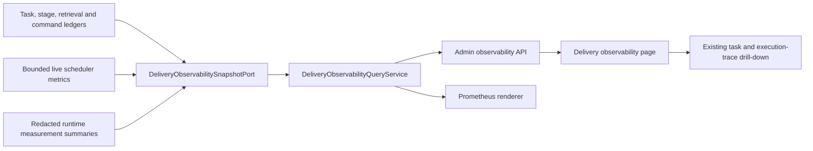

## Context

See `proposal.md` for motivation and `specs/delivery/observability/spec.md` for the behavior contract. This design treats observability as three related but different concerns:

1. durable audit truth for task, stage, retrieval and command state;
2. low-cardinality operational metrics for Prometheus and alerts;
3. project-scoped analytical views for operators.

### Source classification

| Source | Classification | How it is used |
| --- | --- | --- |
| `RULE.md` | current repository rule | Module boundaries, PostgreSQL truth, trace, testing, management API and frontend verification constraints. |
| `docs/openspec/historical-spec-provenance-audit.md` | current provenance index | Establishes that the old execution-observability document is not a current main spec. |
| `docs/superpowers/specs/2026-07-06-rd-task-execution-observability-spec.md` | `IMPLEMENTED_CLAIM` | Historical field/API intent only; every reused claim is rechecked against current code/tests. |
| Supplied `秒哒_技术架构_完整版.html` | external reference | Metric grouping, latency percentiles, first-token and capacity presentation ideas only. Its fixed thresholds, thread counts and product-hosting scope are not RD-Bot requirements. |
| Current source and focused tests listed below | current verified baseline for this plan | Determines existing behavior and the implementation seams used by the plan. |

### Verified current chain

- Task and stage truth: `rd_tasks` / `rd_task_status_events` → `RequirementDeliveryEngine` → durable stage command/finalizer → `RequirementAgentStageOrchestrator` → `rd_agent_stage_runs` / `rd_agent_stage_events`.
- Retrieval truth: `DeepRetrievalOrchestrator` → `rd_rag_retrieval_runs` / steps / events / artifacts.
- Runtime detail: execution profile snapshot → runtime router → Pi or compatibility executor → normalized redacted agent events → provider-attempt metadata and Token parsers.
- User-visible single-task view: `RdTaskExecutionOverviewController` already aggregates stage timestamps, running execution, context budgets, normalized events and Token/cost.
- Project view: `RdDashboardQueryService` and `ExecutionTraceQueryService` already expose current status, current role, retry, elapsed time and estimated cost.
- Prometheus view: `PrometheusMetricsController` manually renders `/actuator/prometheus` from direct SQL. It currently maps `rd_bot_context_build_latency_seconds` to mean task repair time and calls it a placeholder. A top-level query exception returns an empty all-zero snapshot; subqueries also hide exceptions as empty data.
- Scheduler metrics: `RequirementDeliveryMetrics` already records claims, retries, lease loss, queue rejection, queue-age percentiles and resource utilization, but `metricsSnapshot()` is only used by tests and is not connected to Prometheus. Its queue samples and per-project map grow for the life of the process.
- Normalized Pi events already carry `occurredAt` and event types including `PROVIDER_RESPONDED` and `ASSISTANT_TEXT_DELTA`; they do not guarantee that every runtime supplies a distinct request-start/first-token pair.

### Baseline commands run for this plan

```bash
./mvnw -pl bootstrap -am \
  -Dtest=PrometheusMetricsControllerTest,RdTaskExecutionOverviewControllerTest,RdDashboardControllerTest,ExecutionTraceControllerTest,RequirementDeliveryDispatchServiceTest,RequirementDeliveryMetricsTest,AgentEventTokenUsageParserTest \
  -Dsurefire.failIfNoSpecifiedTests=false test

cd frontend
node --experimental-strip-types --test \
  test/rdTaskExecutionOverviewContract.test.ts \
  test/dashboardPresentation.test.ts \
  test/executionTracePresentation.test.ts
```

Result on 2026-08-15: Maven reactor success with 78 focused tests; frontend 7/7 tests passed. This proves the current seams compile and the named behavior is covered; it does not prove production traffic volumes, query latency, SLO values or external Provider timing.

## Goals / Non-Goals

**Goals:**

- Make every published metric semantically correct and traceable to a named source.
- Provide low-cardinality operational signals and project/time-window analytical views without changing task behavior.
- Reuse durable ledgers before adding new persistence.
- Preserve the existing Prometheus path and single-task execution-overview contract.
- Make missing, stale and failed observations visible.
- Split delivery into independently releasable work packages with rollback gates.

**Non-Goals:**

- Changing fair scheduling, resource quotas, retry count, Provider fallback, model selection or budget approval.
- Replacing the task/stage state machines with an observability-specific workflow.
- Persisting raw prompts, source files, model output or full private Pi events in metrics storage.
- Building a general APM platform or requiring OpenTelemetry Collector, Grafana or a new time-series database in the first release.
- Copying 秒哒's fixed RAG thresholds, fixed thread-pool sizes or full application-hosting runtime.
- Defining production SLO thresholds before a measured baseline exists.

## Decisions

### Decision 1: Keep audit truth, operational metrics and operator analytics separate

The target chain is:



- `engine` owns the query model, metric definitions and `DeliveryObservabilityQueryService` because requirement delivery is an engine capability.
- `engine` defines `DeliveryObservabilitySnapshotPort`; it does not depend on SQL, Prometheus or frontend types.
- `bootstrap` supplies a PostgreSQL adapter and composes optional live scheduler snapshots.
- `exec` continues to return redacted runtime events and metadata through existing result boundaries; it does not depend on engine.
- Controllers remain HTTP/rendering adapters. New business aggregation does not stay inside `PrometheusMetricsController`.

Alternative rejected: adding Micrometer calls throughout all modules immediately. That would mix vendor-facing instrumentation with domain transitions and still leave the management analytics/data-quality problem unsolved.

### Decision 2: Establish one versioned metric dictionary before adding charts

Create a versioned `delivery-observability/v1` dictionary covering:

| Family | Canonical measurements | Primary source | Window membership |
| --- | --- | --- | --- |
| Throughput | accepted, terminal, success, failure, PR, QA pass, human intervention | task/stage ledgers | event or terminal time in window |
| Task latency | accepted-to-terminal, active age | task timestamps and terminal events | terminal time; active is point-in-time |
| Task phase latency | material, context, plan, policy, execution, validation, publication, reporting | adjacent task status entry timestamps | phase exit in window |
| Role latency | role attempt runtime and internal stage transitions | stage run started/finished and adjacent stage events | finished time in window |
| Retrieval | run/step duration, iteration, selected evidence, degraded/insufficient | retrieval runs and steps | finished/update time in window |
| Queue | backlog, oldest age, claim wait, service duration, retry, rejection, lease loss | command ledger plus bounded live metrics; later command-attempt observations | point-in-time or claim/finish time |
| Runtime | total duration, first response/Token, tool duration, retries | redacted normalized event summary | runtime attempt finish time |
| Usage | input/output/cache Token and estimated cost | deduplicated provider attempt metadata | attempt finish time |
| Capacity | in use, configured capacity, saturation | fair scheduling limits and live claims | point-in-time |
| Data quality | collection success, last success, stale age, invalid/dropped observations | each collector | point-in-time |

Rules:

- A task phase duration uses adjacent `entered_at` values, not the existing `duration_ms` blindly. Current host-finalizer paths write zero duration for some task events.
- A role attempt duration uses `started_at` and `finished_at`; running attempts are excluded from completed percentiles.
- A ratio always exposes numerator, denominator and sample count in the admin API.
- An absent timestamp produces an unavailable/invalid sample, never a zero-duration sample.
- All percentiles state the window and sample count. P99 is suppressed as insufficient when the configured minimum sample count is not met.

### Decision 3: Reuse existing ledgers and keep new metric persistence out of this change

All work packages in this change add no metric table. They use existing task/stage/retrieval/command tables, existing stage artifact/provider-attempt metadata and bounded live metrics.

Exact historical queue wait per lease attempt is not recoverable from the current command row because claim and completion both rewrite `updated_at`. Therefore this change exposes:

- point-in-time durable backlog and oldest age from PostgreSQL;
- bounded process-window queue wait/service histograms from the actual claim/completion boundaries;
- source, coverage, process-start time and sample count so a post-restart live window cannot look like durable history.

If WP-6 proves that Prometheus retention and process-window samples are insufficient, it opens a separate OpenSpec change for a narrow command-attempt observation ledger. That future change must define idempotent, failure-isolated writes and coverage semantics; it is not pre-authorized here.

The new management API is still a public contract change. Before implementing WP-4, the apply phase must pass the repository's architecture-review gate. The repository asks for the `model-escalation` skill at this boundary; that skill was not available in the current planning session, so applying WP-4 must not bypass this gate.

Alternative rejected: a generic `rd_metrics_events` JSON table. It would create an unbounded second event system, weaken schema semantics and invite high-cardinality labels.

### Decision 4: Persist only compact runtime measurement summaries

After a runtime attempt settles, the host derives a redacted, versioned summary from normalized events and existing provider metadata. The summary includes only:

- task/stage/attempt identity;
- runtime, configured Provider and model alias;
- request/first-response/first-text/finish timestamps when observed;
- total/tool/provider-retry durations;
- Token/cache counts and estimated cost with currency metadata;
- availability flags, source protocol and parse-error category.

It is persisted as a bounded stage artifact/metadata record and folded into the existing provider-attempt JSON in a backward-compatible schema version. Aggregate code deduplicates by immutable attempt ID. Raw private events remain subject to existing retention and size rules.

`TTFT` is calculated only when a trustworthy request-start or agent-start boundary and the first non-thinking assistant text delta exist. `PROVIDER_RESPONDED` alone is a provider response metric, not automatically first Token.

### Decision 5: Replace unbounded scheduler samples with fixed buckets

`RequirementDeliveryMetrics` will retain fixed histogram buckets/counters rather than every queue age and every project ID:

- fixed duration buckets for queue wait and service time;
- counters for enqueue, claim, completion, retry, lease loss and queue rejection;
- gauges for current in-flight, capacity, utilization and oldest durable backlog;
- no project/task/stage identity in process metrics.

Project fairness and project-specific analytics continue to come from the durable query API. This preserves low overhead and prevents a long-lived process from accumulating an unbounded sample list/map.

### Decision 6: Preserve `/actuator/prometheus` and repair compatibility deliberately

The endpoint continues to return Prometheus text and remains referenced by existing production-acceptance evidence.

New core series use low-cardinality dimensions only. Representative names:

- `rd_bot_delivery_active{phase}`
- `rd_bot_delivery_completed_total{outcome}`
- `rd_bot_delivery_duration_seconds_bucket{phase,role,runtime,le}`
- `rd_bot_delivery_queue_backlog{status,resource}`
- `rd_bot_delivery_queue_oldest_seconds{status,resource}`
- `rd_bot_delivery_resource_in_use{resource}` and `rd_bot_delivery_resource_capacity{resource}`
- `rd_bot_delivery_tokens_total{runtime,provider,role,direction,cache}`
- `rd_bot_delivery_estimated_cost_cny_total{runtime,provider,role}`
- `rd_bot_observability_collection_success{source}`
- `rd_bot_observability_last_success_unixtime{source}`
- `rd_bot_observability_invalid_observations_total{source,reason}`

`taskId`, `stageRunId`, `projectId`, model strings, repository URLs and error messages never become labels. Model/provider breakdown with larger cardinality remains in the paginated admin API.

Compatibility handling:

1. Correctly recompute `rd_bot_context_build_latency_seconds` from actual context phase events during one deprecation window and update its HELP text.
2. Publish the new histogram/quantile family alongside legacy acceptance metrics.
3. Add a machine-readable deprecation list to the admin health response and release notes.
4. Remove a legacy name only after repository consumers and acceptance tests have migrated.

On collection failure the endpoint still returns its own collector-health series and any independent healthy contributors. It does not turn an exception into an all-zero healthy snapshot.

### Decision 7: Use bounded analytical APIs instead of exposing Prometheus internals to the UI

Proposed read-only routes:

- `GET /admin/observability/delivery/overview`
- `GET /admin/observability/delivery/timeseries`
- `GET /admin/observability/delivery/failures`
- `GET /admin/observability/delivery/tasks`

Common query fields:

- optional concrete `projectId`; omission means all projects;
- allowlisted windows `1h`, `24h`, `7d`, `30d` with `24h` default;
- optional allowlisted role/runtime/provider/failure category;
- bounded interval and pagination values.

Every response includes normalized scope/window, `generatedAtEpochMillis`, per-section availability, freshness, sample count and warnings. The task breakdown endpoint returns IDs and summaries required to link to `/admin/traces/{taskId}` or `/admin/rd-tasks/{taskId}`; it never returns raw private events.

Alternative rejected: having the browser query Prometheus directly. It would couple the product UI to deployment topology and still lack task-level authorization/scope semantics.

### Decision 8: Add a dedicated page, while preserving existing detail authorities

Add `/admin/observability` and a navigation item named “交付观测”. The page contains:

1. health/data-quality strip;
2. throughput and outcome cards;
3. end-to-end and phase P50/P95/P99;
4. queue/capacity saturation;
5. Provider/Token/cost view;
6. failure and retry trends;
7. slow-task/failure drill-down.

The page reuses the project-scope URL behavior, never sends `projectId=all`, and clears stale responses when scope/window changes. Single-task evidence remains in task detail/execution trace rather than being copied into aggregate cards.

### Decision 9: SLOs begin as recommendations, not control-plane gates

Initial defaults are observation-only. A window becomes eligible for SLO recommendation only after both configured minimum age and sample count are met (initial proposal: 7 days and 30 terminal tasks; final values remain configuration, not hard-coded business truth).

Candidate alerts:

- collection source failed or stale;
- oldest queue age or resource saturation sustained;
- end-to-end/role P95 exceeds the observed baseline band;
- lease loss or thread-pool rejection appears;
- human-intervention/unknown-failure rate increases;
- Token/cost deviates materially from the selected baseline.

Alerts contain scope, metric, window and drill-down URL. They do not retry work, change capacity or mutate a task.

### Decision 10: Bound query cost and expose its health

- PostgreSQL analytics are restricted to allowlisted windows and bounded breakdown pages.
- Snapshot queries use MyBatis mappers/ports, not raw SQL inside controllers.
- Completed percentile queries filter by terminal/finish time and project before aggregation.
- A short configurable read cache may reuse an immutable successful snapshot; it is never a truth store and always reports generated/stale time.
- Query timeout, duration, failure and row-count observations are exposed for the observability system itself.
- Before adding an index, run `EXPLAIN (ANALYZE, BUFFERS)` against realistic volume. Before adding a rollup table, prove that bounded indexed queries miss the target in repeated tests.

The initial performance acceptance target is configurable and measured, not claimed in advance. The tasks use a provisional local target of p95 under 500 ms for a 24-hour overview query at the agreed fixture size; production acceptance records the actual dataset and result.

## Risks / Trade-offs

- **[Metric semantics drift]** Different pages may reimplement ratios or phases → centralize definitions in the engine query model and assert API/Prometheus consistency with shared fixtures.
- **[Observability impacts delivery]** A new observation write could fail during claim/finalization → keep writes idempotent and failure-isolated; expose loss/coverage rather than rolling back business state.
- **[Database scrape pressure]** Frequent Prometheus scrapes could repeat percentile SQL → use bounded live buckets for scrape-time histograms and a short immutable cache for durable gauges; benchmark before schema expansion.
- **[Incomplete TTFT]** Some runtimes do not emit a reliable first-text boundary → return unavailable per runtime and track coverage; do not infer it from final response time.
- **[Double-counted cost]** retries and fallback produce multiple metadata copies → deduplicate on immutable runtime/provider attempt ID and count all genuinely executed attempts exactly once.
- **[Cardinality explosion]** project/model/error text becomes a label → enforce an allowlist policy test and keep those breakdowns in paginated APIs only.
- **[Clock skew]** timestamps from different hosts can create negative or distorted durations → use host-normalized timestamps where possible, reject negative samples, expose invalid counts and require deployment clock synchronization.
- **[Legacy dashboard breakage]** old metric names are consumed by acceptance reports → dual-publish corrected/new metrics, update consumers, then remove only after a documented deprecation gate.
- **[Misleading early SLO]** small sample percentiles fluctuate → show sample count/eligibility and keep alerts observation-only until the baseline gate passes.
- **[Sensitive data leakage]** raw Provider errors or events enter labels/API → aggregate only allowlisted dimensions and reuse redaction, retention and secret-scan policies.

## Migration Plan

### WP-0 — Metric truth and regression baseline

1. Freeze the v1 dictionary and source map.
2. Add regression tests that expose the current context-latency substitution and all-zero-on-query-error behavior.
3. Inventory every current `/actuator/prometheus` consumer and acceptance assertion.
4. Record SQL fixture counts and current query plans; no API/schema change.

**Exit gate:** every legacy metric is classified as correct, correctable, deprecated or unrelated; no placeholder remains unclassified.

### WP-1 — Query boundary and truthful legacy metrics

1. Add the engine query model/service/port and PostgreSQL adapter.
2. Move delivery aggregation out of the controller.
3. Correct context/task/stage/retrieval definitions using persisted timestamps.
4. Add collector health/freshness and preserve independent knowledge projection metrics.

**Rollback:** disable the new delivery contributor and restore the previous renderer artifact; no data migration exists.

### WP-2 — Runtime and queue measurement completeness

1. Add compact runtime measurement summaries and TTFT availability rules.
2. Replace scheduler's unbounded samples with fixed buckets.
3. Connect scheduler capacity/queue metrics to Prometheus.
4. Report process-window source/coverage explicitly and do not claim durable historical queue percentiles.

**Rollback:** stop writing/reading new summaries; old provider metadata remains readable and there is no schema rollback.

### WP-3 — Prometheus v2 contract and compatibility window

1. Publish new low-cardinality series and corrected legacy aliases.
2. Add cardinality, HELP/TYPE, histogram monotonicity and partial-collector-failure tests.
3. Update acceptance-report consumers and document deprecations.

**Rollback:** feature-flag the v2 contributor off while retaining collector-health output and corrected legacy metrics.

### WP-4 — Management API and observability page

1. Deliver the bounded overview/timeseries/failure/task APIs.
2. Add frontend service, route, navigation and project/window filters.
3. Add drill-down links to existing execution-trace/task-detail pages.
4. Run API, Vite proxy, typecheck, production build and real-browser responsive QA.

**Rollback:** remove navigation/route via feature flag; read APIs remain harmless and backward compatible.

### WP-5 — Baseline, SLO recommendation and alerts

1. Run observation-only collection for the configured baseline period.
2. Publish a baseline report with dataset size, windows, percentiles, missing coverage and cost assumptions.
3. Configure alerts only after review; verify each with synthetic signals.

**Rollback:** disable alert evaluation/notification without disabling metric collection.

### WP-6 — Performance decision gate

1. Measure query p50/p95 and database buffers at realistic volume.
2. Add only proven indexes.
3. If bounded queries still miss the target, open a separate change for rollups/materialized aggregates and their retention/rebuild semantics.

## Open Questions

- Which external Prometheus/Grafana deployment, if any, will store long-range histograms? The RD-Bot API and endpoint remain useful without selecting one now.
- What production baseline duration/sample count should replace the provisional 7-day/30-task gate? Decide from real traffic before enabling SLO alerts.
- Does real volume justify the optional command-attempt observation table or later rollups? Decide from WP-0/WP-1 coverage and query benchmarks, not architecture preference.
